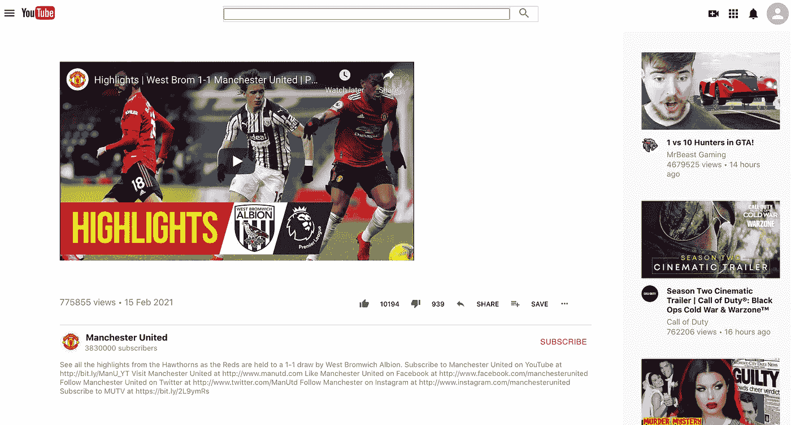
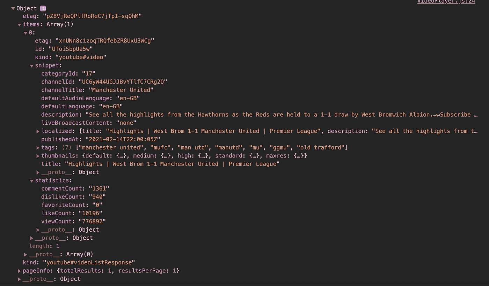

# 让我们用 React 构建一个 YouTube 克隆

> 原文：<https://javascript.plainenglish.io/lets-build-a-youtube-clone-with-react-part-4-48dd9e9d8cef?source=collection_archive---------8----------------------->

## 第 4 部分:在本教程中，我们将通过构建我们的视频播放器来播放 YouTube 上的任何视频，从而完成我们的 YouTube 克隆。

在第[部分 1](https://medium.com/swlh/building-a-youtube-clone-using-react-part-1-40fb09ae2837) 、 [2](https://medium.com/swlh/building-a-youtube-clone-using-react-part-2-a23a9dded270) 和 [3](https://medium.com/javascript-in-plain-english/building-a-youtube-clone-using-react-part-3-d86db83d3b33) 中，我们从从 Youtube 数据 API v3 获取 API 密钥开始，构建了推荐视频页面，该页面根据您的国家代码显示最受欢迎的视频，以及允许通过关键字搜索视频的搜索页面。在这一部分中，我们将构建包含播放视频功能的 YouTube 克隆的视频播放器页面。

Video Player for our YouTube Clone

下面是构建这个 YouTube 克隆的部分列表:

*   第 1 部分—获取 API 密钥并构建侧栏和标题([此处为](https://medium.com/@nouman10/building-a-youtube-clone-using-react-part-1-40fb09ae2837))
*   第 2 部分—建立推荐视频页面([此处](https://medium.com/swlh/building-a-youtube-clone-using-react-part-2-a23a9dded270))
*   第 3 部分—构建搜索页面([此处为](https://medium.com/javascript-in-plain-english/building-a-youtube-clone-using-react-part-3-d86db83d3b33))
*   第 4 部分—构建视频播放器页面(这一部分)

如果你不喜欢阅读，对源代码感兴趣，可以滚动到故事的结尾。

> 注意:本教程假设你对 JavaScript 和 React 有基本的了解。
> 
> 注意:本教程不包含所有的代码，尤其是样式，而是解释了项目的主要部分

# 配置路线

正如我们在上一部分所做的，我们将从在`App.js`中添加视频播放器路径开始。这将是文件的最终状态

这里，我们添加了路径`/video/:videoId`,它将显示我们将要构建的`VideoPlayer`组件

# 将视频重定向到视频播放器页面

首先，我们必须修改`SearchPage`和`RecommendedVideos`中的代码，将视频重定向到视频播放器页面。我们将通过用一个`Link`组件包装我们的`VideoRow`和`VideoCard`组件来做到这一点

组件现在重定向到具有相应视频 ID 的视频页面

# 构建我们的视频组件

视频播放器页面由两个主要组件组成。`Video`和`VideoInfo`组件。让我们从构建`Video`组件开始

这是一个非常简单的组件，它利用了`react-youtube`库，并简单地将视频 ID 传递给它。

# 构建 VideoInfo 组件

`VideoInfo`组件显示了关于视频的附加信息，比如它的描述、它的频道的订阅者数量、喜欢、不喜欢、观点、日期等等

我们利用`@material-ui/icons`使页面看起来与实际的 youtube 页面相似。

# 访问 API

为了获得视频的统计数据，我们需要访问 Youtube API 并存储信息，以便稍后将其传递给`VideoInfo`组件。

API 的输出如下所示:

函数`createVideoInfo`从这个响应中提取信息，并将其存储到组件的状态中。它还再次调用 API 来获取频道的订阅者数量和频道图像。

# 将一切结合在一起

让我们将所有东西组合成最终的`VideoPlayer`组件。

该组件执行如下:

1.  首先，我们从查询参数中获取视频 ID
2.  然后，我们调用 API 来获取关于 videoID 的统计数据
3.  我们编写了一个从 API 响应中提取视频信息的函数
4.  我们检查错误。如果有，我们会显示一条警告消息，指出视频 ID 无效
5.  最后，我们展示视频和视频信息。在这种情况下，API 调用需要一些时间，我们也显示一个加载图标。另外，我们还展示了`RecommendedVideos`组件，让它看起来像真正的 Youtube。

最后，让我们给组件添加一些样式

# 结论

这部分和教程到此为止。让我们总结一下我们在本教程中所做的工作:

1.  使用`react-router-dom`为视频播放器设置路线
2.  创建了`Video`和`VideoInfo`组件来分别渲染实际的视频及其统计数据
3.  使用`axios`通过视频 ID 访问 Youtube API 获取数据
4.  将所有内容组合到`VideoPlayer`组件中以呈现所有内容。

**恭喜你！**你从零开始创建了一个 YouTube 克隆。

你可以在我的 GitHub 上查看完整的源代码

如果您觉得以上内容对您有用，请分享并随时支持我-->

*   [https://www.buymeacoffee.com/nouman10](https://www.buymeacoffee.com/nouman10)