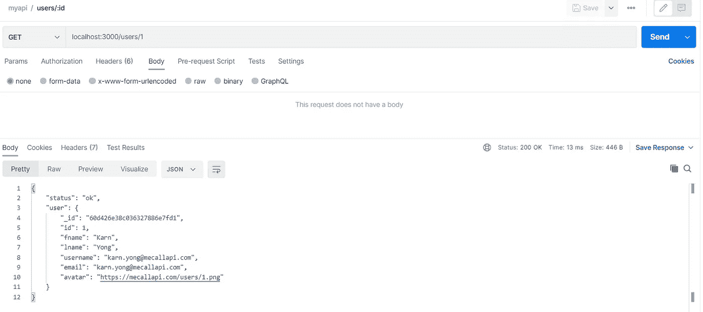
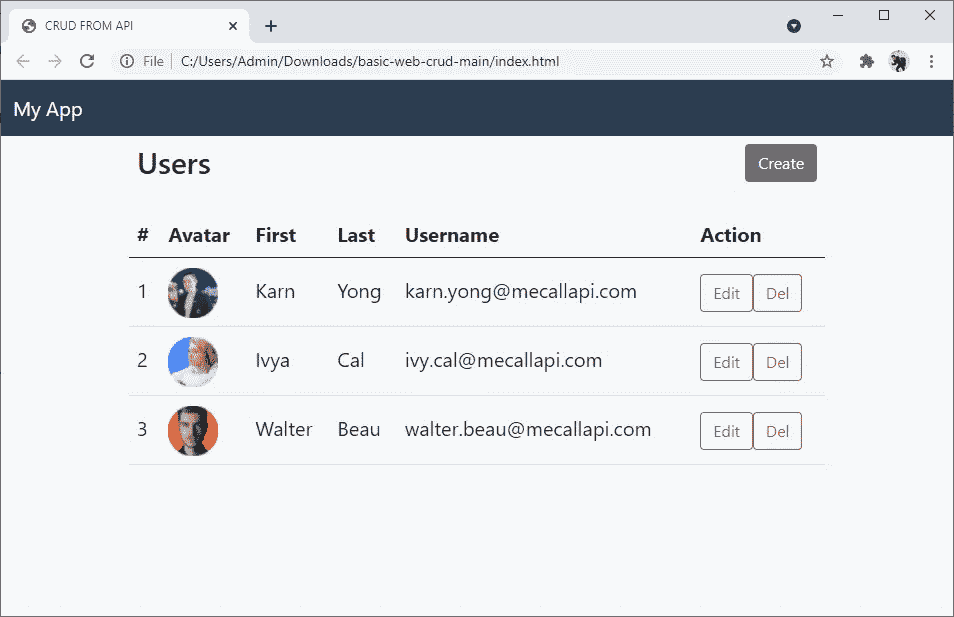

# 让我们用 Express 和 MongoDB 为 CRUD 操作构建一个 API

> 原文：<https://javascript.plainenglish.io/lets-build-an-api-with-express-js-and-mongodb-for-crud-operations-d87182c57fad?source=collection_archive---------2----------------------->


本文将为您提供一个使用 Express 和 MongoDB 为 CRUD 操作创建 API 的基础教程。

**CRUD** 操作是操纵数据的四种基本操作，包括**C**reate/**C**construt、 **R** ead、 **U** pdate 和 **D** elete。在本教程的最后，我们将有一个 API 来服务前端，类似于这里的[mecallapi.com/crud/](https://www.mecallapi.com/crud/)。

***注*** *:本文中我们不重点讨论前端。*


# 软件安装

*   **node . js【https://nodejs.org】:**
*   **MongoDB 社区**:本文使用的数据库[https://www.mongodb.com/try/download/community](https://www.mongodb.com/try/download/community)
*   **Postman**:API 测试工具[https://www.postman.com/downloads/](https://www.postman.com/downloads/)

# 在 MongoDB 中创建一个用户

从在 MongoDB 中创建一个用户开始，从我们的 API 启用连接。启动 **MongoDB Compass** 然后进入**新连接** > **分别填写连接字段**。


**主机名**会是**本地主机**，然后点击**连接**。


我们将使用 **MongoDB Shell** 来创建一个用户。点击 **MONGOSH** 启用 **MongoDB Shell** 。


在 shell 中，使用 admin 来切换数据库 **admin** 。

```
use admin
```


使用密码 myUserAdmin 创建用户:myUserAdmin，并使用以下命令赋予该角色读写任何数据库的权限:

```
db.createUser({user: "myUserAdmin", pwd: "myUserAdmin", roles: [{role: "userAdminAnyDatabase", db: "admin"}, "readWriteAnyDatabase"]})
```


使用您刚刚创建的用户/密码断开并再次连接 MongoDB。


# 用 Express.js 创建一个初始 API

为我们的 API 创建一个文件夹，然后进入该文件夹:

```
mkdir express-mongodb-api
cd express-mongodb-api
```

用 npm init 命令初始化您的项目，然后在项目中安装 **Express.js** 和 **cors** 。注意 **Express.js** 将帮助我们创建一个 web 应用程序作为 API，而 **cors** 将启用来自不同域的 API 请求。

```
npm init
npm install express cors --save
```

创建 **index.js** 然后添加以下代码:

使用以下命令启动我们的 API:

```
node index.js
```

尝试在 web 浏览器上使用 URL[http://localhost:3000](http://localhost:3000/)访问我们的 API，您将看到以下结果:


用 CTRL+C 停止 API，然后安装其他软件包:

*   **nodemon** 在代码改变时启用 API 的刷新。
*   **mongodb** 启用与 **mongodb** 的连接。

```
npm install -g nodemon
npm install mongodb --save
```

因此，使用 **nodemon** 来启动 API。

```
nodemon index.js
```

# 创建 API

用 **C** reate API 开始编码。

*   在第 2 行用用户名和密码定义 uri 来连接 MongoDB。
*   app。 **post** (…)用 **POST** HTTP 方法定义 **API** 。在这个函数中，我们将在 **mydb** 数据库中的 **users** 集合中创建用户数据。

现在，让我们用 POSTMAN 测试 API，请求如下:

HTTP 方法:POST
URL:[HTTP://localhost:3000/users/create](http://localhost:3000/users/create)
示例体(raw — JSON):

```
{
    "id": 1,
    "fname": "Karn",
    "lname": "Yong",
    "username": "[karn.yong@mecallapi.com](mailto:karn.yong@mecallapi.com)",
    "email": "[karn.yong@mecallapi.com](mailto:karn.yong@mecallapi.com)",
    "avatar": "[https://mecallapi.com/users/1.png](https://mecallapi.com/users/1.png)"
}
```

*在这个请求的主体中将有一个 JSON 数据(键-值对)。如果想了解更多关于 JSON 的知识，可以看看 [w3school](https://www.w3schools.com/js/js_json_intro.asp) 。


样本响应:

```
{
    "status": "ok",
    "message": "User with ID = 1 is created",
    "user": {
        "id": 1,
        "fname": "Karn",
        "lname": "Yong",
        "username": "[karn.yong@mecallapi.com](mailto:karn.yong@mecallapi.com)",
        "email": "[karn.yong@mecallapi.com](mailto:karn.yong@mecallapi.com)",
        "avatar": "[https://mecallapi.com/users/1.png](https://mecallapi.com/users/1.png)",
        "_id": "60d426e38c036327886e7fd1"
    }
}
```

让我们回到 **MongoDB Compass** 来看看最近添加的数据。按刷新，然后选择 **mydb** 数据库>用户**集合。**


尝试使用以下数据通过 POSTMAN 添加另一个用户数据:

```
{
    "id": 2,
    "fname": "Ivy",
    "lname": "Cal",
    "username": "[ivy.cal@mecallapi.com](mailto:ivy.cal@mecallapi.com)",
    "email": "[ivy.cal@mecallapi.com](mailto:ivy.cal@mecallapi.com)",
    "avatar": "[https://www.mecallapi.com/users/2.png](https://www.mecallapi.com/users/2.png)"
}
```

回到 **MongoDB Compass** 查看最新添加的数据(点击**刷新**)


# 读取所有 API

接下来，让我们创建一个 API 来读取所有用户数据。

*   app。 **get** (…)用 **GET** HTTP 方法定义 **API** 。

用 **POSTMAN** 测试 API。

HTTP 方法:获取
URL:[https://localhost:3000/users](https://localhost:3000/users)


样本响应:

```
[
    {
        "_id": "60d5cfd7469c0403e492e1dc",
        "id": 1,
        "fname": "Karn",
        "lname": "Yong",
        "username": "[karn.yong@mecallapi.com](mailto:karn.yong@mecallapi.com)",
        "email": "[karn.yong@mecallapi.com](mailto:karn.yong@mecallapi.com)",
        "avatar": "[https://mecallapi.com/users/1.png](https://mecallapi.com/users/1.png)"
    },
    {
        "_id": "60d5cfe2469c0403e492e1dd",
        "id": 2,
        "fname": "Ivy",
        "lname": "Cal",
        "username": "[ivy.cal@mecallapi.com](mailto:ivy.cal@mecallapi.com)",
        "email": "[ivy.cal@mecallapi.com](mailto:ivy.cal@mecallapi.com)",
        "avatar": "[https://www.mecallapi.com/users/2.png](https://www.mecallapi.com/users/2.png)"
    }
]
```

# 通过 id API 读取

创建一个 API 来通过 id 读取用户数据。

HTTP 方法:获取
URL:[HTTP://localhost:3000/users/1](http://localhost:3000/users/1)
* 1 在 URL 末尾可以更改。



样本响应:

```
{
    "status": "ok",
    "user": {
        "_id": "60d5cfd7469c0403e492e1dc",
        "id": 1,
        "fname": "Karn",
        "lname": "Yong",
        "username": "[karn.yong@mecallapi.com](mailto:karn.yong@mecallapi.com)",
        "email": "[karn.yong@mecallapi.com](mailto:karn.yong@mecallapi.com)",
        "avatar": "[https://mecallapi.com/users/1.png](https://mecallapi.com/users/1.png)"
    }
}
```

# 更新 API

APIเส้นนี้จะเป็นการแก้ไขข้อมูลที่มีอยู่แล้วโดยอ้างอิงจากid

*   app。 **put** (…)用 **PUT** HTTP 方法定义 **API** 。

用 **POSTMAN** 测试 API。

HTTP 方法:PUT
URL:[HTTP://localhost:3000/users/update](http://localhost:3000/users/update)示例体(raw — JSON):

```
{
    "id": 1,
    "fname": "Cat",
    "lname": "Chat",
    "username": "[karn.yong@mecallapi.com](mailto:karn.yong@mecallapi.com)",
    "email": "[karn.yong@mecallapi.com](mailto:karn.yong@mecallapi.com)",
    "avatar": "[https://mecallapi.com/users/1.png](https://mecallapi.com/users/1.png)"
}
```


样本响应:

```
{
    "status": "ok",
    "message": "User with ID = 1 is updated",
    "user": {
        "id": 1,
        "fname": "Cat",
        "lname": "Chat",
        "username": "[karn.yong@mecallapi.com](mailto:karn.yong@mecallapi.com)",
        "email": "[karn.yong@mecallapi.com](mailto:karn.yong@mecallapi.com)",
        "avatar": "[https://mecallapi.com/users/1.png](https://mecallapi.com/users/1.png)"
    }
}
```

# 删除 API

最后一个是删除一个 id 的用户数据。

*   app。**删除** (…)用**删除** HTTP 方法定义 **API** 。

用 **POSTMAN** 测试 API。

HTTP 方法:删除
URL:[HTTP://localhost:3000/users/DELETE](http://localhost:3000/users/delete)
示例体(raw — JSON):

```
{
    "id": 1
}
```

* id(1)的值可以更改。


样本响应:

```
{
    "status": "ok",
    "message": "User with ID = 1 is deleted"
}
```

# 用网站测试 API

在 API 完成之后，通常，你会让前端(UI)向 API 发出请求。因此，我们将通过从 GitHub 下载示例网站来模拟这样的任务。注意，调用 API 的代码在 **index.js** 中。

ปกติจะส่งให้ผู้พัฒนาในฝั่งของหน้าบ้าน(前端)หรือฝั่งที่พัฒนาส่วนติดต่อผู้ใช้(用户界面)มาเรียกใช้APIของเราเพื่อให้เห็นภาพนะครับผมเตรียมส่วนของหน้าบ้านไว้ให้สามารถดาวน์โหลดได้จากgithubด้านล่างนี้นะครับโดย代码ที่เรียกAPIทั้งหมดจะอยู่ที่**index . js**

[](https://github.com/KarnYong/web-crud-api-test) [## KarnYong/web-crud-api-test

### 在 GitHub 上创建一个帐户，为 KarnYong/web-crud-api-test 开发做贡献。

github.com](https://github.com/KarnYong/web-crud-api-test) 

在网页浏览器上打开 **index.js** (网站一)，然后尝试执行 **CRUD** 操作。


尝试创建新用户:



## **结论**

就这样了。请记住，这只是基本的 API，因此它不会完美地工作。您可能希望有异常处理程序，并适当地响应错误，如重复的 id、找不到 id 等。对于下一篇文章，可能是关于开发认证 API 的。再见。:D

*朗西特大学数字创新技术学院博士 Karn Yongsiriwit 的文章*

*更多内容请看*[***plain English . io***](http://plainenglish.io)