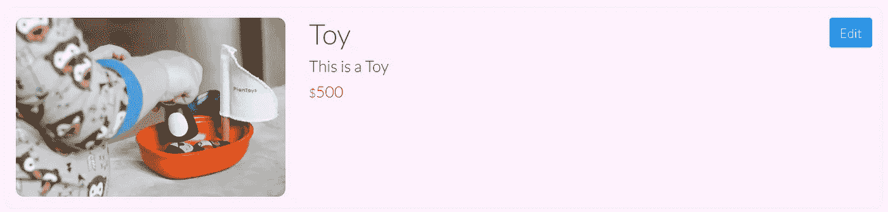

# 让我们用 Vue.js 构建一个电子商务应用前端

> 原文：<https://javascript.plainenglish.io/lets-build-an-e-commerce-app-frontend-with-vue-js-8eb088f421a7?source=collection_archive---------11----------------------->

## 构建管理面板后，现在我们将向客户展示产品。

Photo by [Danielle MacInnes](https://unsplash.com/@dsmacinnes?utm_source=medium&utm_medium=referral) on [Unsplash](https://unsplash.com?utm_source=medium&utm_medium=referral)

# 目录

*   *简介*
*   *前端框架*
*   *武威 js*
*   我们的电子商务应用程序
*   *相关文章*
*   *资源*

# 介绍

我们正在从头开始构建一个电子商务应用程序。我们有一系列教程解释它的不同方面，从后端 API 到 Android 和 Web 的前端设计。

本教程的重点是 Vue.js，这是一个流行的基于 JavaScript 的前端框架。我将分享我的知识，比如什么是 Vue.js 和 Vue.js 能提供什么。然后，我们将了解如何将 Vue 的所有不同部分结合起来，为我们的应用创建一个健壮的前端。

## 演示

 [## Webtutsplus 电子商务应用程序

### 编辑描述

remotedevs.org](http://remotedevs.org:8000/) 

看看上面的链接，检查我们的应用程序的工作。我们所有的功能更新和修改都将反映在这里。

# 前端框架

简单来说，前端框架充当了我们和 DOM 之间的中介。使用前端框架，我们不再需要使用浏览器提供的特性来操作 DOM 及其元素。

使用这些框架，我们只需要管理应用程序的数据及其流程，对 DOM 的更改是自动处理的。像 [React](https://reactjs.org/) 、 [Angular](https://angular.io/) 和 [Vue](https://v3.vuejs.org/) 这样的前端框架为我们提供了与传统的 DOM 交互方式不同的包装器。

这些框架为我们提供了一个脚手架，我们可以在上面编写代码。在这样做的时候，我们必须遵循这些框架提供的基本模式和结构。

## 为什么我们需要框架？

浏览器在最近变得非常强大。随着新功能的加入，网络应用和本地应用之间的界限开始变得越来越小。设计更复杂的应用程序需要从底层任务中进行更多的抽象。

这是开发人员想出前端框架的想法的地方。这些框架使我们的代码库更具可伸缩性和可管理性。简而言之，前端框架为我们提供了一种新的更简单的方式来修饰 DOM。

# vue . j

Vue.js 是一个轻量级但功能强大的 JavaScript 前端框架。Vue 自第一次发布以来就一直广受欢迎。Vue 3 中最近引入的更新使其在开发人员中更受欢迎。

所有前端框架都解决相同的问题，因此大多数都遵循相同的方法。但是许多开发者认为 Vue 是两个世界中最好的——反应和角度。Vue 和其他框架一样，为我们提供了许多特性。

首先，我们将为我们的电子商务应用程序创建客户主页，然后我们将深入了解 Vue.js 的一些功能

# 电子商务应用主页

现在，在概述了 Vue.js 之后，让我们考虑创建一个前端来显示我们的应用程序的产品和类别。我们可能需要 Vue 的哪些特性？

## **获取数据**

我们的应用程序的第一个需求是产品和类别的数据。每个 Vue 应用程序都有一个根组件，它是第一个挂载到 DOM 的组件。Vue CLI 将这个组件命名为 **App.vue** 。在这个组件的**挂载的**生命周期钩子中获取我们的数据是有益的，因为一旦我们的应用程序组件中有了所需的数据，我们就可以将这些数据作为道具传递给所有其他组件。我已经使用了[获取 API](https://developer.mozilla.org/en-US/docs/Web/API/Fetch_API) 从我们的后端 API 请求数据。

## 设置路由器

如前所述，Vue 路由器使我们能够将浏览器 URL 与组件链接起来。这意味着，如果我们转到前面定义的某个特定 URL，我们可以基于该 URL 呈现特定的组件。为了设置所有这些路由，Vue CLI 提供了 **index.js** 文件。在这个文件中，我们必须用 URL 路径、其名称和要呈现的组件来定义所有的路由。

让我们从设计展示产品的前端开始。类似的过程也适用于类别。这些是与我创造的产品相关的路线。

所有与某些路由相关联的组件都被称为路由器视图。Vue 路由器提供了一个 **router-view** 标签，用于根据 URL 动态呈现组件。这里还需要提到要发送到路由器视图的道具。router-view 标记只是基于 URL 路径替换对子组件的调用。这与在另一个组件中使用一个组件是一样的。

## 家用部件

主页组件呈现在我们的 web 应用程序的登录页面上。但是如前所述，App.vue 是第一个被渲染的组件，那么为什么我们要到达主页呢？这是因为在我们应用程序的整个使用过程中，App 组件总是处于活动状态。所有其他的路由器视图只是在它里面渲染。这就是 App.vue 组件被称为根组件的原因。

因此，在主页组件上，我们为用户提供所有重要页面的不同链接。我刚刚提供了一个按钮*开始购物*，导致产品页面。**顶部的导航栏是一个完全可重用的组件**，它位于 App 组件的 router-view 之前。因此，无论 URL 路径如何，它都将在顶部可见。

Background photo by [Susan Holt Simpson](https://unsplash.com/@shs521?utm_source=unsplash&utm_medium=referral&utm_content=creditCopyText) on [Unsplash](https://unsplash.com/s/photos/toys?utm_source=unsplash&utm_medium=referral&utm_content=creditCopyText)

## 产品组件

主页组件上的*开始购物*按钮和导航栏上的*产品*链接指向产品路线。它列出了我们仓库里所有准备发货的产品。除此之外，它还提供了一个按钮 **AddProduct** route。

现在产品列表可能包含数百个项目。所有产品将有一个共同的布局，并显示相同的属性。因此，我们可以利用一个将在所有产品中重用的组件。

让我们把这个组件命名为 **ProductBox，**我们很快就会看到它的细节。但是我们如何循环遍历所有的产品呢？记住，我们有所有的产品(一个数组)作为根组件发送的道具。

现在，为了遍历产品，我们使用了 **v-for** 指令。 **v-for** 是 Vue 提供的 for 循环命令。对于每个产品，我们都呈现了作为道具传递产品对象的 **ProductBox** 组件。这样，所有的产品都会一个接一个地展示出来。

## **ProductBox 组件**

**ProductBox** 组件将显示产品细节，在我们的例子中包括名称、描述、价格和 imageURL。对于我们应用程序的每个产品， **ProductBox** 组件都将呈现动态数据。

我们还有一个编辑按钮来更新产品细节。在后面的教程中，我们将隐藏这个选项，只保留给管理员使用。这个编辑按钮将我们带到**编辑产品**组件。

Product display page

## **添加产品组件**

该组件呈现一个表单，用于向我们的应用程序数据库添加新产品。类似于编辑功能，这也将是管理员专属。在表单中，我们将使用 **v-model** 指令来建立用户输入和组件数据字段之间的双向绑定。

通过这种方式，我们可以跟踪用户提到的产品细节。我们还在表单提交按钮上附加了一个点击事件。click 事件触发对一个方法的调用，该方法将产品添加到我们的产品列表中。在幕后，该方法向后端 API 发出 POST 请求。这里，我也使用 Fetch API 来发出这个请求。

## **编辑产品组件**

该组件呈现一个表单来更新现有产品的详细信息。为了唯一地标识产品，该路线的路径包含一个参数 id。每当我们按下某个产品的编辑按钮时，重定向到编辑页面会将产品 id 作为一个**路由参数**带走。

这样，我们可以访问产品，并在开始时用当前的详细信息填充表单。类似于**的 AddProduct** 组件，我们将一个点击事件附加到提交按钮上。然后，被调用的方法向后端 API 发送一个请求，以更新由其唯一 id 标识的产品。

## ShowProduct 组件

现在，我们还需要为用户提供选项，以查看更多的产品功能，将其添加到购物车，继续购买产品，查看类似的产品，等等。为此，我们需要一个所有产品的专用页面。

**ShowProduct** 组件解决了这个问题。该路由还将产品 id 作为路由参数。在 **ProductBox** 组件中，我在产品图片和名称上附加了点击事件监听器。这些事件一旦被触发，就会将我们重定向到这个 ShowDetails 路由。

*立即购买*和*添加到购物车*功能目前还不可用，但请继续关注，我们将很快添加这些功能和更多功能。我们即将推出的教程将重点介绍您在热门电子商务网站上经历的认证、购物车和完整的结账流程。😉

对于那些想深入了解 Vue.js 并对其有更多了解的人，请继续阅读。

# **用 Vue.js 深潜**

## 虚拟 DOM

虚拟 DOM 是指原始 DOM 的副本。虚拟 DOM 用于减少对实际 DOM 的频繁操作。当我们的应用程序需要一些更改时，这些更改首先是对虚拟 DOM 进行的。然后，将这些更改与原始更改进行比较，只有最终的更新才会在真正的 DOM 中完成。

现在，这可能听起来很奇怪，但事实上，这提高了我们的应用程序的效率和速度。整个想法是基于这样一个事实，即真实的 DOM，它描绘了我们的网页需要相对更多的时间来更新，因此虚拟 DOM 优化了这个过程。

## Vue CLI

Vue 命令行界面有助于我们顺利完成项目。我们可以使用 Vue CLI 工具添加我们的首选项和要求。使用 Vue CLI 创建的新 Vue 项目使我们的任务变得非常简单。它为我们提供了一个简单的 Vue 项目脚手架。它通过填写基本项目所需的常规代码来节省我们的时间。

## 成分

我们的应用程序有许多部分在不同的地方使用，有时我们不得不不重复相同的代码来获得正确的功能。Vue 通过使用组件解决了这个问题。在 Vue 中，带有**的文件。vue"** 扩展名被称为单个文件组件。

这些组件存放了它们的 HTML、CSS 和 JavaScript。这些组件可以与动态数据一起在多个地方独立使用。我们可以使用组件的一些常见情况包括搜索栏、注册表单、产品展示卡等。

## 指令

[指令](https://v3.vuejs.org/api/directives.html#directives)是我们在组件模板中使用的 Vue 命令，用于执行几个动作。其中包括 **v-on** 、 **v-show** 、 **v-model** 、 **v-bind** 、 **v-if** 、 **v-for** 等等很多针对不同情况。

## 数据绑定

指令 **v-bind** 和 **v-model** 可用于在组件的模板元素和数据字段之间建立数据绑定。 **v-bind** 用于从 JavaScript 到 HTML 的数据流，v-model 用于从 JavaScript 到 HTML 的数据流。

Using v-model to track input

## 事件处理

指令`**v-on**`用于将事件监听器附加到 HTML 元素上。在事件发生时，我们可以执行一些内联逻辑或者进行函数调用。使用普通的 JavaScript，我们必须首先使用浏览器提供的方法选择元素，然后将事件侦听器附加到它。`**v-on**`指令使这项任务变得容易多了。

## 小道具

Vue 组件可以在多个地方使用。我们也可以在其他组件中使用 Vue 组件。在这种情况下，它们分别被称为子组件和父组件。父母和孩子的交流是通过`[**props**](https://v3.vuejs.org/guide/component-props.html#prop-types)`来完成的。父组件可以向其子组件发送数据。这些数据被称为道具。在实践中，我们使用这些道具使子组件能够呈现动态数据。

但是一个孩子如何与父母交流呢？Vue 组件能够触发 [**自定义事件**](https://v3.vuejs.org/guide/component-custom-events.html#event-names) 。这些事件就像其他事件一样，可以使用 **v-on** 指令来监听。子组件可以**发出**一个**事件**让父组件处理它。在发出此事件时，子组件也可以向其父组件传递参数。

## 生命周期挂钩

每个 Vue 组件在其生命周期中都经历了不同的过程。这包括创建一个组件，第一次将其装载到 DOM，以及第一次将其销毁。Vue 为我们提供了编写代码的能力，只要某个组件通过这些过程，代码就会自动执行。我们必须使用类似 **created()** 、**mount()**和**destroy()**这样的方法来定义组件实例对象中的逻辑。这些方法被称为[生命周期挂钩](https://v3.vuejs.org/api/options-lifecycle-hooks.html#lifecycle-hooks)。Vue 文档中的这个[图像](https://vuejs.org/images/lifecycle.png)很好地解释了所有这些生命周期钩子。看一看！

## 路由器

Vue 路由器使我们能够链接浏览器网址和组件。这有助于我们定义与组件耦合的路径。这样，Vue 就可以根据网址呈现组件。Vue 路由器的[官方页面](https://router.vuejs.org/)列出了它的所有功能。其中最重要的是使用 Vue 路由器轻松创建 [**单页应用程序**](https://en.wikipedia.org/wiki/Single-page_application) **(SPAs)** 。

# 相关文章

本教程旨在向您概述什么是 Vue.js，以及我们如何使用前端框架来设计漂亮的应用程序。如果您对实现细节感兴趣，请查看以下文章。

 [## 让我们创建一个虚拟的电子商务应用程序

### 我们将创建一个 Vue.js 应用程序来显示我们的产品和类别。

medium.com](https://medium.com/javascript-in-plain-english/lets-link-product-with-category-for-our-ecommerce-app-28100657a848)  [## 让我们使用 Java 和 Spring 从头开始开发一个电子商务应用程序

### 我们将使用 Java、Spring 后端从头开始构建一个电子商务应用程序，在 Vue.js 中构建 web UI，并且……

medium.com](https://medium.com/javarevisited/lets-develop-an-ecommerce-application-from-scratch-using-java-and-spring-6dfac6ce5a9f) 

# 资源

*   [Vue . js 3](https://v3.vuejs.org/guide/introduction.html):Vue 3 的官方文档
*   [前端代码](https://bitbucket.org/ecommerce-webtutsplus/ecommerce-ui/src/f77c335cd9b1b777cff065f4396af6b1cefcef0e/?at=chitresh%2Fvue.js-product-category):到前端代码库的比特桶链接
*   [后端 API 存储库](https://bitbucket.org/ecommerce-webtutsplus/ecommerce/src/master/):到后端 API 代码库的位桶链接
*   [API 的 swag-UI](http://104.236.26.66:8080/api/swagger-ui.html#/):在此可视化 API

## 谢谢你的阅读📘😊