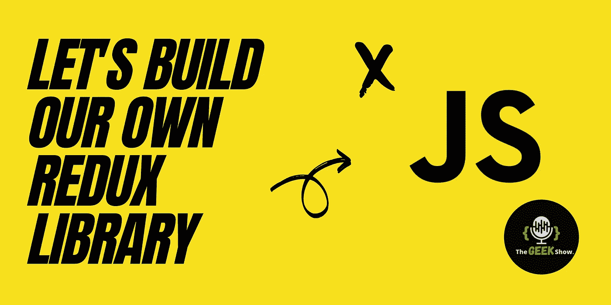
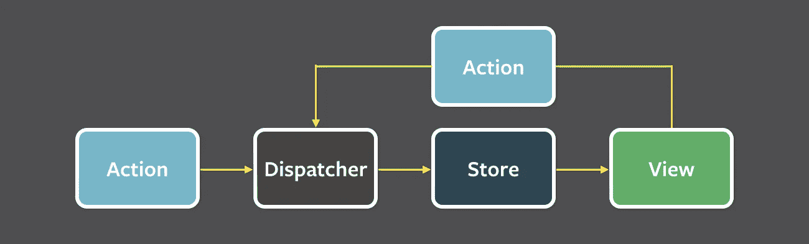

# 让我们建立自己的 Redux

> 原文：<https://javascript.plainenglish.io/lets-build-our-own-redux-9384b283529c?source=collection_archive---------5----------------------->



我在大学生活的大部分时间里都用 Java/Kotlin 编写代码，因此，大部分项目都遵循 MVC 模式。具有讽刺意味的是，我大学毕业后的第一份工作是 ReactJS 开发人员。现在，我不得不将我的范式从这种方法转移到建模数据的函数方法 Redux 上，这对我来说并不容易，我也经历了一些艰难的时刻。

首先，这几乎就像魔术一样。这个问题困扰了我很久，直到有一天我决定不再这样做。我体内的极客，就像你的一样，开始更多地了解它。好吧，你在正确的地方，不再怀疑，今天当你离开的时候，你将有足够的知识来建立你自己的 **redux** 。

Redux 至少可以分解为两个部分——减速器和通量。

# 什么是通量？

Flux 是一种模式或架构，而不是一个库或框架，用于管理我们应用程序中的数据流。由脸书(现为 Meta)创建，其 USP 是数据单向流动。见下图。



Image source: [https://github.com/facebook/flux/tree/main/examples/flux-concepts](https://github.com/facebook/flux/tree/main/examples/flux-concepts)

数据的任何变化，即**存储**，都必须经过**调度程序。**防止多个动作同时改变**存储器**中的相同数据**。**视图从商店中读取任何所需的信息，并将其显示在 UI 部件上。让我们在应用程序中使用一个简单的添加到购物车功能来快速理解这些。

## 分配器

商店进货的唯一来源是通过调度员。调度程序通过动作接收信息，并将其传递给商店。**每家店都会收到每一个动作**。此外，flux 模式规定每个应用程序都应该有一个单独的调度程序。

只要用户按下 add-to-cart 按钮，我们的视图就会捕获事件并调度一个包含产品 id 的`add-to-cart`动作。

## 商店

商店是我们应用程序的小型数据库。它拥有持久存储所需的所有数据，仅此而已。它向调度程序注册以接收动作。存储中的数据只能通过响应一个动作来改变。

收到`add-to-cart`动作后，我们的商店更新购物车，并在应用程序中发出一个 change 事件。

## 行动

动作是简单的 JavaScript 对象，具有需要调度的动作类型和有效负载，或者特定动作所需的数据。按照惯例，动作应该是语义性的，而不是描述动作的实现。

在我们的例子中`add-to-cart`是看起来更像下面的动作。

```
{
   type: 'add-to-cart',
   payload: { 
     product: '1' 
   }
}
```

## 视图

这些只是显示商店数据的 UI 组件。它们监听来自存储的变化事件，并根据上下文重新呈现。通常在用户触发的事件回调时从 UI 调度操作。

当用户按下 add-to-cart 按钮时，我们在`onclick`回调上调度`add-to-cart`动作。

现在我们知道了 flux 框架，让我们从构建自己的 redux 开始。另外，如果你对 JavaScript 的`reduce`方法了解不多，请快速阅读这篇[文章](/lets-deduce-the-reduce-method-in-javascript-bdc828f368a2),然后回到这里。如果你已经知道，让我们从一个简单的使用 reduce 的 sum 函数开始。

## 将数组简化为总和

Reduce 方法可以用来计算数组的和。下面是一个简单的实现。

```
const sum = (nums) => {
   return nums.reduce((state, next) => state + next);
};
sum([1,2,3,4]); // **10**
```

让我们把这个写得复杂一点。

```
const sum = (nums) => {
   const iterator = (state, next) => state + next;
   const [initialState, rest] = nums;
   return rest.reduce(iterator, initialState);
};
sum([1,2,3,4]); // **10**
```

我只是析构了数组，并单独创建了迭代器函数。到目前为止看起来不错。现在让我们试着将这个概念应用到更真实的世界。

## 越来越具体

假设我们有一个购物车，它根据 UI 上的用户交互接收关于产品数量的更新。下面是上述代码的更新版本，以匹配这个用例。

`update`方法与我们之前看到的 sum 函数相同，只是用作购物车中产品数量的更新方法。传递给 update 方法的数组中的所有值本质上都是传递给 reducer 的动作。让我们通过给我们的行为命名来使它更清楚。参见下面的代码。

看看我们所有的动作现在都有一个类型字段和有效载荷，在我们的例子中是 qty。此外，将现有存储作为初始状态传递给`reduce()`，然后用结果覆盖它，我们可以开始跨多个调用转换数据以减少。

这种方法使我们的代码更容易阅读和维护。此外，我们的存储只涉及数据建模和逻辑，这使得存储和归约器非常容易移植。ReactJS 上的 web 应用程序和 React Native 上的移动应用程序可以使用同一套 reducers 和 stores，考虑到如今我们将想法发布到产品上的时间越来越少，这是非常酷的。

希望你今天学到了新东西。一定要尝试做一个类似 redux 的应用来解决离你更近的应用挑战。此外，让我知道哪些 JavaScript 主题仍然困扰着你，我们会努力理解它们。

***让你内心的极客赢！***

*更多内容请看*[***plain English . io***](http://plainenglish.io)