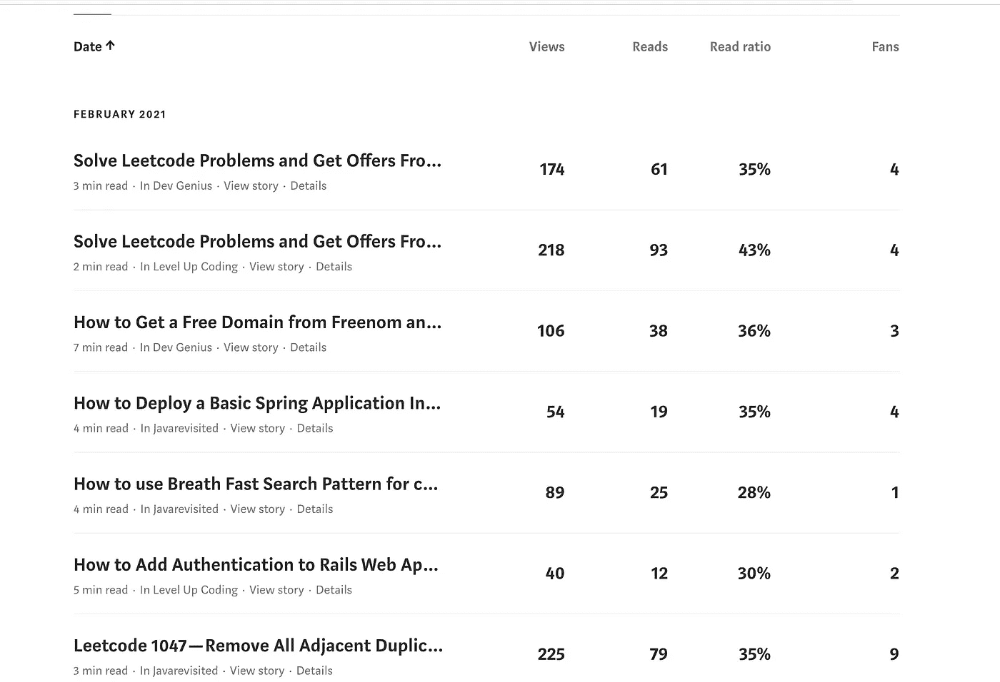
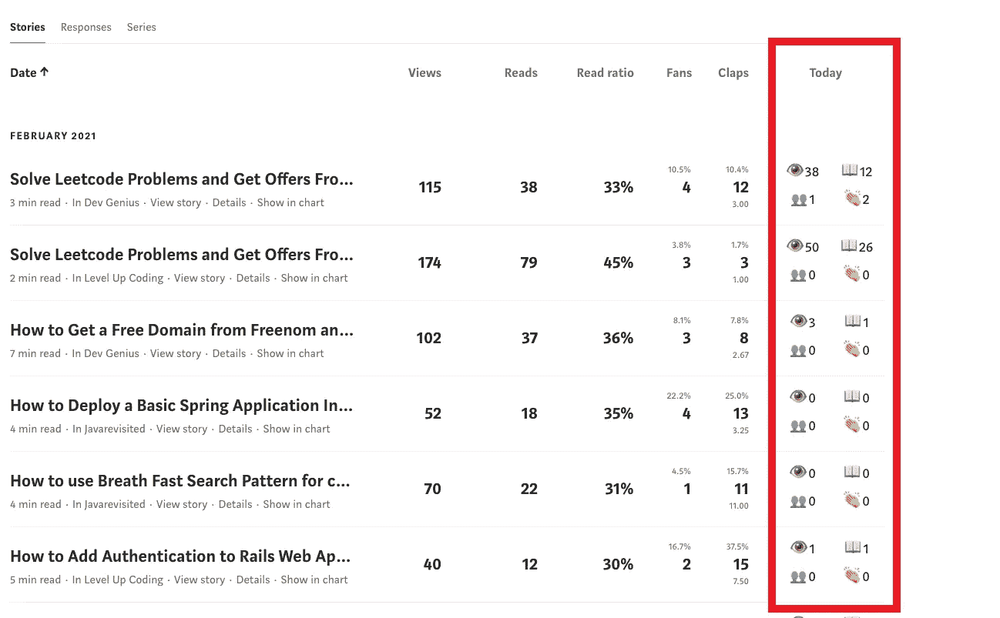

# 让我们创建一个 Chrome 扩展来为 Medium 添加新功能

> 原文：<https://javascript.plainenglish.io/lets-create-a-chrome-extension-to-add-new-features-to-medium-3da288af710e?source=collection_archive---------13----------------------->

## 我们将学习 chrome 扩展的基础知识，以及如何将 today 特性添加到中型开源 Chrome 扩展中

Photo by [Daniel Josef](https://unsplash.com/@josef_photography?utm_source=unsplash&utm_medium=referral&utm_content=creditCopyText) on [Unsplash](https://unsplash.com/s/photos/technology?utm_source=unsplash&utm_medium=referral&utm_content=creditCopyText)

# 什么是 Chrome 扩展？

谷歌 **Chrome 扩展**是可以安装到 **Chrome** 中以改变浏览器功能的程序。这包括为 **Chrome** 添加新功能，或者修改程序本身的现有行为，使其对用户更方便。([来源](https://www.bleepingcomputer.com/tutorials/understanding-google-chrome-extensions/#:~:text=Google%20Chrome%20Extensions%3F-,What%20is%20a%20Google%20Chrome%20Extension%3F,more%20convenient%20for%20the%20user.))

# 中等增强统计

[**中等增强 Stats**](https://chrome.google.com/webstore/detail/medium-enhanced-stats/jnomnfoenpdinfkpaaigokicgcfkomjo)**chrome 扩展由 [**Tomas Trajan**](https://twitter.com/tomastrajan) 创建。这是所有作家必备的扩展。这个扩展允许用户看到许多统计数据，包括**浏览量、阅读量、阅读率、粉丝数、鼓掌数、粉丝与鼓掌数之比，以及发布的故事或回复总数**。这里的 可以找到 [**的代码。**](https://github.com/tomastrajan/medium-enhanced-stats)**

# **如何安装 Chrome 扩展**

1.  **打开 [Chrome 网络商店](https://chrome.google.com/webstore)。**
2.  **查找并选择所需的扩展名。**
3.  **点击`Add to Chrome`。**
4.  **有些扩展会让你知道他们是否需要某些权限或数据。若要批准，请单击“添加扩展”**

**要了解更多信息，请访问官方文档[这里](https://support.google.com/chrome_webstore/answer/2664769?hl=en)。**

# **Chrome 扩展是如何工作的**

**有多个文件使 Chrome 扩展能够工作。**

1.  **`manifest.json`:这个文件包含了关于扩展名、名称、版本、权限和其他属性的重要信息。**
2.  **`background.js`:这个文件可以称为我们扩展的**数据**层。在这个文件中，我们让 API 调用获取数据。**
3.  **`stats-total.js`:这个文件是我们扩展的**视图**层。我们向`background.js`文件传递一条消息来触发 API 调用，当我们得到响应时，我们将它显示给用户。**
4.  **`stats-total.css`:这个文件包含了我们扩展的样式。**

**你也可以浏览我们的视频。**

# **如何安装自定义 Chrome 扩展**

**从 [**这里**](https://github.com/tomastrajan/medium-enhanced-stats) 下载原始代码，并执行以下操作在浏览器中加载扩展。**

1.  **在目标 Chrome 浏览器中进入`chrome://extensions`，通过右上角的复选框**启用“开发者模式”**。**
2.  **按下**“加载未打包的扩展……”**并选择包含扩展代码的文件夹。**

**在进入编码部分之前，让我们检查一下我们目前有什么，需要添加什么。**

****

**Original Medium Stat**

**上图显示了一个用户的中等增强状态。在这里，我们将添加今天的统计数据，即浏览量，阅读量，粉丝数和掌声。**

****** [## 增强中等增强统计铬扩展

### 我为任何关心统计数据的媒体作者添加了一个必备扩展的新功能！

medium.com](https://medium.com/dev-genius/enhancing-the-medium-enhanced-stats-chrome-extension-c99c1d251240) 

# 添加功能

整个过程在这个视频里有解释。

Improved Medium Enhanced Stats

我们的目标是获取今天所有文章的浏览量和阅读量。

**步骤 1:** 我们从`stats-total.js`向`background.js`发送一条消息，获取今天的所有帖子数据。

**步骤 2** :在`background.js`文件中，我们添加了一个监听器，如果我们得到的消息是`GET_POST_STATS_TODAY`，我们就调用`handleGetPostStatsToday`方法。

**步骤 3:** 在`handleGetPostStatsToday`函数中，我们调用后端 API 来按时间获取帖子统计数据。

**第四步:**在`calculatePostStats`函数中，我们将日期作为`key`，返回一个名为`result`的对象，并带有`views,reads,fans,claps`属性。

**第四步**:在`updateTableSummary`功能中，在表格中增加以下一行。

**步骤 5:** 在`loadPostStatsToday`方法中，我们得到今天的统计数据。我们还在 UI 中设置了统计数据。

万岁！！！！现在，重新加载 chrome 扩展，你就可以看到变化了。

# **恭喜**

你在中等增强状态 chrome 扩展中增加了一个新特性。现在，您可以随意试验这段代码，并自己构建许多很酷的特性。从这里下载完整的代码并安装 chrome 扩展。

代码可以在这里找到。

 [## 托马斯·斯特拉扬/中等-增强-统计

### 谷歌浏览器扩展增强中等统计！通过新的表格摘要行深入了解总视图数…

github.com](https://github.com/tomastrajan/medium-enhanced-stats) 

*阅读更多在*[***plain English . io***](https://plainenglish.io/)**