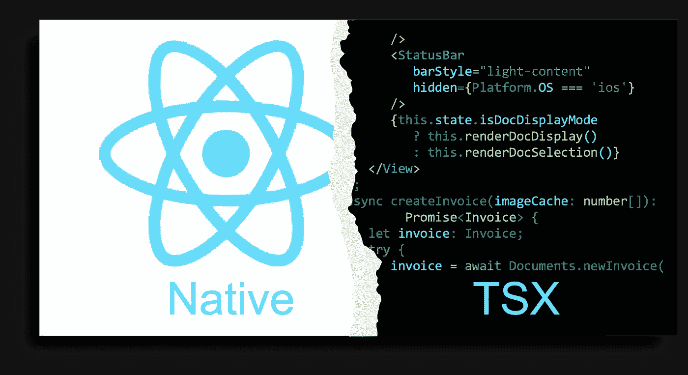
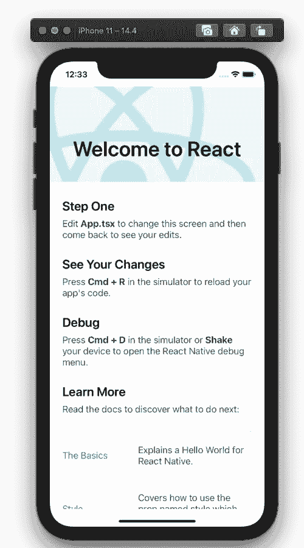
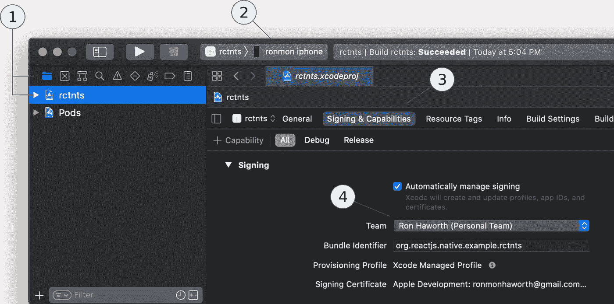
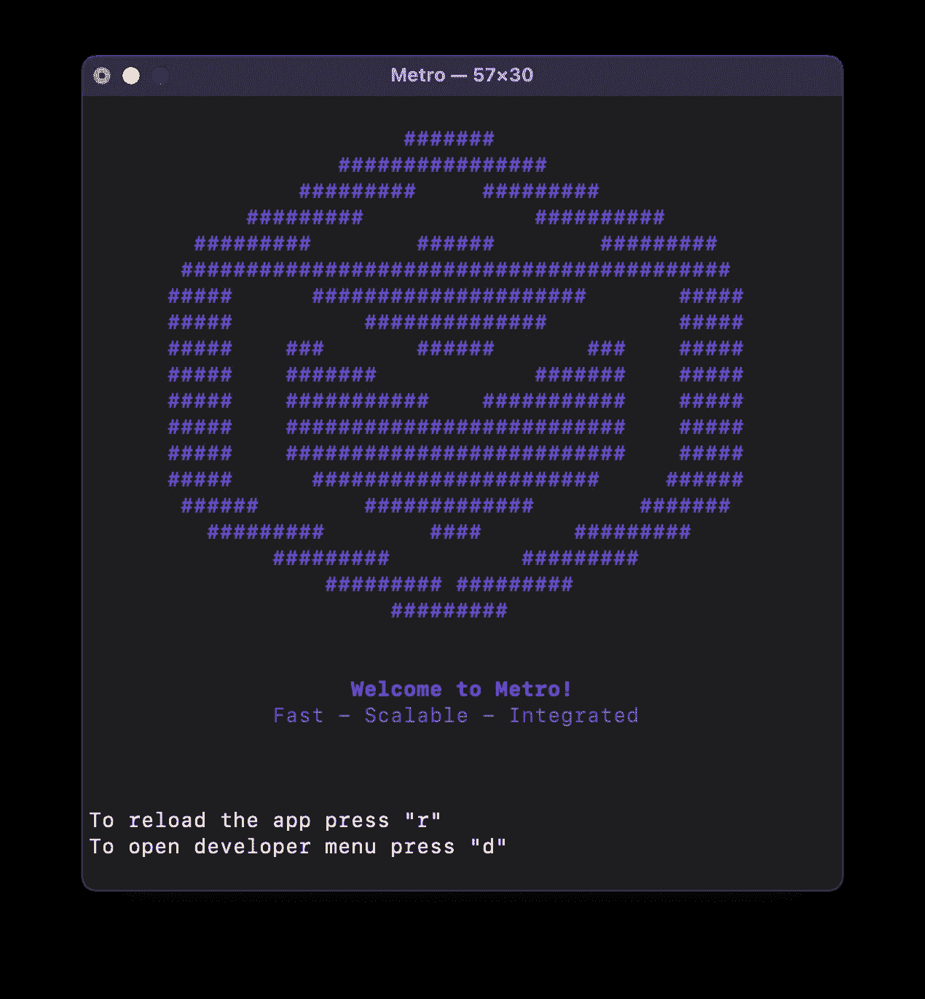
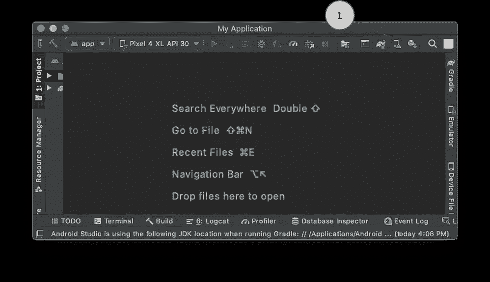
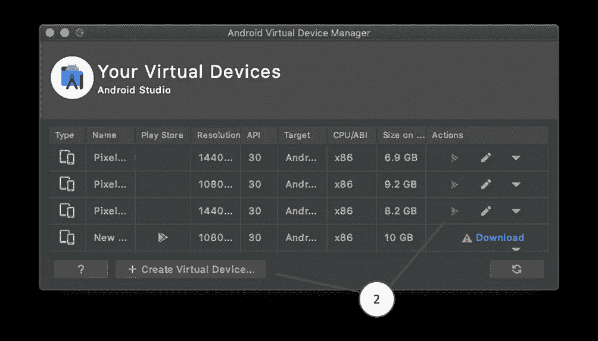
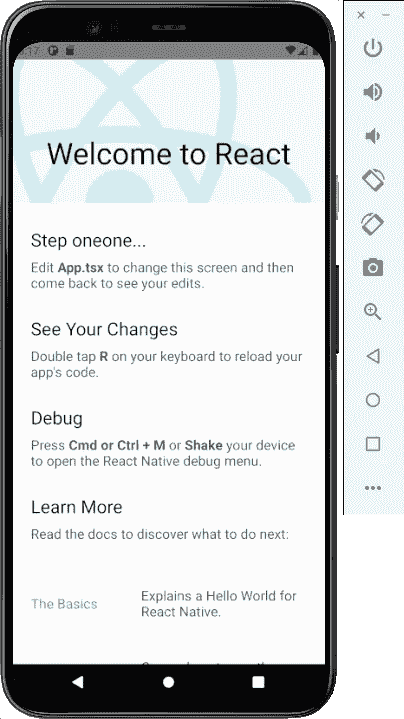

# 让我们创建一个 React 本机类型脚本应用程序

> 原文：<https://javascript.plainenglish.io/lets-create-a-react-native-typescript-app-35eee21e162d?source=collection_archive---------4----------------------->

# 作为学习练习和参考实施，现在就将这一架构完善、可重复的基础设施添加到您的武器库中



用*编写的应用 React Native* 原生运行在 iOS 和 Android 设备上。无需编写一行 Java 或 Swift 代码，您就可以控制整个堆栈——前端、中间和后端。你可以很容易地用纯粹的*打字稿*来完成。用一种语言来统治他们。

这个故事是为有兴趣学习或过渡到 React 原生生态系统的 TypeScript 开发人员编写的。它也适用于任何对坚实的 React Native / TypeScript 基础感兴趣的多平台应用程序开发人员，作为未来应用程序的起点。

我们将使用 TypeScript 作为源语言，为任何非正式或专业的 React Native 工作创建一个参考实现和起点。我们的实现将涵盖一系列不同的主题，包括项目结构、一些基本的 React 本地语言语义、代码库可重用性、设备管理、命令行快捷方式和产品命名规则。

我们将生产一个功能最少但架构良好的核心应用程序，用于绿地产品开发。让这个项目保持最新，并使用它来自信地引导任何需要这个堆栈的新应用程序。

# React 本机 CLI 项目

我们的项目将*而不是*基于 Expo tooling 或任何其他先进的锅炉板系统；也不会以这种方式开始。相反，我们将使用标准的 [*React Native CLI*](https://www.npmjs.com/package/react-native-cli) 以及一个优秀的、社区驱动的、现成的 React Native TypeScript [模板](https://github.com/react-native-community/react-native-template-typescript)。我们将利用各种命令行实用程序以及与设备相关的本地开发平台——用于 iOS 的 Xcode IDE 和用于其他平台的 Android Studio。

# 你需要什么

## 技术技能

没有必要了解任何关于打字稿的知识。我们的主要目标是创建一个由强大的 Typescript 编码环境支持的应用程序基础架构。该设置将准备扩展到下一个功能级别，并将作为对 TypeScript 和 React Native 感兴趣的人的学习平台。

对于这些目标，唯一的语言先决条件是 JavaScript 的工作知识和熟悉一种 [POSIX shell 命令语言](https://pubs.opengroup.org/onlinepubs/007904975/utilities/xcu_chap02.html)(这里我们将使用 [**zsh**](https://www.theverge.com/2019/6/4/18651872/apple-macos-catalina-zsh-bash-shell-replacement-features) )。你也要对 [**Node.js**](https://nodejs.org) ，[**NPM**/**npx**](https://www.npmjs.com/)， [**纱**](https://yarnpkg.com/) 和 [**git**](https://git-scm.com/) 驾轻就熟。

## 系统设置

你需要:

*   运行 Catalina 或更好的基于 macOS 的电脑(**macbox*)*
*   *您最喜欢的 IDE 或代码编辑器*
*   *可选地，通过 USB 连接到 macbox 和 macbox WIFI 网络的 iOS 和/或 Android 移动设备*

*我们的故事发生在一台基于 macOS 的电脑上。虽然没有它也可以编写 iOS 解决方案，但那是另一回事了。*

## *Xcode 和 Android Studio*

*Xcode 和 Android Studio 的设置和一般使用超出了本文的范围。在完成我们的项目(不包括它们的安装)的过程中，将会提供关于它们的使用的明确说明，并且它们在这里的使用都是非常直接的。如果 macbox 上没有安装这些产品，请安装它们。如果已经安装，请继续更新以获得最新版本。*

## *目标平台*

*我们将在 Android 模拟器(可通过 Android Studio 获得)、iOS 模拟器(来自 Xcode)上运行我们的软件，并可选地在任一平台的*物理*设备上运行。*

# *让我们摇滚吧！*

## *确保 Node.js 的 l *测试 LTS* 已安装，并且是 macbox 的默认设置*

*既然我们是从零开始构建一个项目，我们不妨从最新的完全支持版本的 **Node.js** (node)开始，因为从这一点开始我们所做的几乎所有事情都将依赖于它。*

*让我们用 **nvm** (节点版本管理器)来抓取*最新的 LTS* (长期支持)版本的节点。你可能会被诱惑使用他们所谓的*当前版本*，这看起来很合理，甚至是可取的，但不要这样做。当前版本用于内部系统开发和生产包管理，仅支持 6 个月，而 LTS 版本支持 30 个月。选择最新的 LTS 可以节省几年升级应用程序的麻烦。*

*如果 macbox 上没有安装 **nvm** ，请遵循此处的说明。*

*下面的片段说明了我们在终端会话中关于交互式命令处理器对话框的约定。`**bold**`字符是在`*italics*`中响应输入的命令——常规的终端内容。空白行上的省略号代替了不感兴趣的输出。*

*从任何目录:*

1.  *运行命令`**node --version**`，在我的系统上，它返回`*v15.8.0*`；注意到 node 的所有奇数版本都是非 LTS 的，我决定不这样做*
2.  *最新的 grep，我们看到的是`*v14.15.5 (Latest LTS: Fermium)*`*
3.  *如果你还没有最新的 LTS，用`**nvm install --lts**`安装它，其中`**nvm**`显示我们新的`*default alias*`指向`*v14.16.0*`*
4.  *用`**node --version**`命令验证这一点，知道我们已经设置好了。*

```
***node --version**
*v15.8.0***nvm ls-remote | grep 'Latest LTS' | tail -1**
*v18.14.0   (Latest LTS: Hydrogen)***nvm install --lts**
*Installing latest LTS version.* Downloading and installing node v18.14.0...
Downloading [https://nodejs.org/dist/v18.14.0/node-v18.14.0-linux-x64.tar.xz](https://nodejs.org/dist/v18.14.0/node-v18.14.0-linux-x64.tar.xz)... *...* Now using node v18.14.0 (npm v9.3.1)**node --version**
*v18.14.0* **~ >***
```

*安装节点的同时也安装了可执行文件**NPM**T21 和**npx**([节点包管理器*和节点包运行器*)。我们将使用 **npx** 专门运行`**react-native**`实用程序。](https://nodejs.dev/learn/the-npx-nodejs-package-runner)*

## *创建参考模型*

*接下来，使用`[**npx react-native init**](https://reactnative.dev/)`创建一个框架应用程序，传入我们的项目名称(`**rctnts**`，这里)和`**--template**`开关以引入社区模板`[**react-native-template-typescript**](https://github.com/react-native-community/react-native-template-typescript)`。该模板基于标准的 React 本机模板，同时添加了一些经过深思熟虑的、提供 TypeScript 支持的最小扩展。*

*完成后，导航到`**./rctnts**`目录并列出其一级结构。我们将很快仔细看看这些文件和目录，但让我们先运行应用程序。*

```
***cd ~
mkdir apps**
**cd apps
npx react-native init rctnts --template react-native-template-typescript** *...
✔ Downloading template
✔ Copying template
✔ Processing template
✔ Installing CocoaPods dependencies (this may take a few minutes)**Run instructions for iOS:
    • cd "*/Users/fred*/*apps*/rctnts" && npx react-native run-ios
    - or -
    • Open* /Users/fred/*rctnts/ios/rctnts.xcworkspace in Xcode or run "xed -b ios"
    • Hit the Run button**Run instructions for Android:
    • Have an Android emulator running (quickest way to get started), or a device connected.
    • cd "*/Users/fred*/apps/rctnts" && npx react-native run-android
...*
**cd rctnts
ls -1**
*App.tsx
__tests__
android
app.json
babel.config.js
index.js
ios
metro.config.js
node_modules
package.json
tsconfig.json
yarn.lock**
```

## *在模拟器上运行 iOS 应用程序*

*我们现在准备在 Xcode iPhone 模拟器上运行该应用程序。按照上面片段中打印的说明，在`*Run instructions for iOS:*`下面。*

```
***cd rctnts
npx react-native run-ios** *info Found Xcode workspace "rctnts.xcworkspace"
info Launching iPhone 11 (iOS 14.4)
info Building (using "xcodebuild -workspace rctnts.xcworkspace -
...
info Launching "org.reactjs.native.example.rctnts"
success Successfully launched the app on the simulator**
```

**

*default iOS app from **react-native-template-typescript***

****我们刚刚创建的 app***
这个单页 app 显示了几个基本的交互指令。它还滚动显示官方 [React 原生教程](https://reactnative.dev/docs/tutorial)的各种链接。如果你点击其中一个链接，结果页面将显示在 macbox 的默认浏览器中(而不是模拟器的浏览器中)。有趣的是，当我们在物理设备上运行这款应用程序时，我们会得到相同的行为——使该应用程序成为 macbox 浏览器的遥控器。干净利落。*

****跟随链接*** 如果这是你第一次接触 React Native，那就继续跟随应用程序的链接了解情况吧。这些链接中的材料质量超高，是网站综合处理的一小部分，将成为你的首选参考。*

*在这里，应用程序出现在 iOS 模拟器中，默认为 iPhone 11 设备。要在另一个 iOS 设备模拟器上运行应用程序，请使用模拟器开关，就像在`npx react-native run-ios --simulator="iPhone 8"`中一样。*

## *选择性地在设备上运行 iOS 应用程序*

*在您的项目上启动 Xcode 运行`**xed ./ios.**`命令。这会对你的`**rctnts.xcworkspace**`运行 Xcode。*

*然后，在 Xcode 中，做这些事情。*

**

*Select a signing Team associated with your Apple ID*

1.  *选择左上角的文件夹图标以查看项目视图，然后选择项目`rctnts`*
2.  *将您的 iOS 设备连接到 macbox USB 端口，选择左侧的`rctnts`并点击右侧的设备列表，滚动到顶部并按名称选择您的设备*
3.  *点击*签名&功能*标签*
4.  *在团队选择列表中，点击*添加账号…* 并用你的 Apple ID 进行认证，此时你就被赋予了一个用户角色叫做*你的名字*(个人团队)的团队；关闭对话框，现在您可以从 Xcode *团队*选择列表中选择该团队*

*请注意[您的(个人团队)不能用于对您的应用进行代码签名以提交至应用商店](https://developer.apple.com/library/archive/qa/qa1915/_index.html)。要进入 App Store，你必须有一个 99 美元/年的苹果开发者账户，在那里你可以创建真正的开发者和发行凭证来签署和销售你的应用。请参见应用程序分发指南的[管理帐户部分。](https://developer.apple.com/library/ios/documentation/IDEs/Conceptual/AppDistributionGuide/ManagingAccounts/ManagingAccounts.html)*

*您现在可以在设备上运行应用程序了。确保您的设备**未被锁定**且**未被您的防火墙**阻止，并按下 Xcode 面板顶部的▶️。*

*如果您从未使用上一步中选择的团队在 iOS 设备上运行应用程序，则会出现一个 Xcode 错误对话框，标题为*无法运行“RCT nts”*，并包含指示应用程序的*配置文件未被用户*明确信任的措辞。完美！*

*走到这一步并收到这个错误，iOS 设备现在有了一个新的`Settings`菜单元素。在设备上，您现在可以导航到`Settings`>`General`>`Device Management…` >`Apple Development: …`>`Trust “Apple Development…`，然后按`Trust`。好了，我们进去了。*

*返回 Xcode 并再次按下▶️，应用程序将在设备上旋转。只有第一次，应用程序会问:*“RCT nts*想要找到并连接到您的本地网络上的设备。”单击确定。*

*如果应用程序在设备上只显示为不运行的图标，只需按下它。如果应用程序无法加载，用力摇晃设备(严重)，在出现的开发者菜单中，选择*配置捆绑器*，输入 macbox IP 地址，点击*应用更改*。您可能需要在设备进入睡眠模式时重复摇动程序(要控制睡眠模式，请调整`Settings` > `Display & Brightness`下的自动锁定)。在同一个菜单中，您也可以通过简单地选择*重新加载*来启动它。*

*你现在可以杀死 Xcode 并回到你信任的编辑器和终端，在那里你可以运行`**npx react-native run-ios --device**`(这次是用`**--device**`选项)并继续。如果您连接了多个 iOS 设备，请将设备名称指定为参数(`**--device *iosDeviceName***`)。*

**

****Metro —自动驾驶***
当你运行 app 时，一个终端弹出来，周围一堆胡言乱语*欢迎反应原生！**

*这是*Metro*—[JavaScript bundler](https://github.com/facebook/metro)和服务器，在 macbox 和设备之间建立了一座桥梁。它将我们复杂的代码集捆绑到一个 JavaScript 文件中，在设备上安装和管理它，并监听源代码的变化。*

*Metro 用我们的`**npx react-native run-ios**`命令自动跑*自动跑*，很棒但是有点太方便了。不能这样。*

****Metro —驾驶杆*** 为了进入下一个级别的控制，我们需要手动运行 Metro*—在一个单独的终端窗口中执行`**npx react-native start**` ，让它一直运行。这将使 Metro 服务器守护进程保持活动并监听。**

**要停止 Metro，在它的终端窗口中执行一个`***CTRL-c***`或者向它发送一个 kill 信号——对于它的默认端口(8081 ),使用:**

**`**kill $(sudo lsof -iTCP:8081 -sTCP:LISTEN | awk '{ print $2 }')**`**

**像这样手动运行 Metro 给了我们额外的控制权来管理它的资源，包括端口细节和缓存，并且通常给了我们一个很好的关注点分离，这在我们遇到冲突或需要更多控制时很有用。另外，驾驶手动挡只是更有趣而已。**

*****地铁——开快车*** 我们的 app 构建、安装、运行花了几分钟。但是有了 Metro，一旦它*在*运行，对其源代码的任何改变都会立即反映在应用程序及其显示上。**

**所以，让我们改变一个应用程序，并观察它的运行。当应用程序运行时，在编辑器中打开`**App.tsx**`，这样你就可以同时查看运行的应用程序和编辑器。**

**对`**App.tsx**`做任何明显的改变，比如说，将文字文本`>Step One<`改为`>Step Uno<`，然后观察当你点击 Command-S 时，屏幕会多快地反映出你的改变**

**是的——亚秒！不再有冗长的构建过程。仅此一点就让 React Native 值回票价。**

**试试这个。使用我们的新应用程序导航到其中一个*了解更多*页面，复制源代码并替换`**App.tsx**`的全部内容，然后点击 Command-S。瞧！你自己的实验室用这些反应本地的例子和那些世界和以太的例子进行实验。**

*****在非 8081 端口上运行 iOS 应用*** 使用普通`**npx react-native run-ios**`命令运行应用的默认端口是 8081。**

**if you need to use a non-8081 port for Metro iOS apps**

**偶尔，这个端口已经被分配给另一个进程。您可以停止该进程或使用另一个端口。如果您需要使用另一个端口(因为公司的 McAfee 应用程序不会放弃 8081)，您将需要修改几个文件，并在 npx 命令中添加`**--port**`选项。**

**您可以按照这里的注释手动编辑`**RCTDefines.h**`和`**project.pbxproj**`,或者将这些命令合并到您的 shell 操作中，如果这不仅仅是一个临时场景，或者如果您只是想方便地使用它，或者如果您是个坏蛋，那么这是一个不错的选择。**

**不管怎样，事情就是这样的。**

*****App.tsx*** 在运行这个应用程序时，精明的观察者可能已经注意到，我们的应用程序屏幕的指令中的**步骤一**建议编辑`**App.tsx**`文件以*改变这个屏幕，然后回来查看您的编辑*。**

**我们将很快接受应用程序的建议。现在，好肉汁——另一个扩展？这是什么**。tsx** 的事情？**

## *****JSX 语法:*。jsx *和。tsx 文件*****

**具有这些扩展名的文件支持 JavaScript JSX 语言语法，这正是 React 编程的优势所在。扩展名为`**.jsx**`和`.**tsx**`的文件分别用 JavaScript 和 TypeScript 编写，并且都支持相同的 JSX 语法。如果这是您第一次接触 JSX 语法，在继续阅读之前，请到这里[快速了解一下。并且知道这些事情。](https://reactjs.org/docs/introducing-jsx.html)**

***TypeScript 是 JavaScript 的超集，因此有效的 JavaScript 就是有效的 TypeScript。***

***JSX 是 JavaScript 的扩展，因此也是 TypeScript 的扩展。***

***所有的 TypeScript 语法在* ***中都有效。tsx*** *文件，有以下例外:***

**在 TypeScript 中，尖括号用于类型断言。但是 JSX 文件中的尖括号总是定义 JSX 元素。这给需要使用 JSX 语法的 TypeScript 程序造成了解析歧义。为此， ***。tsx*** *文件不允许通过尖括号进行类型断言。替换* ***中的此类断言。tsx*** *文件带有* `*as*` *运算符，以便…***

```
**const myPet = <Dog> createBestFriend("fido");**
```

***……变成了……***

```
**const myPet = createBestFriend("fido") as Dog;**
```

## *****有趣的文件*****

**下面是我们的`**npx react-native init rctnts react-native-template-typescript**`命令在应用程序根目录下创建的一些有趣的文件和目录。**

**`***Asp.tsx***`
我们 app 的主要入口点，也是我们开始编程的地方。**

**`***ios***`*`***android***`***目录***
平台特定目录主要由我们的 React 原生构建系统维护。***

**`***app.json***`
包含我们 app 的名称——实际上是它的*简称*和*显示名称*。这个简称将在我们的构建上下文中以各种方式使用，您将在下面的脚本中看到它的引用。**

**`[***babel.config.js***](https://babeljs.io/docs/en/configuration)` 控制着通天塔 transpiler 的行为。React Native 依赖于从该文件导出的 Babel 预设(参见[metro-react-Native-Babel-preset](https://www.npmjs.com/package/metro-react-native-babel-preset))来获取 Metro 和构建过程的正确插件。**

**`***index.js***`
用于引导我们的应用: **App.tsx** 。**

**`***tsconfig.json***`
告诉 TypeScript 这是项目的根目录，并为`**tsc**`(*TypeScript 编译器*)提供默认选项，包括`**tsc**` 命令行上没有直接提供的任何编译器选项和文件包含。这个文件也被你的 IDE 和 linter 使用。**

## **看看这个应用程序**

**`***index.js***`
React 原生应用需要注册自己，以便它们的生命周期可以由它们的目标原生系统管理。**

****index.js** file generated with the **react-native-template-typescript** template**

**这是使用根级别的`**index.js**`文件完成的，在这个清单中，它导入了`**App.tsx**`，其唯一目的是返回我们应用程序的顶级 JavaScript 入口点。它还从`**app.json**`抓取应用名称。**

**现在，AppRegistry 为 Metro 提供了一个入口点，供本机系统用来加载应用程序和管理其运行时生命周期。**

**这是我们应用程序的主要源文件，可能是你在任何新应用程序中替换的第一个文件。让我们仔细看看这里发生了什么。当你明白这一点，你就成功了。**

**第 31 行开始了`App`函数，这是我们应用程序的入口点，必须返回一个 JSX。元素对象(一个 *React 元素*)并且必须是文件的默认导出。按照惯例，但技术上无关，这里的函数名`App`与我们的`**index.js**`文件中的名称相匹配。名字不重要。只要是默认导出(第 118 行)，就可以称之为`Fred`。**

****App.tsx** file generated with **react-native-template-typescript** template**

*****JSX 元素是组件***
【JSX】元素标签(如第 34 行的`<StatusBar>`)指明了 React 元素的类型(*元素类型*)。元素类型是指 React 中的组件类型—元素*是*组件。**

**让我们看看这里使用的一些组件种类。**

**小写的 React 元素指的是内置组件——读 HTML 标签，像`<div>`。大写的元素被假定为范围内组件，例如从`‘react-native’`导入的`View`(第 12–19 行)。**

**部分 React 元素指 React [*核心组件*](https://reactnative.dev/docs/intro-react-native-components) ( `View`、`Text`、`ScrollView`)。有些是在各种标准库中实现的，还有一些是用户定义的。**

**这里可以看到`ReloadInstructions`(第 56 行)在范围内，因为它是从`NewAppScreen`系统库导入的(第 21–27 行)。为什么他们在这里使用一个组件，而不仅仅是一些文本文字？这是因为这个应用程序必须支持平台特定的措辞，因为在 iOS 和 Android 之间重新加载应用程序的指令是不同的。有趣的是，这里有一个[拉请求](https://github.com/facebook/react-native/pull/25353/files)调整该组件显示的特定于平台的指令。**

**`SafeAreaView`(第 35 行)，虽然是真正的核心组件，但只适用于 iOS 设备。它用于管理 UI 元素周围的填充，以避免物理屏幕限制，如相机凹口和圆角。**

**像`style={styles.body}`这样看起来像属性的东西是组件道具。这里，`style`是属性名，它的值`styles.body`是一个 JavaScript 表达式。**

**是的，在 JSX，任何出现在大括号(`{}`)中的东西都是有效的 JavaScript 表达式。记住，尽管`if`语句和`for`循环不是 JavaScript 表达式。如果一个组件需要使用这些，将逻辑和循环放入它们自己的函数中，然后这些函数可以被当作表达式并在大括号中引用。此外，有时用三元表达式代替`if` / `else`构造是有意义的。**

**更多详细内容、说明和示例，请参见 [JSX 深度](https://reactjs.org/docs/jsx-in-depth.html)。**

**包含整个 JSX 文档树的空的`<>`和`</>`元素(第 33 和 75 行)被称为*片段*，分别是`<React.Fragment>`和`</React.Fragment>`的简写。**

**碎片的存在是为了*防止*不得不将兄弟元素封装在像`<View>`或`<div>`这样的“普通”容器中。**

**我们正在通过组合创造复杂的成分(原谅辅音)。不可能允许兄弟(例如，一行中的三个`<Text>`元素)在容器元素之外单独呈现，所以我们把它们放在比如`<div>`中。当我们把这个结构嵌入到另一个不支持`<div>`的元素中时，问题就出现了。**

**在 JSX，当需要兄弟元素，但是常规容器不可行或不理想时，我们可以改为在片段中包含这些兄弟元素，这些片段不在文档模型中创建节点，但是提供了包含兄弟元素所需的语法。更完整的举例说明见[片段](https://reactjs.org/docs/fragments.html)。**

**好了，这已经很多了，但是 **App.tsx** 文件到此为止。值得研究和参考冲浪，因为这些都不会消失。一切都从这里开始，变得更加有趣，所以思考这个例子，直到它熟悉为止。**

## **在模拟器上运行安卓应用程序**

*****启动 AVD*** 转到 Android 模拟器，运行 Android Studio 并执行这些操作。**

********

**Run a virtual device on the Android Studio emulator**

1.  **单击 AVD (Android 虚拟设备)管理器图标**
2.  **在 AVD 管理器中，单击[启动]按钮(绿色箭头)在仿真器中运行其中一个 AVD，或者首先使用[创建虚拟设备]按钮创建一个 AVD，然后返回此处并单击[启动]按钮**

*****启动 Android 应用*** 现在 Android 虚拟设备正在运行，我们可以启动我们的 Android 应用了。**

```
****npx react-native run-android** *info Running jetifier to migrate libraries to AndroidX. You can disable it using "--no-jetifier" flag.
Jetifier found 967 file(s) to forward-jetify. Using 4 workers...
info Starting JS server...
info Installing the app...
Starting a Gradle Daemon (subsequent builds will be faster)
...
BUILD SUCCESSFUL in 1m 18s
27 actionable tasks: 27 executed
info Connecting to the development server...
8081
info Starting the app on "emulator-5554"...
Starting: Intent { cmp=com.rctnts/.MainActivity }***
```

****

**Android app from **react-native-template-typescript****

**我们被当作一个形式和功能与 iOS 应用程序完全相同的安卓应用程序。嗯……除了基于我们的`ReloadInstructions`和`DebugInstructions`组件中平台特定逻辑的屏幕指令中的细微差别之外。**

## **可选地在设备上运行安卓应用程序**

*****首先，找到 Android 的* * & ^$% *build 号*** 不同的 Android 设备类型和操作系统变体有不同的菜单结构，但对于定位`Build number`来说，它们遵循下面的*通用导航模式。现在就使用它。***

**(`Settings`-或-`Settings`>`System`)**>**
(`About phone`-或-`About`)**>**
(`Software info`-或-
`Software information`-或-
`Software information`>`More`-或-
*什么都没有，好像你已经在那里了*)**

**到了那里，轻敲`Build number`七次*召唤隐形剑客*。我是认真的(无论如何，关于七拍)。这将带你进入双秘密开发模式。现在才可以在`Settings` > `Developer`下启用 *USB 调试*。是的，这正在发生。**

**回到 macbox，将`**Android/sdk/platform-tools**`添加到您的路径中。**

```
****echo 'export PATH=$PATH:~/Library/Android/sdk/platform-tools/' >> ~/.bashrc
. ~/.bashrc****
```

**将设备插入 macbox 上的 USB 端口，并运行 *Android 调试桥*命令`**adb devices**` 以确保设备被识别。单词 *device* 左边的字母数字字符串是您的设备标识符。如果 Android 模拟器还在运行，它也会出现在列表中，就像这里一样。**

```
****adb devices** *List of devices attached**emulator-5554 device
15efadeb device***
```

**`**adb**`命令是它自己的故事，有无数选项，运行它自己的 Unix 系统，在设备上运行一个守护进程，并促进与 macbox dev 服务器 Metro 的通信。对于我们的直接目的，我们将“仅仅”使用它来做*反向端口转发*，以便当设备试图与其自己的 8081 端口通信时，它将改为与 macbox 8081 端口对话。**

**给我们的`**run-android**`命令加上一个`**--device**`开关，比赛就开始了。**

```
****adb reverse tcp:8081 tcp:8081
npx react-native run-android --device****
```

*****在非 8081 端口上运行 Android 应用程序*** 参见 ***在非 8081 端口上运行 iOS 应用程序*** 一节，了解关于这个一般主题的讨论和基本原理。以下是 Android 的细节。**

**if you need to use a non-8081 port for Metro apps**

## **完善模型——添加一点 sumpin**

**从技术上来说，我们已经实现了我们的目标，即创建一个应用程序，作为未来应用程序的可重用核心。但是目的是什么呢？使用上述说明创建一个新的应用程序就像从我们的新模型中“克隆”一个一样简单。但这没有抓住重点。**

**毕竟，这个练习的目的是创建一个可克隆的参考实现。是的，为了节省时间，但更重要的是为了促进我们的标准，提供一致性和可重复性，以及在我们的开发环境中代表我们对未来应用的最低期望。**

**另一方面，在这里猜测一个给定的开发努力或组织可能需要或甚至想要什么是愚蠢的。取而代之的是，让我们补充一点每个人都需要的假设，以表明我们在这里。一些*常用目录*怎么样？总之，他们通常是第一个上来的。**

****此外，围绕媒体、字体、服务、语言、可访问性和其他任意特性的各种资产需要共同的生存空间。下面是一些你会在野外看到的目录。还有其他的，你可能不需要所有这些。您将根据您的应用、组织和客户的要求找到自己的组合，但这些是几个事实上的选择，让这一切成为现实。****

**在应用程序的根目录(`**./rctnts**`，运行这些`**mkdir**`命令。我们创建了`**.keep**`文件，所以最深的目录被 git 选中(git 不存储空目录)。**

```
****mkdir -p src/assets/fonts; touch src/assets/fonts/.keep
mkdir -p src/components; touch src/components/.keep
mkdir -p src/i18n; touch src/i18n/.keep
mkdir -p src/modules; touch src/modules/.keep
mkdir -p src/services; touch src/services/.keep****
```

**`**src/assets/fonts**` 标准放置各种系统检查字体**

**`**src/components**` 我们组件的专用根目录**

**`**src/i18n**` 国际化资产包括翻译映射**

**`**src/modules**`**React 特定组件之外的代码和算法****

****`**src/services**` 访问和管理任意功能的抽象****

*******将参考模型提交给 git*** 让我们将我们的参考模型提交给`**git**`，以便为 C *lone 和重命名*流程做好准备。在`**./rctnts**`中，运行以下命令，我们称之为参考实现。****

```
******git init****git add -A****git commit -m 'initial commit'******
```

****我们的模板已经给了我们一个完美的`**.gitignore**`文件，所以我们现在有了一个好的、可发布的工作库(减去一个`**README.md**`文件)。****

## ****克隆并重命名我们的参考应用****

*******克隆参考应用*** 我们已经为将来会有自己名字的应用创建了一个参考模型。所以我们才花了无数个小时来到这里。因此，让我们克隆我们的模型应用程序，并对其进行重命名。让我们把这个新的应用程序叫做*目录应用程序*，就像我们知道自己在做什么一样。****

```
******cd ~/apps
git clone rctnts catalogapp
cd catalogapp******
```

******此外，iOS 和 Android 平台的命名惯例完全不同，这使得重命名 React 原生应用看起来更像是一项职业，而不是一个偶然的问题。******

****幸运的是，开源社区又一次提供了我们所需要的东西。我们将使用一个社区贡献的包来帮助我们高效地克隆/重命名应用程序本身，并帮助更改其绑定和应用程序标识符。还有一个琐碎但必要的手动步骤。****

*******重命名我们的参考 app*** 全局安装精彩的`[**react-native-rename**](https://www.npmjs.com/package/react-native-rename)` 包和二进制文件并运行，如下所示(全部来自我们新的`./**catalogapp**`目录内)。然后按照完整的`**react-native-rename**`输出(此处未显示)中的指示运行此处显示的清理命令。结尾用一个`**CTRL-c**`爆发。****

```
******yarn global add react-native-rename
npx react-native-rename 'Catalog App' -b com.acme.catalogapp**/ios/CatalogApp RENAMED
/ios/CatalogApp-tvOS RENAMED
...
/app.json MODIFIED
/android/app/build.gradle MODIFIED
...
**yarn install
...
cd ios; pod install; cd ..** *...
Pod installation complete! There are 47 dependencies from the Podfile and 38 total pods installed.*
**watchman watch-del-all** *{
    "version": "4.9.0",
    "roots": [
        "/Users/fred/apps/rctnts"
    ]
}*
**npx react-native start --reset-cache
*...*** To reload the app press "r"
To open developer menu press "d"
**CTRL-c******
```

*******传递给`**react-native-rename**` ( `'Catalog App'`)的 app 名称和 bundle id*** 主值将成为`**app.json**`中`displayName`参数的值。它的语法是混合大小写的字母数字加空格。该值也将被分配给`name`参数(没有空格)。****

****`**-b**`选项指定了 *Bundle ID* ，它将在 Android 端控制大量的 Java 类型(反向域)目录命名，但在 iOS 端则没有。捆绑包 id 的长度必须至少为两段(由句点分隔)，并且不能以句点结尾。每个段都是大小写混合的字母数字加连字符，并且必须以字母开头。****

****要指定 iOS 端的捆绑 ID，请参见上面标题为*选择与您的 Apple ID 关联的签名团队*的截图。我们使用该屏幕选择了我们的*签约团队*，但是团队字段的正下方是*捆绑包标识符*字段。在 Xcode 中打开我们的新应用程序(`**xed ./ios**`)，返回到该屏幕并输入您在上面输入的确切的捆绑包 ID。从那里保存应用程序，它将被编码到我们项目的 iOS 端。****

****注意，包 id 很重要。它们在苹果的应用商店和谷歌的 Play 商店中唯一地识别你的应用。在您的应用程序被接受之前，您可以更改它们。之后，在应用程序的整个生命周期中，你都要使用这个标识符。慎重选择。****

*******为了测试新系统*** 使用`**npx react-native start**`在自己的终端会话中启动 Metro，在另一个终端中，使用`**npx react-native run-***platform*`(其中`*platform*` 是`ios` 或`android`)启动 iOS 或 Android 应用程序(确保首先运行 Android 模拟器)。****

****如果使用连接的设备，请按照 *O* ***下的说明在设备*** 上运行 iOS/Android 应用程序。****

## ****货物****

****已经走了这么远，你现在有权得到货物。以下两个脚本结合了整个故事中的操作命令、技术和假设。我称他们为`**rctntsclone**`和`**rctntsrun**`，但是你喜欢怎么称呼他们都行。将这些列表的内容粘贴到您选择的文件中，并使它们可执行(`**chmod 755 rctntsclone rctntsrun**`)。****

****在使用这些脚本之前，请确保您已经按照上面的说明创建了我们的`**rctnts**`参考模型(按照上面的说明从 ***创建参考模型*** 到 ***将参考模型提交给 git*** ，包括在内)，这些脚本应该可以正常工作。****

****`the **rctntsclone** script`****

*******rctntsclone 脚本*** 该脚本一举完成克隆和重命名过程。****

****正在运行命令…****

****`**rctntsclone \
--app 'Catalog App' \
--bundle com.acme.CatalogApp**`****

****…在`**./rctnts**`目录中，将验证您的捆绑包 ID，克隆`**rctnts**`应用程序，重命名并在之后清理，创建一个包含该应用程序的新的并行目录(`**../CatalogApp**`)。****

****我们在这里使用`**zsh**` shell(并继续使用),因为它现在是 macOS 的默认设置。另外，它能够解析“长”命令选项(`--app`)。****

****如果用户误用选项或通过`--help`选项，将打印用法。****

****这个脚本和我们之前收集的 shell 命令的主要区别在于，这个脚本执行了许多健全性检查和验证。****

****例如，它验证包 ID 的语法，并确保脚本在一个合理的位置启动——目录`**./rctnts**`。****

****这里的捆绑 ID 验证是一种混合的东西，旨在保护与苹果应用商店和谷歌 Play 商店兼容的值。虽然这两个商店之间的 Bundle ID 规范非常类似于 Java 风格的反向域名，但是我们必须坚持一些细微的差异，而且我们确实这样做了。****

****最后，该脚本启动 Metro 服务器，只是将`**--reset-cache**`选项传递给它，作为其清理过程的一部分，在此之后，它等待几秒钟并终止剩余的进程。****

****如上所述，不要忘记通过 Xcode 复制新的包 ID。****

****the **rctntsrun** script****

*******rctntsrun 脚本*** 接下来，您可以`**cd** **../CatalogApp**`并运行命令`**rctntsrun**`的一些变体，比如…****

****`**rctntsrun --ios --port 8042 \
--device 'Rons iPhone'**`****

****…有或没有设备(和可选的设备名称)，在 Android 或 iOS 平台上，针对任何有效的可用端口(或重用工作的 Metro 端口)。****

****该脚本将编辑文件并执行启动应用程序所需的命令。根据您的测试场景，它可以针对相同或不同的端口同时运行多次。例如，你可以在 iOS 上运行一次，在 Android 的同一个端口上再运行一次，在两个设备上同时测试同一个应用。你可以启动多个应用程序(在不同的端口上)以及模拟器/设备/端口/平台的任何其他逻辑排列。****

****这里值得评论的一些代码包括第 37 行…****

****`**if [[ “$v_port” != <-> ]] {**`****

****…这确保了`**$v_port**`变量只包含数字字符。很好奇是因为这种模式只有`**zsh**`才有。****

****这里真正繁重的工作是由第 70–77 行的`**ed**`命令完成的。这里，脚本将文件的`**RCT_METRO_PORT**`条目更新为我们的命令的`**--port**`值，或者如果没有指定，则更新为默认值(`**8081**`)。****

****从第 82 行开始，脚本评估用户输入的端口当前是否在使用，这是一个很有意思的步骤。****

# ****结论****

****咻。您已经创建了一个 React Native TypeScript 参考应用程序，用于支持您的产品计划。你已经用它召唤出了邪恶的同卵双胞胎。现在，您拥有了几个独特而强大的脚本，它们可以与您不断发展的体系结构进行插件兼容。****

****感谢您在此投入时间。我相信这会为你节省几个小时的时间。感谢你远道而来——很明显你在坏蛋的北面。快乐编码，愿源代码与你同在！****

****罗恩·霍沃斯
北美粘度****

*******许可:*** *以上脚本为*原创*且完全免费，可用于任何您认为有趣的用途、商业用途或其他用途。这里的想法、方法和代码样本都是从最好的朋友、工程师、网络空间潜水酒吧和目前可用的行星地狱洞中剽窃来的。积极地分享它们。*****