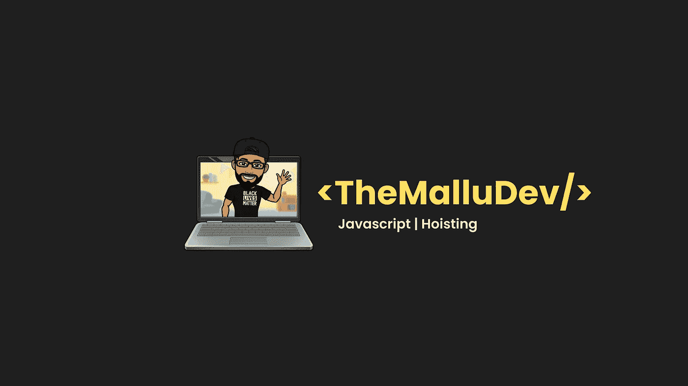

# 让我们揭开 JavaScript 中提升的神秘面纱

> 原文：<https://javascript.plainenglish.io/lets-demystify-hoisting-in-javascript-84e18b9f6569?source=collection_archive---------12----------------------->

## JavaScript 中的提升是什么，它是如何工作的？



提升是 JavaScript 中的一个特性，它将所有的变量和函数声明移动到代码的顶部(这个声明并不意味着代码被物理地移动到顶部。).众所周知，JavaScript 引擎创建了一个*执行上下文*，在这里运行 JavaScript 代码。

执行上下文中有两个阶段——创建阶段和执行阶段。创建阶段是提升发生的阶段。现在，让我们试着借助例子来理解吊装是如何工作的。

# 可变提升

JavaScript 有三种方法来声明变量。分别是 **var** 、 **let、**和 **const** 。它们中的每一个在用途、范围和提升方面都与其他的不同。你可以在这里阅读更多关于[的变量声明。这里需要注意的重要一点是，在变量提升期间，只有变量声明部分会被移动到代码的顶部，留下赋值。](https://themallu.dev/demystifying-var-let-and-const)

# 案例 1

```
 console.log(icecream); // Prints undefined
var icecream = “Vanilla”; 
```

在上面的代码片段中，我们试图在声明变量之前就使用它。这看起来会抛出一个错误。但是真的吗？这就是吊装的用武之地。

运行这段代码的 JavaScript 引擎首先创建一个执行上下文。一旦创建了执行上下文，它就从创建阶段开始。在创建阶段，引擎解析代码，将声明和初始化分成两条语句，并将所有声明移到代码的顶部。所有使用 **var** 关键字声明的变量在被提升时将被初始化为默认值 **undefined** 。这就是它在 JavaScript 执行上述代码时打印出**未定义**而不是错误的原因。

# 案例 2

```
 console.log(icecream); // Prints ReferenceError: icecream is not defined
let icecream = “Vanilla”;
```

当 JavaScript 引擎执行上述代码时，它会抛出一个引用错误。为什么会这样？不是应该打印**未定义**吗？ **let** 声明的变量真的被吊起来了吗？嗯，**让**变量也被提升，但与 **var** 相比，它们有一点不同。

运行这段代码的 JavaScript 引擎会创建一个执行上下文。一旦创建了执行上下文，它就从创建阶段开始。在创建阶段，引擎解析代码，将声明和初始化分成两条语句，并将所有声明移到代码的顶部。

现在区别来了:所有使用 **let** 关键字声明的变量将不会有像 **var** 那样的默认值；相反，当它们被提升时，它们将被标记为处于 **TDZ(时间死区)**模式。这只是意味着变量确实存在，但在用一个值初始化之前，它们是不可访问的。这就是当**让**声明的变量被提升时，JavaScript 抛出引用错误的原因。

# 案例 3

```
 console.log(icecream); // Prints ReferenceError: icecream is not defined
const icecream = “Vanilla”; 
```

那么 **const** 声明的变量呢？常量变量也被提升，它们的工作方式和提升 **let** 完全一样。这就是当 **const** 声明的变量也被提升时，我们得到相同错误的原因。

# 功能提升

将函数声明移到代码顶部的提升称为函数提升。

# 案例 1

```
 getIcecream(); // Prints Vanilla Icecream
function getIcecream() {
 console.log(“Vanilla Icecream”),
} 
```

运行上述代码的 JavaScript 引擎创建一个执行上下文，并开始创建阶段。在创建阶段，它将所有的变量和函数声明移到代码的顶部。在这种情况下，函数声明**geticestream**将被移到代码的顶部。在创建阶段之后不久，执行阶段就开始了，在那里代码将被执行。由于函数**geticestream**已经在创建阶段声明，调用**geticestream**将打印预期的输出，而不是错误。

# 案例 2

```
 icecream(); // Prints TypeError: icecream is not a function
var icecream = function () {
 console.log(“Vanilla Icecream”)
} 
```

运行上述代码的 JavaScript 引擎创建一个执行上下文，并开始创建阶段。在创建阶段，它将所有的变量和函数声明移到代码的顶部。在这个例子中， **var icecream** 被赋值给一个函数，这个语句叫做函数表达式。当引擎识别出 **var 变量** icecream 时，它将声明移到代码的顶部，并分配一个默认值 **undefined** ，留下函数代码。在执行阶段，当它遇到语句 **icecream()** 时，它将抛出一个类型错误，因为引擎期望一个函数，但却得到一个未定义的。这就是函数表达式不吊的原因。箭头函数呢？同样的事情也适用于箭头函数。这意味着箭头功能也不会被提升。

我希望这清楚了提升在 JavaScript 中是如何工作的。如果你觉得这篇文章有用，请展示你的爱，并通过你的社交媒体与你的同伴分享，他们可以最大限度地利用这篇文章。请随时通过 Twitter、LinkedIn 或电子邮件与我联系。

直到我们再次见面，**马卢开发**结束👋干杯！🥂

*更多内容请看*[***plain English . io***](http://plainenglish.io/)