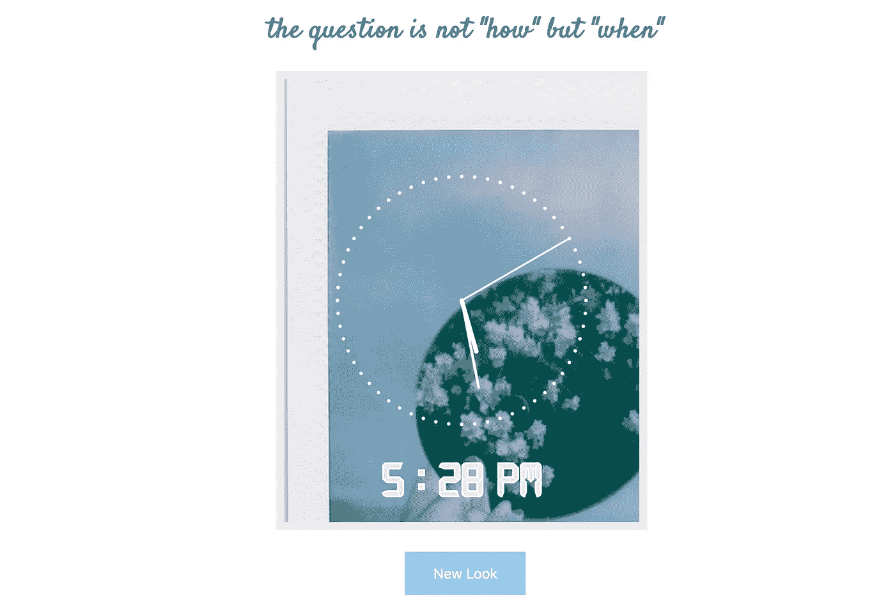
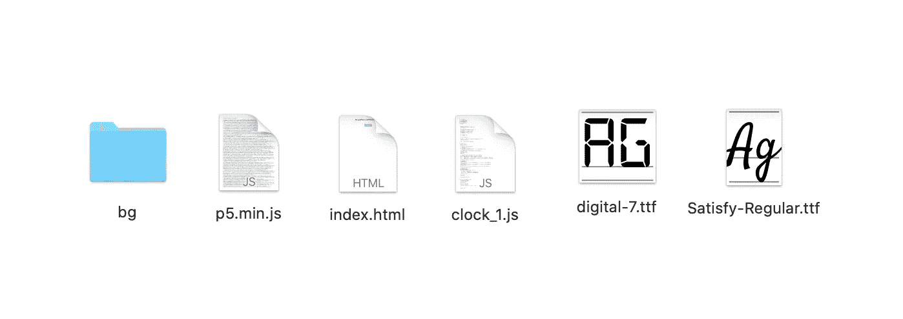

# 让我们用 P5 . js——JavaScript 设计一个个性化的时钟网站

> 原文：<https://javascript.plainenglish.io/lets-design-a-personalized-clock-website-using-p5-js-javascript-8b28f326d53a?source=collection_archive---------14----------------------->

## 带视频演示的分步指南


Photo by [Karolina Grabowska](https://www.pexels.com/@karolina-grabowska?utm_content=attributionCopyText&utm_medium=referral&utm_source=pexels) from [Pexels](https://www.pexels.com/photo/food-wood-dawn-dinner-5877662/?utm_content=attributionCopyText&utm_medium=referral&utm_source=pexels)

在本文中，我将向您展示如何使用 JavaScript 设计一个可定制的个性化时钟网站。对于开始使用 p5.js 库来说，这是一个很好的入门项目。这里有一个我如何来到这里的小背景故事:

我是一名程序员，碰巧也热爱摄影和艺术。在网上呆了一段时间，并研究了一些可以将编程与艺术相结合的项目后，我发现了这个领域叫做:“生成艺术”。然后，我买了几本书开始。有多个库可以用来创建艺术，其中最强大的一个是 *p5.js* ，这是一个 JavaScript 库。我决定从这个 p5.js 开始，因为 JavaScript 是我已经熟悉的语言。这些设计可以很容易地在网络项目中展示。

我在这里，写一篇如何用 p5.js 设计时钟的文章，谁不喜欢看着好玩的时钟呢。让我们开始建造一个。

## 目录

*   入门指南
*   编码部分
*   视频演示
*   结论

**这里有一张截图，让你对最终效果有所了解:**



image by author

# 入门指南

## **P5.js 库**

用他们自己的话来简短定义:" *p5.js 是一个用于创造性编码的 JavaScript 库，致力于让艺术家、设计师、教育工作者、初学者和其他任何人都可以访问和包容编码！p5.js 是免费开源的。”*(参考:[https://p5js.org](https://p5js.org))

我们将下载 javascript 文件，并使用 script 标签将其导入到我们的程序中。

顺便说一下，p5 也可以用于基于网络的游戏开发。这里有一个由 Jimmy Lam 写的不错的帖子: [Flappy Bird Clone 使用 p5.js](/how-to-make-a-web-based-flappy-bird-clone-with-p5-js-part-1-2913fde25c8a) 。

## 代码编辑器:Atom

[这里的](https://atom.io)是官网链接。

## Atom 包

Atom-live-server:在实时服务器上运行 web 项目。

# 编码部分

这里是我的文件夹目录的样子，给你一些想法。



image by author

## HTML(index.html)

这是 html 标签中的所有内容。

*   p5.min.js 是 p5 javascript 库的压缩版本。你可以在这里找到下载链接[。](https://p5js.org/download/)
*   clock_1.js 是 javascript 文件，大部分神奇的事情都发生在这里。将在 Javascript 部分讨论。
*   css 是一个非常酷的动画包。我将用它来制作一个按钮的动画。我用的是 CDN 版本，而不是下载文件。

```
<html>
  <head>
    <script src="../p5.min.js"></script>
    <script src="clock_1.js"></script>
    <style>
    //css codes here
    </style> // CDN link for animate.css     
    <link rel="stylesheet" href="[https://cdnjs.cloudflare.com/ajax/libs/animate.css/4.1.1/animate.min.css](https://cdnjs.cloudflare.com/ajax/libs/animate.css/4.1.1/animate.min.css)">   
  </head>  
<body>
    <div class="container">
      <p id="colors"></p>
      <h1>the question is not "how" but "when"</h1>
      <main>
      </main>
      <div class="renew">
        <button class="button" type="button" onClick="window.location.reload();">New Look</button>
      </div>
    </div></body>
</html>
```

## 半铸钢ˌ钢性铸铁(Cast Semi-Steel)

这个样式标签在 head 标签下面。没什么复杂的。只是在用户界面设计上做一些小改动。

```
<style>
    [@font](http://twitter.com/font)-face {
       font-family: satisfy-font;
       src: url(Satisfy-Regular.ttf);
    }
      h1{
        text-align: center;
        margin-top: 5%;
        font-family:satisfy-font;
        color: #577f99;
      }
      canvas{
        border:9px solid #f5e4f4;
        margin-left: 38%;
      }
      .button {
        background-color: #98caed; /* Green */
        border: none;
        color: white;
        padding: 15px 32px;
        text-align: center;
        text-decoration: none;
        display: inline-block;
        font-size: 16px;
      }
      .button:hover{
        animation: jello;
        animation-duration: 2s;
      }
      .renew{
        position: absolute;
        left: 50%;
        -ms-transform: translate(-50%, 50%);
        transform: translate(-50%, 50%);
      }
 </style>
```

## JS(时钟 _1.js)

这就是奇迹发生的地方。

**全局变量**

```
let center_x, center_y;
let sec_radius;
let min_radius;
let hr_radius;
let img;let colors_of_image;
```

**设置功能**

在这个功能中，我们要做几件事:

*   定义画布及其高度和宽度。
*   定义时针、分针和秒针的长度。
*   加载名为“digital-7”的外部字体。我们将用它来显示时钟下方的时间。
*   最后加载背景图像。我预先选择了 8 张图片，r 是一个随机数，它定义了选择哪张图片作为背景。

```
function setup() {
  let cnvs = createCanvas(400, 500);
  stroke(255); let radius = min(width, height) / 2; sec_radius = radius * 0.7;
  min_radius = radius * 0.5;
  hr_radius = radius * 0.3; center_x = width / 2;
  center_y = height / 2; digital_fnt = loadFont('digital-7.ttf');
  textFont(digital_fnt);
  r = Math.floor(Math.random() * 8);
  img = loadImage('bg/clock_bg_'+ r +'.jpg');
}
```

**时间显示功能**

在这个函数中，我们在时钟的正下方添加了一个数字文本来显示时间。这样我们也可以知道准确的分钟。

```
function time_show(x_w,y_h){
  fill(242, 225, 228);
  textFont(digital_fnt);
  textSize(54); let Hour = hour();
  let min = minute();
  let pm_or_am; if (Hour>= 12)
    pm_or_am = " PM"
  else
    pm_or_am = " AM" if(min < 10)
    min = "0" + min hr = Hour%=12 text(hr+" : "+min + pm_or_am, x_w, y_h);
}
```

**绘图功能**

时钟设计部分来了。我尽量让代码简单易懂。最后，我们调用时间显示功能，添加数字时钟。

```
function draw() {
  tint(255, 240);
  image(img, 0, 0);
  noFill(); let s = map(second(), 0, 60, 0, TWO_PI) - HALF_PI;
  let m = map(minute() + norm(second(), 0, 60), 0, 60, 0, TWO_PI) - HALF_PI;
  let h = map(hour() + norm(minute(), 0, 60), 0, 24, 0, TWO_PI * 2) - HALF_PI; stroke(255); strokeWeight(2);
  line(center_x, center_y, center_x + cos(s) * sec_radius, center_y + sin(s) * sec_radius); strokeWeight(3);
  line(center_x, center_y, center_x + cos(m) * min_radius, center_y + sin(m) * min_radius); strokeWeight(5);
  line(center_x, center_y, center_x + cos(h) * hr_radius, center_y + sin(h) * hr_radius); strokeWeight(4);
  beginShape(POINTS); for (let a = 0; a < 360; a += 6) {
    let rad_angle = radians(a);
    let x = center_x + cos(rad_angle) * sec_radius;
    let y = center_y + sin(rad_angle) * sec_radius;
    vertex(x, y);
  }
  endShape(); time_show(center_x/2+10, 470);
}
```

# *视频演示*

# 结论

本文到此为止。我希望你今天学到了新东西。从事像这样的实践项目是练习和展示编程技能的最佳方式。如果您喜欢这篇文章，请随意查看我的其他动手编程文章。快乐编码，保持创造力！

[](https://towardsdatascience.com/building-an-image-color-analyzer-using-python-12de6b0acf74) [## 使用 Python 构建图像颜色分析器

### 使用 Scikit-learn 和 OpenCV 的机器学习项目

towardsdatascience.com](https://towardsdatascience.com/building-an-image-color-analyzer-using-python-12de6b0acf74) [](https://towardsdatascience.com/building-a-face-recognizer-in-python-7fd6630c6340) [## 用 Python 构建人脸识别器

### 使用 OpenCv 库进行实时人脸识别的分步指南

towardsdatascience.com](https://towardsdatascience.com/building-a-face-recognizer-in-python-7fd6630c6340) 

*更多内容请看*[***plain English . io***](http://plainenglish.io/)