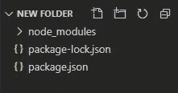
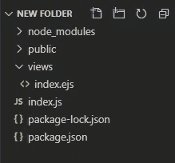

# 让我们使用 JavaScript 和 WebRTC 开发一个视频聊天应用程序

> 原文：<https://javascript.plainenglish.io/lets-develop-a-video-chat-app-using-javascript-and-webrtc-71d86cff8faf?source=collection_archive---------2----------------------->

## 第 2 部分:如何在后端使用 JavaScript 和 Node.js 实现 WebRTC

Photo by [Florian Olivo](https://unsplash.com/@florianolv?utm_source=medium&utm_medium=referral) on [Unsplash](https://unsplash.com?utm_source=medium&utm_medium=referral)

# 本系列教程

1.  [了解 WebRTC](https://medium.com/p/de745072c38c/edit)
2.  用代码实现 WebRTC(本教程)

在上一个教程中，我们学习了 WebRTC 的基础知识。

> [本文最初发表于简单编码](https://www.simplecoding.dev/articles/let-s-build-a-video-chat-app-with-javascript-and-webrtc-29cd)

 [## 让我们用 JavaScript 和 WebRTC 构建一个视频聊天应用程序

### 第 1 部分:了解 WebRTC

medium.com](https://medium.com/javascript-in-plain-english/lets-build-a-video-chat-app-with-javascript-and-webrtc-de745072c38c) 

在本教程中，我们将学习如何用代码实现这些概念，并创建一个在线视频会议网站。

# 现场演示

你可以通过下面提到的链接看到并使用网站**实况**。您只需输入房间名称即可创建/加入房间。

 [## WebTutsPlus WebCon

### 立即加入

desolate-depths-86299.herokuapp.com](https://desolate-depths-86299.herokuapp.com/) 

注意:-

*   该网站目前仅支持每个房间 2 人。

## 录像

你也可以观看下面的视频，看看如何使用这个网站。

# 要求

如果您还没有阅读前面的教程，强烈建议您在开始本教程之前阅读它。

我们将使用以下内容:-

*   节点。Js(版本 12 . 14 . 1)—JS 的运行时环境
*   插座。IO(版本 1.2.0) —用于 WebRTC 中的信令
*   快递。Js:(版本 4.17.1) —后端框架
*   代码编辑器(推荐使用 Microsoft Visual Studio 代码)
*   一个好的浏览器(推荐谷歌浏览器)

我们将使用节点。带有 Express 的 Js。后端的 Js 框架。**如果不熟悉 Node。Js 和 Express。Js 但是你知道任何其他的 MVC 框架，不用担心**。我们试图用这样一种方式来解释，即使你从未使用过 Node，你也应该能够理解。Js &快递。射流研究…

# 第一步。设置项目

让我们从建立项目开始。

**步骤 1.1。下载节点。Js**

*   你可以下载节点。点击[这个](https://nodejs.org/en/download/)链接。下载节点。Js 会自动在你的电脑上安装 NPM ( **节点包管理器)**。NPM 是节点的默认程序包管理器。射流研究…

**步骤 1.2。创建一个节点项目**

*   创建一个新文件夹。这个文件夹将是我们项目的根目录。
*   打开该文件夹中的 terminal/CMD，运行命令`npm init`。
*   持续按下`Enter Key`跳过项目的附加配置，并在提示时写入`YES`。
*   这将在项目的根目录下创建一个文件`package.json`。这个文件将包含关于我们的项目的所有必要信息，如项目依赖性。

**步骤 1.3。安装依赖关系**

*   在终端中，运行以下命令。它将安装依赖项— Express。JS 和 socket。我们项目中的 IO。

`npm install express@4.17.1 socket.io@1.2.0 --save`

*   标志`--save`会将这些依赖项的名称和版本保存在`**package.json**`中，以备将来参考。
*   上述命令执行完毕后，您会看到在项目的根目录下创建了一个文件夹`node_modules`。该文件夹包含我们刚刚安装的依赖项。

现在我们已经完成了项目的设置。以下是本阶段的项目结构

# 第二步。创建后端

现在让我们开始编写后端代码。在我们开始之前，让我们回顾一下之前教程中的几点。

*   我们需要一个后端服务器来发送信号。
*   某些信息—候选(网络)信息和媒体编解码器必须在两个对等体之间交换，然后才能使用 WebRTC 在它们之间建立直接连接。
*   信令指的是两个对等体用来交换信息的机制

以上几点告诉我们，我们必须实现一种机制，使用这种机制，两个客户端(浏览器)可以互相发送消息。我们将使用插座。木卫一为此目的。插座。IO 适合学习 WebRTC 信令，因为它内置了“房间”的概念。我们先来讨论一下什么是 Socket。超正析象管(Image Orthicon)

**插座。IO**

*   插座。IO 由两部分组成— `client Library` & `server Library`。显然，`client library`用于客户端，&用于服务器端。
*   插座。IO 有助于实现以下功能——假设有四个客户端连接到服务器。当服务器从一个客户端收到新消息时，它应该通知所有其他客户端，并将该消息转发给其他客户端。它类似于群聊。
*   在插座中。IO，发送到服务器或从服务器接收的每条消息都与一个事件相关联。因此，如果一个客户端向服务器发送一个关于特定事件的消息，服务器将只把这个消息转发给那些正在监听这个相应事件的客户端。
*   有一些保留的事件。然而，我们也可以定义自定义事件。要了解预约活动，您可以访问[此](https://www.tutorialspoint.com/socket.io/socket.io_event_handling.htm)链接。
*   此外，客户端可以加入一个房间，并要求服务器只向那些已经加入特定房间的客户端发送消息。

既然我们已经讨论了套接字。IO，我们可以开始实现后端服务器了

**第 2.1 步。创建文件索引. js**

*   在 Express 框架中，默认情况下，`index.js`是服务器的起点。因此，在项目的根级别创建一个文件索引. js。

**第 2.2 步。创建公共文件夹和视图文件夹**

*   在项目的根级别创建以下文件夹
    *`public`——包含前端的静态文件，如 CSS 和 JS 文件
    *`views`——包含前端的视图
*   我们的网站将只包含一个页面。在`views`文件夹中，创建一个包含前端 HTML 代码的文件`index.ejs`。表示使用`ejs`作为模板引擎。
*   项目结构现在将如下所示

**第 2.3 步。初始化 Express 和一个 HTTP 服务器**

*   现在，我们必须初始化 Express、HTTP 服务器和套接字。我们后端的输入输出。为此，将以下代码粘贴到位于项目根级别的`index.js`中

**第 2.3 步。机具插座。IO**

*   现在，是时候实现套接字了。后端中的 IO。
*   将以下代码粘贴到`index.js`文件中

所以，现在我们已经实现了我们网站的后端。以下为`index.js`的完整代码

# 第三步。创建我们网站的前端

现在，让我们创建我们网站的前端

**第 3.1 步。创建 HTML 文件**

*   让我们为前端创建一个 HTML 文件。
*   我们将分别在`public/css/styles.css`和`public/js/main.js`中定义前端的 CSS 和 Javascript。因此，我们必须导入这些文件。在后端，我们明确地将`public`设置为服务静态文件的默认目录。因此，我们将从 HTML 中的`css/styles.css` & `js/main.js`导入文件。
*   我们还将为`socket.io`导入客户端库
*   我们还将为 WebRTC 导入`adapter.js`,因为 WebRTC 的实现仍在发展中，并且因为每个浏览器对编解码器和 WebRTC 特性的支持[都有不同的级别。适配器是一个 JavaScript 垫片，它允许您的代码按照规范编写，这样它就可以在所有支持 WebRTC 的浏览器中“正常工作”。](https://developer.mozilla.org/en-US/docs/Web/Media/Formats/WebRTC_codecs)
*   我们在之前的教程中讨论了 STURN/TURN 服务器。我们将从`public/js/config.js`导入回合/眩晕 URL。我们将在本教程的后面创建这个文件。
*   将下面的代码粘贴到`views/index.ejs`

**步骤 3.2。添加 CSS 代码**

*   我们不解释 CSS 代码。
*   将以下代码粘贴到`public/css/styles.css`

**步骤 3.3。添加 JS 文件**

*   现在，让我们将 javascript 添加到我们的前端。我们在`index.ejs`已经有了文件`public/js/main.js`。正是在这个文件中，我们将实现使用`WebRTC`和`client library of Socket.IO`的各种方法
*   在两个客户端之间创建直接连接之前，它们之间会交换大量消息。在上一个教程中，我们以 Amy 和 Bernadette 为例，详细介绍了这一点。强烈建议您阅读该示例。我们已经使用 Socket 简单地实现了那篇文章中提到的每个步骤。超正析象管(Image Orthicon)
*   将以下代码粘贴到`public/js/main.js`

**第 3.4 步。在 config.js 中添加 STUN/TURN URL**

*   要在现实世界中制作这个网站，我们必须将 TURN/STUN 配置指定为`RTCPeerConnection()`。有很多公司提供免费的眩晕/转身服务器。我们将使用 XirSys 提供的服务器。
*   本自述文件的[中提到了从 XirSys 获取回合/眩晕 URL 的步骤](https://github.com/webtutsplus/videoChat-WebFrontend/blob/master/README.md)
*   将获得的配置粘贴到`public/js/config.js`
*   下面是`config.js`的样子。(网址会有所不同

# 恭喜你！

您现在已经创建了一个网络会议网站。要在 localhost 上部署并测试您的网站，请遵循以下步骤

*   在我们项目的根目录下打开一个终端。
*   运行以下命令— `node index.js`。
*   打开谷歌 Chrome，访问`localhost:8000`。输入房间名称(比如 foo)。你应该看看你的视频。
*   打开一个新标签并访问`localhost:8000`。输入相同的房间名称(foo)。您现在应该会看到两个视频元素。

你可以在[这个 GitHub 回购](https://github.com/webtutsplus/videoChat-WebFrontend)中找到完整的代码