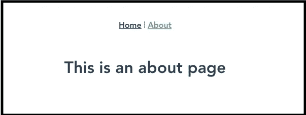

# 让我们使用 Spring Boot 和 Vue.js 从头开始开发一个电子商务应用程序

> 原文：<https://javascript.plainenglish.io/lets-develop-an-e-commerce-application-from-scratch-using-spring-boot-and-vue-js-aca33bd76517?source=collection_archive---------2----------------------->

## 用于管理 Vue.js 中类别的项目设置和构建管理面板


# 动机

在我看来，学习编程的最好方法是创建一个有实际用途的真实项目。这样，整个学习过程就变得相当令人兴奋。此外，你可以在你的文件夹中展示你的应用程序，如果你想获得一份自由职业或参加面试，这可以帮到你很多。

> 本教程非常适合刚开始 Vue.js 之旅的人，因为我们从头开始构建它，集成远程 API 调用、路由器、将 UI 分解成组件、表单处理以及涵盖一些重要概念，如 v-model、v-on。

在这一系列博客中，您将通过学习如何从零开始构建电子商务平台来增强您的开发技能。我擅长后端开发，本来想学 Vue.js，就通过创建这个项目学的。我想分享我建造的东西，所以我选择 medium.com 来分享我的旅程。

视频教程

# 读者注意

虽然我已经构建了整个应用程序，并编写了一系列的[教程](https://medium.com/javarevisited/lets-develop-an-ecommerce-application-from-scratch-using-java-and-spring-6dfac6ce5a9f)，这些教程非常受欢迎，在我引以为豪的 google result 中名列前茅(仅 medium 就有超过 130，000 的浏览量)，但我后来发现这些教程中缺少了一些部分，一些教程不再相关。例如，在一些教程中，我们使用了 vanilla JS，还开始开发一个 [android 应用](https://medium.com/javarevisited/7-free-flutter-online-courses-to-build-android-and-ios-apps-in-2021-54c0c92f16f9)，后来我们放弃了这个应用。此外，每个部分的详细解释也不见了，因为我的重点是构建应用程序，而不是编写教程。


所以，这是我重做教程的尝试，删除/编辑一些不再相关的部分，并创建一些涵盖缺失部分的教程，这样用户就可以很容易地跟上教程。

# 我们将在教程中介绍的内容

本教程将重点介绍前端。

1.  建立一个 Vue.js 项目
2.  配置路由器、API 调用、甜蜜警报
3.  创建一个仪表板，列出后端的所有类别
4.  添加和编辑类别。

作为构建电子商务应用程序的一部分，之前我们已经配置了这个应用程序的后端，并使用 Spring boot 开发了一些 API。如果你有兴趣，可以看看这个[教程](https://medium.com/javarevisited/lets-develop-an-e-commerce-application-from-scratch-using-java-and-spring-a921f448a93b)。但是如果你只对前端感兴趣，可以直接从这里开始。

每一个像亚马逊这样的电商店铺，都会有上百万的商品，它们往往属于一个品类。例如，一个鞋类包含许多鞋类产品。可以有一个类别，一个子类别，但为了简单起见，我们将只采取类别和产品。


现在，让我们看看如何使用最流行的 JavaScript 框架之一 Vue.js 来配置前端和创建 category 的用户界面。让我们开始吧！

# 最终演示

在本教程的最后，我们将

**列出所有类别**


**添加新类别**


**编辑一个类别**


# 开始项目

让我们开始吧。


Photo by [Braden Collum](https://unsplash.com/@bradencollum?utm_source=medium&utm_medium=referral) on [Unsplash](https://unsplash.com?utm_source=medium&utm_medium=referral)

打开命令行并执行下面的命令来启动一个新的 Vue 项目，假设你已经安装了 vue.js 或者转到这个[链接](https://v3.vuejs.org/guide/installation.htm)。

```
> vue create ecommerce-ui
```

如果您已经安装了 Vue CLI，该命令应该可以正常工作。接下来，它会询问一些项目配置。为配置我们的前端 Vue 应用程序提供以下数据:


确认所有细节后，Vue CLI 将为我们创建一个项目文件夹。

转到项目文件夹，给出以下命令来运行应用程序

```
> npm run serve
```

在服务器托管和应用程序启动后，您可以进入`http://localhost:8080/`。响应应该类似于输出，如下所示


耶！我们已经创建了我们的 Vue 应用程序。已经有了一个好的开始。


Photo by [Peter Conlan](https://unsplash.com/@peterconlan?utm_source=medium&utm_medium=referral) on [Unsplash](https://unsplash.com?utm_source=medium&utm_medium=referral)

该项目将有一些包含。vue 扩展，称为 Vue 组件。

# Vue 组件

几乎所有的前端框架都允许我们创建可以在相同或不同网站的多个地方重用的组件。一些例子包括搜索栏、登录表单、产品显示组件等。在 Vue 中，文件带有“.vue”扩展名被称为单个文件组件。这些单个文件组件由 HTML、JavaScript 和 CSS 组成。

```
<template>
  <!-- HTML Template -->
</template><script>
  export default {}
</script><style>
</style>
```

*   模板部件包含组件的 HTML。
*   脚本标签包含定义组件自定义行为的代码。
*   样式标签包含组件的 CSS。
*   `src/components`和`src/views`包含了我们所有的组件。


# 文件夹结构

让我们浏览一下我们新创建的 Vue 项目的文件夹结构

*   **public** —包含我们项目的主 HTML 文件
*   **src/assets** —存储图像、徽标等媒体文件。
*   **src/components** —存储我们项目的所有可重用组件。这些组件并不是某些特定路线所独有的。

除此之外，我们还有一些重要的文件

*   App.vue —它是我们项目的根组件
*   **main.js** —是我们项目的起点。这里我们导入我们的根组件 **App.vue** ，我们的路由器文件 **index.js** 和 **createApp** 方法。之后，我们使用下面的语句将根组件挂载到 DOM:

```
new Vue({
  render: h => h(App),
}).$mount('#app')
```

Vue 并不强制要求文件夹结构，我们可以根据自己的要求进行定制。

现在，我们有了我们的应用程序前端的基本版本，我们将努力增加更多的功能。基本的项目结构可以在下面的 GitHub 资源库中找到。

[](https://github.com/webtutsplus/ecommerce-ui/tree/setup) [## GitHub —安装时的 webtutsplus/ecommerce-ui

### 通过在 GitHub 上创建帐户，为 webtutsplus/ecommerce-ui 开发做出贡献。

github.com](https://github.com/webtutsplus/ecommerce-ui/tree/setup) 

# 为类别构建用户界面

一旦基本结构准备就绪，我们将开始为类别构建仪表板。

我们将首先在我们的项目中添加一个路由器。在命令行中运行以下命令，在系统中安装 Vue 路由器

```
vue add router
```

当要求选择历史模式时，选择是。现在，如果你运行这个应用程序，你会在上面看到两个链接。

它将创建一个路由器目录，其中包含 index.js 文件。此外，它将创建一个`views`目录，其中包含两个文件，它们是

1.  About.vue
2.  Home.vue


如果您使用命令`***npm run serve***`运行前端应用程序，您将在主页上看到两个链接。



我们仍然有`Helloworld`组件，让我们删除它。还删除 Home.vue 中的第 4 行、第 10 行和第 15 行，其中包含 vue 徽标图像和对 HelloWorld 的引用。

如果您运行该应用程序，您将看到以下屏幕。


## 设计应用程序

打开文件 index.html，并用下面的代码替换内容。

我们只是添加了一些基本的字体，bootstrap.css 和 jQuery。

# 添加类别

是时候创建一个添加类别的表单了。

1.  我们将在`views`目录中创建一个目录`Category`。
2.  在里面创建一个文件`*AddCategory.vue*`
3.  添加下面给出的内容，其中包含用于创建类别的输入数据的表单

## v-模型绑定概念

如你所见，在表格中，我们使用了`v-model=”categoryName”`。这是 Vue.js 中的一个重要概念，叫做[表单输入绑定](https://vuejs.org/v2/guide/forms.html)。

> 您可以使用`v-model`指令在表单输入、文本区域和选择元素上创建双向数据绑定。它会根据输入类型自动选择更新元素的正确方式。`v-model`虽然有点神奇，但本质上是更新用户输入事件数据的语法糖，加上对一些边缘情况的特别关注。更新路由器路径

为了让我们的单页应用程序正常运行，我们需要为新创建的组件创建路由器路径。进入`src/router/index.js`文件，通过添加和导入`AddCategory`组件进行如下更新。

```
{
    path: "/admin/category/add",
    name: "AddCategory",
    component: AddCategory,
  }
```

> 请注意，虽然我们在`views`和`components`目录中都有 vue 组件，但主要的区别是我们在路由器中使用 view 目录中的 vue 组件，即 view 目录中的每个 vue 组件都映射到一条路由。

现在如果我们转到页面[http://localhost:8080/admin/category/add](http://localhost:8080/admin/category/add)


## Axios 和`sweetalert`集成

Axios 是一个流行的、基于承诺的 HTTP 客户端，它有一个易于使用的 API，可以在浏览器和节点中使用

1.  运行命令`npm install --save axios`
2.  我们在 main.js `window.axios = require('axios')`中添加了以下一行
3.  我们还将安装软件包`npm install --save sweetalert`

## API 调用

1.  首先，点击提交按钮，触发`addCategory`功能。我们可以通过在提交按钮中添加代码`@click="addCategory"`很容易地做到，所以它看起来像这样

我们将在脚本标签内的方法部分定义一个函数。

## 基本 url

我们已经在 Heroku 上托管了我们的后端，您可以通过端点[https://infinity-lake-55070 . Heroku app . com/swag-ui . html #/category-controller](https://limitless-lake-55070.herokuapp.com/swagger-ui.html#/category-controller/getCategoriesUsingGET)

我们将把`[https://limitless-lake-55070.herokuapp.com/](https://limitless-lake-55070.herokuapp.com/)` 定义为我们的基本 url，为了创建一个新的类别，我们需要点击，

为了添加一个新的类别，我们需要用这个带有请求正文的 JSON 来点击 base URL+“category/create”。

我们将在脚本部分实现。


在这个应用程序的这个阶段，完整的代码可以在下面给出的 GitHub 存储库中找到。

[](https://github.com/webtutsplus/ecommerce-ui/tree/category-add) [## git hub——类别添加时的 web tuttsplus/电子商务用户界面

### 通过在 GitHub 上创建帐户，为 webtutsplus/ecommerce-ui 开发做出贡献。

github.com](https://github.com/webtutsplus/ecommerce-ui/tree/category-add) 

Photo by [IA SB](https://unsplash.com/@iasb?utm_source=medium&utm_medium=referral) on [Unsplash](https://unsplash.com?utm_source=medium&utm_medium=referral)

干得好，伙计们，如果你们成功做到了。接下来，我们将从显示类别开始。如果没有，可以在本地机器上运行上面的 Github repo，应该可以。

# 显示类别

现在，我们可以创建一个新的类别，以一种漂亮的方式显示所有的类别。

我们显示类别的最终结果如下所示-


# 组件分解

为了显示所有的类别，我们需要为此创建一个视图。在`src/views/Category`文件夹下创建一个名为 Category.vue 的文件。该视图用于显示从数据库中提取的类别。该视图还包含将我们重定向到`AddCategory`视图的引用。

在像 Vue.js/react,这样的现代前端框架中，我们将用户界面分解成更小的组件以实现可重用性。

在这里，我们还将按类别对此进行细分。这将是一个组成部分-


# CategoryBox.vue 组件

我们将在`src/components`中创建一个目录`Category`，并在其中创建`CategoryBox.vue`文件。

它将有一个从父视图传递过来的属性`category`，它将只显示类别，并带有一个转到编辑页面的选项，我们将在下一章构建这个页面。

# Category.vue 组件

现在是时候创建列出所有类别的组件了！

该组件使用 axios 从后端获取类别，并将每个类别作为道具传递给`CategoryBox`组件，后者显示每个类别。最后，组件将是显示在`CategoryBox`组件中的类别集合。

转到我们已经创建的`src/views/Category/Category.vue`文件，用下面的代码更新它！

# 更新路线

最后一步，让我们为该组件创建路由器路径，以显示所有类别。以下路线将被附加到路线中-

```
{
    path: "/admin/category",
    name: "AdminCategory",
    component: Category,
}
```

完整的 index.js 文件如下所示

```
import Vue from "vue";
import VueRouter from "vue-router";
import AddCategory from "../views/Category/AddCategory";
import Category from "../views/Category/Category";Vue.use(VueRouter);const routes = [
  {
    path: "/",
    name: "Home",
    component: Home,
  },
  {
    path: "/about",
    name: "About",
    // route level code-splitting
    // this generates a separate chunk (about.[hash].js) for this route
    // which is lazy-loaded when the route is visited.
    component: () =>
      import(/* webpackChunkName: "about" */ "../views/About.vue"),
  },
  {
    path: "/admin/category/add",
    name: "AddCategory",
    component: AddCategory,
  },
  {
    path: "/admin/category",
    name: "AdminCategory",
    component: Category,
  },
];const router = new VueRouter({
  mode: "history",
  base: process.env.BASE_URL,
  routes,
});
```


在下面给出的 GitHub 资源库中可以找到应用程序到这个阶段的完整代码

[](https://github.com/webtutsplus/ecommerce-ui/tree/category-display) [## GitHub-webtutsplus/ecommerce-ui 分类显示

### 通过在 GitHub 上创建帐户，为 webtutsplus/ecommerce-ui 开发做出贡献。

github.com](https://github.com/webtutsplus/ecommerce-ui/tree/category-display) 

Photo by [Nick Fewings](https://unsplash.com/@jannerboy62?utm_source=medium&utm_medium=referral) on [Unsplash](https://unsplash.com?utm_source=medium&utm_medium=referral)

伙计们，继续。接下来，我们将移动到编辑类别。

# 编辑类别

打开`src/views/Category`文件夹，用如下样板代码为`EditCategory`视图创建一个文件。

非常简单，我们只是定义了三个部分，模板，脚本和风格。

# 添加表单

现在，我们将添加表单来编辑类别。这将是一个类似于`AddCategory`视图的形式。我们还定义了 5 个变量`id`、`categoryName`、`description`、`imageUrl`、`categoryIndex`并将它们初始化为 null。我们还将定义基本 Url

# 发送要查看的类别数据

现在的问题是，我们如何将数据从类别主页获取到此视图。答案很简单。首先，我们为视图创建一个路由器。我们将`props: true`设置在第 5 行。我们将通过我们需要编辑的类别数据作为道具。

# 添加编辑选项

现在，我们将在`CategoryBox`中添加一个编辑类别的选项。10–12 号线。


# 更新脚本

现在，我们将创建一个道具`category`并在挂载部分填充所有数据。

就这样，现在如果我们点击`categoryBox`中的编辑按钮，我们会看到数据。


# 保存数据的 API 调用

现在，我们只剩下一件事，如何更新远程服务器中的数据？

我们将在方法部分定义一个函数`editCategory`。我们将在提交按钮中调用这个函数。

`<button type="button" class="btn btn-primary" @click="editCategory">Submit</button>`


`EditCategory.vue`完整代码

本教程的完整项目可以在下面给出的 GitHub 存储库中找到-

[](https://github.com/webtutsplus/ecommerce-ui/tree/category-edit) [## git hub——web tuttsplus/电子商务——ui 在分类——编辑

### 通过在 GitHub 上创建一个帐户，为 web tuts plus/电子商务 ui 开发做出贡献。

github.com](https://github.com/webtutsplus/ecommerce-ui/tree/category-edit) 

万岁。我们已经完成了使用 Vue.js 创建类别的前端构建部分！等等。在这个教程系列中有很多东西要学！在此之前请继续关注！

让我在评论中知道，如果你喜欢这个教程，或者你喜欢任何改进来更好地理解它，

***快乐学习！***

*多内容于* [***浅显易懂***](http://plainenglish.io/)