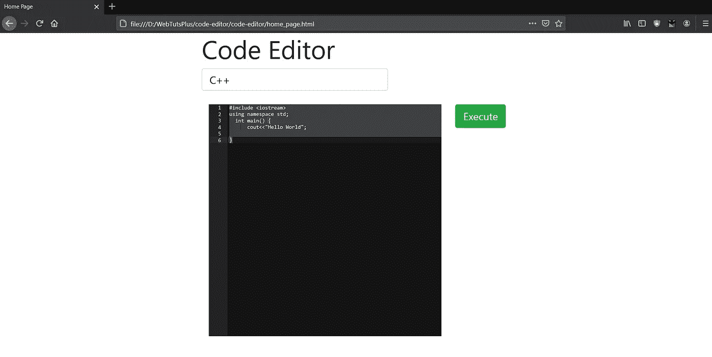
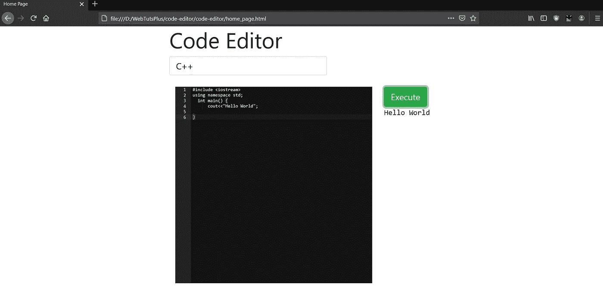

# 让我们开发一个像 HackerRank 这样的在线代码编辑器/编译器

> 原文：<https://javascript.plainenglish.io/lets-develop-an-online-code-editor-compiler-like-hackerrank-702881803eee?source=collection_archive---------1----------------------->

在本文中，我将解释我是如何使用开源代码制作自己的在线编译器的。

这里我将制作一个支持 3 种语言的编辑器；C++、Java 和 Python。

添加更多的语言也很简单。

# **概述**

构建一个在线代码编辑器和编译器似乎太复杂了，但是我们可以把它分成两部分。

1.  运行在后端服务器上的 API，它将一段代码和语言作为输入，在服务器上运行代码后输出答案
2.  前端代码编辑器。我们。我们可以在这里选择语言并编辑和更改代码。然后，我们向后端 API 发出 post 请求，并在 website.website 上显示输出。

# 本系列教程

1.  [在谷歌云中部署我们的在线代码执行器](https://medium.com/javarevisited/lets-deploy-our-online-code-executor-in-google-cloud-e76a9fabac57?postPublishedType=repub)
2.  [理解判断 0 的 API](https://medium.com/p/c433d8db060d)
3.  创建在线代码编辑器前端(本教程)

# 视频教程

# 简短演示

Online code editor demo

# **前端**

我们的前端非常简单。我们有一个下拉菜单，在那里我们可以选择语言，根据语言，我们将得到我们各自的代码编辑器。我们的主要代码位于 home-page.html 中，代码编辑器位于 texteditor.js 中

这里我们为下拉菜单项目制作了一个 onClickListener。因此，当一个项目被点击时，相应的监听器被触发，我们可以调用我们想要的编辑器。所有的语言都有不同的 id 与之关联。使用[这个](http://134.209.156.1/languages)可以找到列表。

主页看起来像这样。

主页 html 代码如下所示。

这里我们调用 javascript 文件的 codeEditor 函数，我们传递与语言相关的各自的 id。

我们从 assets/css/style.css 添加样式。

我们还需要链接 javascript 文件，以便可以执行代码。我们从 html 中获取 lang_id，并相应地进行网络调用。**对于 java 代码是 62，cpp 是 53，python 是 70** 。这是在`language_id` 中传递的。我们还根据`lang_id`为编辑器设置默认值。

在执行代码时，它应该像这样显示。

完整的代码可以在下面的库中找到。

 [## webtutsplus/代码编辑器

### Ace 是用 JavaScript 编写的代码编辑器。此存储库仅生成了文件。如果你想在 ace 上工作，请…

github.com](https://github.com/webtutsplus/code-editor)