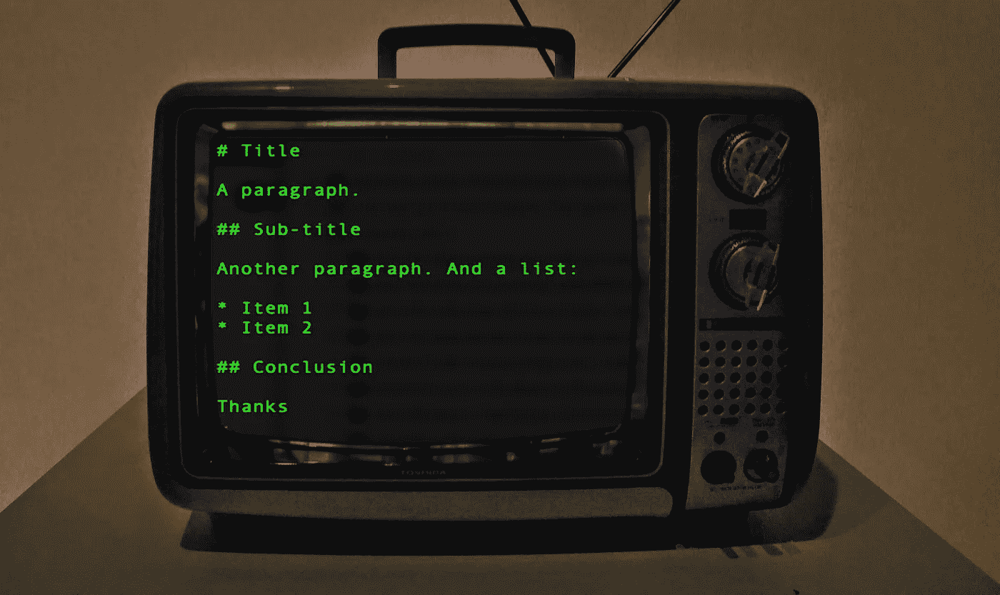
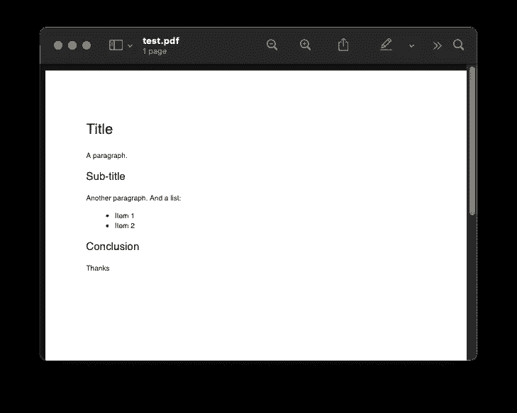
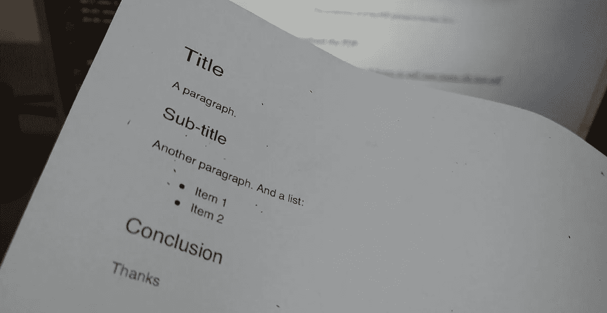

# 如何使用 Node.js 和 JavaScript 从 Markdown 文件生成 PDF

> 原文：<https://javascript.plainenglish.io/lets-generate-a-pdf-from-a-markdown-file-using-nodejs-and-javascript-224478b30d6b?source=collection_archive---------2----------------------->

在这个项目中，我们将使用 JavaScript 基于 Markdown 中编写的另一个文件生成一个 PDF 文件。我的动机是这样的:我通常用简单的文字写一份文件，包括我大部分会议的执行摘要。我想要一份 PDF 格式的。无论如何，这是我的情况——你的情况可能是另外一回事。

重要的是我已经在用降价了。Markdown 是众所周知的轻量级标记语言，旨在轻松转换为 HTML。开发人员知道这一点，但如果您不知道，现在您知道了。因为 Markdown 可以变成 HTML，HTML 可以变成 PDF，所以我有了把我的报告打包成 PDF 的想法。

# 让我们看看 Markdown 中的一个简单文件



Photo by [Bruna Araujo](https://unsplash.com/@brucaraujo?utm_source=unsplash&utm_medium=referral&utm_content=creditCopyText) on [Unsplash](https://unsplash.com/s/photos/old-monitor-crt-code?utm_source=unsplash&utm_medium=referral&utm_content=creditCopyText) — screenshot adapted by Marcio

# 让我们看看从中生成的 PDF

下面的截图可以帮助你更容易地看到整个流程:



The screenshot of of the PDF preview in my Mac OS X



Example of the PDF sample printed

您也可以下载 PDF:

[https://github . com/taboca/lets-markdown-to-pdf/raw/main/db/test . pdf](https://github.com/taboca/lets-markdown-to-pdf/raw/main/db/test.pdf)

# 介绍 Markdown-pdf

好消息是，我甚至不必做这两个步骤，尽管我认为强调这一点很重要，因为我使用的库是在幕后进行的。如果你想查，这个库是 [markdown-pdf](https://www.npmjs.com/package/markdown-pdf) :

[](https://www.npmjs.com/package/markdown-pdf) [## 降价-pdf

### 将降价文件转换为 pdf 的节点模块。PDF 看起来很棒，因为它是由 HTML5 样板设计的。什么…

www.npmjs.com](https://www.npmjs.com/package/markdown-pdf) 

虽然这个库将帮助您使用命令行进行转换，但下面的示例将展示如何通过 JavaScript 以编程方式进行转换。

# 示例代码——在 JavaScript 中使用 Node.js

以下是 JavaScript 中的主文件。这个示例是一个服务器端 JavaScript，它将使用输入文件“*”呈现一个 PDF。/db/test.md* ":

```
const path           = require('path');
const fs             = require('fs');
const markdownpdf    = require("markdown-pdf");let inFile  = path.join(__dirname, 'db', 'test.md');
let outFile = path.join(__dirname, 'db', 'test.pdf');

fs.createReadStream(inFile)
  .pipe(markdownpdf())
  .pipe(fs.createWriteStream(outFile))
```

我在这里发布了简单的脚本:

[https://github.com/taboca/lets-markdown-to-pdf](https://github.com/taboca/lets-markdown-to-pdf)

下面的结构显示了这个示例在文件系统中的样子:

```
├─ README.md
├─ db
│  ├─ test.md
│  └─ test.pdf
├─ index.js
└─ package.json
```

上面的示例案例将让对所提供的示例文件进行转换。要让它运行起来，您需要克隆这个项目，并且熟悉 Node.js 和 npm(节点包管理器)。

# 让我们看看底层的库

在这篇文章的结尾，我想告诉你我检查了来自 [Markdown-pdf](https://github.com/alanshaw/markdown-pdf) 的文件 [package.json](https://github.com/alanshaw/markdown-pdf/blob/master/package.json) ，并且能够得到作者使用的一些关键底层库项目的概述，即:

*   “非凡”——一个可以将 Markdown 转换成 HTML 的项目。
*   “phantomjs-pre build”——一个浏览器渲染引擎的项目，在后台执行 HTML 渲染工作。幻想曲也可以生成 PDF 格式的“页面”。

# 参考

*   示例代码— [让我们从降价文件](https://github.com/taboca/lets-markdown-to-pdf)生成一个 PDF
*   图书馆展示—【https://www.npmjs.com/package/markdown-pdf 
*   示例代码— [使用带有图像的 Markdown 文件生成 PDF 文件](https://github.com/taboca/lets-markdown-to-pdf-relative-images)

*更多内容请看*[*plain English . io*](http://plainenglish.io/)