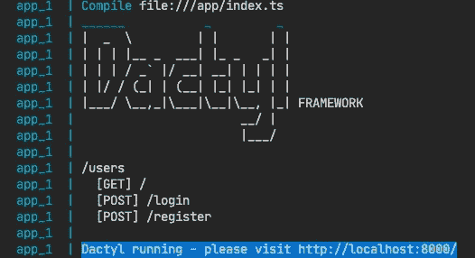
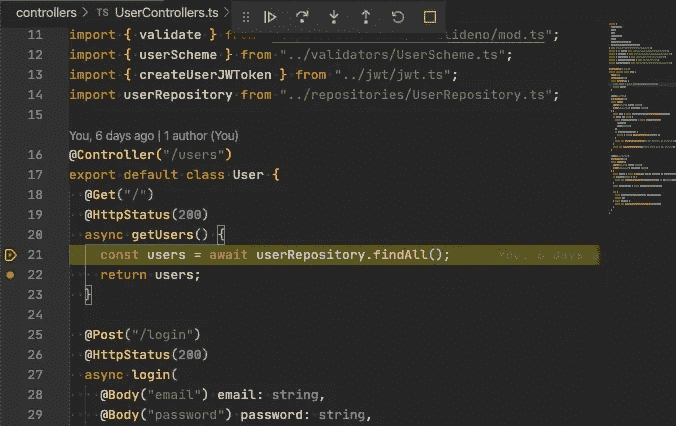
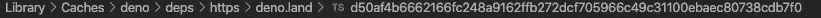

# 我们用 Deno 做个 REST API 吧！

> 原文：<https://javascript.plainenglish.io/lets-make-a-rest-api-with-deno-375c3243c1a?source=collection_archive---------8----------------------->

## 近距离观察 Node 的替代方案


在过去的几个月里，Deno 无疑是 JavaScript 和 Node 社区中的热门话题。安全的环境，没有节点模块，内置对 TypeScript 的支持——这些只是这个运行时的一些好处。但是它准备好用于 REST APIs 的开发了吗？或许，编写一个简单的基于 Deno 的应用程序将有助于回答这个问题。

我准备用 Deno 写一个简单的用户管理的 app。该应用程序将包括登录、注册和使用原生 Deno 库生成令牌等功能。如果你不熟悉 Deno 是什么，可以从阅读这个 Deno [文档](https://deno.land/)开始。

如果你准备好了，让我们开始吧！

# Deno 应用程序的 HTTP 服务器

我将使用 Oak 中间件作为我的 HTTP 服务器，但是为了给它一个更现代的感觉，我还将利用基于 Oak 的 Dactyl 框架。我需要创建我的第一个控制器。它叫做*用户控制器. ts* ，位于*控制器*目录中。它返回用户列表。

```
import {
  Controller,
  Get,
  HttpStatus,
} from "https://deno.land/x/dactyl/mod.ts";

@Controller("/users")
export default class User {
  @Get("/")
  getUsers() {
    return [
      { email: "*bilal*@gmail.com" },
    ];
  }
}
```

我使用了 Dactyl 中可用的装饰器:

@ Controller("/users ")-路由前缀在参数中设置

@Get("/") —通过它，我为方法配置了路由

```
import { Application } from "https://deno.land/x/dactyl/mod.ts";
import UserController from "./controllers/UserControllers.ts";

const app: Application = new Application({
  controllers: [UserController],
});
```

现在我需要导入控制器，将其添加到 Dactyl 生成的应用程序中，并设置端口 8000。

我几乎准备好启动 REST API 了。留给我的就是添加一个带有 TypeScript 配置的文件，因为我正在使用实验性的装饰器。

这是 *tsconfig.json* 文件的样子:

```
{ 
  "compilerOptions": { 
    "strict": true,
    "esModuleInterop": true,
    "experimentalDecorators": true, 
  }
}
```

为了启动应用程序，我使用以下命令:

```
*deno run –allow-net -c tsconfig.json index.ts*
```

关于我在这里使用的标志的一点解释。默认情况下，Deno 不提供对网络、文件等的访问。出于安全考虑。为了能够在端口 8000 上启动我们的应用程序，我必须显式地启用它，使用*–allow-net*标志，然后用 *-c tsconfig.json* 提供我的 TypeScript 配置(以及装饰器)的路径。

我现在可以获得用户列表:

```
*curl* [*http://localhost:8000/users/*](http://localhost:8000/users/)
```

答案应该是:

*[*

*{*

*“电子邮件”:“Bilal @ Gmail . com”*

*}*

*】*

有用！

# 我的 Deno 应用程序的数据库


Photo by [Markus Winkler](https://unsplash.com/@markuswinkler?utm_source=medium&utm_medium=referral) on [Unsplash](https://unsplash.com?utm_source=medium&utm_medium=referral)

我刚刚创建了我的第一个带有用户列表的控制器。但是用户现在是代码中的静态数据。使用某种数据库是个好主意。我将在 PostgreSQL 中创建新的，并将其命名为 *denoapp* 。用户和密码将被简化为 *deno* 。现在我需要创建一个名为 *users* 的新表。

```
CREATE TABLE IF NOT EXISTS users(
  id serial PRIMARY KEY,
  password VARCHAR (60) NOT NULL,
  email VARCHAR (355) UNIQUE NOT NULL
);
```

为了登录用户，我将利用电子邮件地址。我可以将数据库中的数据存储在环境变量或文件中。这里的一个好主意是使用 *dotenv* 包(使用 Node.js 的人都知道)。

我正在添加*。env* 文件，其中包括:

```
DATABASE_HOST=localhost
DATABASE_NAME=denoapp
DATABASE_USER=deno
DATABASE_PASSWORD=deno
DATABASE_PORT=5432
```

我现在可以从*获得配置。env* 文件。我还将添加 *config.ts* 文件，稍后我可以轻松导入该文件:

```
import { config } from "https://deno.land/x/dotenv/mod.ts";

export const {
  DATABASE_NAME,
  DATABASE_USER,
  DATABASE_PASSWORD,
  DATABASE_HOST
} = config();

export const DATABASE_PORT: number = parseInt(config().DATABASE_PORT, 10);
```

默认情况下，dotenv 包以字符串形式返回所有变量。数据库端口应该存储为一个数字。所以我准备单独导入，拆分。

数据库需要一个客户端。我将对 *repositories/pg.ts* 文件进行更改:

```
import { Client } from "https://deno.land/x/postgres/mod.ts";
import { DATABASE_NAME, DATABASE_USER, DATABASE_PASSWORD, DATABASE_HOST, DATABASE_PORT } from "../config.ts";

const pgClient = new Client({
  user: DATABASE_USER,
  password: DATABASE_PASSWORD,
  database: DATABASE_NAME,
  hostname: DATABASE_HOST,
  port: DATABASE_PORT
});

await pgClient.connect();

export default pgClient;
```

我正在从 config.ts 文件中获取配置并连接到数据库。

客户来了！现在，我可以用它从数据库中返回用户列表。我将添加 *UserRepository.ts* 文件。

```
import pgClient from "./pg.ts";

export default {
  findAll: async () => {
    const result = await pgClient.query("SELECT id, email FROM users;");
    return result.rowsOfObjects();
  },
};
```

我现在可以修改控制器方法了:

```
@Controller("/users")
export default class User {
  @Get("/")
  @HttpStatus(200)
  async getUsers() {
    const users = await userRepository.findAll();
    return users;
  }
}
```

我将启动应用程序，但我还需要添加另一个标志:*–allow-read =。/* 以便应用程序可以读取文件(*)。env* 。

`deno run --allow-net --allow-read./ -c tsconfig.json index.ts`

用户需要能够注册。在添加这个特性之前，我需要检查在这个过程中会发送什么样的数据。valideno 库是这项工作的好工具。我将添加*validators/user scheme . ts*文件，它包含:

```
import {
  isString,
  isEmail,
  isRequired
} from "https://deno.land/x/valideno/mod.ts";

export const userScheme = {
  email: [isEmail(), isRequired()],
  password: [isString(), isRequired()],
};
```

接下来，我将向 UserRepository.ts 添加一个新方法。它向数据库添加一个新用户:

```
import pgClient from "./pg.ts";

export default {
  add: async (email: string, password: string) => {
    await pgClient.query(
      "INSERT INTO users (email, password) VALUES (lower($1), $2);",
      email,
      password,
    );
  },
}
```

我还需要一种新的控制器方法:

```
import {
  Controller,
  Body,
  Get,
  HttpStatus,
  Post,
  BadRequestException,
  InternalServerErrorException,
} from "https://deno.land/x/dactyl/mod.ts";
import * as bcrypt from "https://deno.land/x/bcrypt/mod.ts";
import { validate } from "https://deno.land/x/valideno/mod.ts";
import { userScheme } from "../validators/UserScheme.ts";
import userRepository from "../repositories/UserRepository.ts";

@Controller("/users")
export default class User {

  ...

  @Post("/register")
  @HttpStatus(201)
  async register(
    @Body("email") email: string,
    @Body("password") password: string,
  ) {
    const errors = await validate({ email, password }, userScheme);
    if (errors.length > 0) {
      throw new BadRequestException(errors.map((i) => i.message).join(", "));
    }
    const passwordHash = await bcrypt.hash(password);

    try {
      await userRepository.add(email, passwordHash);
      return {};
    } catch (error) {
      throw new InternalServerErrorException(error);
    }
}

}
```

这需要一点解释。新用户注册时，我得到的唯一数据是 JSON 中的邮箱地址和密码。接下来，我需要验证数据。如果不是，将返回一个错误列表。如果是的话，密码散列将由 bcrypt 库生成。然后，用户被添加到数据库中。

还缺少一些东西——检查用户是否已经在数据库中的方法。我应该把它添加到验证器中。

我需要在*用户存储库*文件中添加一个新方法。它将返回给定的用户。我还可以在以后将它用于登录功能:

```
import pgClient from "./pg.ts";

export default {
  ...
  findUserByEmail: async (email: string) => {
    const result = await pgClient.query(
      "SELECT email, password FROM users WHERE email = lower($1) LIMIT 1",
      email,
    );
    if (result.rowCount === 1) {
      const data = result.rowsOfObjects();
      return data[0];
    }
    return null;
  },
}
```

我现在可以添加一个新的验证器，包括新创建的方法:

```
import {
  isString,
  isEmail,
  isRequired,
  Validator,
  Args,
} from "https://deno.land/x/valideno/mod.ts";
import userRepository from "../repositories/UserRepository.ts";

export const emailExists = (): Validator => {
  return {
    type: "emailExists",
    check: async (value: any) => {
      const user = await userRepository.findUserByEmail(value);
      return (user === null) ? undefined : {};
    },
    message: (value: any, args?: Args) => {
      return `User with email [${value}] already exists.`;
    },
  };
};
```

我将它添加到电子邮件地址验证方法中:

`email: [isEmail(), isRequired(), emailExists()],`

瞧啊。现在，当一个新用户试图注册，但他们的电子邮件地址已经在数据库中，一个提供信息的消息被返回。

# 登录到应用程序


Photo by [Erwan Hesry](https://unsplash.com/@erwanhesry?utm_source=medium&utm_medium=referral) on [Unsplash](https://unsplash.com?utm_source=medium&utm_medium=referral)

是时候添加日志功能了。从数据库中获取用户的方法已经存在。剩下我要做的就是在控制器中编写一个新的端点。它的工作是检查用户并为他们生成一个 JWT 令牌。

为了创建令牌，我将利用 [djwt 库](https://deno.land/x/djwt)。我还需要一把钥匙。我准备把它保存在*里。env* 文件。

`JWT_KEY=secret`

我将修改 *config.ts* 文件:

```
export const {
  DATABASE_NAME,
  DATABASE_USER,
  DATABASE_PASSWORD,
  DATABASE_HOST,
  JWT_KEY,
} = config();
```

现在我有了密钥，我可以生成令牌。我将添加 *jwt/jwt.ts* 文件:

```
import { makeJwt, setExpiration, Jose, Payload } from "https://deno.land/x/djwt/create.ts";
import { JWT_KEY } from "../config.ts";

export const createUserJWToken = (email: string) => {
  const payload = {
    iss: email,
    exp: setExpiration(new Date().getTime() + 3600),
  } as Payload;
  const header: Jose = {
    alg: "HS256",
    typ: "JWT",
  };
  return makeJwt({ header, payload, key: JWT_KEY });
}
```

对于每个新的电子邮件地址，我将生成一个新的令牌，该令牌将在一小时后过期。我现在将在我的控制器中使用该功能。

```
@Post("/login")
@HttpStatus(200)
async login(
  @Body("email") email: string,
  @Body("password") password: string,
) {
  const user = await userRepository.findUserByEmail(email);
  if (user !== null) {
    const comparePasswords = await bcrypt.compare(
      password,
      user.password,
    );
    if (comparePasswords) {
      return { token: createUserJWToken(email) };
    }
    throw new BadRequestException("Given password is incorrect.");
  }
  throw new BadRequestException("Given email does not exists.");
}
```

在这里，我要寻找一个有特定电子邮件地址的用户。一旦找到，我会检查他们的密码是否正确，并返回令牌。如果找不到用户，我就服务 *BadRequestException* 。然后它被 Dactyl 获取并作为 JSON 返回。

我还应该能够管理数据库结构。为此，我将使用 *Deno Nessie* 包。

我需要为 Nessie 添加一个适当的配置。它包含在 *nessie.config.ts* 文件中:

```
import { ClientPostgreSQL } from "https://deno.land/x/nessie/clients/ClientPostgreSQL.ts";
import { DATABASE_NAME, DATABASE_USER, DATABASE_PASSWORD, DATABASE_HOST, DATABASE_PORT } from "./config.ts";

const nessieOptions = {
  migrationFolder: "./migrations"
};

const connectionOptions = {
  database: DATABASE_NAME,
  hostname: DATABASE_HOST,
  port: DATABASE_PORT,
  user: DATABASE_USER,
  password: DATABASE_PASSWORD,
};

export default {
  client: new ClientPostgreSQL(nessieOptions, connectionOptions),
  exposeQueryBuilder: false,
};
```

我现在可以开始第一次迁移，目的是创建用户。

*deno run–allow-net–allow-read。/–allow-write*[*https://deno.land/x/nessie/cli.ts*](https://deno.land/x/nessie/cli.ts)*make create _ users*

我现在在目录中有 1592465715781-create_users.ts 文件。它提供了两种方法:

*   up(迁移)、
*   向下(回滚)。

在迁移方法中，我将添加在数据库中创建和删除用户表的功能。

```
import { Migration } from "https://deno.land/x/nessie/mod.ts";

export const up: Migration = () => {
  return `CREATE TABLE IF NOT EXISTS users(
    id serial PRIMARY KEY,
    password VARCHAR (60) NOT NULL,
    email VARCHAR (355) UNIQUE NOT NULL
  );`;
};

export const down: Migration = () => {
  return "DROP TABLE users";
};
```

我将使用一个命令启动迁移:

*deno run–allow-net–allow-read。/–allow-write*【https://deno.land/x/nessie/cli.ts】**迁移**

**已迁移 1592465715781-create _ users . ts**

**迁移完成**

# *添加 Docker*

**

*Photo by [Antonio Janeski](https://unsplash.com/@janesky?utm_source=medium&utm_medium=referral) on [Unsplash](https://unsplash.com?utm_source=medium&utm_medium=referral)*

*应用程序已经准备好，迁移正在进行。是时候让我的应用程序具备启动能力了，不管它在什么操作系统上。为此，我将使用 Docker。*

*Deno 还没有一个官方的 Docker 形象，但是社区准备了[一个](http://hayd/alpine-deno:1.1.0)。我要去 docker file(docker/docker file)。*

```
*FROM hayd/alpine-deno:1.1.0
EXPOSE 8000

WORKDIR /app
USER deno

ADD . .*
```

*我还将使用 docker-compose，这样我的数据库也可以在 docker 中启动( *docker-compose.yml* 文件)。*

```
*version: "3.4"
services:
  db:
    image: postgres:12-alpine
    environment:
      POSTGRES_PASSWORD: denopassword
      POSTGRES_USER: deno
      POSTGRES_DB: denoapp
    volumes:
      - postgres:/var/lib/postgresql/data
    ports:
      - 5432:5432
    networks:
      - app

  app:
    build:
      context: .
      dockerfile: ./docker/Dockerfile
    command: ["run", "--allow-read=./", "--allow-net", "--unstable", "-c", "tsconfig.json", "index.ts"]
    working_dir: /app
    ports:
      - 8000:8000
    depends_on:
      - db
    networks:
      - app

networks:
  app:

volumes:
  postgres:*
```

*现在，我要建立一个图像:*

**docker-compose 构建**

*我将启动数据库迁移流程:*

**docker-compose run app run–allow-net–allow-read。/–允许-写*[*https://deno.land/x/nessie/cli.ts*](https://deno.land/x/nessie/cli.ts)迁移*

*有了它，我可以在 Docker 中启动应用程序:*

**docker-compose up**

**

*与 Node 非常相似，Deno 提供了一个内置的调试器(它与 GoogleChrome 的 DevTools 一起工作，并支持 V8 检查器协议)。因此，我可以在 VisualStudio 代码中轻松启动它。配置示例——launch . JSON:*

```
*{
  "version": "0.2.0",
  "configurations": [
    {
      "name": "Deno debugger",
      "type": "node",
      "request": "launch",
      "cwd": "${workspaceFolder}",
      "runtimeExecutable": "deno",
      "runtimeArgs": [
        "run",
        "--inspect",
        "--allow-net",
        "--allow-read=./",
        "--allow-write",
        "--config",
        "tsconfig.json",
        "index.ts"
      ],
      "port": 9229
    }
  ]
}*
```

**

# *总结- Deno REST 原料药*

**

*Photo by [Brooke Cagle](https://unsplash.com/@brookecagle?utm_source=medium&utm_medium=referral) on [Unsplash](https://unsplash.com?utm_source=medium&utm_medium=referral)*

*来自 Node，每天使用 TypeScript，对我来说很容易开始使用 Deno。在成为 Node 的真正竞争对手之前，这项技术还有很长的路要走，但它似乎确实走在了正确的方向上。然而，我们不要忘记，Node 也在变得越来越好。在节点开发人员之前，肯定有一些有趣的时期。*

# *Deno 的最大优势包括:*

*   *伟大的开发时间-不需要安装任何依赖。只需导入一个包并使用它，*
*   *从一开始就完全支持 TypeScript，*
*   *默认文件格式机制(deno fmt)来自 Go 语言，*
*   *默认情况下阻止对资源和网络的访问。*

# *Deno 的主要缺点:*

*   *包的导入路径相当长。在节点中，您只需要名称。Deno 需要整个路径，包括 https://deno……(可以使用 *import_map.json* 文件，这缩短了导入时间，但在启动时需要增加一个标志)，*
*   *当您在 VSCode 中使用“转到定义”选项时，无法找到当前文件的位置。只能看到文件哈希:*

**

*   *编辑器中没有软件包的语法建议，这些软件包不是由 Deno 导入和缓存的。它迫使用户在真正开始使用它之前启动具有导入的应用程序。*

# *对 Deno 的集成开发环境支持*

**

*Photo by [Tim Mossholder](https://unsplash.com/@timmossholder?utm_source=medium&utm_medium=referral) on [Unsplash](https://unsplash.com?utm_source=medium&utm_medium=referral)*

*我一直在使用带有合适的 [Deno 插件](https://marketplace.visualstudio.com/items?itemName=denoland.vscode-deno)的 Visual Studio 代码。实际的支持并不一致，在我说您可以舒服地使用它之前，它还需要成熟一点。网络风暴还通过插件为 Deno [提供支持。](https://blog.jetbrains.com/webstorm/2020/06/deno-support-in-jetbrains-ides/)*

*本文中使用的库:*

*   *[趾](https://deno.land/x/dactyl)*
*   *[橡木](https://deno.land/x/oak)*
*   *[Postgres](https://deno.land/x/postgres)*
*   *[DJWT](https://deno.land/x/djwt)*
*   *[Valideno](https://deno.land/x/valideno)*
*   *[尼斯](https://deno.land/x/nessie)*

**多内容于* [***浅显易懂***](http://plainenglish.io/)*