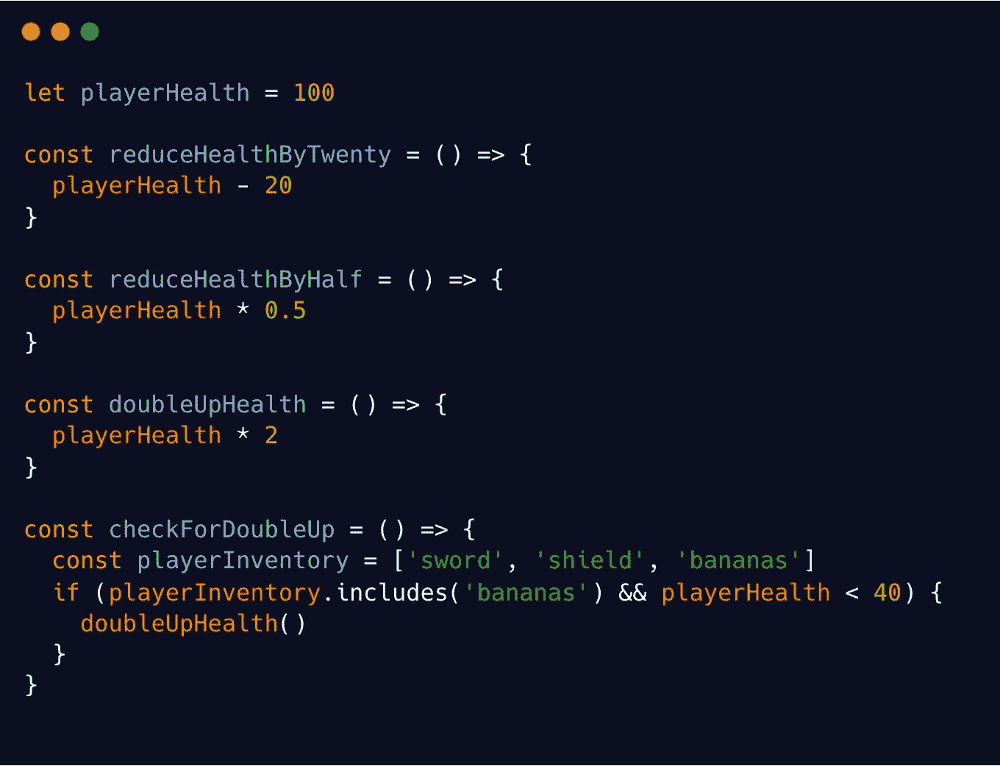
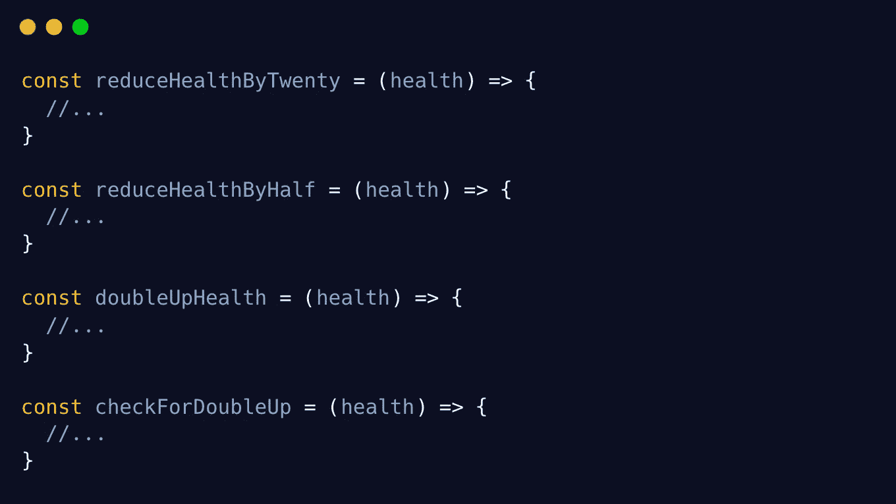
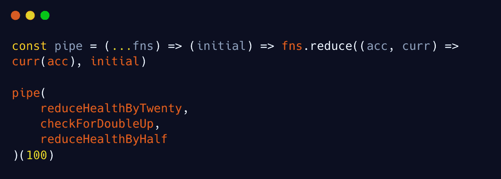
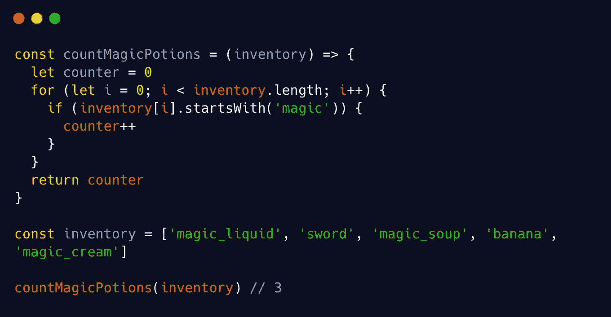

# 学习函数式编程的游戏化方法

> 原文：<https://javascript.plainenglish.io/lets-play-functional-programming-7da92d6f97d9?source=collection_archive---------2----------------------->

## 阅读时不睡着的 JavaScript

Image [Christoph Schober](https://medium.com/u/d113de1e073e?source=post_page-----7da92d6f97d9--------------------------------) | graphicriver.net Lizense

# **简介**

你的 JavaScript 世界正处于魔法战争中。还有，你的代码库已经被邪恶力量占有了。你可能是一个疯狂的编码术士，但无论如何，你开始失去对代码越来越多的控制。情况似乎没有希望了。

但还是有希望的。书呆子数学家处女们发现了一个古代法宝的建造计划。一件有能力扭转局势的武器。这个计划只有一行字，还附有一个简短的注释。

image [Christoph Schober](https://medium.com/u/d113de1e073e?source=post_page-----7da92d6f97d9--------------------------------)

*建立小宝宝功能。他们每个人都有一个单一的责任。它们每个都需要接收一个输入并返回一个输出。像乐高积木一样把它们放在一起，这样一个函数的输出就变成了下一个函数的输入。这会拯救你。这才是你需要全力以赴的。这是函数式编程的精髓。这叫作文。*

*但是要注意:如果你的婴儿功能产生了副作用，例如，通过突变状态。你的武器将会爆炸，你的应用程序将会陷入永久的毁灭。*

你通读了几遍笔记和施工计划，然后问自己:*哈哈……这应该一点都不难*。你拿起你的魔杖…嗯…我是说你的机械 LED 键盘，启动你的 IDE，你的旅程开始了… **祝你好运，勇敢的巫师。**

# **关于这个游戏**

**我是谁？克里斯托夫，地狱不:我绝不是一个 9000 级超级赛亚金专业水平的程序员。我只是一个随机的网络开发人员，扩展他的技能和知识，有一天成为一名真正的软件工程师。所以请对我温柔点。**

**为什么写这篇文章？在过去的几周里，我尽可能多地学习了 JavaScript 中的函数式编程。总结我所学的函数式编程将有助于巩固我对这个主题的理解。另外，我很确定初级到普通开发人员会从不太专业的角度受益。函数式编程领域的专家倾向于用数学和书呆子气来解释。我会在这个故事里反其道而行之，不让你我的脑子爆炸。哦，还有…我已经和老板说好了，每月发表一篇中型文章。所以，嘿老板:在这里。**

**这个故事是给谁看的？你可能会对这个故事感兴趣**

*   如果你对函数式编程或编程完全陌生，需要一个心智模型或；
*   如果你想从不同的角度来看它的一些原则或；
*   如果你有一个初级开发人员，你想向他转发一个关于该主题的心智模型；
*   如果你喜欢怪异的幻想。

# **第一阶段:婴儿功能废土**

在您的 IDE 打开后，您立即受到这个意大利面条恶魔函数的攻击:

a demon function

你试着闭上眼睛继续滚动，但是已经太晚了。没有任何警告，它开始在其怪异的数据流中吸你。您已经看到了`demonAttacks()`，并且立即可以感觉到它是如何将您拖入嵌套函数调用的兔子洞的。你检查一下`checkInventory`里面发生了什么。然后你跟随`playerEatsBananas()`，在你意识到之前，你已经失去了你的第一次生命。你一边挨饿，一边随着数据流越走越深。

Image [Christoph Schober](https://medium.com/u/d113de1e073e?source=post_page-----7da92d6f97d9--------------------------------) | graphicriver.net Lizense

*不，不，不…*好的保持冷静，回到上一个保存点。现在，专心完成你的任务。为了建造你的超级武器，你首先需要构建小的婴儿功能，这些功能只为一个超级简单的任务而设计。越简单越好。

因此，您只需浏览一下我们的兔子洞代码的前几行，然后将这些内容重写为具有单一职责的新的小函数。你也根据他们的所作所为给他们取一个名字。现在先忘记函数调用。

little functions with single responsiblies

但是这里还是有问题。你可以从乳头感觉到。啊…**退货报表！哦，不，他们都不见了。此外，这仍然是一个奇怪的数据流。好，好，好..你做得很及时，在它再次变得危险之前。**

added return keyword

Boooom！！！你的第二人生已经没了。不好意思老弟，你还在通过变异全局状态`playerHealth`产生副作用，必然导致最后的湮灭。*该死的你，来自地狱的愚蠢状态突变。哦，顺便说一句。您还缺少每个函数的输入参数。*

Image [Christoph Schober](https://medium.com/u/d113de1e073e?source=post_page-----7da92d6f97d9--------------------------------) | graphicriver.net Lizense

好的，如果你现在深呼吸，那是最好的；只剩一条命了。回到保存点并重新开始。

added parameter to each function

好了，让我们看看你现在是否安全:

单一职责的小功能=检查

正确命名=检查

接收输入并返回输出=检查

无副作用，即无状态突变=检查

让我们在这里添加一个额外的要点:
“参照透明”。

这意味着对于相同的输入，函数总是给出相同的输出。现在你的重构代码也是如此。

现在你已经创建了一个叫做**纯函数**的东西。你收到了你武器的第一个组件:一个纯粹的功能。你现在可能会抱怨代码不会像我们重构的那样工作，因为独立的函数永远不会被调用。我们将在下一个级别处理此事。

Image [Christoph Schober](https://medium.com/u/d113de1e073e?source=post_page-----7da92d6f97d9--------------------------------) | graphicriver.net Lizense

# **第二阶段:作文的幽灵**

您已经将代码的第一部分重构为一些友好的纯函数。让我们重新看看你到目前为止已经得到了什么。

functions that we have so far

你要记住，这是所有关于把这些婴儿功能放在一起。Alias 将一个函数的输出放到下一个函数的输入中。别名组成它们。你想一想，如何利用库存中的功能做到这一点。你想出了这个:

putting the functions together

但是，等一下，你很快就会发现这些常量赋值和你的魔法帽子一样没用，你可以用一行代码重写它:

putting functions together refactored

Image [Christoph Schober](https://medium.com/u/d113de1e073e?source=post_page-----7da92d6f97d9--------------------------------) | graphicriver and craftpix Lizense

哦，天啊…你认为那还是很丑。当你盯着你的乱七八糟的东西时，你被强光弄瞎了。一个黏糊糊的鬼不知从哪里冒出来，他开始用青蛙克米特的声音和你说话。

他说我的朋友:我是。的。幽灵。的。 ***作文！*** *我会给你你所见过的最强大的法术——终极法术* ***减少。*** *我的朋友:永远记住，它会把两个价值减为一个。但是朋友，不要勉强使用这个咒语；他说，不要尽可能地用它来发垃圾邮件。*

你说:*好吧，黏糊糊的鬼，但是你能不能不要用这种烦人的神秘方式跟我说话，也不要对着我的屏幕流口水？告诉我我能用它做什么！*

但是鬼魂没有任何回答就消失了。

好吧，我恨你，笨鬼，但是我会自己找出来的，你想。你施法，一些奇怪的例子 Reduce 函数出现在你的代码中。

example reduce function

什么鬼东西！我们给这个 Reduce 方法两个参数。**首先是一个怪异的回调函数。第二个很简单。只是一个初值。在这种情况下，它是 10 的整数。**

好了，让我们一步一步来看更复杂的回调。

*   Reduce 首先查看初始值是什么。在这种情况下是 10。
*   现在它将累加器设置为初始值。所以累加器现在是 10。
*   现在我们来看看`sweetArray`的第一个值。在这种情况下是 1。
*   现在它将别名`accumulator` (10)的值和当前数组值(1)合并为一个值。为了进行这种合并，它使用您在回调函数体中确定的规则。
*   在这个例子中，它使用简单的加法来减少`accumulator` (10)和`currentValue` (1)
*   现在你有 11 个。这将成为新的累加器值。
*   Reduce 将跳转到下一个数组值。本例中为 2。
*   它将继续减少/合并`accumulator` (11)和`currentValue` (2)
*   新的`accumulator`将变为 13，Reduce 将跳到下一个当前值。
*   …这种情况一直持续到我们到达数组的末尾。

所以就像讨厌的鬼说的，最需要记住的是: **Reduce 用你定义的规则把两个值合并成一个。**

*哦，那挺好的，*你想着，又挥了挥你的机械键盘。出现了 Reduce 函数的另一个例子。

second example for reduce

在这里，你做完全相同的事情，但目的完全不同。

*   您将初始值设置为空数组[]
*   acc 变成这个空数组[]
*   然后我们将`acc` ([])与数组的第一个值合并。哪个是第一个嵌套数组[3，2，2，4]
*   对于合并，缩减器使用我们定义的规则。在这种情况下，我们做一个 concat。
*   我们将空数组[]与[3，2，2，4]连接起来，所以`acc`现在是[3，2，2，4]
*   Reduce 查找下面的值([4，5，])并再次用`acc` = [3，2，2，4，4，5，]连接它
*   最后，我们已经在 Reduce 的帮助下展平了`nestedArray`

嗯，好吧，你认为这很酷，很强大。事实上，它是如此强大，以至于你可以用这个方法实现大量不同的功能。**您甚至可以用“Reduce”**替换其他重要的函数式编程功能，如“Map”和“Filter”。

现在你想:我应该试试如果我在我丑陋的作文上使用还原魔法会发生什么。天哪，你的作文立刻变成了一个美丽的，可读性很强的结构。

final composition with pipe

在你的代码中还出现了一个额外的 Reduce 函数。

the pipe function itself

让我们再检查一下这是怎么回事。

*   管道的第一个参数将接收所有的功能(`reduceHealth..., checkFor..., reduceHealth...`)
*   管道返回的不是一个值，而是一个新函数
*   管道末端的第二个括号也会立即调用这个嵌套函数:`pipe(...)(100)`
*   嵌套函数也需要一个参数`initial`。我们给它赋值 100。
*   因此，Reduce 的初始值也将获得值 100

现在还原魔法又开始了:

*   Reduce 将为我们提供的每个函数运行(就像前面例子中的数组值)
*   初始值为 100，因此`acc`立即设置为 100
*   现在 Reduce 查找第一个提供的值`reduceHealthByTwenty`。这就是现在的`curr`。
*   现在它按照给定的规则将 curr 与 acc 合并。在这种情况下，它做`curr(acc)`。或者更明确地说，它调用:`reduceHealthByTwenty(100)`
*   这个函数调用将返回一个新值(80)
*   这个新值将成为新的 acc，Reduce 将继续执行我们提供的下一个功能(`checkForDoubleUp`)

这不是很棒吗？现在，将一个函数的返回值放入下一个函数的输入中。你看，你现在的最终作文是如此的不言自明。您不需要检查任何函数就可以知道这里发生了什么。快速浏览一下管道调用就足以理解代码到底做了什么。它的初始值为 100，然后减 20，然后检查是否会有双倍增长，最后将结果减半。这是你的结果，你不需要向上滚动。

the complete pipe again

*哇，你以为。太酷了。多么幸运，我现在配备了这个强大的减少方法和这个甜蜜的管道功能。*

Image [Christoph Schober](https://medium.com/u/d113de1e073e?source=post_page-----7da92d6f97d9--------------------------------) | graphicriver.net Lizense

# **第三阶段:不可逾越的障碍**

好吧，好吧，好吧，让我们做一个回顾:你有你的小纯函数，你也知道如何在一个 Reduce 函数的帮助下将它们组合在一起，你用来构建管道。*哈哈，函数式编程就是 eaaaasyyy。*

你开始重构你的代码，同时面带微笑写下一个又一个管道。哥们，杀妖功能好满足啊。但是你会被这个函数绊倒:

function with two parameters

这是什么？？每当你解释你的工作时，你的面部表情和你销售部的同事一样。这个诡异的`demonStealsPlayerFruits` **函数** **需要两个参数**。**但是我们管道中的前一个函数只给出了一个返回值。**提供的输出与要求的输入不匹配。函数形状不适合。你管不了他们。你会在某些情况下产生‘未定义’。你的上辈子已经过去了。游戏结束。抱歉伙计。

Image [Christoph Schober](https://medium.com/u/d113de1e073e?source=post_page-----7da92d6f97d9--------------------------------) | graphicriver.net Lizense

你开始意识到函数可以有不同的形状。形状被定义为它期望的输入和它提供的输出。有些函数需要两个输入。有些函数返回函数而不是值；有些期望数组或其他数据类型，等等… *该死的 funczy！#nal progrzmm！ng 游戏。好吧，不管怎样，让我们谷歌一些作弊和演练，使这个游戏可解。*

## **演练**

Image [Christoph Schober](https://medium.com/u/d113de1e073e?source=post_page-----7da92d6f97d9--------------------------------) | graphicriver & craftpix Lizense

**演练秘诀 1:** 存在很多不同的函数形状。主要有以下几种:

*   一元函数。它接受一个输入并返回一个输出。
*   无函数。它接受多个输入并返回一个输出。
*   供应商。它不接受输入，但返回一个输出。
*   消费者。它接受输入，但不返回输出。
*   谓词。它接受输入并返回一个布尔值。

**演练秘密提示 2:** 尽量只构建一元函数。

**穿越秘笈三:**不惜一切代价避开消费者。

**演练秘密提示 4:** 如果您的函数形状不匹配，您可以使用两种策略:

1.  编辑函数使其匹配。
2.  构建一个适配器函数，您可以用它来连接两个不匹配的函数。

## **小抄**

1.  **闭包** —如果你真的需要一个安全的状态，就给你一个可变的状态。
2.  **Curry** —将 N 元函数转换成一元函数。

# **第三阶段:简单障碍**

在演练和作弊的帮助下，你现在可以粉碎这个阶段。

## 演练第 1 部分:函数编辑

这又是函数:

the function that we will curry

您有一个需要两个输入的函数。你总是喜欢一元函数。所以咖喱秘方在这里会很管用。

当您使用作弊时，函数参数会发生以下情况:

the curried function

这些参数被拆分到它们自己的独立嵌套函数中。
`demonStealsPlayerFruits`现在返回一个新的函数而不是一个值。这个新函数需要第二个参数(**库存**)。`demonStealsPlayerFruits`本身期望现在只有`demonIsHungry`的论证。这意味着你现在只需要一个参数就可以调用`demonStealsPlayerFruits`。

calling first part of curry

并且不会发生错误。如果这样做，您将返回另一个包含剩余参数的函数。

现在您可以通过调用`hungryDemon(['sword',...])`来为第二个参数提供参数

calling second part of curry

您也可以正常使用`demonStealPlayerFruits`,用双括号语法一次性提供所有参数:

calling all at once with double brackets

你现在很可能会想:好吧，兄弟，blablabla..但是，我如何使用这个工具来解决我的作文/管道问题呢？

简单:通过调用 curried 函数的第一部分来修改其中一个值。现在，您可以在管道中使用返回的函数，而不是原来的函数。

finally, pipe again with new function

很好，您刚刚使用了演练秘密提示 4 和咖喱秘籍，并且编辑了该函数，使其适合您的管道。

## **演练第 2 部分:函数适配器**

稍后在你的代码中，你会看到这个函数。它已经被咖喱化了，所以它已经可以用在烟斗里了。但是，如果参数的顺序是错误的，该怎么办呢？

wrong parameter order

让我们假设您需要**库存**作为这里的第二个约束参数，您可以在您的管道中使用它。第二，你不能重写这个函数，因为你代码的其他部分已经使用了相同的函数。你血压升高，对着屏幕大喊:我讨厌你的函数式编程——你为什么要这样对我。但请记住，你有一个演练表。所以快速回顾一下，看看你能做些什么。

**秘密提示 4:如果你的函数形状不匹配，你可以使用两种策略。**

1.  **编辑功能，使其与**匹配。
2.  **构建一个适配器函数，您可以使用它来连接两个不匹配的函数。**

快速回顾:当你用 curry cheat 分解函数参数时，你使用了策略 A。现在策略“B ”,适配器功能将提供帮助。所以继续构建一个适配器函数。在这种情况下，您需要一个 flip 函数将 curried 参数按正确的顺序排列。

added flip as adapter function to turn around orders

现在您只需在管道中使用`playerAttacksDemonFlipped`,而不是原来的 playerAttacksDemon 函数

# **最后阶段:突变区**

*问候，*一个怪异喝醉了脾气暴躁的纨绔子弟对你说。*你怎么会在这里？他停留在你的代码突变区的入口前——过去你已经在那里做了许多丑陋的全局突变。*

Image [Christoph Schober](https://medium.com/u/d113de1e073e?source=post_page-----7da92d6f97d9--------------------------------) | graphicriver & craftpix Lizense

你说:我需要杀死我的功能操纵或与外部世界交流的所有部分。不然我的功能编程*武器会爆炸。所以请让开，让我进去。*

哈哈哈，哎呀！这是一个危险的地区。在你被允许进入之前，他说，我会给你一些建议。如果你不听，我会把你的灵魂卖给市场部。

他从你有史以来最重要的 JavaScript 课程开始。你需要明白一件事。你需要知道 JavaScript 在内存层面是如何工作的。 ***你需要知道如何混合执行上下文和调用栈的魔药。***

假设你有这样一个函数:

example for execution context

当 JavaScript 看到这个函数时，它做的第一件事就是将所有的全局值保存到**全局内存中，这是全局执行上下文**的一部分。对于上一个示例，它看起来像这样:

execution context first part

所以让我们一步一步地检查这里发生了什么:

1.  JavaScript 将函数`demonWatchesNetflix`保存到全局内存中。还没有执行任何东西。
2.  现在，它将标签`demonInitialLaziness`的值 10 保存到全局内存中。
3.  在最后一步，它**声明**一个名为`newLaziness`的标签。`newLaziness`还没有价值。(也不是未定义…这是因为我们不能用 const 关键字重新赋值。这就是为什么它只是**声明)**的原因
4.  为了解析`newLaziness`的值，JavaScript 需要执行`demonWatchesNetflix`。
5.  一旦新的执行发生，新的执行上下文将被建立
6.  这个新的执行上下文有自己的本地内存
7.  这个新的执行上下文将被放在调用堆栈的顶部

好了，现在让我们看看接下来会发生什么。

execution context second part

1.  在新的执行上下文中，我们将:
2.  首先将**标签** `laziness` **保存到本地内存**。在这种情况下，它被赋值为 10。
3.  接下来，我们将把值为 5 的标签**保存到本地存储器。**
4.  接下来，JS 将运行一个条件检查
5.  该条件为真，并且 `demonWatchesNetflix` **的**返回值将被分配给标签新值****
6.  执行上下文完成**并从调用堆栈中弹出**

现在，孩子，你知道如何酿造行刑魔药了。现在你可以通过大门进入黑暗变异区了。但是相信我，亲爱的，第一次你真的不应该一个人去。我会护送你。反正突变地带有最好的酒和烟。

在这个区域只呆了一分钟，这个变异函数就穿过了你的路径。

forEach method example

醉汉解释道*每一个改变你原始数据结构的数组方法都可能杀死你的整个代码。避免使用它们，最好使用创建新数组的数组方法，而不是改变原始数组。* ***贴图、过滤、缩小*** *是你将需要的*必备魔法方法。他踢他的变种人的屁股，直到它切换到地图。

map method example

过了一会儿，你们俩都达到了这个功能:

global state example

你的坏脾气同志说:*它正在访问全局内存。我们需要在全球变异扩散前杀死它。他用力踢它，它就切换到这个功能。*

closure example

你知道现在已经没有全局变量了。但是你完全不理解这种变化。然后他说:*小子，我们好好喝一口* ***执行上下文的魔药，调用栈*** 。这将极大地帮助你了解新功能中发生了什么。

execution context for closure part 1

1.  `attack`函数被保存到全局存储器中
2.  `causeDamage`获得声明但尚未分配。
3.  为了解析`causeDamage`的值，我们需要执行`attack`。构建新的执行上下文
4.  `attack`被添加到调用堆栈中
5.  在`attack`的本地存储器中，保存了一个值为 0 的`hitCounter`变量
6.  此外，一个名为`addOneHitpoint`的函数被保存到本地内存中

好了，我们来看看接下来会发生什么。

execution context for closure part 2

1.  `attack`返回其名为`addOneHitpoint`的嵌套函数
2.  所以`causeDamage`的解析值就是这个`addOneHitpoint`函数。或者换句话说:现在和`addOneHitpoint`一样
3.  `attack`执行完成，函数从调用栈中弹出，执行上下文被删除

但是我们还没有准备好。还剩下对`causeDamage`的调用。正如我们之前学过的四句台词。`causeDamage`的调用与`addOneHitpoint`的调用相同。因此，如果我们看一下 JavaScript 的执行情况，它会是这样的:

execution context for closure part 3

1.  为`causeDamage`建立新的执行上下文
2.  我们什么也不返回，但是我们将变量`hitCounter`加 1

但是什么……？**这里没有可以增加的名为** `hitCounter` **的局部和全局标签**。Javascript 已经删除了旧的执行上下文。这到底是怎么回事？请帮帮我，暴躁的朋友。

哈哈哈，他说。现在，孩子，你将学习如何使用 JavaScript 中的一个基本的欺骗。**关闭。**

execution context for closure part 4

每当你将一个内部函数从本地执行上下文保存到全局上下文时，这个函数将会查看同一个本地内存中的内容。然后它会把所有这些东西装进背包，带到全球范围。所以在这个例子中，我们将`addOneHitpoint`保存到全局内存中。当这种情况发生时，`addOneHitpoint`会查看本地内存中还有什么。它会把所有的东西都放进背包，带到全球存储器。

所以回到你关于不存在标签的问题。如果 JavaScript 在本地内存中找不到它，它会查找全局内存中的一些函数是否在它们的背包中有标签。

execution context for closure part 5

*如何直接访问* `*hitCounter*` *的值？*你问脾气暴躁的人。但是他笑着说:*你不能，笨孩子！* *你只能使用背包的功能。这就是 JavaScript 如此强大的原因。该值受其功能保护。你不能从外部改变它。该值为* ***由函数*** *封闭。* ***这就是背包被称为【封】*** *的原因。如果您真的需要函数式编程中的可变状态，这就是您要使用的概念。*

**但是要注意:即使状态被保存为受保护的闭包，你也会违反核心的函数式编程范式。也就是说，在实际的 JavaScript 编码中使用这种封闭状态是有益且安全的。**

Image [Christoph Schober](https://medium.com/u/d113de1e073e?source=post_page-----7da92d6f97d9--------------------------------) | graphicriver.net Lizense

# **奖励阶段:调用堆栈开始**

现在，您已经具备了构建函数式编程终极武器所需的所有要素。醉汉说:

*   你知道你需要建立一些小的婴儿功能:

★责任单一；

★理想情况下，接收一个输入，返回一个输出；

★不与外界交流；

★都是参照透明的。

*   你知道**如何构建这些宝贝功能的组合**，无非就是减少它们。
*   你知道当他们期望不止一个输入参数时，你可以用 curry 编辑婴儿函数**的函数形状**。
*   您知道，如果输出和输入不匹配，您总是可以**构建位于两个函数之间的适配器函数。例如，如果函数 1 具有不同的输出数据结构，那么函数 2 期望它作为输入。**
*   你知道如果你真的需要一个状态，你应该**把状态保存为闭包**。

如果您想在实际的 JavaScript 编程中开始使用函数原则，就没有什么需要了解的了。脾气暴躁的人会踢掉你的一些其他功能，同时慢慢走回变异区去拿他的烟和酒。但是突然，他转过身来问你:*你想马上升级你的新武器让它更强大吗？是啊！你说。肯定的事。我该怎么做呢？*

***干掉你的迭代！他说。***

为什么会这样？？你可能会问。原因很简单:请看下面的循环:

iteration example

在这样的循环中，您仍然在对计数器变量进行状态突变。一般来说，在函数式编程中应该不惜一切代价防止状态突变，因为它会导致奇怪的副作用。

这并不太引人注目，因为状态在函数的作用域内，并不是全局可用的。但是无论如何，**如果你去除了这样的突变**，那么迭代本身就会更有功能。你可以用递归来实现。这意味着在一个函数内部，你调用同一个函数本身。所以你递归地调用这个函数。哦，顺便说一下，一旦你习惯了递归，你就会爱上它。刚开始用起来会觉得有点怪怪的，笨重。但我保证，只要你用几次，它就会完全改变。

让我向您展示一下上一个迭代示例的情况:

recursive refactoring

Whuuuut？？？为了更好地理解代码，请记住执行上下文和调用堆栈是如何工作的。如果您跟踪执行，那么将会发生以下情况:

*   我们称之为函数。
*   我们检查退出声明。你会在每个递归函数调用中发现这样的 if 语句。它必须存在。否则，您将在函数调用的无限循环中结束。**这个 if 语句也被称为“基本条件”。**
*   如果退出条件为假，我们再次调用函数本身。
*   这将生成一个新的执行上下文，它将被放置在调用堆栈的顶部。
*   你从第一步开始。

这意味着:只要退出条件不为真，您就会生成新的执行上下文，而不会删除旧的上下文，并且您的调用堆栈会越积越多。

最后，退出条件为真，不再有新的函数调用添加到调用堆栈中。现在 JavaScript 将开始执行调用堆栈上的所有内容，并从上到下弹出。

Image [Christoph Schober](https://medium.com/u/d113de1e073e?source=post_page-----7da92d6f97d9--------------------------------) | graphicriver & craftpix Lizense

是的，**如果你玩这个游戏玩得太重，你会得到一个堆栈溢出错误**，这无非是浏览器阻止你向调用堆栈添加越来越多的调用。这样做是为了防止你的程序耗尽所有的空闲内存。

*Mmmkay..但是想想就觉得很奇怪，那么我自己怎么能想到这样一个递归的选择呢？你一边擦着眼睛里的泪水一边说。*

脾气暴躁的人说:咪咪，别哭了，你这个软骨头。*这样想:*

***首先，定义要停止递归的基条件。***

*在这个例子中，你要查看你的库存中有多少魔药。基本条件是:如果你的库存里什么都没有，你的魔药数量将为零。*

base condition for recursion

之后，考虑在构建下一个执行上下文时，需要放入什么作为参数。这个参数需要你在下一个递归调用中更接近基本条件。

在本例中，您希望越来越接近一个空的库存数组。要做到这一点，您需要在每次递归调用时删除数组中的一项。

recursive call of the function itself

最后一步，你需要定义每次通话你想做什么。在这种情况下，您需要检查字符串是否以短语'**magic _【T1]'开头。如果是这样，您希望每次递归调用都返回+1。它看起来像一个减速器，我们可以为每一轮做类似 acc + 1 的事情。事实上，这个例子可以通过强大的 Reduce 或 Filter 函数更容易地解决。**

defined what should happen between the recursion and the base condition

不，如果你构建这样一个递归函数，你不需要每次都考虑执行上下文和调用栈。**只要设定好你的基本条件，然后想想如何达到它。**

Image [Christoph Schober](https://medium.com/u/d113de1e073e?source=post_page-----7da92d6f97d9--------------------------------) | graphicriver.net Lizense

**哇哇哇！恭喜你。你成功了！你真棒！**

当然，我给你看的东西只是冰山一角。有更多的函数式编程原则，甚至还有更花哨的技术术语(比如单子、函子、无指针风格等等。).有些代表非常酷的附加概念；其他的只是简单的东西听起来复杂的术语。不幸的是，这个话题太大了，我无法把它合并成一个中等的故事。但无论如何:我向你展示了最重要的原则，更重要的是，我试图给你一个所有这些东西的心理模型，所以函数式编程方法的实际应用现在对你来说应该更容易理解。

结束了。

希望你在阅读的时候和我写这个故事的时候一样开心。😄但更重要的是:我现在要和我的坏脾气的醉鬼同志喝几杯，然后随时加入我们踢变种人的屁股。⚔️

克里斯托弗

*更多内容看* [***说白了. io***](http://plainenglish.io/) ***。*** *报名参加我们的* [***免费每周简讯这里***](http://newsletter.plainenglish.io/) ***。***