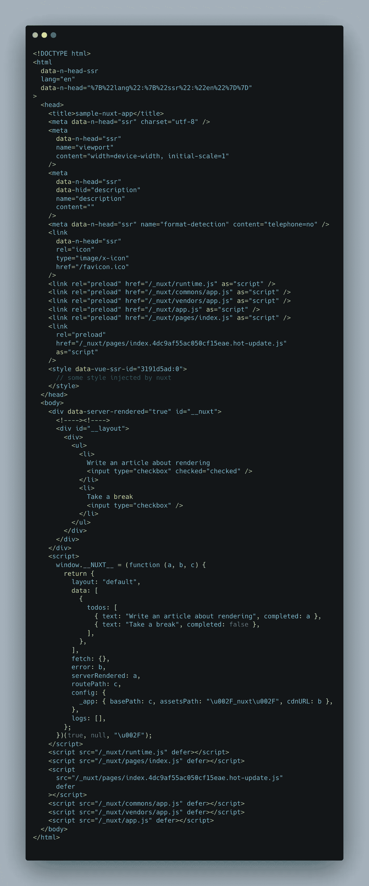
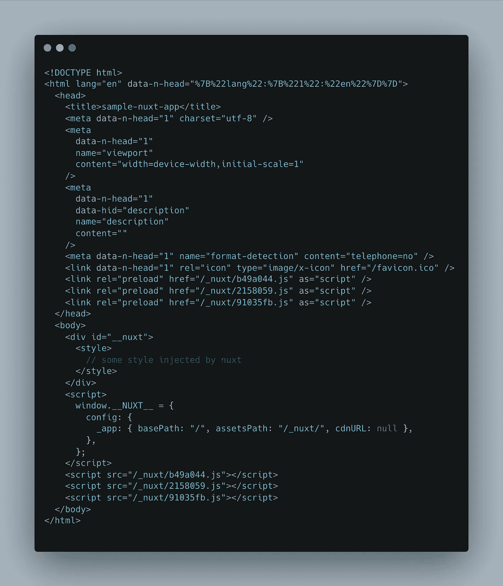
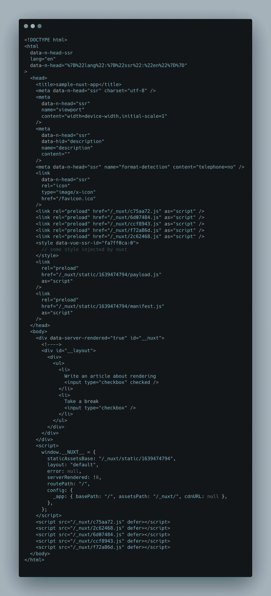
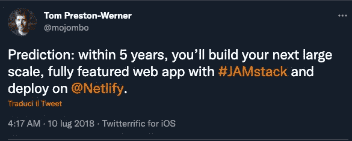

# 让我们试着阐明 web 应用程序的不同“呈现方法”

> 原文：<https://javascript.plainenglish.io/lets-try-to-clarify-different-rendering-approaches-for-web-applications-96ea0a1c8453?source=collection_archive---------5----------------------->

## 什么是服务器端渲染，客户端渲染，预渲染，静态站点，通用应用，它们之间的 JAMstack 在哪里

有很多关于这个主题的文章，但是我仍然听到很多开发人员在理解这些技术上有困难。此外，随着新工具的出现，情况变得越来越复杂，所以我决定写下我对这个主题的想法。

我会试着一个一个的简单解释，突出利弊，举一些例子，工具，和其他文章的链接来深入一些方面。希望帮助其他人更清楚地选择你的下一个项目。

# 介绍

曾几何时，web 很简单(或者至少更简单)。最初，web 仅仅是由 HTML 文件构成的，但是随着时间的推移，工具发生了很大的变化，社区创建了许多解决方案来使其他开发人员的生活更容易，并提供更好(和更复杂)的站点体验。这种发展自然引发了新的方法，因此服务于 HTML 文件的东西变成了在服务器端(服务器端呈现或预呈现)、在客户端(客户端呈现)或在两个地方(通用应用)构建应用程序。

一些新事物没有一个很好的不言自明的名字(看看你的 JAMstack ),所以没有跟上新趋势的开发人员很容易被这些名字弄糊涂。

# 服务器端呈现(SSR)

这是最古老的技术，不包括简单的静态文件主机(实际上是预渲染，但我们会谈到这一点)，因此很容易理解。

当客户端打开浏览器并请求一个网页时，服务器通过填充所有必要的信息(HTML 标签、从数据库或其他地方获取的填充数据、CSS 等)来构建 HTML 响应。浏览器收到的响应是一个完整的 HTML 文件，其中已经包含了它需要的所有内容。

这意味着当响应到达浏览器时，他只需解析和呈现响应，没有其他事情要做。

> 意大利风格 [ELI5](https://www.dictionary.com/e/slang/eli5/) :你是一个人(浏览器)，你从一家披萨店(服务器)点了一份意大利香肠披萨(请求页面)。如果比萨饼是服务器端呈现的，你将收到一个完美的意大利香肠比萨饼，就像你从送货员那里要求的那样，你只需打开它并吃掉它(展示给最终用户)。
> 
> 但是，如果你想吃稍有不同的比萨饼(导航到另一页)，你必须再次打电话给比萨饼店，让另一个完整的比萨饼送来

我们来看一个简单的服务器端渲染 app 的响应。

Response of a sample app created with Nuxt and SSR

这是一个使用 SSR 用 Nuxt 构建的简单待办 app 的响应。如果这不是你自言自语，不要担心，许多开发人员(我是:D 的一员)并不真正了解，或者说并不完全理解现代框架的输出，原因之一是这些框架做了很多事情。总之，我们在这个例子中真正需要注意的是，HTML 的*主体*包含一些数据，在这个例子中，它只是一个待办事项列表(来自服务器发出的 API 调用)，由标签和复选框表示，但在这里可以有任何内容。

同样在头部，有一些元元素，那些可以用来丰富 SEO 和其他有用的东西。所有这些都可能包含特定于用户的数据，因为使用 SSR 构建的每个响应可能因用户而异，这是最重要的事情。

## 赞成的意见

为什么要考虑 SSR？这么多年了还有用吗？是的，它是！

*   **SEO 友好**:在客户端渲染应用几年前开始兴起后，这是导致软件工程师选择 SSR 而不是 CSR 的主要原因(现在仍然如此)。由于响应完全填充了数据，每个 SEO 爬虫(即使它没有 Javascript 引擎)都能够读取响应，分析它并理解那里有什么，从而导致更好的索引，索引应用程序的每个 URL 的可能性，等等。
*   **快速加载时间**:如前所述，当响应到达浏览器时，呈现阶段非常简单，因为 HTML 结构和数据已经存在，所以浏览器需要做的工作更少(至少与 CSR 相比，稍后会详细介绍)。

## 骗局

缺点是什么？为什么会“发明”客户端渲染？

*   **成本**:您必须有一台全天候运行的服务器来处理客户端请求。你可以找到一些便宜的服务器托管，但这仍然是一个成本，这是会有的(对于高流量的应用程序来说，一个便宜的服务器是不够的)。
*   **页面过渡较慢**:我喜欢把这个解释为“老旧的导航体验”。当应用程序以这种方式提供服务时，当你点击一个链接导航到另一个页面(同一网站)时，该页面将完全重新加载，你不可能有“平稳过渡”。
*   **缓存**:在 SSR 应用上配置缓存通常比较困难，尤其是对于没有经验的开发人员(相信我，对于有经验的开发人员也是如此)。
*   **It *可能*有很长的交互时间**:如果你使用 Vue 或 React 之类的框架为应用服务，这是真的，因此会有一个水合阶段，用户看到一个漂亮的页面，但不能与之交互(我们将在下面的预渲染章节中更多地讨论这一点，但如果你对水合感兴趣，请阅读[这一章](https://blog.julien-maury.dev/en/what-the-hell-are-hydration-and-rehydration/#so-what-is-hydrationrehydration-)

> 计算机科学只有两个硬东西:缓存失效和事物命名。
> —菲尔·卡尔顿

## 工具

作为最古老的方法，有数以千计的选择，从*心爱的* [WordPress](https://it.wordpress.org/) 到广泛使用的 [Express](https://expressjs.com/) for node lovers(但是它[没有主动维护](https://www.reddit.com/r/node/comments/l67u0t/what_is_the_current_status_of_express_js_project/)，所以我会考虑 [koa](https://koajs.com/) 或 [fastify](https://www.fastify.io/) 。但是真的有太多的选择，对于你能想到的每一种语言(可能不是 T21 有趣的语言，比如 ArnoldC，对不起，Schwarz 的粉丝)，将会有一些框架/库来创建一个 web 服务器，只需要几个步骤。

## 它的伟大之处在于

我在需求中首先考虑的是 SEO，如果 SEO 不是一个需求，我可能不会选择这种方法，主要是因为成本/维护，但如果你来自后端背景，实际上 SSR 对你来说更容易。

它非常适合需要 SEO 和具有高度动态内容的应用程序(例如，不是个人博客，因为我会选择预渲染，稍后解释)。

# 客户端渲染(CSR)

这通常也被称为**单页应用**，看起来它从 21 世纪初就已经存在了(感觉很老了吗？).

与 SSR 相比，这几乎是相反的方法:客户端向服务器发出网站请求，服务器获取一个静态文件(通常是一个几乎为空的 HTML 文件)，然后立即将其发送回客户端。

请注意，在这种情况下，服务器没有构建 HTML，没有填充任何内容，它只是发送文件，这是一个关键部分，因为只需返回一个静态文件就意味着我们可以通过 CDN 存储和提供这些文件，无需服务器保持运行。

当浏览器收到这个响应时，它会阅读这个响应，通常，他必须“构建页面”。

我构建页面是什么意思？浏览器需要解析文件，这通常只包含一些到其他静态资产的链接，如 js 和 css 文件，他获取它们，解释并执行 javascript。这就是了。构建页面的所有逻辑都在 js 文件中。它们包含从外部 API 获取必要数据的逻辑、处理结果的逻辑、基于这些响应动态构建 HTML 的代码等等。

> 所以意大利式的 ELI5 应该是:你还是以前的那个人，你点了一份意大利香肠比萨饼。送货员拿着一个空盘子和比萨饼的食谱来到你面前，食谱上还列有配料的去处(所有的链接和你可能需要的其他文件)。然后，您必须去检索这些并为自己制作比萨饼(构建 HTML 并呈现所有内容)。
> 
> 好的一面是，如果你以后需要添加一种配料(导航到另一个页面),你只需要去取回那种配料，并把它放在比萨饼上，你不需要重新订购一切

Response of a sample app created with Nuxt and CSR

这是一个 CSR 应用程序的示例响应。

请注意，在这种情况下，页面主体几乎是空的，它只包含一些要加载的脚本。正如我之前所说，这些脚本将负责“构建页面”。在客户端呈现的应用程序中，这个文件将被提供给每个客户端请求，不管是谁请求的。因此，在这种情况下，待办事项元素还没有呈现，因为 API 调用和相关 HTML 的创建将稍后在浏览器中完成。

## 赞成的意见

让我们看看为什么客户端渲染应用程序在过去十年里变得如此流行:

*   **更平滑(看起来更自然)的页面转换**:当一个页面应用程序被渲染时，所有后续的导航都由客户端处理，不再需要点击重新加载页面。用这种方式浏览应用程序感觉更“自然”和快捷。
*   **缓存**:正如我们所说的，服务器只需要返回相同的 HTML(然后还有其他静态文件，js，CSS 等等……)。这意味着我们可以更容易、更主动地缓存文件，缓存策略中隐含的逻辑更少。
*   **成本**:即使这在之前的观点中已经暗示了，我还是想明确指出这一点。要托管一个单页应用程序，你只需要静态托管，到今天为止，你几乎可以在任何地方找到免费的服务，所以这是一个非常便宜的解决方案(对业余爱好项目来说很棒)。

## 骗局

显然，不是所有闪光的都是金子

*   对 SEO 不友好:与 SSR 相反，这可能是主要的弱点。从服务器返回的文件几乎是空的(总是一样的，不能包含动态数据)，所以爬虫需要一个 JavaScript 引擎来获取一些信息，但即使这样，SEO 也不会很好地工作，或者至少不容易预测
*   **较慢的初始加载**:应用程序的第一次加载比所有其他方法都慢(因为浏览器需要做所有繁重的工作)。

## 它的伟大之处在于

我通常为所有不需要 SEO 的应用程序选择 CSR，并且我不想增加一层复杂性(对于前端开发人员来说，这些应用程序通常更容易推理)，例如，在我看来，所有应用程序都受登录保护的 B2B 应用程序非常适合这里。

## 工具

我认为这是工具和框架大爆发的地方。在过去的 10 年里，前端生态系统**进化了如此之多**…所以那里又有了成千上万的选择。在我看来，最著名、最现代、最成熟的是(我不会描述这些，但我会链接他们的网站):

*   [反应过来](https://reactjs.org/)
*   [Vue.js](https://vuejs.org/)
*   [有角度的](https://angular.io/)
*   [苗条](https://svelte.dev/)(有点新，用的少，但是有前途)

有大量的文章助长了“前端框架战争”，我个人认为所有这些框架都很神奇，这就是它们如此成立的原因)。

我必须指出，这些框架也让您能够构建 SSR 应用程序，但这超出了本文的范围，它们并不是简单地开箱即用。

# 预渲染

我觉得这比它的兄弟们更晚成为时尚。

我认为它是在 2008 年由 [Jekyll](https://jekyllrb.com/) 推广开来的(但我不是很确定)，并在过去的 5-7 年里变得非常流行。

这有点像 SSR 和 CSR 之间的融合，对于某些用例来说特别好(但是对于其他用例来说，就像每一种技术一样)。

预渲染实际上是一种服务器端渲染技术(页面不在客户端机器上渲染，所以是服务器端的)，主要区别在于渲染部分是在构建时完成的，而不是在用户请求页面时完成。当开发人员制作网站时，作为他构建网站的最后一步(使用适当的工具)，在这一阶段，生成的静态文件填充了所有的数据等，这正是当客户端请求网页时 SSR 中发生的事情，但这一次是在构建时完成的，而不是在客户端请求时。这具有巨大的影响:

*   输出是一组静态文件，所以我们可以只使用静态托管来托管构建的应用程序(如此容易缓存、便宜等……)，就像客户端呈现的应用程序一样
*   每个路由在生成时都必须是已知的。这是这种方法的最大缺点，如果你有一个电子商务应用程序，其中每个项目都有自己的详细页面，在 URL 中有 id，预呈现并不容易，因为你应该在每次添加项目时重建和部署应用程序(这是可能的，有[新技术](https://www.netlify.com/blog/2019/01/17/how-to-scale-massive-react-static-sites-with-incremental-builds/)可以帮助你做到这一点，但这并不容易)，否则它的详细页面就不会存在。
*   生成的文件不能在构建时插入特定于用户的数据(否则每个用户都会收到相同的数据，如果是特定于用户的，那就不太好了)，因此要启用该功能，需要该信息的部分将在客户端呈现，这就是为什么在我看来 static generated 是 CRS 和 SSR 应用程序的混合。客户端接收到一个已经填充了所有与用户无关的信息的页面，剩下的由他来处理。

> 那么这在意大利人的刻板印象中会是怎样的呢？
> 
> 比萨店只为你提供玛格丽塔比萨，但他们也会给你配方和信息来“改善”你的比萨。所以你得到了一份完美的(已经做好的)玛格丽塔，然后你只需要去取其他的配料，把它们放在披萨上。如果你不需要将披萨个性化，你会非常喜欢他们送的玛格丽塔。

这是一个响应示例:

Response of a sample app created with Nuxt in static generation mode

这和你用 SSR 得到的结果差不多。不同之处在于，这个文件是在构建时生成的，而 SSR 是在用户请求页面时生成的。

## 赞成的意见

这种方法具有 CSR 的大部分好处，因为托管应用程序与托管 CSR 应用程序是一样的，所以:

*   **易于缓存**
*   **便宜(不需要启动和运行服务器)**
*   这种方法实际上也是对 SEO 友好的，因为你有一个预先填充的 HTML 文件用于每个生成的路径，所以一旦爬虫分析了站点，SEO 数据就会出现。
*   另一个优点是**快速初始渲染**(通常使用这种技术可以实现所有技术的更快初始渲染)，因为在 SSR 中，页面已经填充了数据，但它是由具有良好缓存功能的 cdn 提供的。

## 骗局

通过阅读优点，这似乎是最好的方法，但让我们看看有什么缺点:

*   如果有大量的**动态数据或特定于用户的数据**，那么**可能会很困难:网站是在构建时构建的，对于每条路线都会有一个相关的 HTML 文件。这些文件填充了必要的数据，但它们只能包含非特定于用户的数据或动态数据，不能有登录用户的用户名，否则，每个用户都会收到具有相同用户名的 HTML。或者，例如，如果您想根据当前用户的阅读量向他显示一篇建议的博客文章，您就不能在构建时再这样做了。因此，所有这类逻辑都必须在客户端处理(通过 API 获取必要的数据，然后在页面上构建所需的部分。如果你有很多这样的逻辑，预渲染实际上会让你的日子更难过)。**
*   **更多部署**:一个例子胜过千言万语。假设您以这种方式构建了您的博客(这不是一个随机的例子，博客是预渲染应用程序的完美例子，它们非常适合)，当您添加一篇新的博客文章时，您将必须构建并部署整个应用程序，以将新的静态文件关联到新的博客文章。
    所以如果你有一个高度动态的网站，这可能是一个问题(这些天来[正在被一些框架](https://vercel.com/docs/concepts/next.js/incremental-static-regeneration)认真解决)。
*   该网站是**不是**将是**立即互动**:当响应到达浏览器时，它将立即呈现和漂亮。但是 js 代码将在渲染阶段完成时被解析，这意味着当页面很漂亮时，用户期望的所有点击监听器和其他逻辑实际上还没有出现。因此，如果用户试图立即与一个按钮进行交互，网站就有可能什么也不做(这一阶段称为水合，你可以在[为 web 渲染](https://developers.google.com/web/updates/2019/02/rendering-on-the-web)和[水合的成本](https://addyosmani.com/blog/rehydration/)中了解更多信息)。这似乎不是一个大问题，但是如果你有一个大的应用程序，这可能会有点奇怪，在某些情况下，你需要做一些事情来防止用户变得沮丧(比如显示一个加载器或什么的)。

## 什么是伟大的

预渲染是一项伟大的技术，在最近几年变得非常流行，显然，没有什么灵丹妙药。对于受益于 SEO 且不严重依赖用户特定数据的应用程序，我选择预渲染。例如技术博客(你可以注册，但是大部分内容/布局并不依赖于登录的用户)。

如果由于成本原因你不想使用 SSR，但你仍然想改善应用程序的加载时间，这可能是有用的(阅读更多关于 [first contentful paint](https://web.dev/first-contentful-paint/)

## 工具

最近几年([也要感谢 Netlify](https://www.netlify.com/jamstack/) )诞生了很多静态站点生成器，你可以在每种语言中找到一些(javascript 也有很多)。我认为在这里可以找到一个很好的列表，但是如果你偏爱一个框架，你可以谷歌一下“vue 静态站点生成器”这样的东西，大多数时候你不会失望的。

# JAMstack

那么 JAMstack 是什么，是“竞争对手”CSR、SSR 等吗？

没有。我立即离开[源](https://jamstack.org/)去了解更多的情况。

如果我没记错的话，JAMstack 是 Netlify 现任 CEO ( [马蒂亚斯·比尔曼](https://twitter.com/biilmann))创造的一个“词”。

Tom Preston (co-founder and former CEO of Netlify) tweet about his prediction about JAMstack

再次，另一个 [Netlify 网站很好地解释了这一点](https://www.netlify.com/jamstack/)。

从字面上看，JAMstack 的意思是“Javascript Api Markdown Stack”，所以这可以应用于许多(已经存在的)项目，你可能正在进行一个 JAMstack 项目，而你甚至不知道它。

但它真正的意思(至少在我看来是这样，但 Netlify devs 和 CEO 在[这个精彩的播客](https://remotelyinteresting.transistor.fm/episodes/the-jamstack-can-do-that-be-the-future)中证实了这一点，我建议所有剧集都是这样)是一种 web 开发方法，其中许多功能(如身份验证)被外包给第三方 API(与前端应用程序分离)，HTML 和 CSS 被预渲染(尽可能多)。

所以实际上 JAMstack 使用了预渲染并实施了其他原则。我不会深入探讨这个问题，但是如果你感兴趣，我认为这篇文章[中有一篇关于这个问题的非常好的文章](https://www.takeshape.io/articles/a-history-and-overview-of-the-jamstack/)作者是[杰西卡·陈](https://twitter.com/thisisjesschin)。

> 前端开发人员能够专注于他们的专业领域，而不是试图成为所有行业的大师。马蒂亚斯·比尔曼菲尔·霍克斯沃思

# 通用应用

你有没有注意到 CRS 和 SSR 是完全相反的(不仅它们的工作方式完全不同，而且它们的优缺点也完全相反)？

> “通用应用进入游戏”

你也可以找到它们所谓的****。****

*基本上，这是两个世界的融合，试图利用各自的优势，所以当客户端请求一个通用应用程序时，服务器会用一个完整的页面(构建在服务器上，所以在服务器端呈现)来响应，这就获得了 SEO 优势，速度等。例如，当客户端点击链接进入另一个页面(同一个应用程序)时，这种导航是在客户端处理的，因此转换是平滑的，不需要刷新。*

*这基本上融合了两个世界的精华，由于 Next、Nuxt 和其他框架帮助您以这种方式构建，而不需要在键盘上敲敲打打就能工作，所以它最近被广泛使用。*

> *意大利语:你可以点你想要的比萨饼，送货员会送来一个完美的现成的比萨饼，以及你需要改变它的食谱和信息。
> 你真的不能再渴望更多了*

## *赞成的意见*

*   ***SEO 友好***
*   ***快速加载时间***
*   ***平滑页面过渡***

## *骗局*

*   ***成本**:和 SSR 一样，你需要一个启动并运行的服务器来完成这项工作*
*   *复杂性:这种方法比其他方法稍微复杂一点，因为每个页面都可以在客户端和服务器端呈现。这意味着，有时在执行某些代码之前，您必须检查您所处的环境(例如，您不能安全地使用浏览器 API，因为代码可能正在服务器上运行)。*

## *它有什么好处*

*嗯，在我看来，这些应用程序几乎对任何事情都很好，它们确实比 SSR 和 CSR 应用程序都好。但是，总是有但是…我认为，如果你的应用程序可以是一个简单的客户端渲染应用程序，增加复杂性是不值得的(例如，如果你不需要 SEO)，我相信任何复杂性的增加必须权衡其收益，所以总是把利弊放在你的上下文的平衡中。另一个例子是在我看来更适合静态渲染方法的博客或其他应用程序。*

## *工具*

*这可能只是我缺乏知识，但在我看来，这里的景观不像其他情况下那样完整，我知道 Next.js 和 Nuxt.js 对此很棒，我从未尝试过 Svelte Kit，但我肯定它也很棒。*

*这里有另一个很有前途的框架，叫做 [Astro](https://astro.build/) ，它是框架不可知的，承诺给客户端提供更少的 javascript，但是我也从来没有尝试过。*

*我确信还有更多通用的工具，但是我现在想不起来了，欢迎在评论区添加它们*

# *结论*

*我希望这能对某人有所帮助。正如我在开头所说的，这些只是我的观点，你可以自由地对每一点提出不同意见(万一我们在评论区谈论它或者在 Twitter 上联系我)。*

## *放弃*

*在本文写作期间，没有意大利人受到虐待或被迫吃菠萝披萨。*

*如果你想知道你[是否应该把菠萝放在披萨上](https://c.tenor.com/rVITf4xkgrkAAAAC/steve-carell-no.gif) …*

**更多内容看* [***说白了就是***](http://plainenglish.io/) ***。*** *报名参加我们的* [***免费每周简讯点击这里***](http://newsletter.plainenglish.io/) ***。****