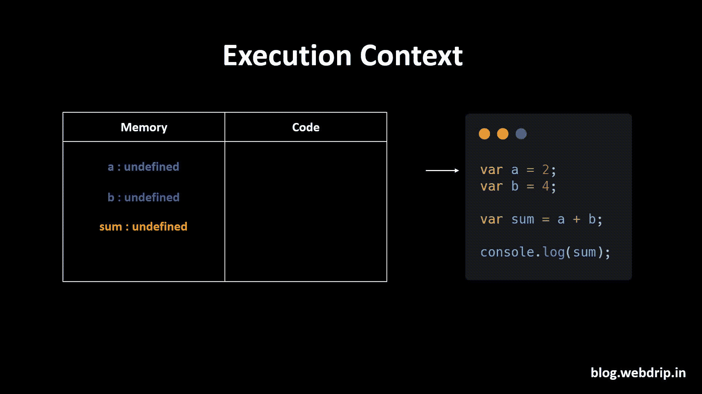

# 让我们来理解 JavaScript 中的提升

> 原文：<https://javascript.plainenglish.io/lets-understand-hoisting-in-javascript-99d9df022ce8?source=collection_archive---------10----------------------->

在 JavaScript 中，提升是在代码执行之前将所有**声明移动到作用域顶部的默认行为。Javascript 中的一切都发生在*执行上下文*中。为了详细理解提升，让我们了解一下执行上下文。**

## **执行上下文**

执行上下文主要有两个组件

1.  内存组件(创建阶段)
2.  代码组件(执行阶段)

**内存组件** —也称为*变量环境*，它使用键值对为变量分配内存。

**代码组件** —也称为执行的*线程。*由于 JavaScript 是同步单线程语言，代码组件负责一次一行地执行程序，并遵循代码的顺序。

*注意:*第一个变量 a、b 和 sum 被设置为*未定义*。当代码组件执行第 1 行时，它将值分配给 a，然后将值分配给 b，在第 3 行，它执行 a 和 b 的加法，因此 sum 的值变为 6。

**吊装**

提升允许我们甚至在初始化函数和变量之前访问它们。

考虑下面的代码。

如果我们执行上面的程序，getName 可以访问这个函数，但是 console.log(x)给出了 undefined。这是因为吊装

在执行代码之前，Javascript 首先为每个变量分配内存，因此 x 的值被设置为 undefined，*(第 3 行尝试****console . log(getName)****)*getName 将是整个函数本身。因此，当我们在赋值之前调用 console.log(x)时，它会打印 undefined。

javascript 中的**未定义和未定义**是有区别的，如果我们注释第 3 行，那么会导致*未捕获引用错误:* x 未定义。

**编写代码的正确方式**。

**让我们尝试使用箭头功能**

当我们使用 arrow 函数时，它的行为就像一个变量

当我们在第 1 行调用 getName()时，它会给出一个错误，因为 getName 函数将表现为一个变量，因此当我们调用 console.log(getName)时，它会给出 undefined，因为变量 getName 有一个未定义的值。

## **结论**

JavaScript 只提升声明，不提升初始化。

JavaScript 在执行之前为程序中定义的所有变量和函数分配内存。

箭头函数表现为一个变量。

*更多内容请看*[***plain English . io***](http://plainenglish.io/)*。报名参加我们的* [***免费周报***](http://newsletter.plainenglish.io/) *。在我们的* [***社区***](https://discord.gg/GtDtUAvyhW) *获得独家获得写作机会和建议。*