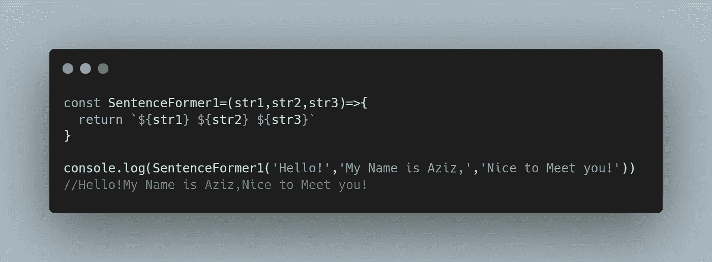
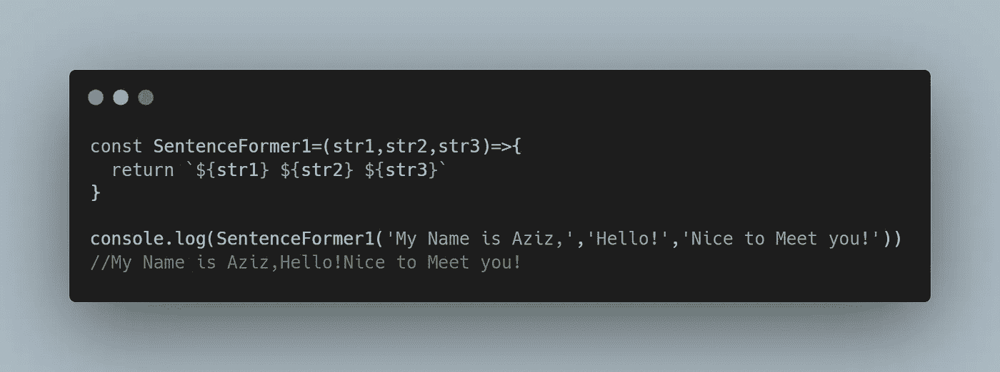
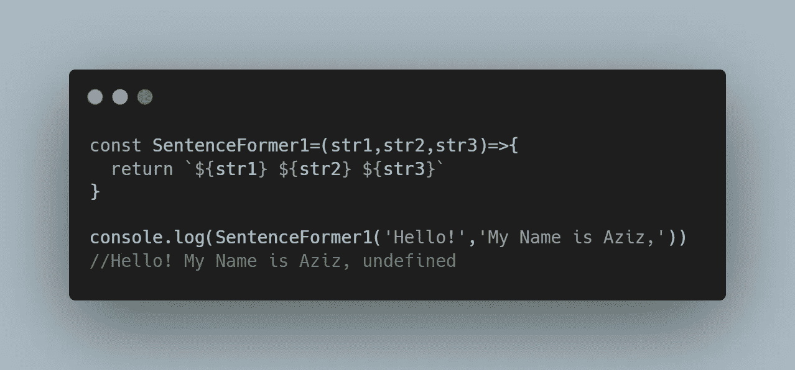
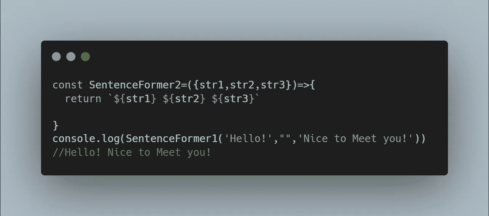
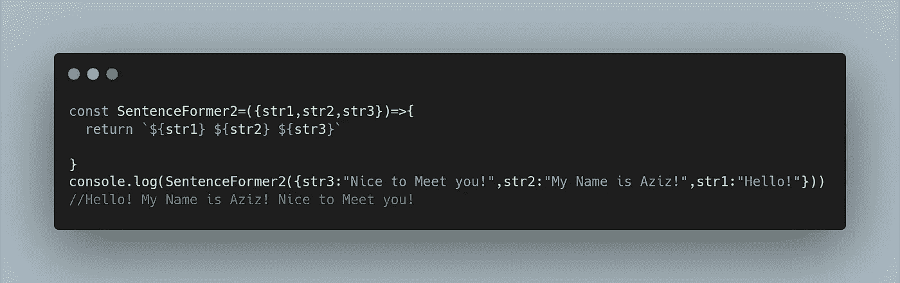
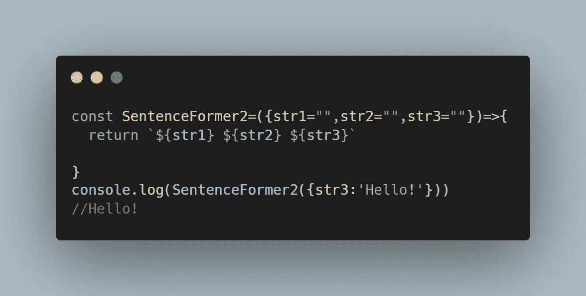

# 让我们理解 JavaScript 中的位置参数和命名参数

> 原文：<https://javascript.plainenglish.io/lets-understand-positional-and-named-parameters-in-javascript-672faa2e4ed9?source=collection_archive---------1----------------------->

## 在 JavaScript 中传递参数变得更加容易了…

Photo by [Florian Olivo](https://unsplash.com/@florianolv?utm_source=medium&utm_medium=referral) on [Unsplash](https://unsplash.com?utm_source=medium&utm_medium=referral)

理解如何使用函数是掌握 JavaScript 的一个重要部分。这使得理解如何使用参数成为每个 JavaScript 开发人员的必要条件。

在这篇文章中，我将介绍两种不同的方法来传递 JavaScript 中的参数，同时使用**位置参数**和**命名参数**

# 理解 P *位置*参数

在 JavaScript 中传递参数的第一种方式是使用位置参数

在 Javascript 中，当调用一个函数时，我们必须按照一定的顺序传递参数。这意味着这些参数的位置很重要。这种传递参数的方式被称为*位置参数*。

这意味着传递给函数的第一个参数将被第一个参数引用，第二个参数将被第二个参数引用，依此类推。

以下面的代码为例:

Passing Parameters using Positional Parameters

如果您要检查控制台，您会看到以下字符串:

> 你好！我叫阿齐兹，很高兴见到你！

# 位置参数的问题是

到目前为止，您应该已经很好地掌握了位置参数。现在，我将通过问一个简单的问题向您展示使用位置参数的缺点。

如果您意外地以不同的顺序传递字符串，如下面的代码所示，会发生什么情况？

Notice how a different string is outputted depending on the order?

如果您再次检查控制台，您会看到以下字符串:

> 我叫阿齐兹，你好！很高兴见到你！

虽然这是一个简单的错误，但在更复杂的函数中，这很容易成为一个问题。

这不是使用位置参数带来的唯一问题。如果在上面的函数中，我们只想传递 str1 和 str3，而不想传递 str2，那该怎么办？

我们仍然需要传递一个值，否则 JavaScript 会用值 *undefined* 替换我们的第三个字符串。

如果您要检查控制台，您会看到如下所示的字符串:

> “你好！“我的名字是阿齐兹，未定义”

The output of the function with only two arguments passed

要解决这个问题，我们必须将一个空字符串传递给 str2，如下面的代码所示:

这意味着以下字符串将显示:

> “你好！很高兴认识你！”

我们可以通过使用**命名参数**轻松解决这个问题

# 使用命名参数

在我们开始使用命名参数之前，我们必须首先理解什么是命名参数*什么是*。

命名参数是一种通过列出参数名称来传递参数的方法。这不同于我们之前讨论的基于参数位置传递参数的方式。

**命名参数的好处如下:**

1.  让我们不必担心参数传入函数的顺序
2.  使拥有可选参数变得容易
3.  便于理解哪些参数引用了哪些参数。

但是现在的问题是我们如何使用命名参数？

Javascript 没有命名参数的本地实现，但是我们可以通过使用[对象析构](https://developer.mozilla.org/en-US/docs/Web/JavaScript/Reference/Operators/Destructuring_assignment)来获得相同的结果

我们使用命名参数所要做的就是传递一个 JavaScript 对象作为函数的参数。在我们的函数内部，我们还将使用一个 JavaScript 对象来接收这些参数。

为了展示这一点，我重构了之前的造句函数，以使用命名参数。这方面的代码如下所示:

Notice How the order doesn’t matter when using named arguments?

以下字符串将被打印到控制台:

> “你好！我叫阿齐兹！很高兴认识你！”

我们也可以毫无问题地传递单个字符串。如下所示:

Notice how can pass str3 only with no problem/

唯一的警告是，我们必须设置[默认参数](https://medium.com/r?url=https%3A%2F%2Fjavascript.plainenglish.io%2Fset-default-parameters-the-easy-way-in-javascript-62b28b981d15)为其他值，这样才能正常工作。

*注:你可以在这个 CodePen 链接* [*这里*](https://codepen.io/azizbooker/pen/WNZvZpR) 查看该项目的完整代码

# 结论

感谢您阅读完我的文章**‘如何在 JavaScript 中使用命名参数’**。希望到现在为止，我希望你对如何使用位置参数和制造参数有了更好的理解。如果你有任何问题，请随意提问，我会尽快回答。

我希望你有美好的一天。如果你是中级新手，你可以点击这里的[链接](https://bookeraziz.medium.com/membership)加入

以下是我的进一步解读:

 [## 你绝对需要了解的 8 个 React 原生库

### 当谈到使用 React Native 创建应用程序时，找到正确的库可以使开发过程变得更加…

JavaScript.plainenglish.io](/8-react-native-libraries-you-absolutely-need-to-know-about-28f6038d0b76)  [## 用 JavaScript 轻松设置默认参数

### 如何正确设置默认参数

javascript.plainenglish.io](/set-default-parameters-the-easy-way-in-javascript-62b28b981d15) 

*更多内容请看**[***说白了。*** *报名参加我们的*](http://plainenglish.io/)*[***免费每周简讯这里***](http://newsletter.plainenglish.io/) ***。*****