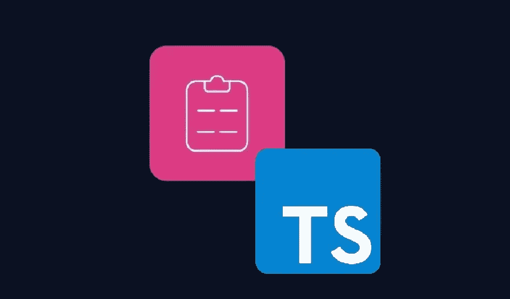
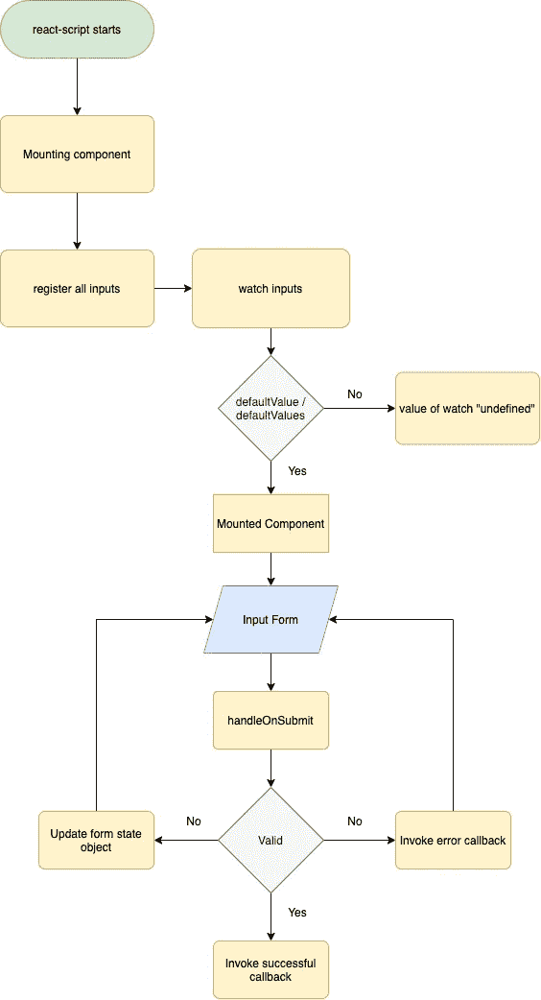
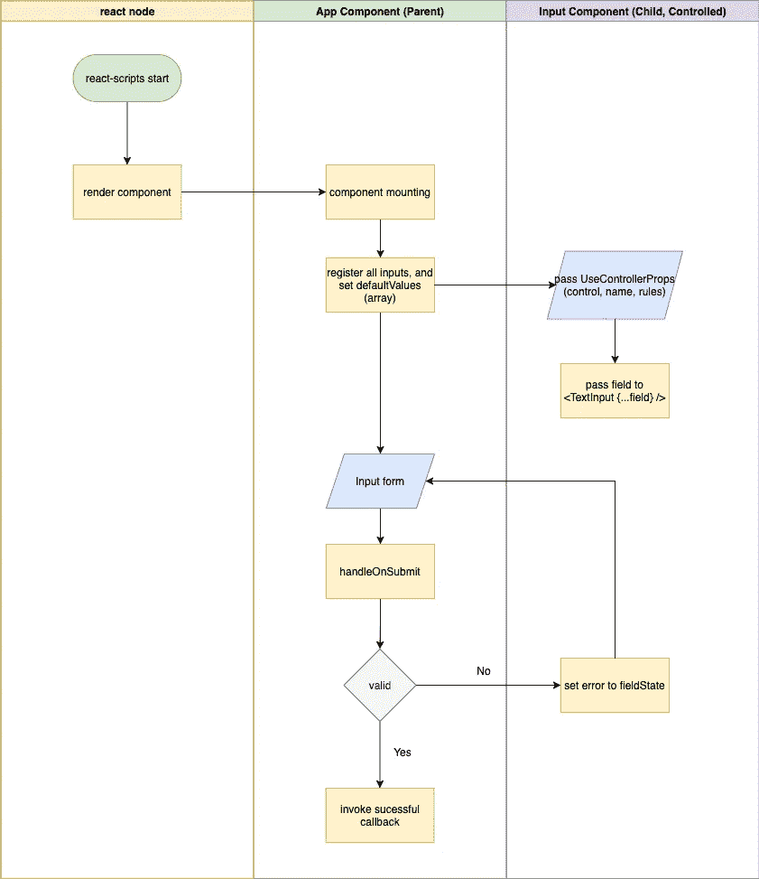

# 让我们验证一下我们的形式:React Hook Form ft。以打字打的文件📝

> 原文：<https://javascript.plainenglish.io/lets-validate-our-form-react-hook-form-ft-typescript-1c5184c04429?source=collection_archive---------3----------------------->



picture from Desmond Gerber in [morioh](https://morioh.com/p/0d8a67bc4b5e)

> **TLDR** : `react-hook-form`是一个强大的处理表单的库，它减少了重新渲染的次数，因为它采用了`uncontrolled`处理表单的方式。你将经常使用库提供的`useForm`钩子来使用它的力量。该挂钩在第 **2a 节中解释。使用表单。**

当然，在 JavaScript 或 React 应用程序中验证表单不是一种固执己见的方式！因为这取决于你工作的环境和用户界面设计。我们可以自己处理或者使用第三方库。有时候，我们自己做验证会花费更多的时间，这也会让其他刚刚处理相关功能的开发人员感到困惑，每个开发人员都有自己的处理方式。

有一个名为`react-hook-form`的第三方库，它旨在帮助开发者处理表单验证。那么，如果第三方库只减少了 3-4 行代码，那么使用它又有什么意义呢？。嗯，`react-hook-form`还有另一个优势，正如官方文件中所说:

> 减少您需要编写的代码量，并删除不必要的重新渲染是 React Hook Form 的一些主要目标

这是真的，因为原因之一是`react-hook-form`主要使用了一种不受控制的处理形式。如果你想知道表单的非受控处理方式是什么，你可以阅读我之前关于 React 中`[Controlled vs Uncontrolled](https://medium.com/@pratamarauf8/controlled-vs-uncontrolled-component-%EF%B8%8F-fa707c759967)`的故事。说够了，给我看看代码！

# 1.装置

它只需要一个简单的命令，我们就可以开始了:

```
//npm
npm install react-hook-form// yarn
yarn add react-hook-form
```

> 声明:在这个故事中，我用`[react-hook-form v7.12.2](https://github.com/react-hook-form/react-hook-form/releases/tag/v7.12.2)`作为例子。

# 2.使用

`react-hook-form`提供了许多函数和钩子来处理表单，但是有一个钩子叫做`[useForm](https://react-hook-form.com/api/useform)`、`useController`和`useFieldArray`，这个钩子是最常用的。

## a.使用形式

useForm basic usage

`useForm` hook 返回的函数有几个，我们来分解一下。

`[**register**](https://react-hook-form.com/api/useform/register)`它将输入或选择元素注册到`react-hook-form`,以便我们能够使用库验证/特性。从技术上讲，我们只是将输入/选择引用传递给函数。我们还可以通过向第二个参数传递一个对象来添加验证，这些是支持的验证规则:

*   `required: boolean`
*   `min: number`
*   `max: number`
*   `minLength: number`
*   `maxLength: number`
*   `pattern: RegExp`
*   `validate: Function | Object`

`[**handleSubmit**](https://react-hook-form.com/api/useform/handlesubmit)` 该函数接受 2 次回调**，成功案例接受** `SubmitHandler`，错误案例接受`SubmitErrorHandler`**。**在调用`onSubmit/onSubmitError`函数之前，该函数将首先验证我们的表单。

`[**watch**](https://react-hook-form.com/api/useform/watch)` 一个不断观察输入变化的函数，通过将输入键/名称传递给函数来指定，它接受字符串或字符串数组。这个函数将导致对根组件的重新渲染，我们可以使用`[useWatch](https://react-hook-form.com/api/usewatch)`钩子来获得更好的性能。

`[**formState**](https://react-hook-form.com/api/useform/formstate)`是一个保存表单状态信息的对象，它返回的值之一是`errors`。`errors`是包含所有无效输入的对象。



useForm basic usage flow

## b.**使用控制器**

它允许我们使用外部受控组件，如 React-Select、AntD、Material-UI 或任何不公开引用的输入。

`useController` basic usage

我们使用`useController`创建一个可重用的受控组件，它接受`[UseControllerProps<T>](https://react-hook-form.com/api/usecontroller)`作为道具。`useController`返回几个对象和函数。我们来分解一下。

`[**field**](https://react-hook-form.com/api/usecontroller)`该对象返回几个函数，如`onChange`、`onBlur`、`ref`、`name`和`value`。要将 react-hook-form 与受控输入连接起来，基本上，我们只需通过 spread 操作符在字段内部传递它的所有值

`[**fieldState**](https://react-hook-form.com/api/usecontroller)`将信息保存到特定输入的对象，类似于 useForm 中的`formState`。

我们还将一些`UseControllerProps<T>`传递给我们刚刚创建的受控可重用组件，即`control`、`name`和`rules`。`control`包含注册相关输入的方法，`name`用作唯一的输入键，`rules`是我们如何应用验证的选项。



Wiring up controlled input to react-hook-form flow using `useController`

## **c. useFieldArray**

useFieldArray 是`react-hook-form`提供的强大钩子之一，它使我们能够处理动态输入。

useFieldArray basic usage

与`useController`类似，`useFieldArray`中的`fields`值通过设置`useForm`上的`defaultValues`来初始化。

在代码示例中，首先，我们声明`useForm` hook，并将一组对象传递给`defaultValues` prop，通过从`useForm`向`useFieldArray` prop 提供`control`函数，这些对象将被传递给`useFieldArray` hook。

`useForm`接受最小道具，返回一些有用的对象/函数`line 32`。

我们使用通过设置`defaultValues`启动的`fields`对象，通过映射它来显示输入，默认情况下`fields`对象和`id`对象在映射对象时作为关键属性很有用。使用由`react-hook-form`提供的`uuid`生成的`id`

然后我们可以用`useFieldArray`返回的其他函数来修改数组，比如`append`、`prepend`、`insert at`、`remove`、`swap`、`move`

# **结论**

`react-hook-form`是一个功能强大的处理表单的第三方库，它比其他库有优势，减少了重新渲染的次数。`react-hook-form`有其他强大的 API/hook 来提升性能，比如`useWatch`、`useFormState`和`useFormContext`。

*更多内容尽在* [***说白了***](http://plainenglish.io/)