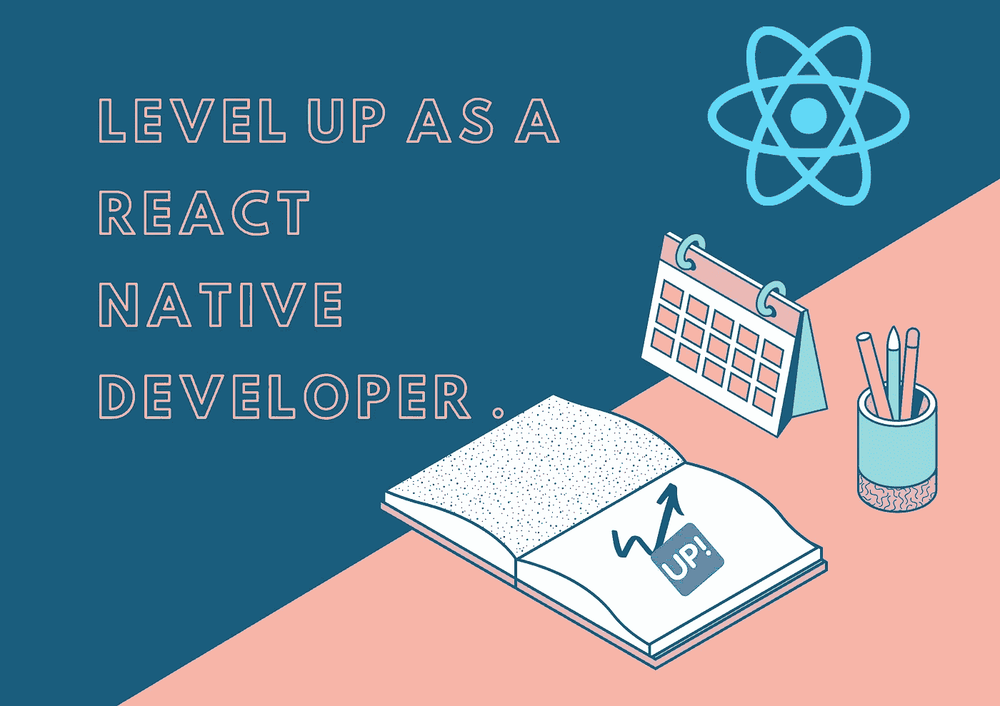
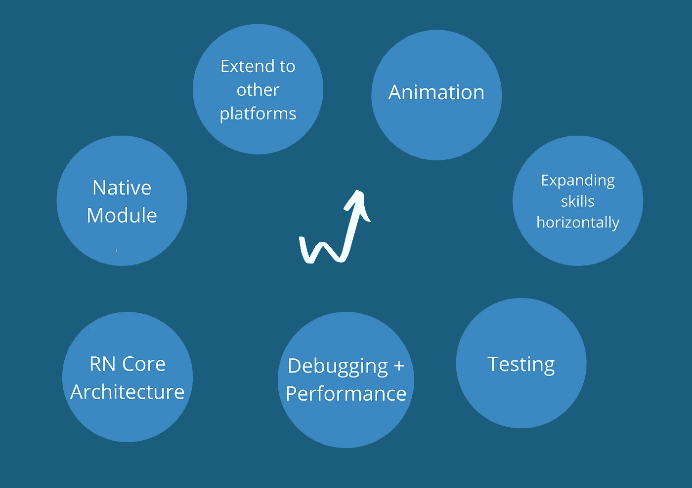

# 提升为 React 本地开发人员

> 原文：<https://javascript.plainenglish.io/level-up-as-a-react-native-developer-cb2832805255?source=collection_archive---------0----------------------->

## 成为 pro React 原生开发者的路线图。

最近，我鼓起勇气，在 Reddit 上直截了当地问了以下问题。

> “如何升级成为一名 react 本地开发者？”

我很高兴我问了，我得到了许多重要的建议和有用的指导。这里是我在一篇博客文章中记录[讨论](https://www.reddit.com/r/reactnative/comments/rm6goz/how_to_level_up_as_a_react_native_developer/)的尝试。

在讨论每一点之前，让我先用一张图来举例说明，以便事先有一个清晰的概念。

skill that might be helpful for your career growth.

# **1。原生模块**

讨论中提到的最常见的技能是在 iOS & Android 中拥有**创建原生模块的技能。**我相信作为一名 react 原生开发人员，我们 80–90%的时间都不使用任何原生模块。要么我们不需要它们，要么我们使用第三方软件包。然而，要成长并让自己从其他注册护士开发者中脱颖而出，这是一项基本技能。

## **什么&怎么学？**

要创建本地模块，我们至少需要掌握 Swift 和 Kotlin 编程语言的基础知识，并在开始时使用它们做一些小事情。学习这项技能的最好方法是构建一些有用的东西。有一个非常好的包，可以帮助非常容易地开始创建一个本机模块。它提供了一个很好的样板，这样你就可以开始了。这个包叫做[react-native-builder-blob](https://github.com/callstack/react-native-builder-bob)。

# **2。动画**

如果你想在前端领域成长自己，动画是一个重要的技能。大多数 RN 开发人员可以根据设计模板创建屏幕，但当涉及到动画和手势时，我们很多人都很难做到。如果你擅长动画，作为一个注册护士开发者，你的价值会自动增加。

## **什么&怎么学？**

最多的建议是学习[react-native-reactived](https://docs.swmansion.com/react-native-reanimated/)，因为动画发生在原生层，不存在性能问题。为了学习这种特殊技能，每个人都建议观看威廉的 Youtube 频道或他的个人课程 T21。

# **3。React 原生核心架构**

理解 RN 如何在引擎盖下工作，桥，新的 fabric 渲染器，通信层，限制将会给你一个清晰的想法，最终将帮助你为你的产品做出正确的和可扩展的决定。我们中的许多人都与 RN 一起工作了很长时间，我们甚至不知道这个框架的核心思想，显然，要构建一个应用程序，你不需要了解他们，但为了提高水平，我们也应该了解框架是如何工作的。

# **4。调试技术&性能**

我们中的许多人对开发感到舒适，但是当涉及到发现错误、问题和解决它们时，我们往往会迷失。因此，对于 RN 开发人员来说，使用适当的调试工具和技术找到错误的根本原因并解决它们是一项至关重要的技能。这项技能将使你脱颖而出，你的团队将永远依靠你的技能。像 **flipper，reactotron，react-native-debugger，breakpoints** 这样的调试工具是非常有用和有效的。与此同时，了解一些事情，比如用 perf monitor 和像[react-native-performance](https://github.com/oblador/react-native-performance)这样的包来测量应用程序的性能，将有助于你提高水平。

# **5。测试**

为你的应用程序编写测试可能是你想达到的下一个最重要的技能。通常我们只是构建并进行手动测试。这很耗时，我们错过了很多场景，最终，我们的应用程序变得更容易出错。因此，为了提升我们在这一领域的职业生涯，这是我们需要探索的一项必备技能。我相信[react-native-testing-library](https://github.com/callstack/react-native-testing-library)是一个很好的起点。

# **6。扩展到其他平台**

大多数时候，我们为 iOS 和 Android 平台开发应用。然而，我们可以将相同的代码基础扩展到 macOS、Web、Windows、等。其他平台不会像 android & iOS 那样 100%流畅。如果我们坚持下去，并找到使我们的代码库与其他平台兼容的方法，这将极大地推动我们的事业。

# **7。横向扩展我们的技能**

这是讨论中我最喜欢的观点之一。为了提高在这个领域的水平，我们不应该只关注注册护士，而是我们可以慢慢扩展我们在不同领域的技能。这些技能会派上用场，帮助我们在我们的领域成长。例如，我们可以学习 backend(可能足以创建 API、认证等。)、DevOps(可能是托管和扩展/了解其工作原理？)，UI/UX(也许我们可以在 Figma 学设计？让我们的用户更好地了解 UX？)，等等。

这就是讨论的全部内容，我真的很高兴，并根据以上几点设定了一些目标。如果你觉得自己停滞不前，而不是成长，你可以试着检查一下这个列表。希望这有所帮助！

感谢您的阅读。

*更多内容看* [*说白了. io*](http://plainenglish.io/) *。报名参加我们的* [*免费每周简讯*](http://newsletter.plainenglish.io/) *。在我们的* [*社区*](https://discord.gg/GtDtUAvyhW) *获得独家写作机会和建议。*