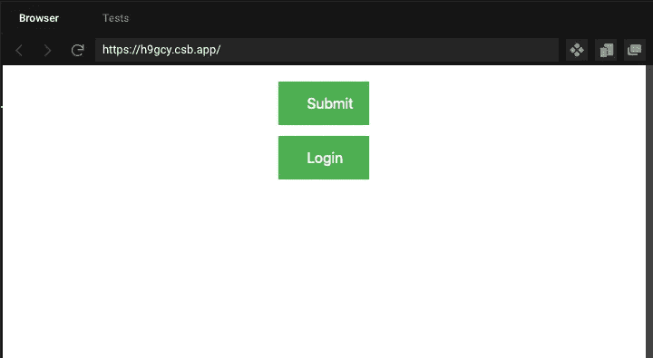

# 用作文来提升你的反应能力

> 原文：<https://javascript.plainenglish.io/level-up-your-react-skills-with-the-use-of-composition-766a41f544c9?source=collection_archive---------9----------------------->

Photo by [FOX](https://www.pexels.com/@fox-58267?utm_content=attributionCopyText&utm_medium=referral&utm_source=pexels) from [Pexels](https://www.pexels.com/photo/low-light-photography-of-computer-gaming-rig-set-1038916/?utm_content=attributionCopyText&utm_medium=referral&utm_source=pexels)

当构建一个应用程序时，您可能需要为某些项目创建不同的风格。想想按钮、输入字段等。令人欣慰的是，React 让我们可以访问叫做 [composition](https://reactjs.org/docs/composition-vs-inheritance.html) 的东西，从而使事情变得简单。组合允许我们创建一个基本项，然后在这个基本项的基础上构建我们需要的东西。想象一个带有常见道具和样式的按钮，然后我们可以为我们用这个基本按钮构建的按钮分配特定的道具。

想象一下，你的团队设计师给了你几页的模型。这些页面具有常见的 UI 元素。因为你的团队想要从头开始构建一切，所以你需要一个游戏计划。所以你坐下来浏览这些页面，同时做笔记。当您做笔记时，您会注意到在文本和按钮功能之外，有各种各样的按钮，它们都有相似的样式。

我们如何实现这一目标？保持我们的代码“干燥”是最佳实践。如果你不熟悉 DRY，它代表**D**on**R**EPE at**Y**our。理想情况下，我们希望构建一个组件，并将其扩展到更新的组件。这将保持我们的代码小，易于管理。

我们可以使用继承，但是如果你的开发者没有面向对象编程的背景，这将导致停机，因为他们需要学习这一切是如何工作的。

那我们该怎么办？谢天谢地，React 有一个叫做复合模型的东西，根据文档:

> React 有一个强大的组合模型，我们建议使用组合而不是继承来重用组件之间的代码。—反应堆文件

因为我们在使用技术时应该遵循文档，所以我们应该尝试一下看看到底发生了什么。真的值得吗？让我们找出答案。

首先，我们将创建我们的`Base Button`。把这当成我们的模子。我们可以使用这个模具快速构建出新的按钮，我们只需要 1 套样式。这让我们的生活轻松多了。

Base Button

接下来，我们想要创建我们的按钮集。我们将从我们的基本按钮创建两个新按钮，我们将把它们叫做`SubmitButton`和`LoginButton`。为新按钮使用合成的过程如下:

1.  导入我们的基本按钮。
2.  为我们的新功能编写代码。
3.  在我们的函数中使用我们的`<Button />`组件。
4.  更新属性文本以显示我们想要的内容。

Submit Button

Login Button

我们需要做的最后一件事是导入我们的`LoginButton`和`SubmitButton`，我们有了一组功能按钮。

Our App.js file

我们也应该树立自己的风格。合成的好处是我们可以将我们的样式应用到我们的基本按钮上，我们创建的任何新按钮都将自动获得这种样式。

Base Button Style

成品应该如下所示

The finished product

虽然这是一个非常小、非常具体的例子，但是我们可以使用这种方式将组件设计成具有共性的组件。我们可以将特定于每个按钮的任何代码保存在各自的文件中。从函数到道具，这是保持文件大小较小的一个好方法，这导致了可维护性和可读性。

# 结论

我希望这篇文章是令人愉快的。如果你有任何反馈，发表评论，让我知道我可以改进的地方。如果你想看看我的其他帖子，可以在这里找到。我写的都是前端特有的东西，所以我有关于 [Fetch API](https://avetwhocodes.com/fetching-data-from-an-api-with-the-fetch-api-in-react-5dbe0abcfb41) 、 [React](https://blog.devgenius.io/how-do-i-function-react-function-components-in-a-nutshell-59f2521f6d06) 、 [TypeScript](https://jgrice01.medium.com/typescript-understanding-the-basics-a2264759cd2d) 、[SASS](https://medium.com/codex/writing-better-sass-with-dynamic-class-generators-e486a0413d0d)&[electronic](https://jgrice01.medium.com/want-to-build-desktop-apps-using-js-say-hello-to-electron-4f862c3b4e38)的文章。感谢您的阅读，祝您愉快！

*更多内容请看*[***plain English . io***](http://plainenglish.io)