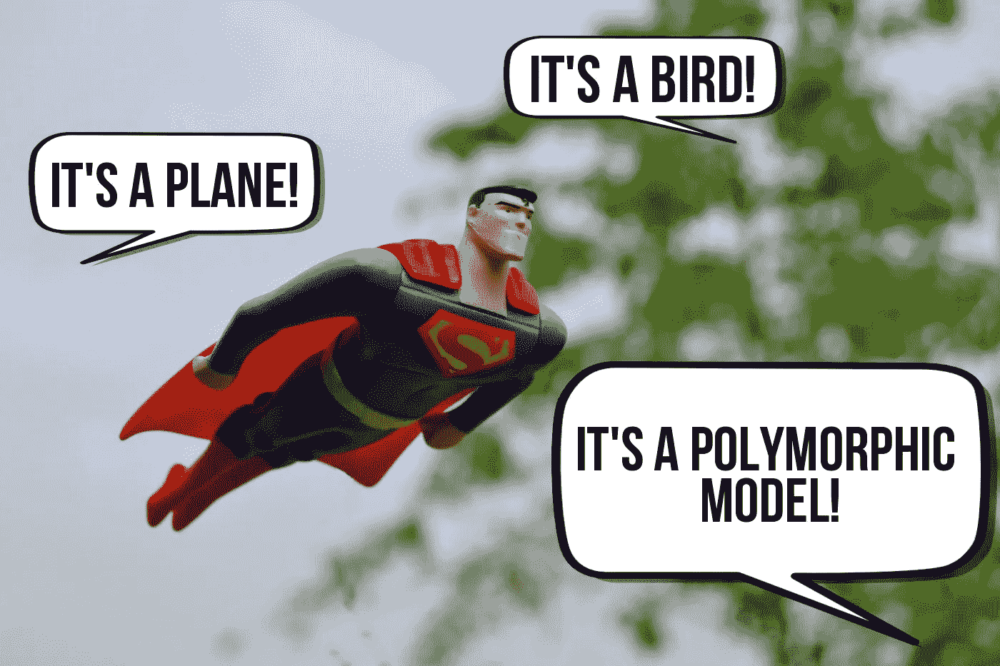
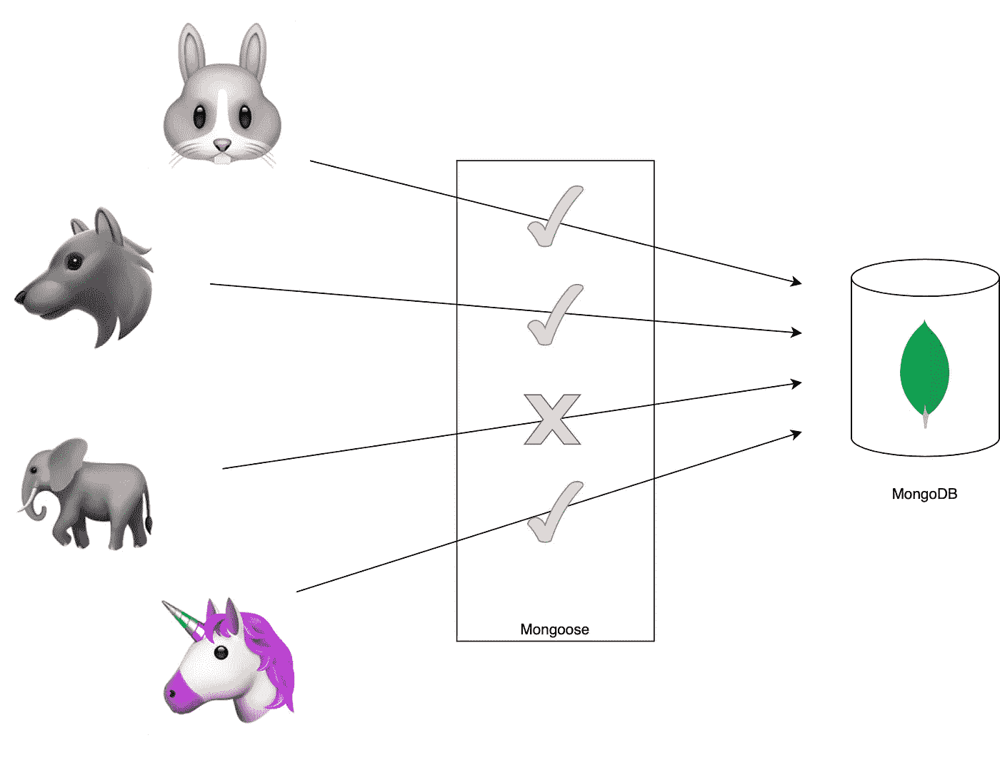
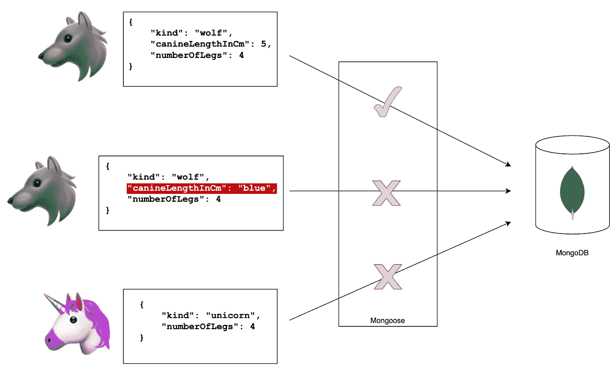
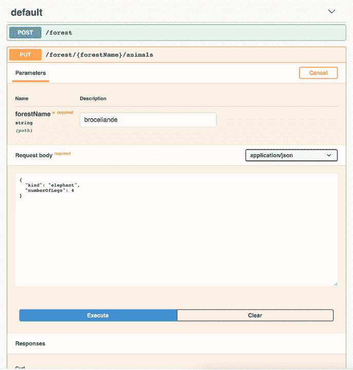

# 利用 Nest.js 和 Mongoose 进行多态数据验证

> 原文：<https://javascript.plainenglish.io/leverage-polymorphic-data-validation-with-nest-js-and-mongoose-10ae1dcbcf6d?source=collection_archive---------1----------------------->

## *验证填充了不同数据模型的文档数组的实践指南*



Photo by [Yogi Purnama](https://unsplash.com/@yogipurnama?utm_source=unsplash&utm_medium=referral&utm_content=creditCopyText) on [Unsplash](https://unsplash.com/?utm_source=medium&utm_medium=referral), modified by the author

想象一下:您有一个`customer`文档的集合，每个文档都有一个`favouritePaymentMethods`数组字段。您需要将它们保存在您的数据库中，但是付款方式的细节可能会有很大的不同。它可能是信用卡或借记卡、礼券或直接借记。它们都是有相似之处的支付方式，但是你可能会存储不同的细节(信用卡的到期日，SEPA 借记的银行账号等等。).嗯，您刚刚进入多态数据模型的世界，我们将在本文中讨论如何确保存储的数据是干净的。

## 先决条件

为了保持这篇文章的重点，我假设你对如何引导 NestJS API 和使用 mongose 有基本的了解:如果没有，那么看看 [Nest](https://docs.nestjs.com/) 的文档和[mongose 的快速入门指南](https://mongoosejs.com/docs/index.html)。不要担心，这篇文章仍然会在那里，供您检查😉。

另外，如果您不确定为什么首先应该使用 NestJS，那么可以看看这篇中肯的文章:

[](https://medium.com/javascript-in-plain-english/be-cool-get-started-with-nestjs-a-modern-web-framework-for-node-js-31b25e6348d5) [## 对于您的节点应用程序，您肯定应该使用 NestJS

### 用 NestJS 超级爽。

medium.com](https://medium.com/javascript-in-plain-english/be-cool-get-started-with-nestjs-a-modern-web-framework-for-node-js-31b25e6348d5) 

# 未经验证的示例 API

在这个例子中，我们将考虑一个 API，它存储了一个`Forest`文档的集合，每个森林都有一个包含森林动物的子文档集合。我相信你已经知道，假设你已经安装了 nest 的 CLI，你可以用`nest new forest-api`创建一个新的 nest API。请随意查看 GitHub 上的[示例代码。我们还需要安装`@nestjs/mongoose`包:它允许我们定义一个 TypeScript 类来生成相应的 Mongoose 模式，如下所示:](https://github.com/Marchelune/nestjs-mongoose-discriminator)

## NestJS 控制器设置

既然我们的森林数据库模型已经定义好了，我们只需要创建一个控制器。为了简化这个例子，我们直接在我们的控制器中注入猫鼬层，但是不要在家里这样做！在生产中，我们应该在专用服务中定义我们的领域逻辑。

我们不要忘记在应用程序模块中注册我们的 Mongoose 连接和模式:

我们到了。我们可以运行我们 API，发布任意多的动物，例如 curl:

```
npm run start;
curl -X PUT "http://localhost:3000/forest/broceliande/animals" -H  "accept: */*" -H  "Content-Type: application/json" -d "{\"type\":\"bear\",\"numberOfLegs\":4}";
```

问题是，使用这种方法，我们无法控制进入数据库的内容😱。

# 创建验证模式

我们这里想要的是验证进入我们森林的动物，我们可以区分我们在数据库模型中预期的两大类属性:

1.  所有动物可能共有的特性(如眼睛的数量、体重等。)
2.  只有一些动物可能具有的特性(鸟喙的颜色，牙齿的数量等。)

从那里我们得到了验证公共属性的基础模式的需求，以及验证特定属性所需的模式。然后，我们将使用 Mongoose 的[鉴别器](https://mongoosejs.com/docs/discriminators.html)将基础模型和特定模型链接在一起。

> 鉴别器是一种模式继承机制。它们使您能够在同一个底层 MongoDB 集合上拥有多个具有重叠模式的模型。

## 限制允许的动物



In our forest document, we only accept hares, wolves and unicorns. The first validation step will be to rule out any other animal.

鉴别器使用一个鉴别器键:Mongoose 将查看这个属性来判断一个模型是一种类型还是另一种类型。在我们的例子中，我们想知道数组中有哪种动物，以便应用适当的验证规则。首先，我们将列举我们的森林中允许的动物种类。从那里我们可以创建一个基础`AnimalModel`，比如说一个公共的`numberOfLegs`属性:

Although we are only interested in the schema here, you can export the class AnimalModel itself of course, to manipulate data when you retrieve it from the database

## 为每种动物配置特定的属性

我们有我们的基地，检查！这意味着猫鼬将拒绝任何类型不属于`AnimalKind`枚举，或者没有`numberOfLegs` 属性的动物。记下`discriminatorKey`模式属性。当然，您可以使用更适合您的域的密钥名。现在我们来看看具体的动物模型:

我们为普通属性定义了一个基本模型，并为每种动物定义了具有特定属性的专用模型。不要让你质疑森林中独角兽的存在，让我们继续来看看让这一切工作的魔术🙂。



A visual recap of the Mongoose schema above: if we try to insert a wolf, then it must have a canineLengthInCm property that is a number. If we add a unicorn, then it must have a *hornColor* string property in order to pass validation.

# 注册一个鉴别器

我们需要告诉 Mongoose，我们在森林文档中的`animals`数组可能包含跟随`AnimalSchema`和`UnicornSchema`、`HareSchema`或`WolfSchema`的对象。因此，让我们重新看看森林文档:

不幸的是，在编写本文时，我们不得不手动向 TypeScript 指出我们模式中的`animals`路径是一个`DocumentArray`——mongose 的类型还不能推断出这一点。因此，我建议我们尽可能保持这种类型假设接近模式定义，并在函数中提取鉴别器的设置。

## 使用专用函数注册所有模式

在上面的代码片段中，我们告诉 Mongoose，当`animalArraySchema`元素的鉴别器键等于`AnimalKind.Hare`时，使用`HareSchema`来验证它。同样的还有`Wolf`和`Unicorn`以及你可能需要的任意多的动物:提取到一个专用函数允许我们在不接触我们的`ForestModel`的情况下增加有效条目的列表！有人说过开闭原则吗😃？

按照执行顺序，`registerAnimalSchemaDiscriminator`会被调用一次，当 Node 读取包含 ForestModel 的模块时。最后一件事:正如[mongose 的文档](https://mongoosejs.com/docs/discriminators.html#embedded-discriminators-in-arrays)所建议的，如果在特定路径上有 pre 或 post 挂钩，那么需要在注册鉴别器之前配置它们。

# 让我们看看它的实际效果吧！

我们现在都准备好了！为了让我们看到验证消息，我在数据库写操作周围添加了一个 try/catch，这样任何验证异常都会导致一个错误的请求。让我们尝试通过 PUT 端点在 animals 数组中插入一只大象:

```
curl -X PUT "http://localhost:3000/forest/broceliande/animals" -H  "accept: */*" -H  "Content-Type: application/json" -d "{\"kind\":\"elephant\",\"numberOfLegs\":4}";
```

为此我们将获得:

```
Bad Request.
ForestModel validation failed: animals.0.kind: `elephant` is not a valid enum value for path `kind`.
```

生效的验证规则是在基本的`AnimalModel`级别:Mongoose 只允许我们列举的动物种类进入。

## 多态验证

不让大象进入我们的森林是令人钦佩的，但也是…基本的。你不需要歧视！让我们更深入地尝试插入一只没有角颜色的独角兽:

```
curl -X PUT “http://localhost:3000/forest/broceliande/animals" -H “accept: */*” -H “Content-Type: application/json” -d “{\”kind\”:\”unicorn\”,\”numberOfLegs\”:4}”
```

这导致:

```
Bad Request.
ForestModel validation failed: animals.0.hornColor: Path `hornColor` is required.
```

看，多态验证的力量🦄！猫鼬拒绝这只独角兽，因为我们明确说过独角兽必须有角的颜色。当然，如果我们使用正确的喇叭颜色字符串运行请求，我们的 API 将返回 200 代码。整洁不是吗？



If you don’t like CLI commands, here is a Swagger UI version of our Rest API

# 包扎

让我们总结一下本文中所涉及的内容:

1.  我们创建了一个基础模式，子文档数组的所有元素都将根据该模式进行验证。
2.  我们为数组中接受的每种元素创建了特定的模式。所有这些模式类型名称都列在一个字符串枚举中。
3.  我们使用 Mongoose 的鉴别器在数组的模式上注册了每个特定的模式。

请注意，鉴别器也可以用于单个子文档(一个属性是多态的)，用于整个文档(集合是多态的)，甚至是嵌套的鉴别器。如果你想知道更多关于这些场景的信息，请在评论中告诉我！

我希望你能从那篇文章中学到一些东西，谢谢你的阅读🙏！

## 资源

*   NestJS 的猫鼬指南:[https://docs.nestjs.com/techniques/mongodb](https://docs.nestjs.com/techniques/mongodb)
*   猫鼬的歧视者博士:[https://mongoosejs.com/docs/discriminators](https://mongoosejs.com/docs/discriminators)
*   那篇文章的全部代码，打包了一个内存中的数据库和 swagger 接口，以便您可以轻松地进行自我测试😉:【https://github.com/Marchelune/nestjs-mongoose-discriminator 