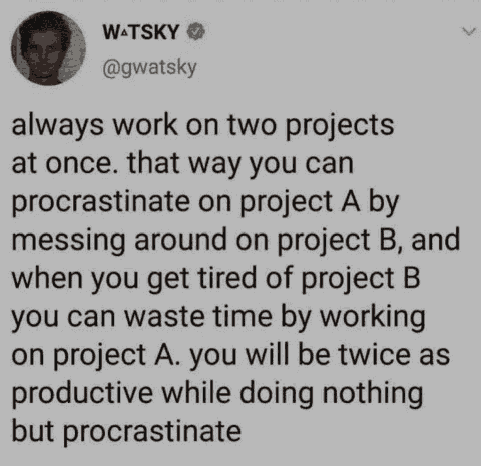

# 迷因形式的程序员生活

> 原文：<https://javascript.plainenglish.io/life-of-a-programmer-in-the-form-of-memes-a80115bdcc8a?source=collection_archive---------2----------------------->

## 2021 年最佳编程迷因汇编

Photo by [chaitanya pillala](https://unsplash.com/@chaiclikz?utm_source=medium&utm_medium=referral) on [Unsplash](https://unsplash.com?utm_source=medium&utm_medium=referral)

## “笑是人类最好的刷新按钮”

这篇文章是关于笑的。忘记过去的一年，考虑为新的一年设定目标。

我主要是在互联网上看到视频、抖音和迷因。我不知道为什么，但它有助于**提神醒脑，减轻工作压力**。

在这篇文章中，我收集了一些我喜欢的网络迷因。

# 从不准时完成…

Pic Credit: [https://twitter.com/_workchronicles/status](https://twitter.com/_workchronicles/status)

# 当有人要求重用旧项目的代码时…

Pic Credit: [https://www.monkeyuser.com/](https://www.monkeyuser.com/)

# 当我们声明变量 result，result1，result2…

Pic Credit: [https://programmerhumor.io/](https://programmerhumor.io/)

# 如何让你的头脑相信你是富有成效的？

Pic Credit: [https://www.facebook.com/yuva.krishna.memes](https://www.facebook.com/yuva.krishna.memes)

# 当客户问我为什么不能理解他们想要什么？

Pic Credit: [https://www.facebook.com/javascriptJS](https://www.facebook.com/javascriptJS)

# 如果你不删除代码，我有什么用…Git，我也不能相信我自己— Dev

Pic Credit: [https://www.facebook.com/javascriptJS](https://www.facebook.com/javascriptJS)

# 是时候搬回来了…

Pic Credit: [https://www.reddit.com/r/ProgrammerHumor](https://www.reddit.com/r/ProgrammerHumor)

# 嗯…完全同意…

Pic Credit: [https://programmerhumor.io/](https://programmerhumor.io/)

# 中断…

Pic Credit: [https://programmerhumor.io/](https://programmerhumor.io/)

# 当你的领导说有可再利用的组件时，不要浪费时间去制造它…

Pic Credit: [https://www.monkeyuser.com/](https://www.monkeyuser.com/)

# 完全正确…

Pic Credit:[https://www.reddit.com/r/ProgrammerHumor](https://www.reddit.com/r/ProgrammerHumor)

# 真的吗？这是谁写的…

Pic Credit: [https://www.facebook.com/jokesvala](https://www.facebook.com/jokesvala)

# 我不能和你分手…因为你在我心里…

Pic Credit: [https://www.facebook.com/ProgrammersCreateLife](https://www.facebook.com/ProgrammersCreateLife)

# 当我们在库中获得更新时…

Pic Credit: [https://www.monkeyuser.com/](https://www.monkeyuser.com/)

# 冻结时间？别担心，我们还有几天…

Pic Credit: [https://www.monkeyuser.com/](https://www.monkeyuser.com/)

# 当智慧无济于事时…

Pic Credit: [https://programmerhumor.io/](https://programmerhumor.io/)

# 嗯…你为什么把我拖到异步，任何类型和许多我不喜欢的东西…

Pic Credit: [https://www.reddit.com/r/ProgrammerHumor](https://www.reddit.com/r/ProgrammerHumor)

# 当您想要一个库，但却有太多库时…

Pic Credit:[https://www.monkeyuser.com/](https://www.monkeyuser.com/)

# 我应该把它收藏起来或者打开我的 50 个标签…

Pic Credit:[https://www.reddit.com/r/ProgrammerHumor](https://www.reddit.com/r/ProgrammerHumor)

# 重构与调试…

Pic Credit:[https://www.reddit.com/r/ProgrammerHumor](https://www.reddit.com/r/ProgrammerHumor)

# 当有人要求利用你的空闲时间进行重构时…

Pic Credit:[https://www.monkeyuser.com/](https://www.monkeyuser.com/)

# 希望你喜欢这篇文章。请在评论中分享你的建议。希望你在今年剩下的时间里过得愉快。

*更多内容看* [***说白了就是***](http://plainenglish.io/) ***。*** *报名参加我们的* [***免费每周简讯点击这里***](http://newsletter.plainenglish.io/) ***。***