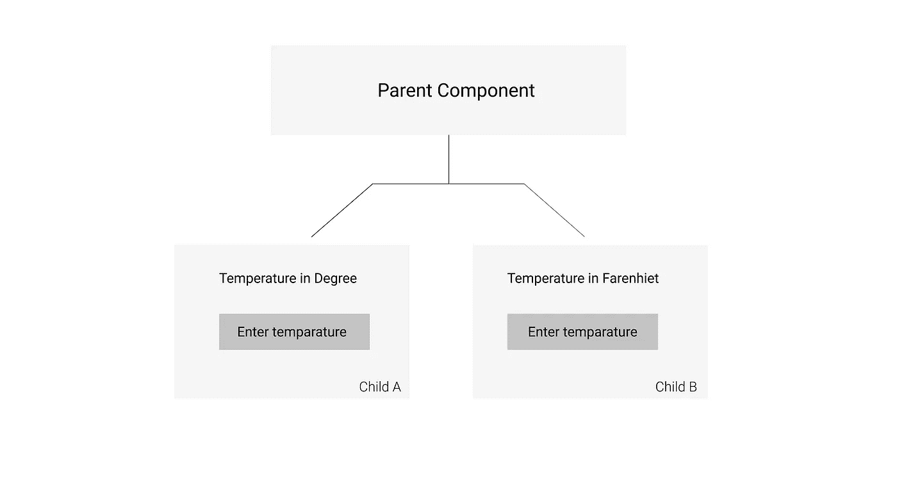
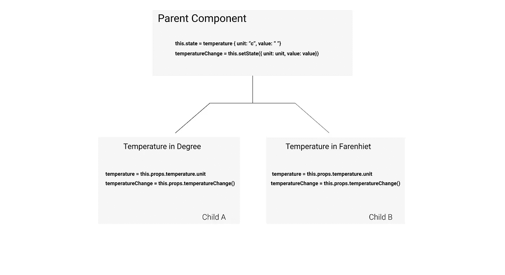

# 如何在反应中提升状态

> 原文：<https://javascript.plainenglish.io/lifting-state-up-in-react-e54e3167c008?source=collection_archive---------15----------------------->

因为我在一次面试中被问到这个问题😁✌️


Photo by [David Ballew](https://unsplash.com/@daveballew?utm_source=medium&utm_medium=referral) on [Unsplash](https://unsplash.com?utm_source=medium&utm_medium=referral)

## 在后台

几天前，在写这篇博客的时候，采访者问了我这个问题— *“告诉我更多关于在 React 中提升状态的信息？”*

当我阅读它时，它是关于为组件中的每个状态或数据添加一个真实的单一来源，并将道具传递给最近的祖先以维护组件中的更新数据的完整概念。起初，这种说法听起来很难理解。所以，在今天的故事中，让我们来理解在 React 中提升状态。

## 意识形态

React 遵循单向数据流的概念，这意味着数据在 DOM 树中只能从上到下流动。您有一个带有 2 个子组件的父组件，因此数据或状态将从父组件流向第一个直接子组件，或者在 React 中的同级组件内流动。

## 问题陈述

数据总是从父组件流向子组件。现在，每个子组件都将自己的更新数据保存在自己的状态中，在这种情况下，兄弟组件如何知道彼此的最新状态。



例如，我们有一个父组件和两个子组件，两个子组件都有一个以各自单位表示温度的输入。我们知道每个输入都有自己的状态，以各自的单位保存输入值，还有一个`**onChange**`方法更新本地状态。

问题是—

*   你将如何确保`**Child A**`和`**Child B**`对彼此状态的输入值保持警惕？
*   他们将如何互相交谈，互相传递本地状态信息？
*   他们怎么知道`**Child A**`的温度状态是某个 X 或 Y 值，反之亦然？

## 解决办法

一旦我们理解了问题，我们就可以阅读并执行解决方案。解决方案在于在 React 中提升状态的概念😁。请记住，我已经告诉过您，React 遵循单一真实来源的概念，数据总是单向流动。

这是一个确切的概念，我们将在这里使用它来理解问题，并写出它的解决方案。

我们唯一的真实来源是父组件。父组件将知道每个子组件中发生的一切，所以父组件当然应该放在我们最新数据应该存在的地方。

每个孩子不应该保存和更新他的存储最新温度值的本地状态。相反，父组件应该存储本地状态，并将温度值及其 onChange 方法传递给相应的子组件。



父组件将存储温度值并定义温度变化方法，我们只需将温度状态及其方法作为道具传递给子组件。

在每个子元素中，我们将使用其属性中的温度值，并更新温度值，我们可以简单地调用属性本身中传递的方法`**onTemperatureChange**`。

## 结论

将状态从本地子组件提升到最近的祖先在 React 中称为提升状态。这很简单，我们在日常生活中经常使用，但我们不知道用来指代它的专业术语。

我希望你明白这个概念。下次见！祝大家愉快，别忘了跟着我。

```
For more such stories, visit our website 💻 [**iHateReading**](http://www.ihatereading.in)
```

## 更多阅读

[](https://medium.com/geekculture/13-steps-for-perfect-authentication-flow-in-backend-4fad7dce0e0) [## 后端完美认证流程的 13 个步骤

### 我把我的应用服务器当作一个俱乐部聚会，只需 13 个步骤就能开发出完美的认证流程

medium.com](https://medium.com/geekculture/13-steps-for-perfect-authentication-flow-in-backend-4fad7dce0e0) [](https://medium.com/nerd-for-tech/5-minutes-read-to-add-github-authentication-via-express-servers-6dd764818124) [## 5 分钟阅读通过 Express 服务器添加 Github 认证

### 不能从浏览器访问 Github API，下面是在前端添加 Github 认证的方法。

medium.com](https://medium.com/nerd-for-tech/5-minutes-read-to-add-github-authentication-via-express-servers-6dd764818124) [](https://medium.com/nerd-for-tech/perfect-ui-library-with-react-813f41704584) [## 用 React 完善 UI 库

### 我们来讨论一下用 react 完善 UI 库即 Material UI 库及其与 Next JS 的安装。

medium.com](https://medium.com/nerd-for-tech/perfect-ui-library-with-react-813f41704584) 

*更多内容尽在*[***plain English . io***](http://plainenglish.io/)