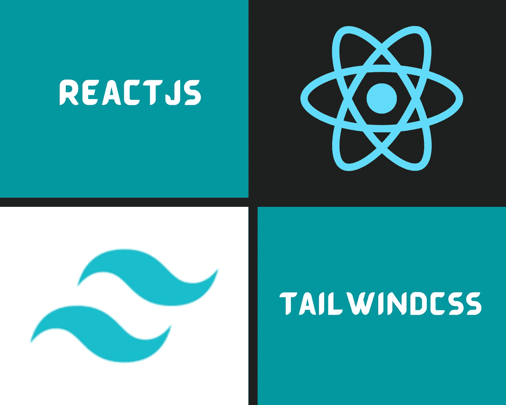
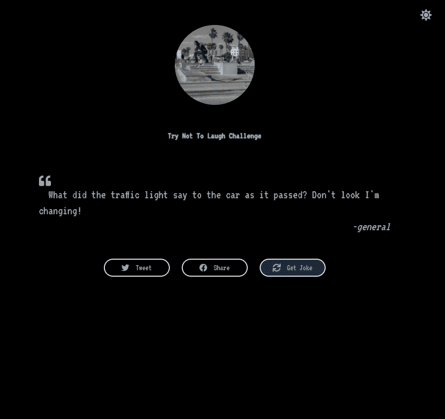

# 使用 Tailwind CSS 的 React Web 应用程序中的明暗模式

> 原文：<https://javascript.plainenglish.io/light-and-dark-mode-in-react-web-application-with-tailwind-css-89674496b942?source=collection_archive---------0----------------------->

## 如何使用 Tailwind CSS 制作简单的 React web 应用程序



Image Designed Using Canva

你好，

今天我想介绍一个简单的使用 **Tailwind CSS** 的 **React** Web 应用程序和一个构建它的教程。

**主要特点:**

*   在黑暗模式和明亮模式之间切换
*   获取随机的笑话和图片
*   在脸书和推特等社交媒体平台上分享笑话

你可以在这里看到一个现场的 [**演示**](https://try-not-to-laugh-challenge.netlify.app/) :

 [## 尽量不要笑挑战 App

### 使用 create-react-app 创建的网站

试着不要笑 challenge.netlify.app](https://try-not-to-laugh-challenge.netlify.app/) 

在本教程中，我使用 **Visual Studio 代码**作为代码编辑器，使用 **Netlify** 来部署我的应用程序。如果你喜欢，你可以使用其他工具。

我们将从本教程中学到什么:

*   **用 Create React App 安装 Tailwind CSS**
*   **切换暗模式和亮模式的主题**
*   **抓取笑话 API**

好了，开始编码吧！

1.  **用 Create React App 安装顺风 CSS**

在我们开始之前，我想简单介绍一下 [Tailwind CSS](https://tailwindcss.com/) 。正如他们在自己的网站 TailwindCSS " *中介绍的那样，无需离开你的 HTML 就能快速构建现代网站。这意味着你不需要写很多 CSS 代码，但是仍然可以使用 HTML 来定制外观。因此，这里值得一试。*

好的，继续前进！要用 Create React App 安装 Tailwind CSS，你得按照以下步骤[这里](https://tailwindcss.com/docs/guides/create-react-app):

[](https://tailwindcss.com/docs/guides/create-react-app) [## 用 Create React App - Tailwind CSS 安装 Tailwind CSS

### 如果您还没有建立一个 Create React 应用程序项目，请从创建一个新的项目开始。最常见的方法是…

tailwindcss.com](https://tailwindcss.com/docs/guides/create-react-app) 

React 应用程序准备就绪后，您需要转到您的 *tailwind.config.js* 文件，并对其进行如下配置:

```
// tailwind.config.js

module.exports = {
  purge: ['./src/**/*.{js,jsx,ts,tsx}', './public/index.html'],
  darkMode: 'class',
  theme: {
    container: {
      center: true,

       padding: {
        DEFAULT: '1rem',
        sm: '2rem',
        lg: '4rem',
        xl: '5rem',
        '2xl': '6rem',
      },

    },
  },
  variants: {
    extend: {},
  },
  plugins: [],
}
```

然后转到您的 *index.css* 文件，添加以下代码行:

```
@tailwind base;
  @tailwind components;
  @tailwind utilities;

  @import url("https://fonts.googleapis.com/css2?family=VT323&display=swap");

  body {
    font-family: "VT323",
    monospace;
  }
```

CSS 文件到此为止。这就是使用 TailwindCSS 的好处，你不需要很多定制的 CSS 代码，让你的应用程序更简单更快。关于这方面的更多细节，在我们继续之前，请在这里看一下他们的文档[。](https://tailwindcss.com/docs)

**2。切换暗模式和亮模式的主题**

要使用 TailwindCSS 创建暗光模式主题，您需要创建这些 Javascript 组件:Background.js、ThemeContext.js 和 ThemeToggle.js。

***background . js****在 body 元素中使用 class name*“BG-white dark:BG-black transition-all”*使主题在白色和黑色背景之间过渡。您可以根据自己的选择选择其他背景颜色。*

```
*//Background.jsimport React from 'react';

const Background = ( { children } ) =>
{
    return (

        <body className="bg-white dark:bg-black transition-all">
            {children}
        </body>
    )
}

export default Background;*
```

****theme context . js:***这使得主题的父提供者开始工作。*

```
*//ThemeContext.jsimport React from 'react';

const getInitialTheme = () => {
    if (typeof window !== 'undefined' && window.localStorage) {
        const storedPrefs = window.localStorage.getItem('color-theme');
        if (typeof storedPrefs === 'string') {
            return storedPrefs;
        }

        const userMedia = window.matchMedia('(prefers-color-scheme: dark)');
        if (userMedia.matches) {
            return 'dark';
        }
    }

   return 'light' // light theme as the default;
};

export const ThemeContext = React.createContext();

export const ThemeProvider = ({ initialTheme, children }) => {
    const [theme, setTheme] = React.useState(getInitialTheme);

    const rawSetTheme = (rawTheme) => {
        const root = window.document.documentElement;
        const isDark = rawTheme === 'dark';

        root.classList.remove(isDark ? 'light' : 'dark');
        root.classList.add(rawTheme);

        localStorage.setItem('color-theme', rawTheme);
    };

    if (initialTheme) {
        rawSetTheme(initialTheme);
    }

    React.useEffect(() => {
        rawSetTheme(theme);
    }, [theme]);

    return (
        <ThemeContext.Provider value={{ theme, setTheme }}>
            {children}
        </ThemeContext.Provider>
    );
};*
```

***ThemeToggle.js** 准备切换 UI 子节点，以便在亮暗模式之间切换。如果您这样使用，请确保安装*反应图标*:*

```
*//ThemeToggle.jsimport React from 'react';
import { FaSun, FaMoon} from "react-icons/fa";
import { ThemeContext } from './ThemeContext';

const Toggle = () => {
    const { theme, setTheme } = React.useContext(ThemeContext);

    return (
        <div className="transition duration-500 ease-in-out rounded-full p-2">
            {theme === 'dark' ? (
                <FaSun
                    onClick={() => setTheme(theme === 'dark' ? 'light' : 'dark')}
                    className="text-gray-500 dark:text-gray-400 text-2xl cursor-pointer"
                />
            ) : (
                    <FaMoon
                        onClick={() => setTheme(theme === 'dark' ? 'light' : 'dark')}
                        className="text-gray-500 dark:text-gray-400 text-2xl cursor-pointer"
                    />
                )}
        </div>
    );
};

export default Toggle;*
```

*现在将所有这些组件导入到您的 *index.js* 文件中，如下所示:*

```
*//index.jsimport React from 'react';
import ReactDOM from 'react-dom';
import './index.css';
import App from './App';
import { ThemeProvider } from './components/ThemeContext';
import Background from './components/Background';
import Toggle from './components/ThemeToggle';

ReactDOM.render(
  <React.StrictMode>
        <ThemeProvider>
      <Background>
         <div className="absolute right-0 top-0 mr-4 mt-4 md:mr-6 md:mt-6">
            <Toggle />
          </div>

        <App />
          </Background>
    </ThemeProvider>,
  </React.StrictMode>,
  document.getElementById('root')
);*
```

*这就是主题模式的作用。现在继续我们的主 *App.js* 文件。*

***3。抓取笑话 API***

*我在这里使用的笑话 API 来自大卫·卡茨创建的[回购](https://github.com/15Dkatz/official_joke_api)(感谢[大卫·卡茨](https://medium.com/u/a8c3f5312247?source=post_page-----89674496b942--------------------------------))。愿意的话可以给这个回购贡献更多的段子。我觉得看笑话很有趣，所以就有了这个应用的想法。*

*我正在使用 Axios 获取数据。如果您使用相同的，请确保在您的 React 应用程序中安装 Axios。*

```
*//App.jsimport React from 'react';
import axios from 'axios'
import { FaFacebook, FaTwitter, FaSync, FaQuoteLeft } from "react-icons/fa"

const API = "https://raw.githubusercontent.com/15Dkatz/official_joke_api/master/jokes/index.json";

class App extends React.Component
{

  state = {
    jokes: [
      {
        setup:"What did the fish say when it hit the wall?",
        punchline: "Dam.",
        type: "general"
      }
    ],
    index: 0
  };

  componentDidMount() {
    this.fetchJoke();
  }

   fetchJoke = () => {
    axios.get(API)
      .then((res) => {
          this.setState(
          {
            jokes: res.data
          },
          this.getRandomIndex
        );
      })
      .catch((error) => {
        console.log(error);
      });
  }

  getRandomIndex = () => {
    const { jokes } = this.state;
    if (jokes.length > 0) {
      const index = Math.floor(Math.random() * jokes.length);
      this.setState({
        index
      });
    }
  };

  render ()
  {

    const { jokes, index } = this.state;
    const joke = jokes[index]; const tweetURL = `https://twitter.com/intent/tweet?text=${joke.setup} ${joke.punchline} - ${joke.type}`;

    const facebookURL =
      "https://www.facebook.com/sharer/sharer.php?u=https://try-not-to-laugh-challenge.netlify.app/";

    return (

      <body className="flex flex-col min-h-screen">

      <header className="flex flex-col items-center justify-center p-8">
           
        <h1 className="font-bold capitalize text-gray-500 dark:text-gray-400 text-center text-lg pt-4">Try-Not-to-Laugh Challenge</h1>
        </header>

         <main class="flex-grow">

        <div className="container text-gray-500 dark:text-gray-400 flex flex-col items-center justify-center gap-4 p-4 md:p-8" id="quote-box">
          {joke && (
            <div className="text-2xl">
              <p id="text">
                  <FaQuoteLeft />&nbsp; { joke.setup }
                  &nbsp;{joke.punchline}
              </p>
              <cite id="author" className="float-right">
                -{joke.type}
              </cite>
            </div>
          )}

          <div className="grid grid-cols-1 md:grid-cols-3 gap-6 m-8">
            <a
              id="tweet-quote"
              className="flex items-center justify-center border-2 rounded-full py-1 px-6"
              target="_blank"
              rel="noreferrer"
              href={tweetURL}
            >
              <FaTwitter/>&nbsp; Tweet
            </a>

            <a
              id="fb-quote"
              className="flex items-center justify-center border-2 rounded-full py-1 px-6"
              target="_blank"
              rel="noreferrer"
              href={facebookURL}
            >
             <FaFacebook/>
                 &nbsp; Share
            </a>

            <button
              className="flex items-center justify-center bg-gray-800 border-2 rounded-full py-1 px-6"
              onClick={this.getRandomIndex}
              id="new-quote"
            >
             <FaSync/>
              &nbsp; Get Joke
            </button>
          </div>
            </div>

          </main>
        <footer className="text-gray-500 dark:text-gray-400">
          <div className="text-center text-xs p-2">
            Made with TailwindCSS by <a target="_blank" rel="noreferrer" href="https://hellojuninguyen.netlify.app/">juniNguyen.</a>
            </div>
        </footer>
           </body>
    );
  }
}

export default App;*
```

*对于随机笑话，我调用了函数 *getRandomIndex()* 来处理“ *Get Joke* ”按钮每次被点击时的事件。要在社交媒体上分享笑话，只需使用按钮的*反应图标*并创建如下 URL 链接 *href* 属性:*

```
*const tweetURL = `https://twitter.com/intent/tweet?text=${joke.setup} ${joke.punchline} - ${joke.type}`;

const facebookURL = "https://www.facebook.com/sharer/sharer.php?u=https://try-not-to-laugh-challenge.netlify.app/";*
```

*对于随机图像，我使用来自 [Lorem Picsum](https://picsum.photos/) 的来源。在 *img* 元素内部，添加源代码，如下所示:*

```
**
```

*今天的教程就到这里，希望你觉得有用。您可以在这里派生或克隆这个应用程序[的源代码。如果你有任何问题，请告诉我。享受快乐的阅读！](https://github.com/juniHub/try-not-to-laugh-challenge)*

## *进一步阅读*

*[](https://bit.cloud/blog/theming-react-apps-with-styled-components-and-bit-l7epurug) [## 使用风格化组件和位对 React 应用程序进行主题化

### 作为 UI 开发人员，我们经常希望将表示与交互分开，这样我们就可以应用相同的 CSS…

比特云](https://bit.cloud/blog/theming-react-apps-with-styled-components-and-bit-l7epurug)* 

**更多内容请看*[***plain English . io***](https://plainenglish.io/)*。报名参加我们的* [***免费周报***](http://newsletter.plainenglish.io/) *。关注我们关于*[***Twitter***](https://twitter.com/inPlainEngHQ)[***LinkedIn***](https://www.linkedin.com/company/inplainenglish/)*[***YouTube***](https://www.youtube.com/channel/UCtipWUghju290NWcn8jhyAw)*[***不和***](https://discord.gg/GtDtUAvyhW) *。对增长黑客感兴趣？检查* [***电路***](https://circuit.ooo/) *。****