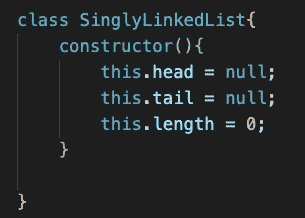

# JavaScript 中的链表实现

> 原文：<https://javascript.plainenglish.io/linked-list-implementation-in-javascript-ca0d3038f797?source=collection_archive---------2----------------------->

作为我在 Udemy 上的柯尔特·斯蒂尔数据结构和算法大师课的继续，我们将回顾的第一个数据结构是链表。我将讲述链表的实现以及如何用 JavaScript 实现反向链表。

Image from Colt Steele’s JS Data Structures and Algo course on Udemy.

在一些编程语言中，提供了本地数据结构，但是在 JavaScript 中，我们将不得不创建一个具有特定属性的类来使用这些数据结构。现在你应该知道，类可以被认为是蓝图，无论何时我们想要使用一个数据结构，我们都可以创建这些蓝图的实例，它们继承了上述类的属性。

一、什么是链表？链表是节点的集合，每个链表都有一个**头、**和**尾**属性。每个节点将有一个值和一个指向下一个节点的*指针*，如果当前节点是结尾，则为空。链表的一些特殊特征是它们是**而不是**索引的(不像数组从 0 到 n-1 索引，n 是数组的长度)，不允许随机访问，节点由前面提到的 **next** 指针连接。我说的随机访问是指我们可以通过索引访问列表中的任何元素，在链表中，我们只能通过那个 **next** 指针从头到尾遍历。

Example of a linked list from Visualgo

如果你想玩玩上面的[例子](https://visualgo.net/en/list)，请访问 Visualgo.net，他们有各种算法和数据结构的可视化工具。

# 链表的 JavaScript 实现

首先，我们创建一个节点类，只有两个属性一个值，和一个 **next** 指针。

使用这个节点类和一些逻辑，我们可以用下面的方法实现一个单链表类:

The initial properties of a SLL are a head, a tail, and list length.

1.  push:添加到列表的尾部

.push() method

2.pop:从列表的尾部移除

.pop() method

3.shift:从列表的顶部删除

.shift() method

4.unshift:在列表的开头插入一个节点

.shift(value) method

5.get:检索给定索引处的值

.get(index) method

6.set:给定一个索引和值，将更新该节点的值

.set(index, value) method

7.插入:接受一个索引和值，**插入**一个新节点

.insert( index, value) method

8.移除，接受索引移除该索引处的节点

.remove(index) method

根据您可能需要的功能，上面的一些方法对于您的单链表类可能不是必需的。一旦你有了这些基本的方法，你就可以创建、读取、更新和删除链表上的节点。请注意我们如何在每个方法的逻辑中使用 next 指针的基本功能。这可能是这门课我最喜欢的部分之一，使用一些逻辑，仅仅一个指针，我们就可以创建一个我们需要的数据结构。当我第一次遇到它的时候，我可以跑题说一下这个对我来说是多么令人兴奋，但是我会把它留到下一次。

# 链表的 BigO

*   插入:O(1)
*   Removal: O(1)或 O(n) // removal vs .在列表内
*   搜索:O(n)
*   访问:O(n)

# 链表与数组

我们要讨论的一件事是数组和链表的相似性。你什么时候在数组上使用链表？当经常需要在集合的开头插入和删除时，它们是很好的选择。要在数组的开头使用 insert 或 delete 元素，由于数组自然保留的元素索引，长度为 n 的整个数组必须重新排序。当从集合末尾插入或删除时，数组和链表的行为类似。链表也是其他数据结构的基础，比如堆栈和队列，这些将在以后的文章中讨论。

# 反向链表

现在，链表中最常见的编码问题之一是反转链表。这很好地检验了一个人的逻辑思维能力，以及识别他们使用数据结构的舒适度，因为链表是我们将会遇到的更简单的链表之一。如果你想自己尝试解决这个问题，这里有一些伪代码:

*   交换当前列表的头部和尾部
*   创建 2 个新变量，previous 和 next
*   创建第三个变量节点，并将其设置为初始 head 属性

在列表中循环:

*   设置 be 旁边的变量。节点的下一个属性
*   设置。节点上的下一个属性是上一个变量的内容
*   将变量 previous 设置为节点变量的值
*   将节点变量设置为下一个变量的值

您的代码应该如下所示:

.reverse() method of a singly linked list

*更多内容看* [***说白了. io***](http://plainenglish.io/)