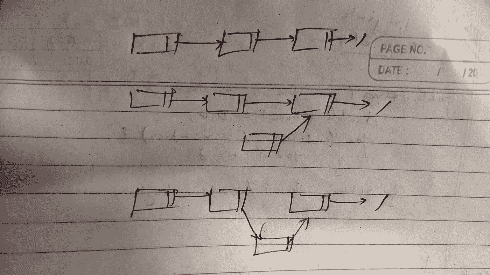

# 用 JavaScript 实现链表的基础

> 原文：<https://javascript.plainenglish.io/linked-list-the-basics-with-javascript-pt-1-60404df9ed?source=collection_archive---------16----------------------->

## 第 1 部分


Photo by [Kelly Sikkema](https://unsplash.com/@kellysikkema?utm_source=medium&utm_medium=referral) on [Unsplash](https://unsplash.com?utm_source=medium&utm_medium=referral)

想象一个暴徒袭击。想象一下，一个颤抖的小家伙向教父寻求帮助。想象一下，教父向军师下命令，他向他的助手下达指令。助手走向他的伙伴，递给他一把枪，伙伴找到了那个人，并把他变成了零。那是一个链表。每个节点都有两个属性:数据和对下一个节点的引用。

在链表中搜索需要花费很长时间，因为您必须遍历整个列表才能找到一个节点，如果您要查找的节点是第一个节点，这可能很好，但是想象一下查找 1，000，000，000 个节点。

插入和删除列表相对容易，因为您需要做的只是改变它的参考点，但是读取一个节点需要的时间和该节点的编号从 0 开始一样多。这与数组是一致的，因为从数组中获取数据非常简单。您提到了索引和 boom，您就说到点子上了，但是插入和删除对计算机来说需要“永远”的时间，因为您必须将新的更短/更大的数组移动到新的内存位置。

JavaScript 中的链表实际上只是以键值对的形式存在于彼此内部的对象，这并不理想，但是我现在已经习惯了 JavaScript，所以我把它们放在一起。当我对 Java 更熟悉时，我也会为它编写一篇文章。

我可以继续谈论这个理论，但这是我喜欢学习的方式。我继续在黑客银行或类似的网站上解决一些简单的问题。像那样的学习对我来说通常会更深入。

对于链表的任何理论，访问[维基百科页面](https://en.wikipedia.org/wiki/Linked_list)。

我不会每次都重写这段代码，所以节点和链接列表类就在这里。

```
class Node {
   constructor(data, next) {
      this.data = data;
      this.next = null;
    }
 };

 class SinglyLinkedList {
    constructor() {
       this.head = null;
       this.tail = null;
    }
 };
```

我将把链表作为函数参数的头。

所以首先，让我们从基础开始，让我们尝试**在链表**的开始插入一个节点。

逻辑是这样的:

1.创建新节点

2.如果链表中没有节点，那么我们想要的节点就成为头

3.否则，我们初始化的节点引用头部，实际上成为链表的头部

```
const insertNodeAtHead => (head, data) = { let newNode = new Node(data); if (head == null) { return newNode; } newNode.next = head; return newNode;}
```

太好了。既然我们已经知道了如何添加链表，让我们看看如何**打印链表**，然后再尝试更多的操作。

1.打印节点的数据

2.移动到下一个节点

3.这样做，直到头部为空(这将带我们从列表的开始到结束)

```
const printLinkedList = (head) => { while (head != null) { console.log(head.data); head = head.next; }}
```

好的，接下来，让我们尝试**在链表的尾部插入一个节点**。

1.创建新节点

2.如果没有头节点，则分配新节点作为头并返回

3.接下来，让我们指定一个临时变量“current”作为头

4.继续将下一个节点分配给当前节点，直到当前节点的下一个为空(这将把我们带到链表的末尾)

5.现在我们在最后一个节点，分配新节点作为当前的下一个节点

6.返回链表

```
const insertNodeAtTail = (head, data) => { let newNode = new Node(data); if (!head) { head = newNode; return head; } let current = head; while (current.next) { current = current.next; } current.next = newNode; return head;}
```

在我们继续删除一些节点之前，让我们再做一次插入。让**插入到一个特定的位置**。该函数有链表头、要输入的数据和节点要插入的位置等参数。

1.声明一个新节点

2.声明一个变量 currentPosition = 1

3.将压头分配给临时可变电流

4.如果位置在 0，那么新节点的下一个引用将在头部，我们从新节点返回链表

5.否则，我们使用 position 作为固定点，curentPosition 作为移动点，将链表移动到位置之前的节点

6.在那里，我们添加新节点的下一个引用到位置

7.我们将当前位置节点的下一个引用更改为新节点

8.返回链表

这是我画的一张图，为了在脑子里解决这个问题…



```
 const insertNodeAtPosition = (head, data, position) => { let newNode = new Node(data); let current = head; let currentPosition = 1; if (position == 0) { newNode.next = head; return newNode; } while (currentPosition < position) { current = current.next; currentPosition++; } newNode.next = current.next; current.next = newNode; return head;}
```

酷毙了。最后，让我们试着**从链表**中删除一个节点。

JavaScript 有一个垃圾清除系统，就像大多数城市一样。你把它排除在外，不知何故它就消失了。所以我们真正需要做的就是删除对一个节点的下一个引用，它就会消失。

1.将 head 赋给一个名为 node 的变量

2.如果位置是 0，那么我们要删除第一个并返回其余的

3.让我们创建一个变量 currentPosition，并将其初始化为 1(以反映列表的第一个位置)

4.为了到达我们想要删除的节点之前的节点，我们将把下一个节点分配给当前节点，并增加 currentPosition，直到它比位置小 1

5.现在我们在需要删除的节点之前，我们把它分配到下一个节点之后。就像我们跳过想要删除的节点，并移除对它的引用。

6.返回链表

```
const deleteNode(head, position) { let node = head; let currentPosition = 1; if (position == 0) { return node.next; } while (currentPosition < position) { node = node.next; currentPosition++; } node.next = node.next.next; return head;}
```

还有几个问题我想解决，但我会把它分成两个帖子，这样更具可读性。所以，去喝杯水，看看第二部分。

*更多内容尽在*[***plain English . io***](http://plainenglish.io/)