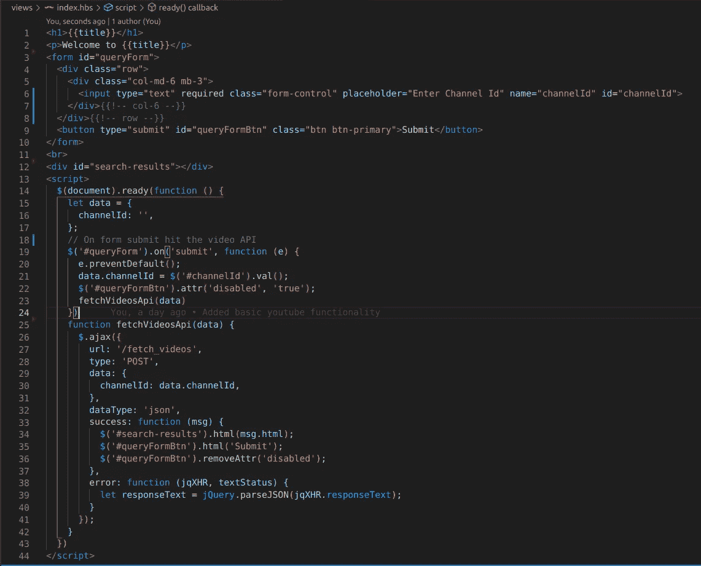

# 如何使用 Node.js 嵌入 YouTube 频道视频

> 原文：<https://javascript.plainenglish.io/listing-videos-of-a-channel-with-the-youtube-api-node-js-a7215df8db2d?source=collection_archive---------3----------------------->

YouTube 为人们提供了一种简单的在线存储视频并与他人分享的方式。这些视频很容易通过其他形式的社交媒体、电子邮件和网站分享，也可以嵌入到其他网站中。

人们可以嵌入视频或链接它。两者的区别在于，嵌入式视频允许你从另一个平台借用视频。相比之下，链接视频共享视频的 URL。当读者点击该链接时，他们会被重定向到托管该视频的页面。如果你想在网站上包含视频，**更好的选择是嵌入视频**。

在本教程中，我们将学习如何使用 YouTube 频道 API，并使用 Node.js 嵌入特定频道的视频，您可以在此测试项目。


Youtube API implementation using Node.js

您也可以从这里获得完整的源代码:

[](https://github.com/shraddha-paghdar/embed-youtube-video-nodejs) [## shraddha-paghdar/embed-YouTube-video-nodejs

github.com](https://github.com/shraddha-paghdar/embed-youtube-video-nodejs) 

为了不浪费更多的时间，让我们分成三个步骤，

1.  创建一个 google cloud 项目并生成一个 YouTube API 密钥。
2.  获取 YouTube 频道 Id。
3.  使用 YouTube API 并从中获取视频。

## 第一步。生成 YouTube API 密钥

1.  转到[https://console.cloud.google.com/](https://console.cloud.google.com/)
2.  如果您没有帐户，请创建一个帐户。谷歌给任何服务 300 美元的免费积分作为免费试用。
3.  在搜索栏中键入“YouTube 数据 API v3”。
4.  单击启用选项。这将为特定项目启用 YouTube 数据 API，该项目的默认配额分配为每天 10，000 个单位。你可以在这里了解更多关于配额[的信息。](https://developers.google.com/youtube/v3/getting-started)


YouTube API key enabling

5.点击凭证->创建凭证-> API 密钥。复制此 API 密钥供以后使用。


YouTube API Key

# 第二步。YouTube 频道 ID

1.  去 Youtube &点击任何视频。https://www.youtube.com/watch?v=uzkD5SeuwzM
2.  点击频道名称，它将重定向到频道页面，例如[https://www.youtube.com/channel/UCsXVk37bltHxD1rDPwtNM8Q](https://www.youtube.com/channel/UCsXVk37bltHxD1rDPwtNM8Q)


3.从由字母数字代码组成的 URL 中复制频道 id，“[ucsxvk 37 blth xd 1 rdpwtnm 8 q](https://www.youtube.com/channel/UCsXVk37bltHxD1rDPwtNM8Q)”。保留此频道代码，以后会用到它。

# 第三步。设置节点项目

**1。安装 Axios 向 YouTube 发出 HTTP 请求获取视频**

```
npm i axios
```

**2。编写一个从 YouTube 获取视频的函数**

```
const fetchVideos = async (queryObject) => {
 const options = {
  method: 'GET',
  url: `https://youtube.googleapis.com/youtube/v3/search? part=snippet&maxResults=50&id=${queryObject.channelId}&key=YOUR_API_KEY`
  };
 const result = await axios(options)
 return result.data
}
```

I .`part`参数指定 API 响应将包括的一个或多个`channel`资源属性的逗号分隔列表。

二。`maxResults`参数指定结果集中应该返回的最大项数。可接受的值是从`0`到`50`，包含在内。默认值为`5`。

三。`id` 参数为正在检索的资源指定一个逗号分隔的 YouTube 频道 ID 列表。

四。`key`参数指定了我们已经生成的 Google key，它将验证您的 API 调用。

**3。调用获取视频功能**

一旦用户输入频道 Id 并点击提交按钮，调用获取视频功能。这将返回通道对象。点击了解更多关于通道对象及其参数[的信息。](https://developers.google.com/youtube/v3/docs/channels/list)

```
router.post('/fetch_videos', async (req, res) => {
 try {
  const fetchedVideos = await fetchVideos(req.body) const searchTemp =
hbs.handlebars.compile(fs.readFileSync('views/searchResults.hbs').toString('utf-8')) const html = searchTemp({ message: fetchedVideos.items })
  res.send({
   html,
  })
 } catch (err) {
    console.log(err);
 }
})
```

**4。搜索结果文件内容**

一旦从 API 中获取视频，这将动态添加视频卡。

```
{{#if result}}
 <div class="row">
 {{#each result}}
  <div class="col-md-4 card mb-2 ml-1">
   <iframe class="card-img-top"  src="https://www.youtube.com/embed/{{id.videoId}}" frameborder="0"
 allowfullscreen></iframe>
   <div class="card-body">
   <h5 class="card-title">{{snippet.title}}</h5>
   <p class="card-text">{{snippet.description}}</p>
   </div>
  </div>
 {{/each}}
 </div>
{{/if}}
```

**5。Index.hbs 文件**

现在我们将创建前端表单，用户可以在其中输入通道 Id 并获得结果。



Index.js file

一旦用户输入频道 id，点击提交按钮并获取结果。并将 HTML 内容添加到搜索 div 标记中，而不刷新页面。您应该能够看到特定频道的视频。

就是这样，你可以使用这个简单的 API 将 YouTube 视频嵌入到任何项目中。

***感谢阅读。最初发表于 2021 年 9 月 1 日***[***https://noob 2 geek . in***](https://noob2geek.in/2021/09/01/listing-videos-of-a-channel-with-the-youtube-api-node-js/)***。***

*更多内容请看*[***plain English . io***](http://plainenglish.io)