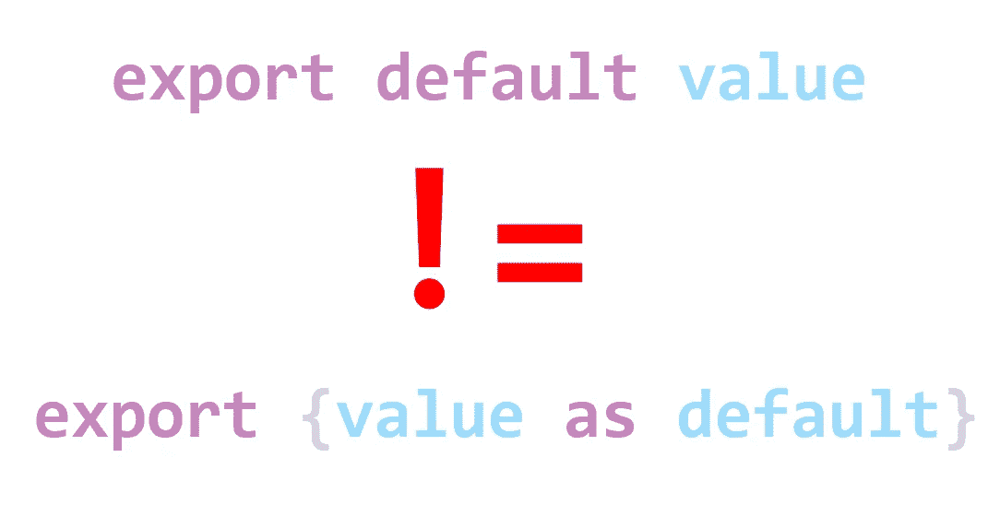

# 动态绑定-导出默认值和导出为默认值之间的区别

> 原文：<https://javascript.plainenglish.io/live-bindings-difference-between-export-default-and-export-as-default-4541c354cdaa?source=collection_archive---------4----------------------->

JavaScript 模块将值导出为动态绑定，除了使用`export default`。



# 什么是实时绑定

JavaScript 模块将值导出为动态绑定。术语*动态绑定*表示对存储导出值的内存位置的引用。换句话说，导出的值通过引用导入它的模块来传递。除了在动态绑定中，变量在 JavaScript 中从不通过引用传递。

# 活动绑定的属性

我使用两个简单的模块来演示动态绑定的属性。

子模块 *child.js* 将`variable`导出为其默认导出:

```
// child.js
let variable = "value";
export { variable as default };
```

父模块`parent.js`导入`variable`并试图赋予它一个新值:

```
// parent.js
import variable from './child.js';
variable="test"; // produces error: Assignment to constant variable.
```

当父模块导入由`child.js`导出的`variable`时，在父模块范围内创建一个常量`variable`。试图给`variable`赋值会产生错误:*给常量变量赋值。*因此，子模块导出的变量在父模块中变成了常量。

与父模块不同，子模块可以更改变量值，即使是在导出之后。当子模块修改导出的变量时，导入的值(父模块中常量的值)也会改变。为了说明这种现象，我不得不使用更复杂的模块。新版本的 *child.js* 增加了异步任务的调度，改变了`variable`的值。

```
// child.js
let variable = "value";
setTimeout(() => variable = "new value");
export { variable as default };
```

父模块打印导入的`variable`的值，并安排任务再次打印值`variable`。由于子进程首先调度任务([更多关于模块执行顺序](https://marian-caikovski.medium.com/execution-order-of-javascript-modules-ddaca4561220)，父进程调度的任务肯定会在`variable`改变后执行。

```
// parent.js
import variable from './child.js';console.log(variable); // prints value 
setTimeout(()=>console.log(variable)); prints new value
```

父级打印出相同的看似常量`variable`的两个不同值——首先是初始*值*，然后是更新的*新值*。

# 默认导出语法-导出变量的两种方法

可以使用以下两种语句之一将变量导出为默认导出:

```
export default variable;
```

或者

```
export { variable as default };
```

第一个语句显然更短。那么，为什么我必须使用更麻烦的默认导出语句来演示实时绑定呢？

# 导出默认值和导出为默认值之间的区别

`export default variable`和`export { variable as default }`产生的活绑定是不等价的。为了说明区别，我在 *child.js:* 中用更短的`export default variable`替换了`export { variable as default }`

```
// child.js
let variable = "value";
setTimeout(() => variable = "new value");
export default variable;
```

现在父模块看不到子模块修改了导出的`variable.`，它打印两倍于导入的`variable`的初始*值*:

```
// parent.js
import variable from './child.js';console.log(variable); // prints value
setTimeout(()=>console.log(variable)); // still prints value
```

使用更简洁的语法`export default variable`，似乎无法创建动态绑定，或者无法像预期的那样工作。导入的`variable`现在表现为一个实常量。

这是两种默认导出语法的主要区别。`export { variable as default }`将引用导出到导出的`variable`，而对于`export default variable`，导入模块不接收对导出的`variable`的引用。

# 为什么语句 export default variable 不导出到变量的活动绑定

首先，一点术语。一个*文字*是代表一个值的源代码。Literal 不是变量，它是赋给变量的。

语句`export default`用于文字和匿名声明的导出。例如，导出匿名函数的模块:

```
export default value => console.log(value);
```

或者导出字符串文字的模块:

```
export default "value";
```

JavaScript 引擎如何将活动绑定导出到文字？它将文本赋给一个辅助变量，并创建一个到自动创建的变量的活动绑定。基本上，代码行`export default value”;`被转换成如下代码:

```
const automaticallyCreatedVariable="value";
export {automaticallyCreatedVariable as default};
```

JavaScript 代码无法访问合成变量`automaticallyCreatedVariable`。

当`export default`用于导出变量时，情况完全相同。它的值被复制到另一个辅助变量中，对该变量的引用被公开为一个活动绑定。

# Rollup bundler 如何复制默认导出的实时绑定

在某些应用程序中，捆绑模块是有意义的。Rollup 是一个易于定制的用户友好的 JavaScript 模块捆绑包。

Rollup 将上面的例子和`export { variable as default }`组合成一个包，它复制了动态绑定的属性:

```
let variable = "value";
setTimeout(() => variable = "new value");console.log(variable); // prints value
setTimeout(()=>console.log(variable)); // prints new value
```

带有`export default variable`的示例，其中活动绑定似乎不起作用，被组合在一个捆绑包中，该捆绑包也使用上述机制复制结果:

```
let variable = "value";
setTimeout(() => variable = "new value");
var variable$1 = variable; // synthetic variable$1 is createdconsole.log(variable$1); // parent does not receive variable
setTimeout(()=>console.log(variable$1));
```

完整的示例代码可以从[https://github.com/marianc000/liveBindings](https://github.com/marianc000/liveBindings)下载并在浏览器中执行。

*更多内容参见* [*简单英语*](http://plainenglish.io/)