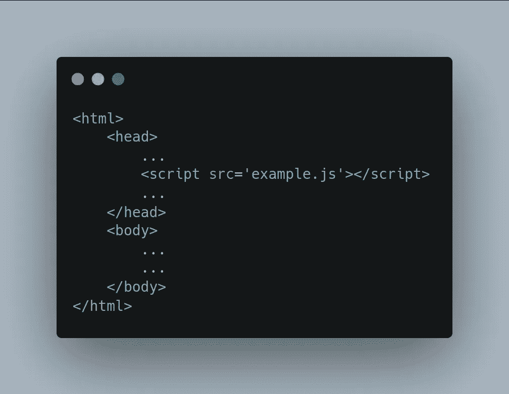
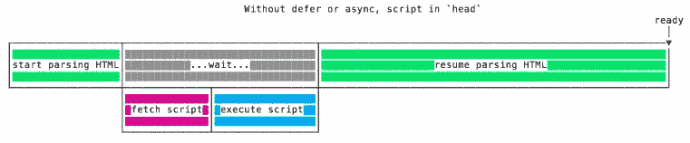
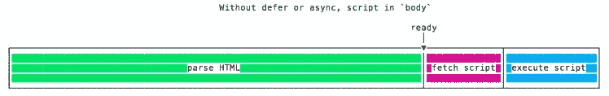
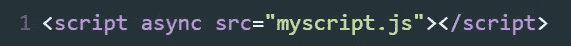
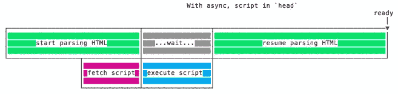
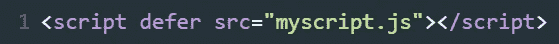
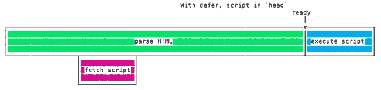
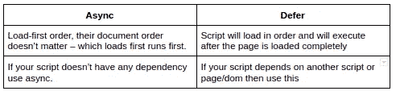

# 使用“异步”和“延迟”有效加载脚本

> 原文：<https://javascript.plainenglish.io/load-script-efficiently-using-async-and-defer-f05dfe46dfc5?source=collection_archive---------6----------------------->

在现代网站中，一些脚本通常比 HTML“更重”:它们的下载和执行时间更长。

在 HTML 页面上加载脚本时，我们需要小心不要损害页面的加载性能。

脚本通常以这种方式加载到页面中:



script in ‘head’ tag

web 浏览器开始解析 HTML，当它遇到`<script>….</script>`标记时会暂停，HTML 的解析被阻止，现在它必须下载并执行脚本，只有这样它才能解析页面的其余部分。

这很糟糕，因为如果脚本的加载时间比预期的长一点，访问者可能会看到一个空白页，这不是一个好的用户体验



一个非常常见的解决方案是将脚本放在页面底部，就在关闭



对于那些不支持我们最近的两个 HTML5 特性的老浏览器来说，这是你能做的最好的事情: **async** 和 **defer。**

# **如何使用‘async’属性？**



使用`async`属性，脚本被异步获取，当它准备好时，HTML 解析被暂停以执行脚本。一旦脚本执行完毕，HTML 解析就会继续。



# 如何使用“延期”属性？



使用`defer`属性，脚本被异步获取，但只在 HTML 解析完成后执行。

简单来说，下载的脚本只有在浏览器完成 HTML 解析后才会执行。



# **总结:**

`async`和`defer`都不会阻止页面渲染，但是`async`会阻止页面的解析，而`defer`不会。

它们之间还有以下本质区别:



现在我们知道了如何使用这些属性，我们可以把我们的脚本标签放在 **head** 标签中，这将允许您的脚本被尽快下载，而不会阻塞您的页面呈现。如果您不使用这些关键字，请确保将其放在< /body >标签的结束之前。这将确保 HTML 解析器不会被脚本阻塞。

```
Note:- async and defer only works for external scripts
```

*更多内容请看*[***plain English . io***](http://plainenglish.io/)*。报名参加我们的* [***免费周报***](http://newsletter.plainenglish.io/) *。在我们的* [***社区***](https://discord.gg/GtDtUAvyhW) *获得独家获得写作机会和建议。*