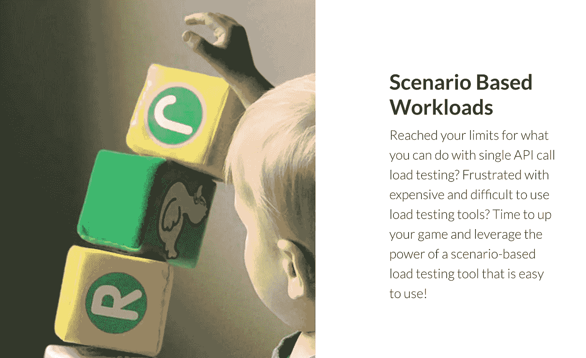
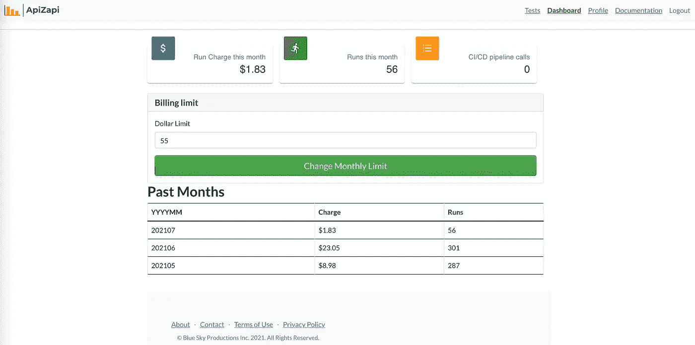
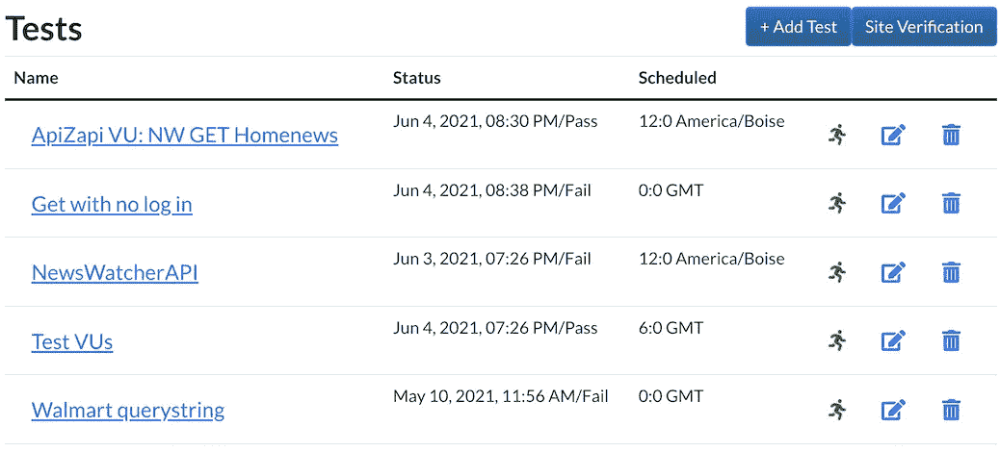
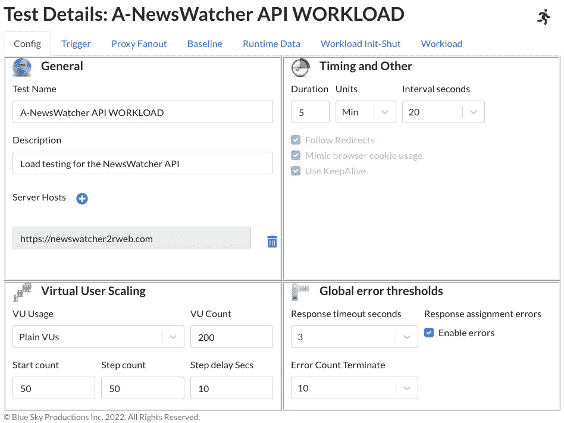
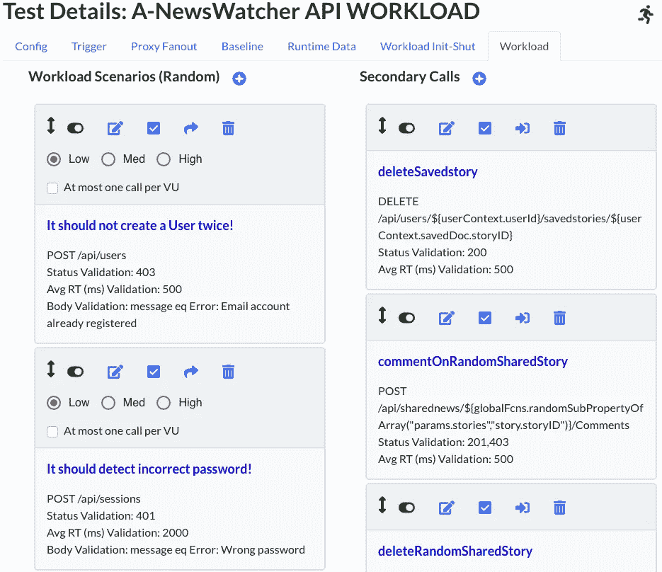
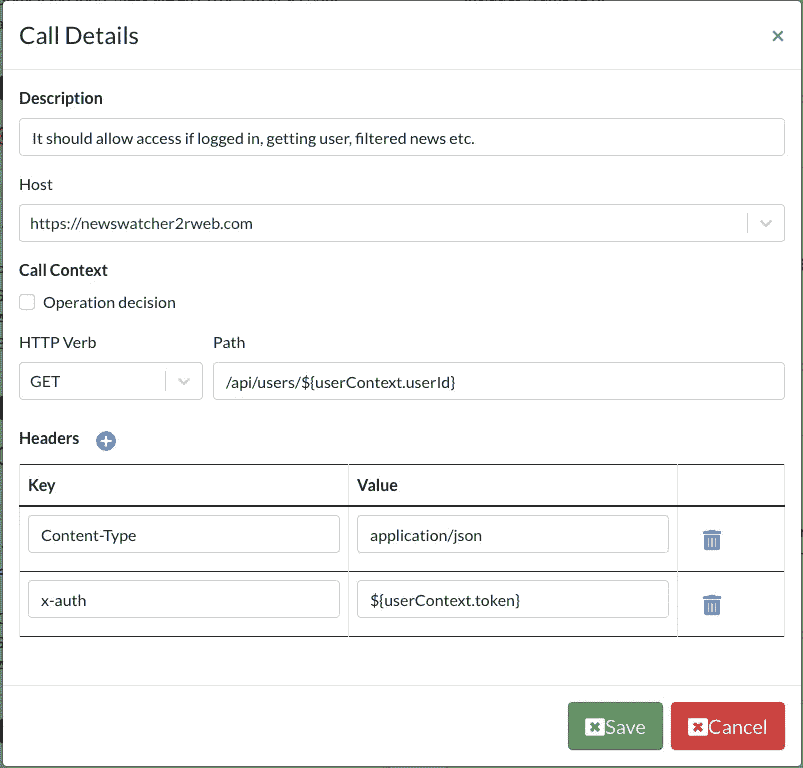
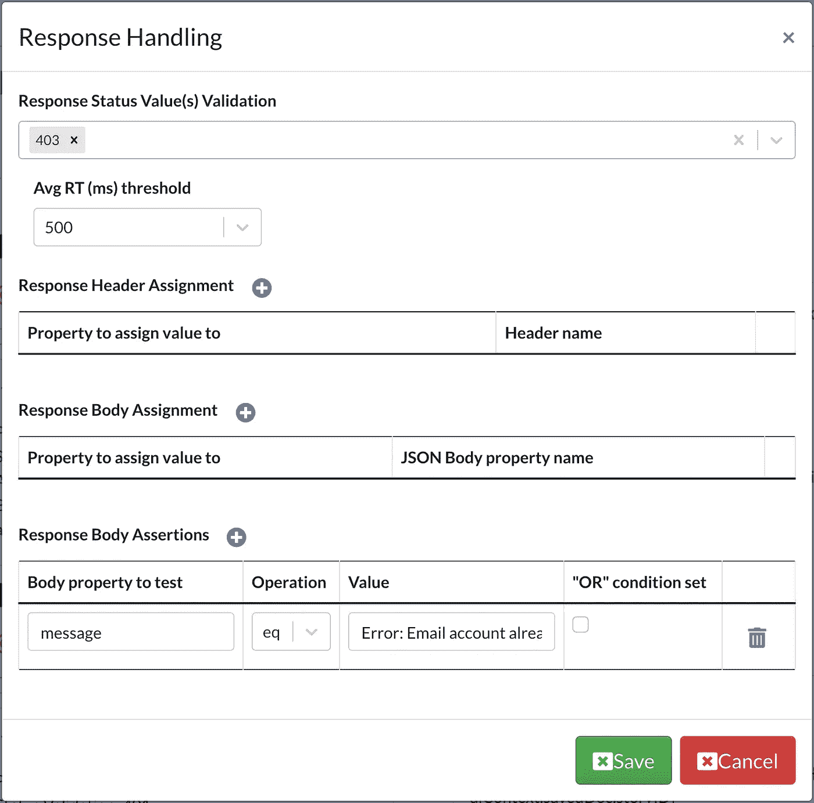
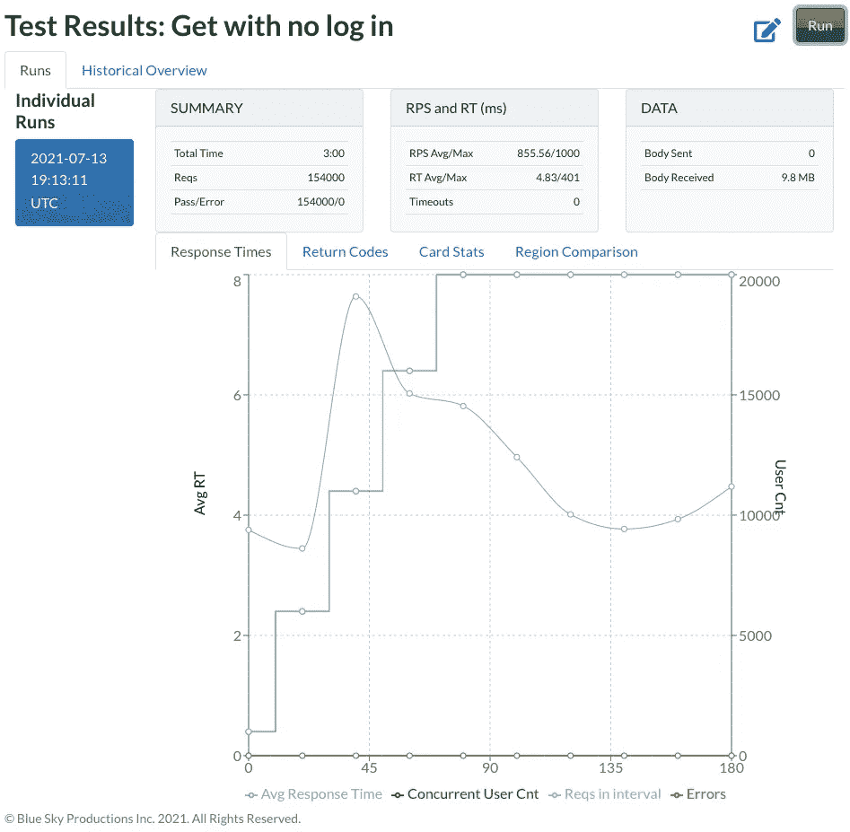
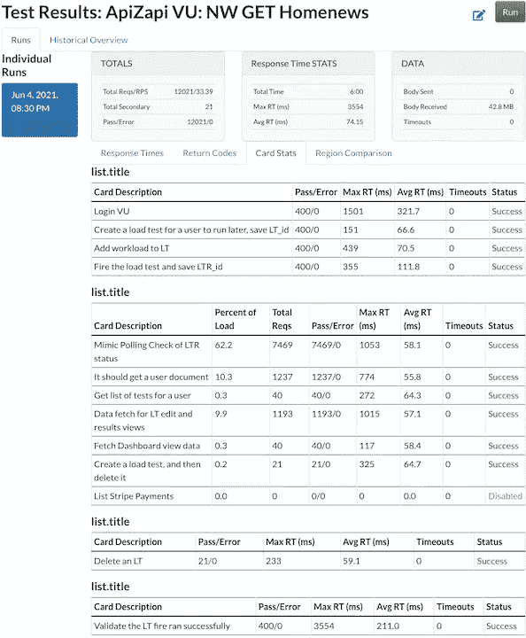
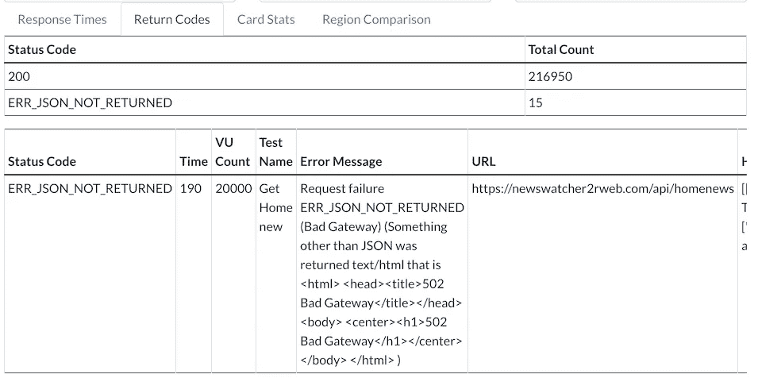

# 用 ApiZapi 负载测试 HTTP APIs

> 原文：<https://javascript.plainenglish.io/load-testing-http-apis-with-apizapi-3e2ac01ea5c8?source=collection_archive---------17----------------------->

Image courtesy of Ryan Fields, on Unsplash [https://unsplash.com/photos/Xz7MMD5tZwA](https://unsplash.com/photos/Xz7MMD5tZwA)

ApiZapi 概述，这是一个新的 HTTP API 负载测试 SaaS 应用程序，用于在不断增加的虚拟用户负载下运行基于场景的测试。

*注意:我是* [*ApiZapi*](https://apizapi.com) *负载测试工具的创建者和开发者，我写这篇文章是为了向其他人介绍该工具的一般功能。*

# 概观

ApiZapi 是一个云托管的服务，允许您在 HTTP API 端点上执行基于场景的测试，并通过模拟成千上万的用户交互来增加负载。该工具将涵盖直接负载测试、峰值和断点测试。使用该应用程序，您可以指定一系列 HTTP 调用，这些调用代表了您希望发送到 API 端点的交互的真实使用情况。我们的目标是模拟用户的真实交互，并同时与多个虚拟用户(vu)大规模运行这些交互。结果是您将基础设施置于现实的负载之下。这些交互构成了工作负载。您还可以配置初始化和关闭序列。作为初始化序列的一部分，您可以调用创建帐户和/或登录将在工作负荷运行期间使用的帐户。

ApiZapi 可用于发现单点故障和瓶颈。最好将它与您的日志记录基础设施和其他应用程序性能管理工具结合使用，以进一步诊断负载测试中的问题。然后由您来改变您的架构，调整您的主机来处理您的理想正常负载，并测试您是否也可以处理可能的峰值负载使用。随着客户使用流量的增加，您希望走在客户使用流量的前面，并知道自己的极限是什么。测试可以手动运行，也可以每天触发。测试也可以通过 HTTP POST 调用作为 CI/CD 管道的一部分启动。Webhook 用于将完成状态接收回您的 CI/CD 环境。

# 入门指南

注册非常容易，只需输入电子邮件和密码(在测试期结束前需要一个加入代码)，你就可以使用一个免费版本，它具有大多数相同的功能，但有一些限制。

要享受全部功能，您需要转到个人资料页面并切换计划。您将不会被收取任何月费，您只需支付当月所有测试运行的使用秒数。例如，如果你一整个月都没有运行任何测试，那么这个月是不收费的。

您可以查看一个仪表板视图，其中显示了本月的最新费用以及过去几个月的视图。您也可以在这里输入金额来设置收费限额。如果你达到了这个限额，你将不能再运行那个月的任何测试，除非你增加你的花费限额。

Dashboard view (All screen shots from apizapi.com)

# 网站访问的验证

一旦您创建了一个测试，您可以点击编辑它，然后最终运行它。如果您将它设置为在多达二十个虚拟用户(vu)的情况下运行，这是正确的。对于 VU 计数大于 20，这是需要你证明你有访问测试您的网站。为了防止 ApiZapi 被用作 DDoS 攻击平台，我们要求您提供一个特殊的 DNS TXT 条目，以证明您有权在您的 api 端点上执行负载测试。或者，您可以提供一个文件供 ApiZapi 访问。该文件将是一个 JSON 文件，其中包含一个特定的 id。点击**现场验证**按钮，了解如何完成此操作的详细信息。

注意:*值得一提的是，您可以使用 ApiZapi 来测试运行在本地机器上的 api 端点。这很容易做到。简单地输入要连接的 IP 地址和端口，例如“http://42.27.0.33:3000”。用***看看你的 IP 地址是什么。然后，您可以在本地机器上运行您的服务，比如 Node.js Express services，并开始与它进行交互。您很可能在您的实际机器前面有一个防火墙或某种类型的路由器。例如，使用家用路由器，您可以设置从实际的外部 IP 地址到实际的内部机器 IP 地址和端口的端口转发。如果将 VUs 设置为大于 20，还必须提供要访问的 apizapiverify.json 文件。你可以先用浏览器测试一下能不能拿到文件。**

# *查看负载测试*

*您可以看到一个测试列表，其中包含每个测试的一些高级细节。每一测试行的末尾都有图标操作，您可以单击这些图标操作。从现有测试列表中，您可以单击一个测试来导航到运行页面，或者导航到编辑页面。*

**

*Test list view*

# *负载测试编辑*

*您将点击 **Add Test** 来创建一个新的负载测试。从这里开始，UI 中有许多选项卡，您可以填写这些选项卡来指定应该发生什么。**配置**是对你将要点击的服务器主机的主设置，运行时间间隔和缩放数字。**触发器**用于设置循环运行以及设置 Webhooks 进入和退出，用于外部触发或接收运行完成的通知。**代理扇出**用于设置 AWS 区域的使用，呼叫将通过这些区域路由，以便能够模拟来自世界各地的流量。**运行时数据**是您设置内部变量的地方，既可以跨所有 VU 使用，也可以针对每个 VU 使用。最后两个选项卡用于添加实际的工作负载 HTTP 调用。*

**

# *HTTP 呼叫*

*通话可以作为一张“卡片”放入几个列表中。对于需要在主工作负载卡列表之前和之后发生的调用，有初始化和关闭列表。每张卡代表一个单独的 HTTP 呼叫。对于每张卡，您指定呼叫和预期结果。*

***工作负荷初始化-关闭**卡按顺序运行。当 vu(虚拟用户)因为步数缩放而开始行动时，每个人都将独自完成他们的序列。工作负载初始化卡在 VU 扩展引入它们时运行。例如，最初可能有 20 个 vu，所有的 vu 都做第一张卡，然后在另一个步骤间隔，另一组 20 个 vu 做它们的 init 步骤。这些按顺序运行，每个 VU 仅运行一次。*

*卡的**工作负荷**序列将在初始化序列完成后运行。工作负载卡是随机运行的，不像初始化和关闭顺序卡那样按顺序运行。你仍然可以拖动卡片，但是，这只是为了方便你。对于给定的间隔触发，每个虚拟用户将有一张随机选择的卡，用于将要进行的 HTTP 调用。*

*您可以使用每个卡上的切换控件来启用和禁用各个卡。还有一组标有**低**、**中、**和**高**的单选按钮。这将为每个设置权重，以确定每个调用的频率。工作量卡之后还可以是需要按顺序进行的二次呼叫，这些可以在**二次呼叫**列表中找到。*

**

*用于工作卡使用的**呼叫详细信息**对话框相当简单。您为所选的主机设置想要访问的路径。可以设置头值，包括 cookies 等。如果动词是 POST，那么您还可以为该调用指定一个 JSON 主体。使用${globalContext 引入变量有一个特殊的语法。？？？}和${userContext。？？？}.这些值要么是预先在 UI 中设置的，要么是在每次调用的结果处理中保存的。每个虚拟用户都有自己的上下文，以及变量的全局共享上下文。这里看到的用户上下文变量的一个例子是令牌。这表示一个 JWT 令牌，该令牌是从先前的卡调用中设置的，该卡调用某个授权路由，该授权路由返回 JWT。响应中返回的 Cookies 会被保留下来，并在后续调用中重用，就像浏览器交互一样。还有一种方法可以提取 cookie 的值并重用它。*

**

*如果您将 **HTTP 动词**更改为 POST 或 PUT，您可以添加一个要作为请求的一部分发送的主体。可以发送 JSON，Text，x-www-form-urlencoded，form-data 等。这意味着您也可以通过发送文件。您还可以从响应中收集数据，并将其保存在用户或全局上下文中，然后以 JSON、text、HTML 或 XML 的形式发送回来。*

*在**响应处理**对话框中，您可以获取标题或正文响应值，并将它们保存到全局和用户上下文中。您还可以对身体、响应状态和平均时间进行测试。*

**

# *结果视图*

*可以查看给定运行的结果，以准确理解负载结果，并确定结果和成功。*

**

*您可以查看**卡统计**选项卡，了解有关如何执行单个呼叫的具体细节。“状态”列给出了给定卡的总体信息，以确定它是否符合您的预期。如果超过了平均响应时间阈值，或者在处理返回时出现任何错误(如意外的状态代码)，它将处于失败状态。*

**

*您可以查看**返回代码**选项卡，了解关于故障的具体细节。这些可能是失败，因为返回的代码不是您所期望的。这为您提供了错误发生的时间、当时的虚拟用户数以及其他有助于您解决问题的详细信息。您可以在图中看到，这个特定的错误是服务器返回“错误网关”，并且只在虚拟用户数达到 20K 时发生。*

**

# *结论*

*在这篇短文中，还有更多的内容需要讨论。希望你现在对基本原理有了很好的理解。如果您有更多的时间，并且想要更深入地了解这些功能和一些用例，请访问[用户文档](https://www.apizapi.com/#/userdoc)。*

**更多内容尽在*[***plain English . io***](http://plainenglish.io/)*