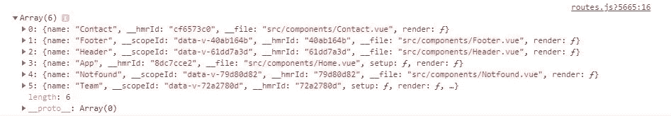

# 在 Vue 3 中自动加载路线

> 原文：<https://javascript.plainenglish.io/loading-routes-automatically-in-vue-3-405b2b81d00?source=collection_archive---------8----------------------->

## 在 Vue 3 中自动加载路线


Photo by [ThisisEngineering RAEng](https://unsplash.com/@thisisengineering?utm_source=medium&utm_medium=referral) on [Unsplash](https://unsplash.com?utm_source=medium&utm_medium=referral)

在本文中，我们将学习如何在 Vue 3 中自动加载路线。

我们将从头开始设置一个 Vue 3 应用程序，看看我们如何从一个特定的文件夹中自动加载路线。

**先决条件**

*   安装 Node.js
*   @vue/cli

**创建一个 Vue 3 应用**

我们需要用 Vue-CLI 创建一个新的 Vue 项目，因此打开您的终端并运行以下命令

**Npm**

```
npm i -g @vue/cli
```

**纱线**

```
yarn global add @vue/cli
```

要在默认设置上创建 Vue 3 应用程序，请选择默认 Vue 3 预览。

vue cli 将提示一些问题，您必须使用 choose，您可以选择 vue-router 在我们的应用程序中安装最新的 vue-router 包，或者我们可以在此过程中稍后安装它。

Vue cli 将在 auto-routes 文件夹中为我们创建包含所有必需包的应用程序

**配置路线自动加载**

如果您在应用程序设置期间没有安装 vue 路由器，请运行以下命令来安装 vue 路由器包。

运行命令

```
npm install vue-router@next
```

该命令将安装最新的 vue 路由器包

现在让我们配置 vue 路由器

在 ***src*** 文件夹中创建一个名为 ***router.js*** 的文件

这个文件将包含我们应用程序的所有路由功能

```
*import* { createWebHistory, createRouter } *from* ‘vue-router’;const routes = [];const requireRoutes = require.context(‘./components’,true,/*^*(?!.*test).*\.vue*$*/is,);requireRoutes.keys().forEach((fileName) => {routes.push({…requireRoutes(fileName).default,});});console.log(routes)const router = createRouter({history: createWebHistory(),routes*// shorthand routes:routes*});*export* *default* router;
```

从 vue-router，我们将导入两个重要的功能。 ***创建网页历史*** 和 ***创建路由器。***

**创建路由器** —创建路由器

**createWebHistory** —将路由模式设置为历史。

现在我们将创建一个 routes const，这将是一个自动填充对象的数组

我们将有一个名为***require routes***的变量，它将接受一个 webpack 内置功能，允许我们传入一个目录进行搜索。我们稍后将使用 regex 搜索并返回任何带有。所提供目录中的 vue 扩展名。

搜索我们的文件

```
const requireRoutes = require.context(‘./components’,true,/*^*(?!.*test).*\.vue*$*/is,);
```

***require routes***将是一个对象，关键字是文件名，值是文件的 ID。

regex 代码将在 components 文件夹中搜索任何带有。vue 扩展名，只忽略测试文件。

为了确保组件自动加载，请在 components 文件夹或您选择的任何文件夹中创建它们。

将路线自动推送到路线数组

```
requireRoutes.keys().forEach((fileName) => {routes.push({…requireRoutes(fileName).default,});});
```

上面的代码将遍历这些文件，并将它们推入具有各种属性的路由中。

为了确保一切正常，我们可以尝试创建一些。组件文件夹中的 vue 文件。

然后我们可以

*在我的例子中，您可以看到所有的路由都被自动填充到 routes 数组中*

**

***待记***

*ü确保为您的组件提供一个名称，如下所示，否则将在没有名称的情况下填充路线。*

```
*<script>*export* *default* { name: “Footer”, }; </script>*
```

*现在任何带有。组件文件夹中的 vue 扩展将被填充到路由中。*

## *结论*

*简单回顾一下我们已经看到的:*

*   *从头开始创建 vue 应用程序*
*   *从头开始设置路由*
*   *从特定文件夹自动加载路线*

*谢谢你坚持到现在。我希望你已经学到了一些东西。如果你发现这篇文章有帮助，请考虑分享出来。*

***更多阅读***

*[](/handle-job-rejections-the-right-way-as-a-developer-99b5658d035b) [## 作为一名开发人员，以正确的方式处理工作拒绝

### 作为开发人员，面对工作拒绝的更好方式

javascript.plainenglish.io](/handle-job-rejections-the-right-way-as-a-developer-99b5658d035b)*