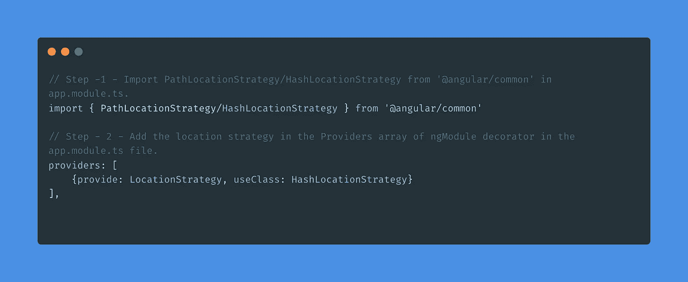

# 角度定位策略

> 原文：<https://javascript.plainenglish.io/location-strategies-in-angular-5c3443d462d3?source=collection_archive---------4----------------------->

Photo by [Kaleidico](https://unsplash.com/@kaleidico?utm_source=unsplash&utm_medium=referral&utm_content=creditCopyText) on [Unsplash](https://unsplash.com/?utm_source=unsplash&utm_medium=referral&utm_content=creditCopyText)

## 实例介绍角度应用中的定位策略

在了解 Angular 中的定位策略之前，我们先来熟悉一下 Angular 中的路由。让我们快速看一下 Angular 中的路由。

# 角度路由

路由是 Angular 用来管理 Angular 应用程序中的“路线”和“路径”的一种机制。这有助于在不同视图之间导航。单页应用程序不应该将 URL 发送到服务器并重新加载页面，每次用户请求新页面时，它只刷新页面的一部分并更新数据。Angular 通过两种方式实现这一点。这些被称为定位策略。位置策略定义了应该如何解析 URL/请求。它也决定了你的 URL 应该是什么样子。

angular 框架有一个“路由器模块”，帮助设计、开发和实现路线和导航链接。每当路径匹配时，Angular 路由器导航到新组件，并呈现其模板，并在浏览器中本地更新视图的历史和 URL。在应用程序中实施路由之前，了解将要使用的路由策略非常重要。

# 有哪些不同的路由策略？

路由策略定义了应用程序 URL 的行为，即路由路径在地址栏中的外观。为此 Angular 提供了两种路由策略，也称为定位策略。

它们是:

1.路径位置策略

2.HashLocationStrategy

**路径定位策略**:

*   这是 Angular 应用程序的默认路由策略。
*   这是默认的 HTML 推送状态 URL 行为。
*   让我们举一些应用程序 URL 段的例子
*   http://myapp.com/users
*   http://myapp.com/users/1
*   http://myapp.com/users/1/posts

**优点:**

产生一个像 http://example.com/foo 一样清晰的网址

支持服务器端呈现

**缺点**:

旧版浏览器不支持

这需要服务器支持

**HashLocationStrategy** :

它类似于 PathLocationStrategy，只是散列包含在 URL 段中。

示例:

http://myapp.com/#/users

http://myapp.com/#/users/1

http://myapp.com/#/users/1/posts

**优点:**

●所有浏览器都支持

**缺点:**

●生成一个类似[http://example.com/#foo](http://example.com/#foo)的网址

●不支持服务器端渲染

服务器端渲染是一种在服务器上渲染关键页面的技术，可以在应用程序首次加载时极大地提高响应速度。

这两种策略的工作原理是一样的，只是后面一种策略中包含了#。那么你可能想知道为什么需要两种策略？在深入调查之前。让我们看看在我们的应用程序中实现策略的步骤。

# 为什么我们需要两种不同的定位策略？

这是一个需要理解的重要问题！因为 Angular 是一个 SPA(单页应用程序)，这意味着它只有一个 index.html 文件，该文件将根据路线为应用程序呈现视图。

有几个提供商来托管应用程序，如 AWS、GCP、Azure 等云提供商。，以及其他 web 应用程序托管服务提供商。

例如，如果在我们的应用程序中有一个像/dashboard/users 这样的路由，那么一些 web 主机会把它当作一个文件夹而不是一个路由，但实际上，它是应用程序中的一个路由，并导致呈现问题。举个例子，

当你键入网址[http://www.myapp.com/userList](http://www.myapp.com/userList)并点击刷新按钮。

浏览器会将请求发送到 web 服务器。由于页面用户列表不存在，它将返回 404(未找到页面)错误。

如果我们能够将所有请求重定向到 index.html，这个问题就可以解决。然后使用 HashLocationStrategy，包含#并且路由看起来像/#/dashboard/users，这将确保只有一个文件 index.html，从而区分路由。那么，什么时候需要用什么呢？

使用 PathLocationStrategy，您可以利用服务器端呈现，这将使我们的应用程序加载更快，方法是在将页面交付给客户端之前，先在服务器中呈现页面。

仅当您必须支持旧版本的浏览器时，才使用哈希定位策略。

Angular 中的定位策略不影响应用程序，但路线中包含的#除外。可能会有一些部署问题，正如我们上面与一些主机提供商讨论的那样。

# **结论**

HashLocationStrategy 使用散列样式路由，而 PathlocationStrategy 使用 HTML 5 路由。

大多数时候开发者更喜欢使用 PathLocation 策略，因为这是默认策略，它会使 URL 看起来干净、容易记忆、SEO 友好，并且可添加书签。快乐学习！

*更多内容看* [*说白了。在这里注册我们的*](http://plainenglish.io/) [*免费周报*](http://newsletter.plainenglish.io/) *。*