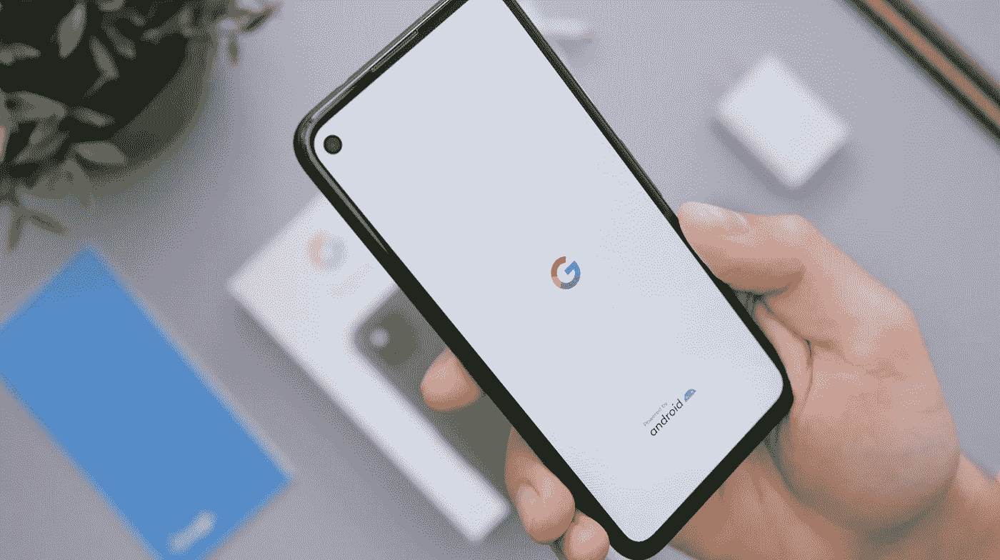
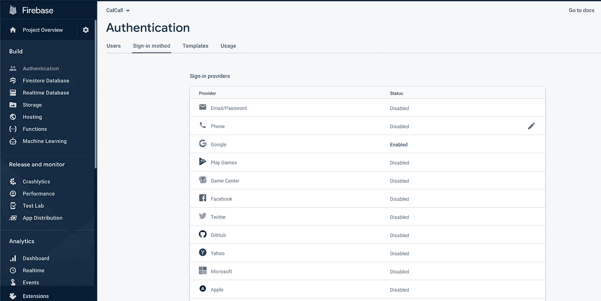
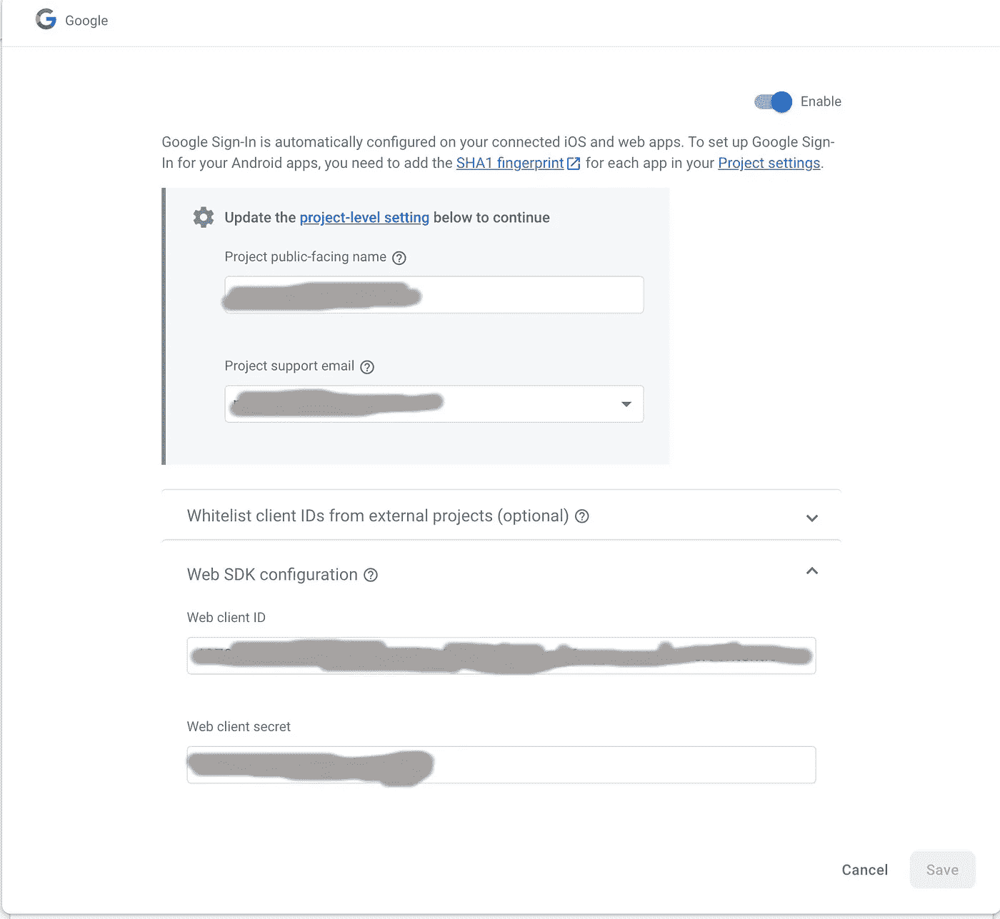

# 在 React 本地应用程序中使用 Google 登录

> 原文：<https://javascript.plainenglish.io/log-in-with-google-in-react-native-application-3aaa519f5df8?source=collection_archive---------6----------------------->

## 如何在 React Native 中使用 Firebase Auth 登录 Google



Photo by [Daniel Romero](https://unsplash.com/@rmrdnl?utm_source=unsplash&utm_medium=referral&utm_content=creditCopyText) on [Unsplash](https://unsplash.com/s/photos/google?utm_source=unsplash&utm_medium=referral&utm_content=creditCopyText)

在这篇文章中，我将带你通过 5 个简单的步骤在你的 React 本地应用程序中添加 Google Auth。我们将在应用程序中使用 Firebase Auth，并在其中启用 **Google Sign In** 选项。

# 先决条件

我假设您已经添加了 React 本地项目设置和 Firebase **app** 模块。如果您没有添加 Firebase 应用程序模块，您可以按照这里的入门指南进行设置。

[](https://rnfirebase.io/) [## 反应天然燃料|反应天然燃料

### 欢迎反应原生火焰基！要开始，您必须首先设置一个 Firebase 项目并安装“app”模块…

rnfirebase.io](https://rnfirebase.io/) 

# 步骤 1:安装 NPM 软件包

首先，我们需要安装 [Firebase Auth](https://rnfirebase.io/auth/usage) 包和 [Google Sign In](https://github.com/react-native-google-signin/google-signin#project-setup-and-initialization) 包。

```
yarn add @react-native-firebase/auth
yarn add @react-native-google-signin/google-signin
```

接下来，如果您也在为 iOS 开发，请进行 pod 安装。

```
cd ios/ && pod install
```

## 步骤 2:在 Firebase 项目中启用 Google 登录

接下来，转到 Firebase 控制台，在 Authentication > Sign-in method 下启用 Google Login。



Enable Google sign-in

单击“启用”后，记下 Web 客户端 ID。我们将在应用程序中稍后使用此 ID。



Note the Web Client ID

## 步骤 3:创建登录页面

接下来，我们将继续在 React 本地页面上添加一个登录按钮。让我们首先为登录页面创建一个框架`React.Component`。该页面只有一个登录按钮及其 click 事件处理程序。

## 步骤 4:配置 Google 登录

接下来，让我们在`componentDidMount`中配置`GoogleSignIn`实例。这个方法只需要在应用程序中初始化一次。

## 步骤 5:实现登录点击方法

最后，让我们实现 Login Clicked 方法。在这个方法中，我们调用`signIn`方法，该方法触发返回 authToken 的应用内基于 web 浏览器的认证流。然后，我们使用这个令牌生成凭证，最后使用凭证获取用户信息。

## 额外收获:在 Redux 状态下保持用户信息

注意，我们已经在 React 组件中设置了 dispatcher。所以我们可以简单地调用 setUser 方法将用户设置为 Redux 状态。当然，假设您已经在应用程序中设置了 Redux。

```
this.props.setUser(user)
```

另外，您可以将一个`onAuthStateChanged`事件监听器附加到`auth()`实例上。有关更多详细信息，请参考文档。

[](https://rnfirebase.io/auth/usage) [## 身份验证| React 本机 Firebase

### 身份验证的安装和入门。本模块要求@react-native-firebase/app 模块…

rnfirebase.io](https://rnfirebase.io/auth/usage) 

就是这样。当你运行应用程序时，你应该让谷歌登录在你的应用程序中工作。如果你觉得这篇文章有用，请留下掌声。

考虑成为中级会员[继续阅读我所有的优质文章以及 1000 多个其他故事。](https://utkarshabakshi.medium.com/membership)

你可以在这个[列表](https://utkarshabakshi.medium.com/list/react-native-development-0d5f690f6585)中找到我关于 React 原生开发的其他文章。

*更多内容尽在*[***plain English . io***](http://plainenglish.io/)