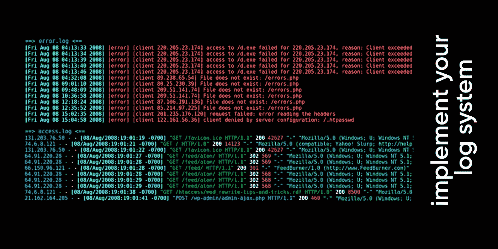

# 登录 Node.js —跟踪您的代码

> 原文：<https://javascript.plainenglish.io/logging-in-nodejs-trace-your-code-3d25b7b017b?source=collection_archive---------6----------------------->



我看到了很多关于日志和日志最佳实践方法的文章。但是他们每个人都单独解释了伐木的某些部分。这里我想解释一下如何**开始登录 Express** 以及如何在**监控**工具中查看结果。我将**直接**开始写代码。

🎥我强烈建议你在开始阅读这篇文章之前，先看看这个**视频**:

# 安慰

**控制台**是 Node.js 中的内置函数之一。正如我所说，它是**在您环境的控制台中显示日志的最基本的**工具。

在[链接](https://nodejs.org/api/console.html)中，您可以访问控制台的许多功能。但我会解释其中一些有趣的现象:

```
console.log(“message”);
// show your message normally
//The below code will show your error stack:try{
   //some code
}catch(e)
{
   console.error(e)
}
//Showing your object as a tableconsole.table([{ a: 1, b: 'Y' }, { a: 'Z', b: 2 }]);
// ┌─────────┬─────┬─────┐
// │ (index) │  a  │  b  │
// ├─────────┼─────┼─────┤
// │    0    │  1  │ 'Y' │
// │    1    │ 'Z' │  2  │
// └─────────┴─────┴─────┘
```

而且是**惊艳**🎯如果你知道，你可以用这种方法让你的日志变得丰富多彩

colorful logs

如果你想继续上 console，推荐你看一下这篇文章:[**console . log 语句的最佳替代**](https://dev.to/ptkdev/the-best-alternative-to-the-console-log-statement-470k)

# Morgan 登录 Express 或任何 HTTP 服务器

如果你使用的是 HTTP 服务器，你需要获取 HTTP 日志。要获取 HTTP 上的实时日志，我们可以使用 [**Morgan**](https://www.npmjs.com/package/morgan) 。Morgan 是 node.js 的 HTTP 请求记录器**中间件**，它已经安装在 express.js 上，在 Morgan 中，你可以定义你的**日志样式**，如果你想保存它，可以保存到**文件**中。

一切都不会在这里结束，我们必须将我们的日志转移到其他地方使用监控工具。为了解决这个问题，我可以使用[温斯顿](https://www.npmjs.com/package/winston)。

⏰和我在一起，在下一篇文章中，我们将继续温斯顿。

感受**自由**到**复制**这个**内容**到你想要的任何地方😊，请不要忘记分享你的**想法**和你的**评论**💬和我一起。

🟢 **在 **Youtube** 和 **Instagram** 上关注**我，获取**更新**

🔅 [Youtube 频道](https://cutt.ly/Nx81N4C)
🔅 [Instagram](https://cutt.ly/1x80uXx)

*更多内容尽在*[*plain English . io*](http://plainenglish.io/)