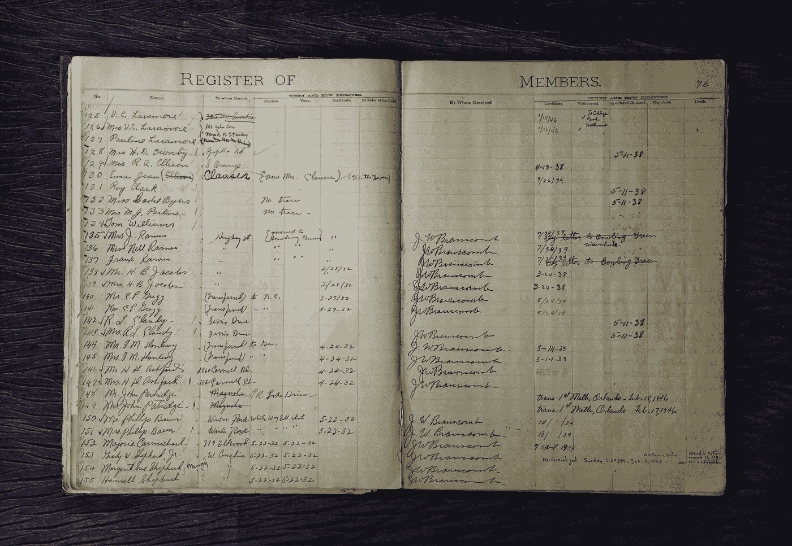
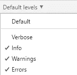
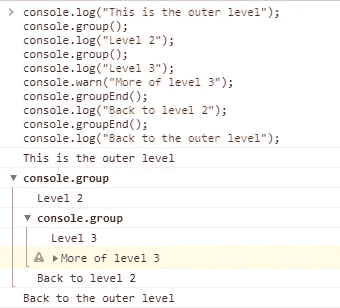
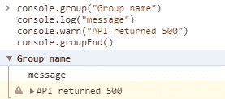
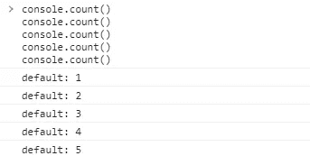
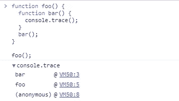

# 像专业人士一样登录控制台

> 原文：<https://javascript.plainenglish.io/logging-in-the-console-like-a-pro-756660672d2b?source=collection_archive---------15----------------------->

*我们都用* `*console.log*` *调试，让我们把它做得更好！*

Photo by [Mick Haupt](https://unsplash.com/@rocinante_11?utm_source=unsplash&utm_medium=referral&utm_content=creditCopyText) on [Unsplash](https://unsplash.com/s/photos/log-book?utm_source=unsplash&utm_medium=referral&utm_content=creditCopyText)

# 介绍

很多人用`console.log`调试。尽管这不完全是最佳实践，但我们这样做是因为它在大多数情况下都有效。但是每个人都只使用`console.log`,而`console`对象有惊人数量的不同功能。

您可能见过一些不使用`.log`专门记录错误、警告或其他详细信息的函数，但是您听说过所有这些控制台函数吗？

# 调试

当用户或爱管闲事的程序员打开控制台，看到控制台中数十个随机日志时，没有什么比随机控制台日志更糟糕的了。

大多数浏览器都将默认设置设为“默认级别”。这意味着控制台将显示除详细日志之外的任何内容。

但是您可以利用这一点，使用`[console.debug](https://developer.mozilla.org/en-US/docs/Web/API/Console/debug)`函数，该函数只有在启用了详细日志的情况下才会出现。

另一件要做的事情是在部署时删除所有不必要的日志，或者在它们前面加上类似“DEBUG: <message>”的字符串。</message>

## 信息

`console.info()`函数的行为与默认的日志函数相同，但是在 Firefox 上它旁边会显示一个小的信息图标。

# 警告和错误

我毫不怀疑你以前见过这些。任何一个程序员想到错误都会发抖，根据技术栈，你可能甚至不太关心警告。但是他们绝对可以提升你的伐木游戏。

`[console.warn](https://developer.mozilla.org/en-US/docs/Web/API/Console/warn)`对于警告开发人员某些不一定会破坏应用程序的事情很有用。像尚未加载的数据或过期版本的包之类的东西可能会返回警告。

`[console.error](https://developer.mozilla.org/en-US/docs/Web/API/Console/error)`在您的控制台中显示红色信息，当这些发生时，可能有不好的事情发生。找不到文件，API 请求返回 404，诸如此类。

但是当调试时，我们并不真正使用它们，尽管这可能是一个很好的实践。让 if 语句检查空值会在它不应该是空值时返回警告，或者在 API 请求出错时返回错误。

# 分组

你看过这个了吗？我肯定你没有因为我肯定没有。使用`[console.group](https://developer.mozilla.org/en-US/docs/Web/API/Console/group)`和`console.groupEnd`功能完成分组。旧的浏览器不支持这些功能，但是越来越多的浏览器正在实现这些功能。

Using the console grouping in Chrome

当您在应用程序的某些组件中记录大量调试消息时，这可能很有用。例如，单个 React 组件的流程完成 API 调用，并在应用程序中的特定时间记录状态。

就像我们在上面的图片中看到的，你可以在组中使用所有常规的日志功能，比如`.warn`。

你也可以给这些组起名字。在上图中，我们没有给`group`和`groupEnd`函数任何参数，但是添加标签可以增加可读性。

可折叠组现在的名称为“组名”。这样，您可以将某个组指定给应用程序的某个组件或部分。

要创建一个开始折叠而不是展开的群组，您可以使用`[console.groupCollapsed()](https://developer.mozilla.org/en-US/docs/Web/API/Console/groupCollapsed)`功能。这将清理控制台多一点，你必须展开组来查看里面是什么。

# 数数

`[console.count()](https://developer.mozilla.org/en-US/docs/Web/API/Console/count)`函数在被调用时会从 1 开始计数。当您不确定它有多少次迭代时，这在循环中会很有用。`console.countReset()`将重置计数。你也可以给这些函数一个自定义的标签字符串，它会显示出来而不是“默认”。

现在我承认这可能不是最有用的函数，但我从未见过它被使用，所以想把它包括在这个列表中。

# 找到；查出

堆栈跟踪很多时候是由错误给出的，但是如果是为了调试的目的呢？`[console.trace](https://developer.mozilla.org/en-US/docs/Web/API/Console/trace)`功能可以提供帮助。

它将返回一个可折叠的函数调用列表。这在大型应用程序中非常有用，在这些应用程序中，函数的流程可能不像它应该的那样简单。

# 清楚的

在我们处理完所有事情之后。组件已经加载，API 调用已经完成，我们终于可以把这一切抛在脑后，清空控制台了。

使用`console.clear()`将为您清除控制台。如果您不想在部署时向用户显示某些消息，这可能很有用。

# 结论

JavaScript 中的控制台对象比开发人员认为的要高级得多，功能也更多。虽然这不是最好的调试方式，但它在大多数情况下是可行的，但在调试大型应用程序时看起来非常糟糕。这些函数可能会稍微解决这个问题。

感谢您的阅读，祝您有美好的一天。