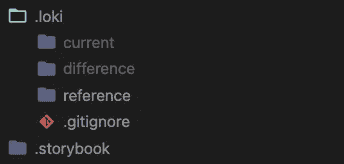

# 洛基:对你的故事书项目进行可视化回归测试

> 原文：<https://javascript.plainenglish.io/loki-a-visual-regression-testing-journey-on-projects-that-use-storybook-1ff5a8530a51?source=collection_archive---------7----------------------->

Photo by [Charles Deluvio](https://unsplash.com/@charlesdeluvio?utm_source=medium&utm_medium=referral) on [Unsplash](https://unsplash.com?utm_source=medium&utm_medium=referral)

当人们开发和交付他们产品的新特性时，功能回归是观察的主要关键。但是——视觉上的也是。

假设你有一个你自己的或者你的团队正在开发的 UI 库/设计系统。如果你熟悉这些花哨的“UI 库、设计系统”关键词，你就知道它们包含了很多原子组件、逻辑和规则。我甚至没有谈论复合组件——就像一张卡片，包含一个动作按钮作为它自己的默认行为。为了更准确地了解这些库在数量上有多复杂，除了钩子之外， [Chakra UI](https://chakra-ui.com/) 中有 70 个 UI 组件。

当您交付新功能时——功能结果、代码质量和开发阶段可能犯的最常见错误可能看起来很容易观察和管理——因为您已经作为团队安排了代码评审会议。但是对于样式方面，它并不(总是)如此。它要求人们有 UI 意识，对库有深入的了解，并且知道组件之间如何交互。

在这个阶段，除了我们的眼睛，我们需要一个自主系统来观察图书馆中的视觉变化。🤔

# 洛基

[Loki](https://loki.js.org/) 是由 [Joel Arvidsson](https://github.com/oblador) 开发的可视化回归库。它的目标是“简单的设置，没有额外的维护成本，独立于操作系统的可重复测试，并支持故事书所支持的所有平台”。

从安装开始，您会注意到 Loki 是一个几乎不需要配置的库。它还使用 CLI 处理在 ***package.json*** 文件中定位其配置的部分。

初始化后，您应该构建第一批快照，以供将来参考。但是在执行 ***更新*** 命令之前，请确保您已经启动了故事书应用程序，因为 Loki 将尝试访问您的故事。

执行该命令后——现在您应该能够看到在 ***下创建的文件夹。洛基*** ，取名 ***参考*** 。

The folder that has been generated by Loki

现在是时候对你的故事中的组件做一些改变了，让洛基注意一下。做出更改后，保存它们并继续执行命令:

Loki 现在将在 ***下创建新的快照。loki/current*** 。它们将用于应用程序当前状态与之前状态的比较(基于 ***)。Loki/参考*** )。

如果存在任何倒退或变化，您可以在 ***下找到它们。正如你所猜测的，作为结果，测试将会失败。***

检查完这些更改后，您可以继续执行“批准”命令来批准这些更改—如果您计划了这些更改的话。

> 提交您的更改以及新的参考图像，然后重复。

# 警告和个人想法

为了确保你的用例首先适合 Loki，你应该回顾/重温你的故事书实践。您应该避免只在一种状态下使用组件，这种状态不会告诉您更多关于它自身的信息。如果你的故事中包含了一些场景，那就说得通了。

但即使在故事没有详细到应有程度的情况下，我相信洛基仍然在向我们介绍一个新的水平的可观察性和检测视觉回归的自主性。

总结一下，有很多测试库，Loki 只是其中之一。我发现这个库很有用，因为它很容易配置，不需要额外开发测试用例。实际上，它也是为了在持续集成服务器上运行而构建的。您也可以在您的软件开发生命周期中轻松地调整它们。✨

您可以在他们的文档中找到更多关于 Loki 的详细信息:

【https://loki.js.org/ 

这是该项目的 GitHub 库:

 [## GitHub-obrador/Loki:👁故事书的视觉回归测试

### 有一些用于 web 的可视化回归工具，但是大多数要么不能无头运行，要么使用幻想曲

github.com](https://github.com/oblador/loki) 

*发现* ***Loki*** *有用吗？测试中你最喜欢的库是什么？让我知道就好！*

另外，如果你喜欢这篇文章，请与你的朋友和同事分享。

保持安全和健康，再见！👋🏻

*更多内容请看*[***plain English . io***](http://plainenglish.io)