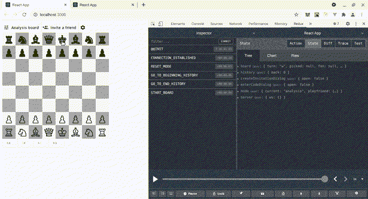
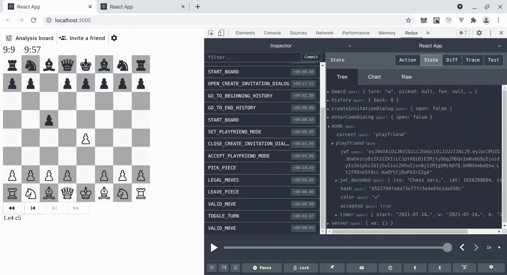

# 如何愉快地测试 React 组件

> 原文：<https://javascript.plainenglish.io/looking-forward-to-testing-react-components-with-joy-5bb3f86c21d7?source=collection_archive---------19----------------------->

## 意识到我正在放松时，有些喜悦


最近，我一直在为基于 Redux 的 npm 包`[redux-chess](https://github.com/programarivm/redux-chess)`添加[和](/testing-a-local-react-npm-package-with-ease-7d0668676ddb)一些令人敬畏的新特性。如果你读过我以前的帖子，你会知道我正在写一个 React 棋盘，打算连接到一个 [PHP 国际象棋服务器](https://github.com/programarivm/chess-server)，用于国际象棋移动验证，位置评估，邀请朋友玩，以及更多令人惊讶的功能。

对于那些刚接触 JavaScript 的人来说， [React](https://create-react-app.dev/) 是一个优秀的库和框架，它使得构建交互式 ui 变得轻而易举，而不是像意大利面条一样的代码。

> Redux 是一种软件设计模式，通过采用通用标准来帮助开发人员更加一致地工作。

到目前为止，我一方面做了一些测试驱动开发(TDD ),另一方面也在主机应用程序中做了一些手动测试。

这个测试方案允许我保持 npm 包的独立性、隔离性和可重用性。截至 2021 年 7 月，`[redux-chess](https://www.npmjs.com/package/redux-chess)`平均每周被下载几百次，这还不算太糟糕！

但是，每次需要添加新功能时，我都必须进行一些手动测试，这有时会导致非常乏味的工作。

> 我想我也应该写一篇新的帖子，期待愉快地测试 React 组件。

基本上，手动测试包括启用 [Redux DevTools](https://github.com/reduxjs/redux-devtools) 在[应用程序的主存储](https://github.com/programarivm/redux-chess/blob/master/src/store.js)中调试状态变化，同时与 React 组件交互。

```
import { createStore, applyMiddleware, compose } from 'redux';
import thunk from 'redux-thunk';
import rootReducer from './reducers/rootReducer';const store = createStore(
  rootReducer,
  compose(
    applyMiddleware(thunk),
    window.__REDUX_DEVTOOLS_EXTENSION__ && window.__REDUX_DEVTOOLS_EXTENSION__()
  )
);export default store;
```

当然，这个工作的前提是一个 PHP 象棋服务器启动并运行在本地主机上，正如这个自述文件所说。

```
$ php cli/ws-server.php 
Welcome to PHP Chess Server
Commands available:
/accept {"id":"id"} Accepts a friend request to play a game.
/ascii Prints the ASCII representation of the game.
/castling Gets the castling status.
/captures Gets the pieces captured by both players.
/fen Prints the FEN string representation of the game.
/history The current game's history.
/ischeck Finds out if the game is in check.
/ismate Finds out if the game is over.
/piece {"position":"string"} Gets a piece by its position on the board.
/pieces {"color":["w","b"]} Gets the pieces on the board by color.
/playfen {"fen":"string"} Plays a chess move in shortened FEN format.
/quit Quits a game.
/start {"mode":["analysis","playfriend"],"color":["w","b"],"min":"int"} Starts a new game.
/status The current game status.Listening to commands...
```

你能想象吗？

事情是这样的，前几天我在`redux-chess`包中添加了一个新功能:一个优雅的同步象棋计时器，在“玩朋友模式”中，如下图所示。



Figure 1\. Debugging the app’s state changes with Redux DevTools

对于手动测试，每当我更改象棋计时器的代码时，如果我想在浏览器上看到相应的更改，我就必须重复创建新的邀请令牌、接受令牌等等的整个过程。

更具体地说，在选项卡 A 上:

*   点击**邀请朋友**
*   选择**创建邀请**
*   填写表格
*   点击**创建代码**
*   将代码复制到剪贴板
*   与朋友分享代码
*   点击**播放**

然后在选项卡 B 上:

*   点击**邀请朋友**
*   选择**输入代码**
*   填写表格
*   点击**播放**



Figure 2\. The chess timer is displayed after a friend accepts an invitation to play

> 有关如何运行 React 应用程序的更多信息，如上面的 GIF 所示，请阅读[如何轻松测试本地 React NPM 包](/testing-a-local-react-npm-package-with-ease-7d0668676ddb)

对此肯定可以采取一些措施。

快乐来自于意识到在一个基于 Redux 的应用程序中测试 React 组件并不是那么明显，所以我一步一步地慢慢来，以防止受挫。

我想目前一个很好的里程碑是安装和设置[酶](https://enzymejs.github.io/enzyme/)来与 Jest 一起工作——至少这是我今天做的事情[正如本期](https://github.com/programarivm/redux-chess/issues/56)所描述的，这将允许测试 React 组件。

Enzyme 是一个 JavaScript 测试工具，在测试 React 组件时让你的生活变得更简单，允许模拟 DOM 事件。

所以，我安装了酵素:

```
$ npm i --save-dev enzyme
```

因为我用的是 React 17，没有可用的适配器，所以我最后安装了一个非官方的适配器。

```
$ npm install --save-dev enzyme-adapter-react-17-updated
```

这是我的应用程序的`package.json`安装后的样子。

```
"devDependencies": {
    "babel-cli": "^6.26.0",
    "babel-preset-env": "^1.7.0",
    "babel-preset-react": "^6.24.1",
    "babel-preset-stage-0": "^6.24.1",
    "enzyme": "^3.11.0",
    "enzyme-adapter-react-17-updated": "^1.0.2"
  }
```

最后，我在应用程序的`src`文件夹中创建了`[setupTests.js](https://github.com/programarivm/redux-chess/blob/master/src/setupTests.js)`文件。

```
import Enzyme from 'enzyme';
import Adapter from 'enzyme-adapter-react-17-updated';Enzyme.configure({ adapter: new Adapter() });
```

并添加了我在`[src/__tests__/components/Chess.test.js](https://github.com/programarivm/redux-chess/blob/master/src/__tests__/components/Chess.test.js)`中可能写的最简单的测试，明确的目标是确认酶设置工作正常。

```
import React from 'react';
import { mount } from 'enzyme';
import Chess from 'components/Chess';const props = {
  server: {
    host: '127.0.0.1',
    port: '8080'
  }
};describe("Chess", () => {
  it("is rendered", () => {
    const wrapper = mount(<Chess props={props} />);
  });
});
```

瞧啊。

```
$ npm testPASS  src/__tests__/utils/Ascii.test.js
PASS  src/__tests__/utils/Piece.test.js
PASS  src/__tests__/components/Chess.test.jsTest Suites: 3 passed, 3 total
Tests:       20 passed, 20 total
Snapshots:   0 total
Time:        5.176 s
Ran all test suites.Watch Usage: Press w to show more.
```

测试通过了。

在以后的文章中，我将详细阐述如何在 Redux 应用程序中轻松愉快地模拟 DOM 事件。我们希望模拟用户与 UI 的交互，以便自动化特定的用例。

一步一步来。

敬请期待！

[](/my-first-integration-test-in-a-redux-hooked-app-3b189addd46e) [## 我在 Redux Hooked 应用中的第一次集成测试

### 因为我不喜欢嘲笑，所以我用了这个应用的真实商店

javascript.plainenglish.io](/my-first-integration-test-in-a-redux-hooked-app-3b189addd46e) 

## 您可能还对以下内容感兴趣:

*   [在不破坏其他任何东西的情况下向一个坚实的代码库添加类](https://medium.com/geekculture/adding-classes-to-a-solid-codebase-without-breaking-anything-else-99e6c5a5f3e4)
*   [一个反应棋盘，棋盘上有几行圈圈和钩子](https://medium.com/geekculture/a-react-chessboard-with-redux-and-hooks-in-few-lines-6009cb724bb)
*   [轻松测试本地 React Npm 包](https://programarivm.medium.com/testing-a-local-react-npm-package-with-ease-7d0668676ddb)
*   [用 Jest 最简单的方法开发 React 应用](https://medium.com/geekculture/tdding-a-react-app-with-jest-the-easy-way-8ddb64aeaba6)

*更多内容请看*[***plain English . io***](http://plainenglish.io)