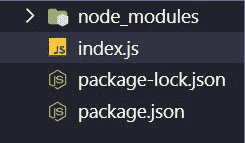

# 在 JavaScript 中使用 Brain.js 进行简单应用程序的机器学习

> 原文：<https://javascript.plainenglish.io/machine-learning-in-javascript-using-brain-js-for-simple-applications-89636ad50759?source=collection_archive---------11----------------------->

## 机器学习|编程

## 用 JavaScript 创建你自己的神经网络


Photo by [James Harrison](https://unsplash.com/@jstrippa?utm_source=medium&utm_medium=referral) on [Unsplash](https://unsplash.com?utm_source=medium&utm_medium=referral)

[机器学习](https://www.sas.com/en_us/insights/analytics/machine-learning.html#:~:text=Machine%20learning%20is%20a%20method,decisions%20with%20minimal%20human%20intervention.) g 是人工智能(AI)的一种形式，旨在建立可以从已处理的数据中学习或使用数据来提高性能的系统。人工智能是模仿人类智能的系统或机器的总称。

即使机器学习和人工智能经常被相提并论，而且这两个术语有时会互换使用，但它们的意思并不相同。

一个重要的区别是，虽然机器学习总是在 AI 之下，但 AI 并不总是在机器学习之下。今天，机器学习应用在我们周围。

当与银行沟通、在线购物或使用社交媒体时，机器学习有助于我们的体验平稳安全地进行。机器学习及其相关技术正在快速发展，但我们才刚刚开始了解它们所提供的可能性。

## 入门指南

对于 JavaScript 中的机器学习，我们将使用`brain.js`包。首先，您需要确保您已经安装了 Node.js，因为我们将使用这个框架。

[*https://nodejs.org/en/*](https://nodejs.org/en/)*—下载链接*

一旦你安装好了，我们就可以开始创建我们的项目了。如果你能在你的电脑上找到一个地方，然后进入`cd`，那将是最好的。

```
C:\Dev\MLJS>
```

完成后，您可以调用以下命令来启动您的项目:

```
> npm init -y
```

这将启动您的文件:

```
Wrote to C:\Dev\MLJS\package.json:{
  "name": "MLJS",
  "version": "1.0.0",
  "description": "",
  "main": "index.js",
  "scripts": {
    "test": "echo \"Error: no test specified\" && exit 1"
  },
  "keywords": [],
  "author": "",
  "license": "ISC"
}
```

## 安装软件包

对于本教程，我们将使用 https://brain.js.org/#/的`brain.js`—。

您可以这样安装它:

```
> npm i brain.js
npm WARN deprecated request@2.88.2: request has been deprecated, see [https://github.com/request/request/issues/3142](https://github.com/request/request/issues/3142)
npm WARN deprecated har-validator@5.1.5: this library is no longer supported> gl@4.9.0 install C:\Dev\MLJS\node_modules\gl     
> prebuild-install || node-gyp rebuild> brain.js@2.0.0-beta.2 postinstall C:\Dev\MLJS\node_modules\brain.js
> npm rebuild gpu.jsnpm notice created a lockfile as package-lock.json. You should commit this file.
npm WARN MLJS@1.0.0 No description
npm WARN MLJS@1.0.0 No repository field.+ brain.js@2.0.0-beta.2
added 149 packages from 106 contributors and audited 149 packages in 19.516s9 packages are looking for funding
  run `npm fund` for detailsfound 0 vulnerabilities
```

## 用 JavaScript 创建你的第一个机器学习项目

首先，创建一个`index.js`来放入所有代码。



Image By Author: Bryan Dijkhuizen

您需要带我们刚刚安装的模块:

```
const brain = require('brain.js');
```

## 神经网络

我们要做的第一件事是创建一个神经网络。

[普通神经网络](https://en.wikipedia.org/wiki/Neural_network)，通常简称为神经网络，是一种计算机系统，其灵感来源于构成动物大脑的生物神经网络。

让我们创建一个:

```
const network = **new** *brain*.NeuralNetwork();
```

现在让我们输入一些训练数据:

```
network.train([{ input: [1, 2], output: [1] },{ input: [1, 3], output: [1] },{ input: [2, 3], output: [0] },{ input: [2, 4], output: [1] },{ input: [1, 2], output: [0] },{ input: [1, 3], output: [0] },{ input: [3, 4], output: [0] }]);
```

这是一个小数据集。通常，它们都很大，但这只是一个例子。现在让我们创建一个变量来生成您的请求的结果:

```
const output = network.run([1, 2]);
```

让我们将它记录到控制台:

```
console.log(output);
```

您可以通过在控制台中调用以下命令来运行 Node.js 程序:

```
> node index.js
Float32Array(1) [ 0.4723612368106842 ]
```

如你所见，它给我们的值是:

```
[ 0.4723612368106842 ]
```

## 结论

现在我们有了。就这样，我们设法在我们的应用程序中添加了一个神经网络。我希望你已经发现这是有用的。一定要在评论里让我知道。

如果你喜欢阅读这样的故事，你想支持我，考虑注册一个中等会员。每月只需花费你 5 美元**——这将让你访问媒体上的所有故事！如果你打算使用这个链接，我将从中获得一小部分，除此之外，如果你想在我发布一个新故事时保持更新，你可以在这里注册我的免费简讯！**