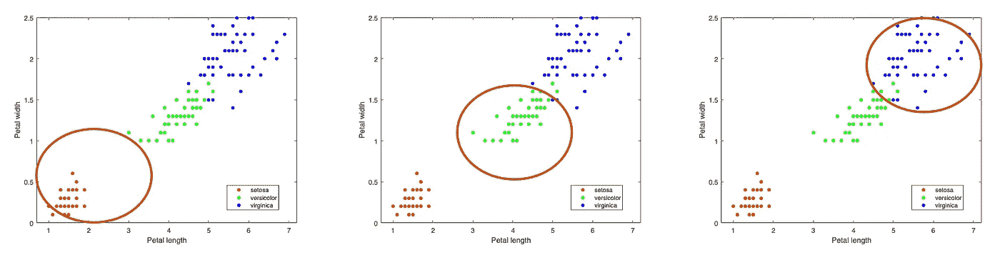
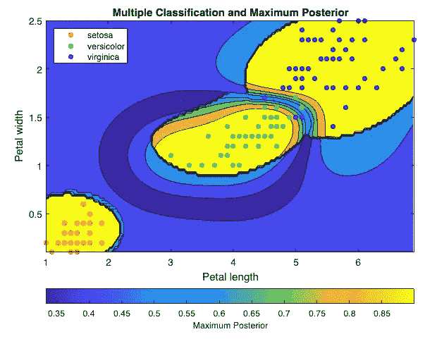

# 机器学习理论和编程:多类分类的监督学习

> 原文：<https://javascript.plainenglish.io/machine-learning-theory-and-programming-supervised-learning-for-multiclass-classification-ee0d9d32150e?source=collection_archive---------11----------------------->

一种流行的机器学习算法介绍。

Image by Author

我们走过了很多有监督的[机器学习](https://en.wikipedia.org/wiki/Machine_learning)算法、[线性回归、多项式回归](https://betterprogramming.pub/machine-learning-theory-and-programming-supervised-learning-regression-analysis-8ed2d86f5714)、[逻辑回归](https://enlear.academy/logistic-regression-in-machine-learning-672c0e8c8053)、[神经网络](https://medium.com/geekculture/machine-learning-theory-and-programming-supervised-learning-neural-networks-74a598cb9e42)、[支持向量机](/machine-learning-theory-and-programming-supervised-learning-support-vector-machine-d6cc7a5747f1) (SVMs)。监督学习建立了一组数据的数学模型，其中包含输入(`x`)和正确的输出(`y`)。

二元分类器只有两种可能的输出。我们写了两篇文章来训练二进制分类器。在这里，我们将展示如何执行多类分类。

# ***多类分类理论***

[多类分类](https://en.wikipedia.org/wiki/Multiclass_classification)将实例分为三类或更多类。

Image Credit: Wikipedia

[Fisher 的虹膜数据](https://en.wikipedia.org/wiki/Iris_flower_data_set)是模式识别文献中最著名的数据库。它包括对 150 种鸢尾属植物的萼片长度、萼片宽度、花瓣长度和花瓣宽度的测量(以`cm`为单位)。`setosa`、`versicolor`、`virginica`三个物种各 50 个标本。我们关注花瓣长度和花瓣宽度，它们是`meas`矩阵中的第 3 列和第 4 列。

Image by Author

在之前的文章中，我们使用了线性 SVM 模型对`'versicolor'`和`'virginica'`进行分类。我们还使用高斯 SVM 模型在`'versicolor'`和`'non-versicolor'`之间进行分类。

多类分类可以被视为多个一对一的分类问题。

Image by Authour

对于虹膜数据集，我们创建三个二元分类器:

*   从`'non-setosa'`预测`'setosa'`的`setosa`分类器
*   从`'non-versicolor'`预测`'versicolor'`的`versicolor`分类器
*   从`'non-virginica'`预测`'virginica'`的`virginica`分类器

对于每个新数据，得到三个预测分数，然后选择最新的值。产生最新值的二元分类器是预测类。

# 多类分类编程

有机器学习专用的编程语言，如 [MATLAB](https://matlab.mathworks.com/) 、 [Octave](https://www.gnu.org/software/octave/index) 、 [R](https://betterprogramming.pub/exploring-the-ai-programming-language-r-102d25af9646) 等。对于一些通用编程语言，如 Python，它们提供了机器学习库。强烈建议不要多此一举。我们可以使用机器学习特定的编程语言或机器学习库来解决多类分类问题。

MATLAB 是 MathWorks 开发的专有多范式编程语言和数值计算环境。它提供了一个内置函数，*k*-均值聚类

*   `[fitcsvm](https://www.mathworks.com/help/stats/fitcsvm.html#bt8v_z4-1)`在低维或中维预测数据集上训练用于一类和二类(二元)分类的 SVM 模型。
*   `[fitcecoc](https://www.mathworks.com/help/stats/fitcecoc.html)`为 SVM 或其他分类器训练多类模型。`ClassificationECOC`是一个用于多类学习的纠错输出码(ECOC)分类器，其中分类器由多个二进制学习器组成。

## 三个二元分类器

这是一个使用三个二元分类器来解决虹膜分类问题的程序。它用不同的颜色绘制预测区域。iris 训练集中的输入显示在用于验证的区域的顶部。

第 1 行指定了函数名`ThreeBinaryClassifiers`。

第 3-5 行加载数据集`fisheriris`，并将数据分配给`X`和`y`。`X`获取第 3 列和第 4 列虹膜数据，即花瓣长度和花瓣宽度。`y`是抄袭`species`的单元数组。

第 8–13 行训练 3 个二元分类器，`SVMModels`。有 3 个独特的类，`'setosa'`、`'versicolor`和`'virginica'`。`numel(classes)`返回 3。它将当前类作为正例，`fitcsvm`用核函数`'gaussian'`训练每个 SVM 模型。

第 16-26 行生成二维网格上的每个点，`xGrid`。密度由`d`(第 16 行)定义。`meshgrid(x, y)`根据矢量`x`和`y`中包含的坐标返回二维网格坐标。对于每个点，它预测 3 个二元分类器的得分，并将结果存储在`Scores`中。

第 29–31 行在二维网格上绘制每个点。每个点选择产生最新值的相应分类器的颜色。如果是来自`'setosa'`，颜色为青色(`'c'`)。如果是来自`'versicolor`，颜色是洋红色(`'m'`)。如果是来自`'virginica'`，颜色是黄色(`'y'`)。`max(Scores, [], 2)`第 29 行返回一个包含每行最大值的列向量。第 31 行调用`hold on`保留当前轴中的图，这样添加到轴中的新图不会删除现有的图。

第 34 行在用于验证的区域的顶部绘制虹膜训练集`X`。

第 37–42 行绘制标题、轴标签和图例。

第 43 行设置数据范围的轴限制。

第 44 行调用`hold off`将保持状态设置为关闭。

第 45 行终止该函数。

以下是生成的带有预测区域的图表:

Image by Author

## 多类分类器

正如我们已经说过的，尽量不要重新发明轮子。有一个内置函数`fitcecoc`，它训练多类分类器。尽管它是一个由多个二进制学习器组成的分类器，我们仍然应该使用这个内置的多类分类模型。它使用后验区域(条件概率)来显示预测的可能性。

下面的程序更短，并且提供了更复杂的结果。

第 1 行指定了函数名`MulticlassClassifier`。

第 3-5 行加载数据集`fisheriris`，并将数据分配给`X`和`y`。`X`取虹膜数据的第 3 列和第 4 列，分别是花瓣长度和花瓣宽度。`y`是从`species`复制过来的单元格数组。

第 8–9 行训练多类分类器`Mdl`。第 8 行返回一个 SVM 学习者模板`templateSVM`，它适合于训练多类模型。第 9 行训练多类分类器，并将分类分数转换为类后验概率。`'Verbose'`级别设置为 2，显示培训过程的信息。

第 12-15 行生成二维网格上的每个点，`xGrid`。密度由`d`(第 12 行)定义。`meshgrid(x, y)`根据矢量`x`和`y`中包含的坐标返回二维网格坐标。对于每个点，它预测后验概率。结果在`PosteriorRegion`(第 15 行)中被捕获。

第 18–22 行描绘了最大的后部区域。`contourf`填充 2-D 轮廓图，它是由类别后验概率整形的坐标。它会创建一个包含同类后验概率值等值线的填充等值线图。第 20 行创建了一个颜色条，用于映射颜色和后验值。在`southoutside`处给棒材贴上标签并设定位置。第 22 行调用`hold on`保留当前轴中的图，这样添加到轴中的新图不会删除现有的图。

第 25 行在用于验证的区域的顶部绘制虹膜训练集。

第 28–31 行绘制标题、轴标签和图例。

第 32 行设置了数据范围的轴限制。

第 33 行调用`hold off`将保持状态设置为关闭。

第 34 行终止该函数。

下图显示了最大后验分布:

Image by Author

以下是 3 名学员的详细控制台输出:

# 结论

有很多机器学习算法。在本文中，我们提出了用于多类分类的监督学习。机器学习编程语言设计有预建的库和对数据科学和数据模型的高级支持。我们已经展示了使用 MATLAB 实现 3 个二元分类器和 1 个多分类器的例子。

以下是其他机器学习算法的列表:

*   [回归分析](https://betterprogramming.pub/machine-learning-theory-and-programming-supervised-learning-regression-analysis-8ed2d86f5714)
*   [逻辑回归](https://enlear.academy/logistic-regression-in-machine-learning-672c0e8c8053)
*   [神经网络](https://medium.com/geekculture/machine-learning-theory-and-programming-supervised-learning-neural-networks-74a598cb9e42)
*   [支持向量机](/machine-learning-theory-and-programming-supervised-learning-support-vector-machine-d6cc7a5747f1)
*   [K 均值聚类](/machine-learning-theory-and-programming-unsupervised-learning-k-means-clustering-52eeea41cba0)

感谢阅读。我希望这有所帮助。如果你有兴趣，可以看看[我的其他媒体文章](https://jenniferfubook.medium.com/jennifer-fus-web-development-publications-1a887e4454af)。

***注:*** *感谢 Josh Poduska、Andrew Ziegler、Subir Mansukhani 推荐机器学习资源！还有，感谢吴恩达教授的* [*机器学习课*](https://www.coursera.org/learn/machine-learning) *。*

*更多内容请看*[***plain English . io***](http://plainenglish.io/)