# 机器学习理论与程序设计—监督学习:支持向量机

> 原文：<https://javascript.plainenglish.io/machine-learning-theory-and-programming-supervised-learning-support-vector-machine-d6cc7a5747f1?source=collection_archive---------11----------------------->

一种流行的机器学习算法介绍。

Image credit: Ryan Kelly

我们走过了许多有监督的[机器学习](https://en.wikipedia.org/wiki/Machine_learning)算法、[线性回归、多项式回归](https://betterprogramming.pub/machine-learning-theory-and-programming-supervised-learning-regression-analysis-8ed2d86f5714)、[逻辑回归](https://enlear.academy/logistic-regression-in-machine-learning-672c0e8c8053)和[神经网络](https://medium.com/geekculture/machine-learning-theory-and-programming-supervised-learning-neural-networks-74a598cb9e42)。监督学习建立了一组数据的数学模型，其中包含输入(`x`)和正确的输出(`y`)。

在本文中，我们来看看[支持向量机](https://en.wikipedia.org/wiki/Support-vector_machine) (SVMs)，这是一种用于分类和回归分析的监督学习模型。更多的时候，它被用作分类器。

# 支持向量机理论

支持向量机分为两种类型:

*   线性支持向量机 **:** 应用于线性可分数据的支持向量机。
*   非线性支持向量机 **:** 适用于非线性可分数据的支持向量机。

## 线性支持向量机

我们[已经举例说明了一个线性二元分类器](https://enlear.academy/logistic-regression-in-machine-learning-672c0e8c8053)。绿色点代表好数据，红色点代表坏数据。线性决策边界(蓝线)将好与坏分开。

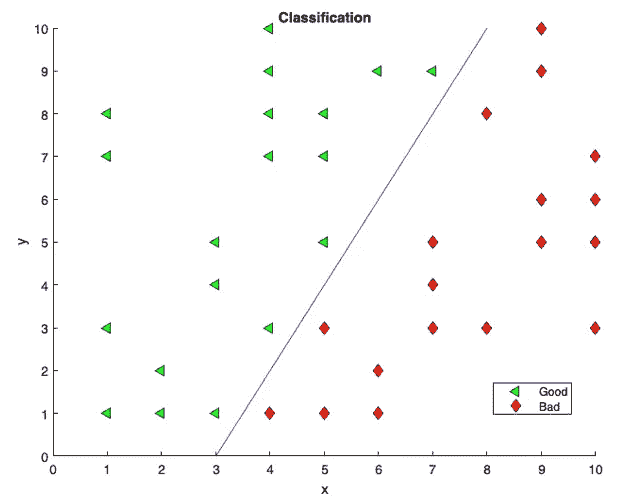

Image by Author

但是，对于这种线性可分的数据，区分好坏的界限不止一个。

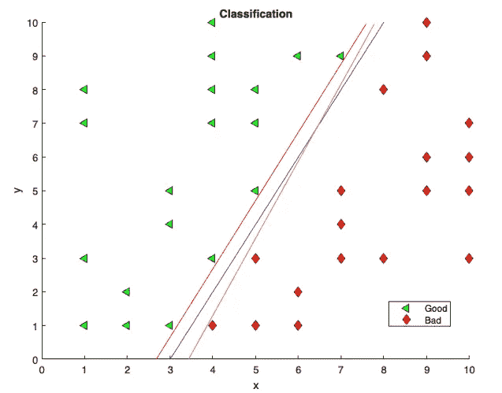

Image by Author

在上图中，红线和橙线也起作用。我们应该选择哪条线？

SVM 创建的决策边界在两个类的异常值之间具有最大的差值。如果是 n 维空间，最大的决策边界称为超平面。

训练数据集定义如下:

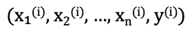

`x⁽ⁱ⁾`是 n 维空间中的一个输入。在下图中，如果是正例，`x⁽ⁱ⁾`被绘制为蓝点(`y⁽ⁱ⁾`为 1)。否则，`x⁽ⁱ⁾`被画成绿点(`y⁽ⁱ⁾`为`-1`)。

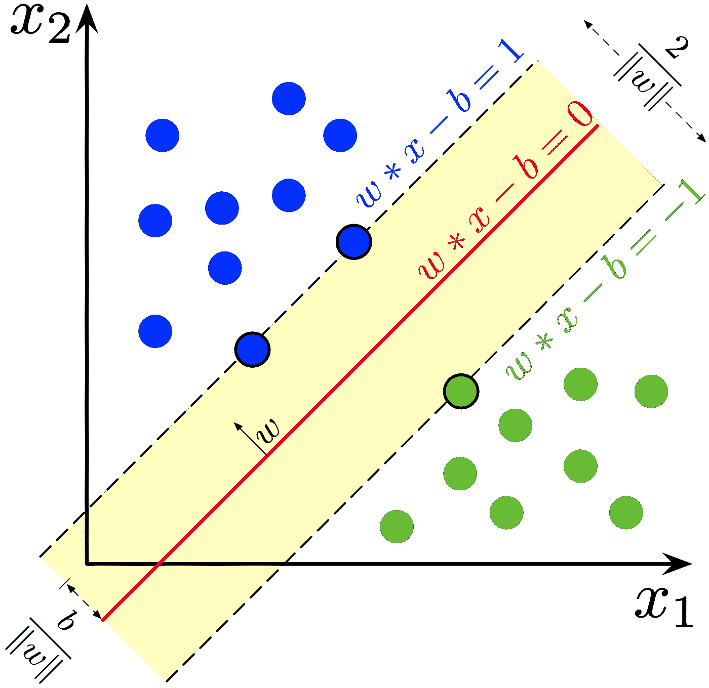

Larhmam, CC BY-SA 4.0 <[https://creativecommons.org/licenses/by-sa/4.0](https://creativecommons.org/licenses/by-sa/4.0)>, via Wikimedia Commons

超平面是`wᵀx — b = 0`，也就是红线。边界上或边界以上的数据`wᵀx — b = 1`是正例。数据在边界之上或之下，`wᵀx — b = -1`，都是否定的情况。这两个超平面之间的距离是`2/||w||`，其中`||w||`是向量的长度`w`。最小化`||w||`实现了两个超平面之间的最大距离。

成本函数(`J`)是一种返回预测结果和实际结果之间的误差的机制。其定义如下:

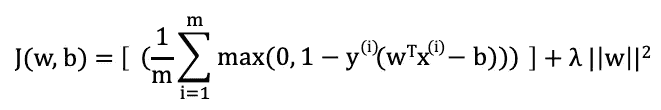

`b`是偏置，俗称`w₀`。因此，成本函数可以简化为:

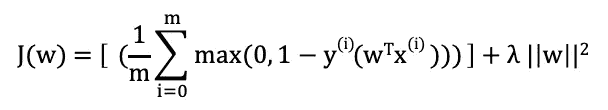

参数λ决定了增加页边距宽度和确保`x⁽ⁱ⁾`位于页边距的正确一侧之间的权衡。

接触边缘的数据被称为支持向量，因为它们支持超平面的位置。这种机器学习算法被称为 SVM。在训练之后，使用 SVM 模型来预测分类。

## 非线性支持向量机

在许多其他情况下，分类数据不是线性可分的。在下图中，一个非线性的决策边界(蓝色圆圈)将好的和坏的区分开来。

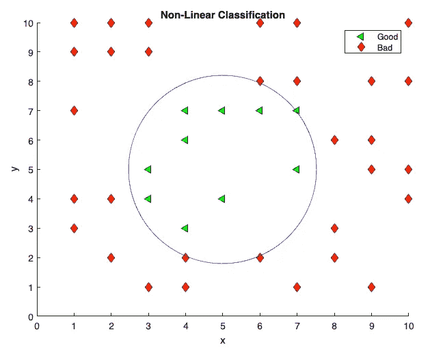

Image by Author

对于这些情况，有一种数学方法的变体，它保留了 SVM 如何分离超平面的几乎所有简单性。

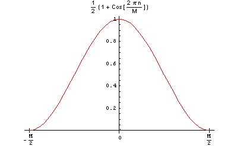

Benutzer:Studi111, Public domain, via Wikimedia Commons

[窗口函数](https://en.wikipedia.org/wiki/Window_function)是一个数学函数，具有以下特征:

*   在某个选定的区间之外，它的值为零。
*   它通常在音程的中间对称。
*   它通常在中间接近最大值。
*   它通常从中间开始逐渐变细。

术语[内核](https://en.wikipedia.org/wiki/Kernel_(statistics))指的是窗口函数。

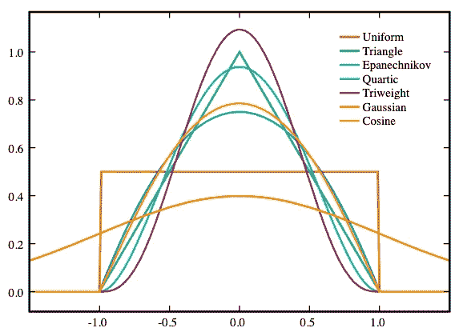

Brian Amberg, CC BY-SA 3.0 <[https://creativecommons.org/licenses/by-sa/3.0](https://creativecommons.org/licenses/by-sa/3.0)>, via Wikimedia Commons

上图显示了各种内核，每个内核对数据应用不同的变换，以使原始问题在高维空间中线性分离。这些是常见的内核:

*   线性内核(无内核)
*   多项式核
*   高斯核
*   Sigmoid 内核

径向基函数(RBF)是在距给定中心点固定距离处具有相同值的函数。高斯核是 RBF 的一个特例。假设在输入空间中有两个样本`x1`和`x2`。两个样品的相似性测量如下:

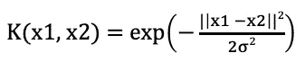

`||x1 — x2||²`是两个样本之间的平方欧氏距离，σ是自由参数。

高斯核用于测量界标和训练集之间的距离。更接近训练集的界标返回值更接近 1。

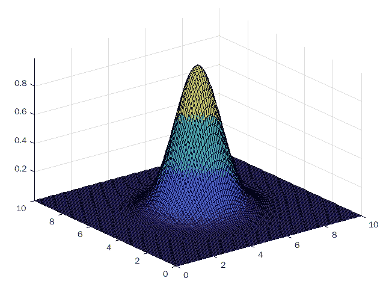

Image by Author

高斯核为非线性 SVM 训练数据集。在训练之后，使用 SVM 模型来预测分类。

# 支持向量机编程

对于支持向量机，计算算法在数学上很复杂。如果我们自己构建模型，这并不容易。

有机器学习专用的编程语言，如 [MATLAB](https://matlab.mathworks.com/) 、 [Octave](https://www.gnu.org/software/octave/index) 、 [R](https://betterprogramming.pub/exploring-the-ai-programming-language-r-102d25af9646) 等。一些通用编程语言，如 Python，提供了机器学习库。因此，训练一个模型可能只需要一次函数调用。

MATLAB 是 MathWorks 开发的专有多范式编程语言和数值计算环境。它为 SVM 提供了许多内置函数。`[fitcsvm](https://www.mathworks.com/help/stats/fitcsvm.html#bt8v_z4-1)`在低维或中维预测数据集上为一类和二类(二元)分类训练 SVM 模型。

## 虹膜数据集

Image Credit: Wikipedia

费希尔的虹膜数据是模式识别文献中最著名的数据库。它包括对 150 种鸢尾属植物的萼片长度、萼片宽度、花瓣长度和花瓣宽度的测量(以`cm`为单位)。`setosa`、`versicolor`、`virginica`三个物种各 50 个标本。

在 MATLAB 控制台上，我们加载数据集`fisheriris`。`meas`和`species`的表格显示了内容。

我们关注花瓣长度和花瓣宽度，它们是`meas`矩阵中的第 3 列和第 4 列。

下面的 MATLAB 代码将这些数据可视化为图形。

第 1 行指定了函数名`pedalSize`。

第 2 行用变量`meas`和`species`加载数据集`fisheriris`。

第 3 行调用一个内置函数`gscatter`，用`species`分组的踏板长度(`meas`中的第 3 列)和踏板宽度(`meas`中的第 4 列)绘图。

第 4 行标记 x 轴。

第 5 行标记了 y 轴。

第 6 行指定了图例的位置。

第 7 行结束了这个函数。

运行 MATLAB 代码，踏板大小以三种不同的颜色显示。

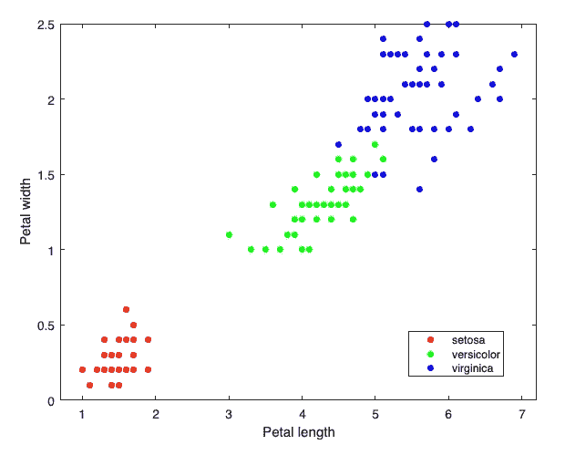

Image by Author

## 线性支持向量机

线性 SVM 对可线性分离的数据进行分类。对于虹膜数据集，如果我们忽略其中一种虹膜类型，剩下的两个物种将构建一个线性可分的训练集。

以下是训练线性 SVM 的算法:

第 1 行指定了函数名`linearSVM`和返回值`SVMModel`。

第 2 行用变量`meas`和`species`加载数据集`fisheriris`。

第 3 行检索索引`index`，其种类不是`'setosa'`。

第 4 行构造了`X`，它是`meas`的子矩阵，它接受包含第 3 列和第 4 列的索引行。

第 5 行构造了来自`species`的索引单元格数组`y`。

第 6 行调用`gscatter`绘制构造好的`X`和`y`。

第 7 行调用`hold on`保留当前轴中的图，这样添加到轴中的新图不会删除现有的图。

第 8 行调用`fitcsvm`用输入`X`和`y`训练一个 SVM 模型。默认的`'KernelFunction'`是`'linear'`，而`'BoxConstraint'`被设置为 5，这会影响边距大小。

一个经过训练的 SVM 包括许多属性和方法。第 9 行为接触页边空白的支持向量创建了一个变量`sv`。

第 10 行用大小为 10 的黑色(`k`)圆圈(`o`)绘制了`sv`。

第 11 行定义了图例标签。

第 12 行和第 13 行标记了 x 轴和 y 轴。

第 14 行调用`hold off`将保持状态设置为关闭。

第 15 行终止该函数。

运行程序。该图显示了支持向量标记决策边界的分类。

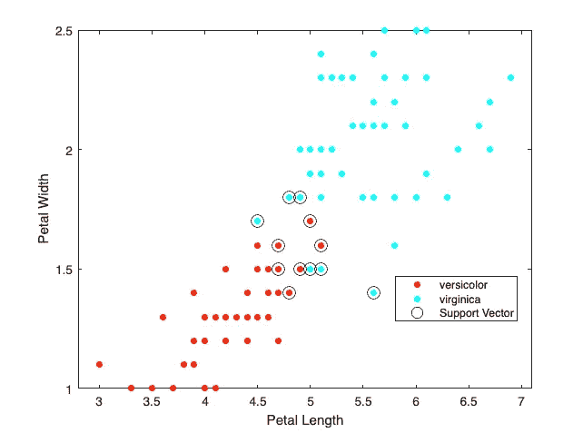

Image by Author

以下是控制台输出:

在第 1 行，我们运行程序并将函数返回值赋给`model`。

第 3–17 行列出了经过训练的 SVM 的详细信息。

第 20 行显示了到`model`的属性和方法的链接。

在第 22 行，我们调用内置函数`predict`，用训练好的`model`和输入值`[4, 1]`预测分类。

第 24–28 行正确地预测它是`'versicolor'`。

在第 30 行，我们用训练好的`model`和输入值`[6, 2]`预测分类。

第 32–36 行正确地预测它是`'virginica'`。

## 非线性支持向量机

我们使用 iris 数据集来构建非线性分类案例。如果我们将虹膜名称重新标记为两个类别，`'versicolor'`和`'non-versicolor'`，则训练集不再是线性可分的。然后我们可以使用高斯核来训练 SVM。

以下是训练非线性 SVM 的算法:

第 1 行指定了函数名`gaussianSVM`和返回值`SVMModel`。

第 2 行用变量`meas`和`species`加载数据集`fisheriris`。

第 3 行构造了`X`，这是`meas`的子矩阵，它包含了第 3 列和第 4 列的所有行。

第 4 行构建了从`species`复制的单元格数组`y`。

第 5 行检索索引`index`，其种类不是`'versicolor'`。

第 6 行将`y`的索引行重置为值`{'non-versicolor'}`。

第 7 行调用`gscatter`绘制构造好的`X`和`y`。

第 8 行调用`hold on`保留当前轴中的图，这样添加到轴中的新图不会删除现有的图。

第 9 行调用`fitcsvm`用输入`X`和`y`训练一个 SVM 模型。将`'KernelFunction'`设置为`'gaussian'`，将`'BoxConstraint'`设置为 1000。

第 10 行为经过训练的支持向量创建了一个变量`sv`。

第 11 行用大小为 10 的黑色(`k`)圆圈(`o`)绘制了`sv`。

第 12 行定义了图例标签。

第 13 行和第 14 行标记了 x 轴和 y 轴。

第 15 行调用`hold off`将保持状态设置为 off。

第 16 行终止该函数。

运行程序。该图显示了支持向量标记决策边界的分类。

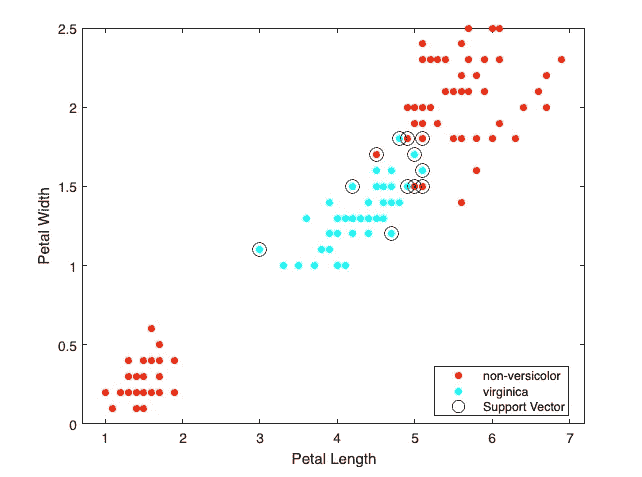

Image by Author

以下是控制台输出:

在第 1 行，我们运行程序并将函数返回值赋给`model`。

第 3–17 行列出了经过训练的 SVM 的详细信息。

第 20 行显示了到`model`的属性和方法的链接。

在第 22 行，我们调用`predict`来用训练好的`model`和输入值`[2, 0.5]`预测分类。

第 24–28 行正确地预测它是`'non-versicolor'`。

在第 30 行，我们用训练好的`model`和输入值`[4, 1]`预测分类。

第 32–36 行正确地预测它是`'versicolor'`。

在第 38 行，我们用训练好的`model`和输入值`[6, 2]`预测分类。

第 40–44 行正确地预测它是`'non-versicolor'`。

# 结论

有很多机器学习算法。本文提出了支持向量机在监督学习中的应用。机器学习编程语言设计有预建的库和对数据科学和数据模型的高级支持。我们已经展示了使用 MATLAB 实现线性和非线性支持向量机的例子。

以下是其他机器学习算法的列表:

*   [回归分析](https://betterprogramming.pub/machine-learning-theory-and-programming-supervised-learning-regression-analysis-8ed2d86f5714)
*   [逻辑回归](https://enlear.academy/logistic-regression-in-machine-learning-672c0e8c8053)
*   [神经网络](https://medium.com/geekculture/machine-learning-theory-and-programming-supervised-learning-neural-networks-74a598cb9e42)
*   [多类分类](/machine-learning-theory-and-programming-supervised-learning-for-multiclass-classification-ee0d9d32150e)
*   [K-均值聚类](/machine-learning-theory-and-programming-unsupervised-learning-k-means-clustering-52eeea41cba0)

感谢阅读。我希望这有所帮助。如果你有兴趣，可以看看[我的其他媒体文章](https://jenniferfubook.medium.com/jennifer-fus-web-development-publications-1a887e4454af)。

***注:*** *感谢 Josh Poduska、Andrew Ziegler、Subir Mansukhani 推荐机器学习资源！还有，感谢吴恩达教授的* [*机器学习课*](https://www.coursera.org/learn/machine-learning) *。*

# 附录

一些 MATLAB 程序用于生成本文的图像，我们想在这里分享它们。

## 线性分类

## 非线性分类

## 高斯核

*更多内容看* [***说白了. io***](http://plainenglish.io/)