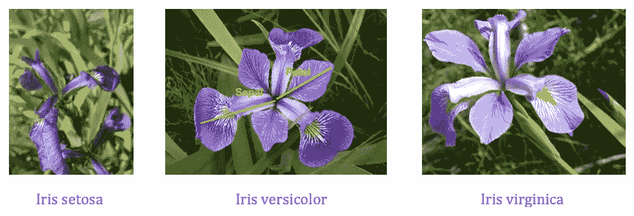

# 机器学习理论与程序设计——无监督学习:K-均值聚类

> 原文：<https://javascript.plainenglish.io/machine-learning-theory-and-programming-unsupervised-learning-k-means-clustering-52eeea41cba0?source=collection_archive---------10----------------------->

一种流行的机器学习算法介绍

Image credit: Jon Radchenko

我们走过了很多有监督的[机器学习](https://en.wikipedia.org/wiki/Machine_learning)算法、[线性回归、多项式回归](https://betterprogramming.pub/machine-learning-theory-and-programming-supervised-learning-regression-analysis-8ed2d86f5714)、[逻辑回归](https://enlear.academy/logistic-regression-in-machine-learning-672c0e8c8053)、[神经网络](https://medium.com/geekculture/machine-learning-theory-and-programming-supervised-learning-neural-networks-74a598cb9e42)、[支持向量机](/machine-learning-theory-and-programming-supervised-learning-support-vector-machine-d6cc7a5747f1) (SVMs)、以及[多分类器](/machine-learning-theory-and-programming-supervised-learning-for-multiclass-classification-ee0d9d32150e)。监督学习建立了一组数据的数学模型，其中包含输入(`x`)和正确的输出(`y`)。

[无监督学习](https://en.wikipedia.org/wiki/Unsupervised_learning)是一种机器学习，其中算法没有为训练数据提供任何正确的输出(`y`)。它发现训练数据集中自然出现的模式。聚类是一种无监督的学习算法，它将未标记的数据集(没有正确的输出)分组到不同的簇中。K 均值聚类算法将训练数据分组为 K 个聚类。它是最简单和最流行的无监督机器学习算法之一。

在本文中，我们来看看 K-means 聚类是如何工作的。

# k-均值聚类理论

我们假设数据集中有 K 个聚类。K-means 算法随机初始化 K 个聚类质心，`μ₁`，`μ₂`，…，`μₖ`。

重复以下循环，直到质心稳定(收敛)或达到预定义的迭代次数:

*   `for i = 1 to m`，找出哪个质心最接近`x⁽ⁱ⁾`。将簇索引分配给`c⁽ⁱ⁾`。
*   `for k = 1 to K`，计算分配给`kth`质心的点的平均值。将平均值分配给`μₖ`作为新的质心。

该算法的目标是找到聚类，使得总成本`J(c⁽¹⁾, c⁽²⁾,... ,c⁽ᵐ⁾,μ₁, μ₂, …, μₖ)`最低。

`||x — μ||²`是两点间欧几里得距离的平方。

以下是从[维基百科](https://en.wikipedia.org/wiki/K-means_clustering)下载的动态 gif 图片。它说明了三个质心如何从随机位置开始并收敛到三个聚类中心。在此过程中，数据集被分为三个集群。

Chire, CC BY-SA 4.0 <[https://creativecommons.org/licenses/by-sa/4.0](https://creativecommons.org/licenses/by-sa/4.0)>, via Wikimedia Commons

# k-均值聚类编程

还有机器学习专用的编程语言，比如 [MATLAB](https://matlab.mathworks.com/) 、 [Octave](https://www.gnu.org/software/octave/index) 、 [R](https://betterprogramming.pub/exploring-the-ai-programming-language-r-102d25af9646) 等。对于一些通用编程语言，如 Python，它们提供了机器学习库。强烈建议不要多此一举。我们可以使用机器学习特定的编程语言或机器学习库来解决多类分类问题。

MATLAB 是 MathWorks 开发的专有多范式编程语言和数值计算环境。它提供了一个内置函数`[kmeans](https://www.mathworks.com/help/stats/kmeans.html?searchHighlight=kmeans&s_tid=srchtitle)(X,k)`，用于执行 K-means 聚类，将矩阵`X`中的观察值划分为`k`个聚类。它返回一个向量(`idx`)，包含每个观察值的聚类索引。

## 虹膜数据的 k-均值聚类

Image credit: Wikipedia

[费希尔的虹膜数据](https://en.wikipedia.org/wiki/Iris_flower_data_set)是模式识别文献中最著名的数据库。它包括对 150 种鸢尾属植物的萼片长度、萼片宽度、花瓣长度和花瓣宽度的测量(在`cm`中)。`setosa`、`versicolor`和`virginica`三个物种各有 50 个标本。我们关注花瓣长度和花瓣宽度，它们是`meas`矩阵中的第 3 列和第 4 列。

Image by author

我们已经使用监督学习来分类 iris 类。这里我们使用无监督的 K-means 对它们进行分类。

第 1 行指定了函数名`kMeansClustering`。它有一个用于目标集群计数的参数`k`。

第 3–5 行加载数据集`fisheriris`，并将数据分配给`X`和`y`。`X`取虹膜数据的第 3 列和第 4 列，分别是花瓣长度和花瓣宽度。`y`是从`species`复制的单元格数组。

第 8 行指定随机数生成器的种子以控制再现性。

第 11–12 行使用内置函数`kmeans`来训练模型。第 11 行设置迭代输出的配置。第 12 行使用迭代输出运行`kmeans`，并返回经过训练的质心`C`。

第 15-18 行生成二维网格上的每个点，`xGrid`。密度由`d`(第 15 行)定义。`meshgrid(x, y)`根据矢量`x`和`y`中包含的坐标返回二维网格坐标。

第 21-23 行用一次`kmeans`迭代为训练过的`C`检查每个二维网格坐标。结果指标存储在`idxRegion`中，由`gscatter`绘制，其中`Region 1`用洋红色(`'m'`)`Region 2`用黄色(`'y'`)`Region 3`用青色(`'c'`)。第 23 行调用`hold on`来保留当前轴中的图，以便添加到轴中的新图不会删除现有的图。

第 26 行在彩色区域的顶部绘制了虹膜训练集`X`。

第 29 行在现有图形的顶部绘制了经过训练的质心`C`，其中`marker`是一个十字(`x`)，带有黑色的`color`(`k`)。`MarkerSize`是 15，`linewidth`是 3。

第 32–37 行绘制标题、轴标签和图例。

第 38 行设置了数据范围的轴限制。

第 39 行调用`hold off`将保持状态设置为关闭。

第 40 行终止该函数。

在 MATLAB 命令窗口上运行程序:

由于我们设置了`statset('Display', 'iter')`，所以显示的是迭代输出。需要 4 次迭代才能收敛。最佳距离总和`sumd`为`31.4129`。

以下是`kMeansClustering(3)`的分类:

Image by author

## 确定聚类数

我们已经使用 K-均值聚类来分类三个虹膜类。如果我们不知道要分类的聚类数，那该怎么办？

我们可以运行`kMeansClustering(2)`，得到两个类的分类:

Image by author

我们也可以运行`kMeansClustering(4)`，得到四个类的分类:

Image by author

两节课和四节课看起来都是合理的答案。

[肘方法](https://en.wikipedia.org/wiki/Elbow_method_(clustering))是确定数据集中聚类数量的启发式方法。在数学优化中，使用“肘”作为分界点是一种常见的启发式方法，以选择一个收益递减不再值得额外成本的点。

我们运行下面的算法来显示聚类数和成本函数 j 之间的关系。

第 1 行指定了函数名`kMeansElbowGraph`。

第 3–4 行加载数据集`fisheriris`，并将数据分配给`X`。`X`获取第 3 列和第 4 列虹膜数据，即花瓣长度和花瓣宽度。

第 7 行指定了随机数生成器的种子以控制再现性。

第 10–16 行训练 K-means 模型，使聚类数为 1，2，…，10。训练值`sumd`被汇总并与 k 一起存储

第 19 行描绘了`k`和`sumd`之间的关系。线条颜色为蓝色(`b`)，而`linewidth`为 2。

第 22–24 行绘制标题和轴标签。

第 27 行设置 x 轴的范围。

第 28 行结束了这个函数。

运行程序，我们得到了肘图:

Image by author

上图清楚地显示了`k = 2`或`k = 4`是可接受的选择，但`k = 3`是最佳选择。

# 结论

有很多机器学习算法。在这篇文章中，我们提出了 K-means 聚类的无监督学习。机器学习编程语言设计有预建的库和对数据科学和数据模型的高级支持。MATLAB 的内置函数`kmeans`，让训练变得简单有效。

以下是其他机器学习算法的列表:

*   [回归分析](https://betterprogramming.pub/machine-learning-theory-and-programming-supervised-learning-regression-analysis-8ed2d86f5714)
*   [逻辑回归](https://enlear.academy/logistic-regression-in-machine-learning-672c0e8c8053)
*   [神经网络](https://medium.com/geekculture/machine-learning-theory-and-programming-supervised-learning-neural-networks-74a598cb9e42)
*   [支持向量机](/machine-learning-theory-and-programming-supervised-learning-support-vector-machine-d6cc7a5747f1)
*   [多重量词](/machine-learning-theory-and-programming-supervised-learning-for-multiclass-classification-ee0d9d32150e)

感谢阅读。我希望这有所帮助。如果你有兴趣，可以看看[我的其他媒体文章](https://jenniferfubook.medium.com/jennifer-fus-web-development-publications-1a887e4454af)。

*注:感谢 Josh Poduska、Andrew Ziegler 和 Subir Mansukhani 推荐机器学习资源！还有，感谢吴恩达教授的* [*机器学习课*](https://www.coursera.org/learn/machine-learning) *。*

*更多内容请看*[*plain English . io*](http://plainenglish.io/)*。在这里报名参加我们的* [*免费周报*](http://newsletter.plainenglish.io/) *。*