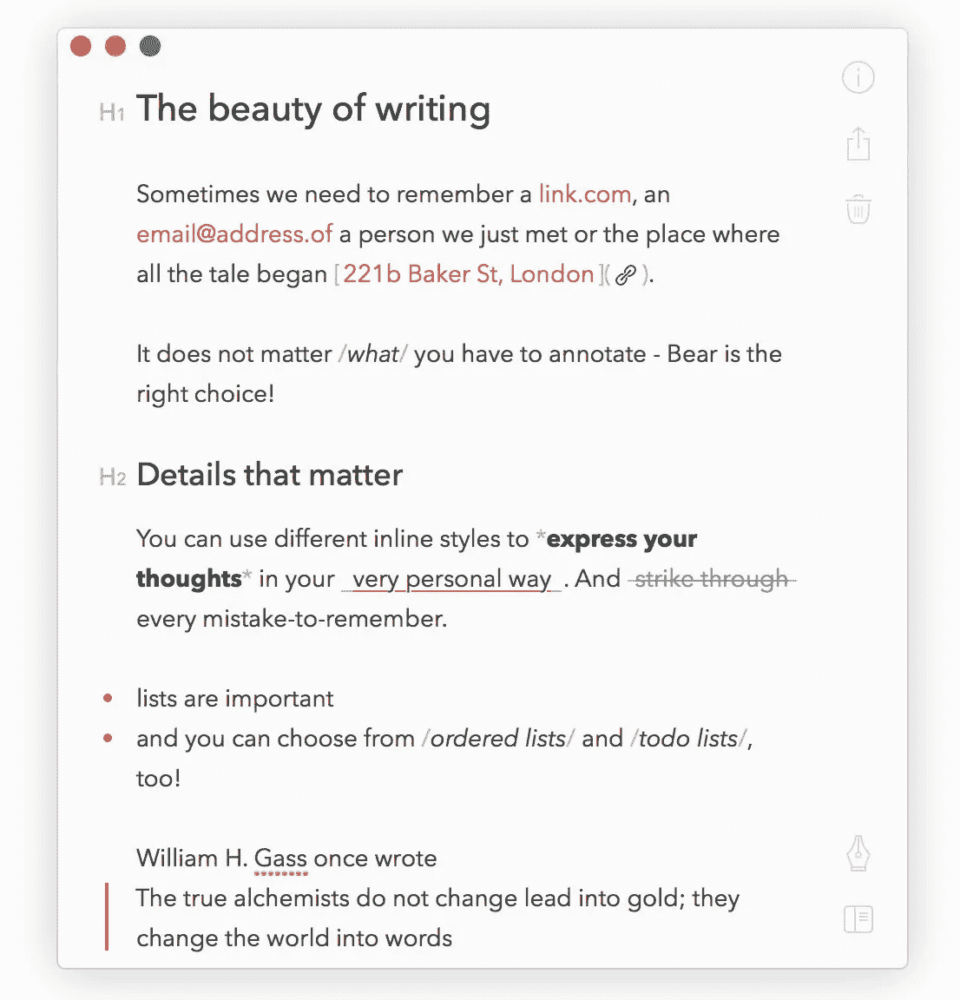

# macOS X 生产力提示

> 原文：<https://javascript.plainenglish.io/macos-x-productivity-tips-52502891731d?source=collection_archive---------18----------------------->

释放您的 Macbook——无需花费一分钱！

Photo by [Ales Nesetril](https://unsplash.com/@alesnesetril?utm_source=unsplash&utm_medium=referral&utm_content=creditCopyText) on [Unsplash](https://unsplash.com/s/photos/macbook?utm_source=unsplash&utm_medium=referral&utm_content=creditCopyText)

无论你是一个新用户，还是已经使用 mac 多年的用户，很可能你还没有探索系统的根源，你也没有必要，但你总是可以用新的技巧来提升你的工作流程。

与大多数软件一样，macOS 随着每个版本的发布变得越来越先进，但仍有相当多的东西可以修改，以帮助我们的日常工作。

# 每个用户的必需品

以下几个应用程序将帮助任何人，即使你不使用 mac 工作，或者相反，任何工作。

# 阿尔弗烈德

简单，却无比强大。阿尔弗雷德是我拿到的每台 mac 电脑上安装的第一件东西。它根本不需要任何设置。只需下载并打开它的键盘快捷键。搜索互联网或您的本地文件系统，包括联系人，计算器，货币转换器，打开任何应用程序，你已经安装了很多，更多，而仍然是绝对免费的！

不过，对于那些想要深入了解的人来说，你可以设置自己的工作流程，或者下载现有的工作流程，保存剪贴板历史记录，或者从手机上远程启动应用程序。对于习惯于只使用键盘的人来说，这是必备的。

我的建议是设置它在每次启动时启动，这样你马上就会习惯了。

# 矩形

没有人喜欢杂乱的工作空间，但是当然，每个人都在某个时候经历过。我绝对讨厌它，尽管我认为自己很有条理，这个应用程序完全改变了我的日常工作流程。它允许你将键盘快捷键绑定到应用程序窗口，因此你可以调整大小，在屏幕上移动，在显示器之间移动等等。

在这里免费下载。

# 语法上

尽管不是每个人都是作家，但如今几乎任何一种工作都需要正式的沟通，仅仅是一封电子邮件，或者是给经理、客户或任何其他关系的信息，我们不希望在发出之前看起来好像我们甚至没有阅读自己的信息。语法上的救援！它提供了相当不错的语法和准时检查，同时仍然让你决定是否要接受它的建议(是的，我在看着你，自动更正>)。

# Mail

I honestly never got used to the default Mac Mail app. My full-time job requires more than a few daily emails, so I have been constantly looking for an alternative, a suitable mail application to keep up with multiple inboxes, calendars and so on. My search stopped when I discovered [给自己的航空邮件](https://airmailapp.com/#mac)。

它是高度可定制的，设计令人愉快，并与整个苹果设备生态系统兼容。设备之间的无缝集成和简单的配置让我很快爱上了它！推荐给大家。

# 1 密码

这不是免费的，但我认为这是一个光荣的提。随着这些天一切都在云上进行，并建议对不同的网站使用不同的密码，这个应用程序将为你跟踪一切。你只需要一个密码就可以控制所有人:)

# **生产力提升**

下一组应用程序已经更多地与工作/生产力相关，扩展了系统的一般用途

# 酒保

第一个，非常恰当地以它的主要目标命名——修改系统栏。你可以很容易地在顶栏上显示和隐藏不同的应用程序，并将它们映射到键盘快捷键上。

官网[这里](https://www.macbartender.com/)。

# 熊

文笔之美！就像他们官网上提到的。

Bear 是一个时尚的笔记应用程序，可以满足您的所有需求。它可以在所有苹果设备上完美运行，同步你的账户。在文件夹或标签中轻松整理，利用直观的降价设计，甚至将敏感内容设为隐私，仅通过面部/触摸 Id 访问。基本用法是免费的，可以从[这里](https://bear.app/)下载。

# Todoist

与酒保类似，这个程序也有自己的名字，但它不仅仅是一个简单的待办事项列表应用程序。它允许你将你的任务分组，设置优先级和可选的提醒，同时跟踪你的进度。

你可以在这里找到[。](https://todoist.com/)

# 作家的天堂

尤利塞斯探测器

内容创作者的非凡应用。甚至被苹果公司在设计奖上选中。尤利西斯是一个丰富的文本编辑器，专为作家打造。轻松管理你的想法，分别写你的手稿。在文件夹和类别中整理。你拥有一切。之后，轻松导出到 PDF，保持相同的格式，你都设置好了。该界面功能强大，但设计简单，允许您立即关注您的内容。

[官网](https://ulysses.app/)

**额外收获**:你有没有发现自己在网上有很多很棒的资源，却没有时间去找，所以你把它们留到以后，再也不去读它们？是啊，我也是。

这就是口袋[来营救的地方。在同一个空间中，列出您在互联网上保存的所有内容。像这样简单。](https://getpocket.com/en/)

# Web 开发

Photo by [Farzad Nazifi](https://unsplash.com/@euwars?utm_source=unsplash&utm_medium=referral&utm_content=creditCopyText) on [Unsplash](https://unsplash.com/s/photos/web-development?utm_source=unsplash&utm_medium=referral&utm_content=creditCopyText)

我的全职工作实际上是一名 web 开发人员，所以我不能没有对我来说最重要的生产力应用程序，我每天都在使用它。

# **Visual Studio 代码**

我不认为这一行的任何人没有尝试过或者至少听说过这个。我相信这是微软为我个人利益提供的最重要的工具:)我绝对喜欢它。一个非常轻便、高度可定制的代码编辑器，几乎可以用于任何类型的开发。

Photo by [Ferenc Almasi](https://unsplash.com/@flowforfrank?utm_source=unsplash&utm_medium=referral&utm_content=creditCopyText) on [Unsplash](https://unsplash.com/s/photos/web-development?utm_source=unsplash&utm_medium=referral&utm_content=creditCopyText)

当用于任何类型的 web 开发时都特别有用，这利用了微软的另一个伟大的工具——[TypeScript](/typescript-what-why-how-3c2301e6ea40)。我将它用于我所有以任何方式涉及 TypeScript 或 JavaScript 的项目，不管它是用于前端还是后端应用程序开发。

有很多扩展，从括号高亮显示到在编辑器中实时预览应用程序。我将为完整的设置和最常用的扩展发布一篇单独的文章。

# 结论

我希望这里提到的工具能像帮助我一样帮助任何人加快他们的进程。如果你觉得我遗漏了什么，请随意评论，或者联系 [LinkedIn](https://www.linkedin.com/in/ivan-dzhurov-18161383/) 。

我已经发表了几篇与发展相关的文章，您可以在这里找到:

[TypeScript 开发环境设置](/typescript-environment-with-webpack-compilation-and-automatic-reload-b4d6d5a60f6f)

[JavaScript 开发环境设置](https://medium.com/@dzhurovivan/es6-development-environment-made-easy-with-babel-gulp-and-webpack-a4017bd96c30)

*更多内容请看*[*plain English . io*](http://plainenglish.io/)*。报名参加我们的* [*免费每周简讯*](http://newsletter.plainenglish.io/) *。在我们的* [*社区不和谐*](https://discord.gg/GtDtUAvyhW) *获取独家写作机会和建议。*