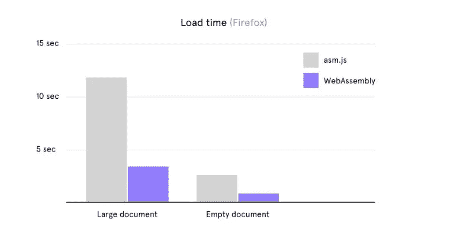
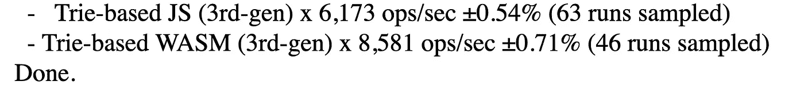

# 3 个已经开始拥抱 WebAssembly 的大项目

> 原文：<https://javascript.plainenglish.io/made-with-webassembly-e2115fe7d97c?source=collection_archive---------3----------------------->

## 它随时可以用来打破 JavaScript 的限制

Photo by [Austin Distel](https://unsplash.com/@austindistel?utm_source=medium&utm_medium=referral) on [Unsplash](https://unsplash.com?utm_source=medium&utm_medium=referral)

WebAssembly 已准备好投入生产。虽然只有 1.1 版，但字节码已经在使用。不仅是爱好程序员，也是大公司和大项目。

下面是 3 个以不同方式使用 WebAssembly 的项目和公司。玩得开心！

# 1.Figma

Figma 是一个完全在浏览器中运行的基于云的设计工具。有了浏览器中的 SVGs 和 canvas，你不会走得太远。为了使模糊、渐变和混合在设计平台上正常工作，它完全依赖于自己的 WebGL 引擎。

Figma 多年来一直在使用 Emscripten，这是一个用于 C 和 C++的 WebAssembly 编译器。但由于 WebAssembly 2017 年才发布，Figma 在此之前一直与 asm.js 合作。然后 Emscripten 将 C/C++代码编译为 asm.js。

asm.js 是 JavaScript 的一个子集。没有字符串和对象，只有数字。这允许执行 C++代码，因为在引擎盖下所有的东西都用数字表示。整个 C++内存空间可以用一个巨大的数字数组来表示。然后，指针作为数组的索引。

一个优点是可以使用 32 位浮点来代替 JavaScript 的 64 位双精度浮点。在大型应用程序中，这对内存使用有积极的影响。

是的，这一切都相当复杂和抽象。重要的是你要知道 Figma 在 WebAssembly 之前已经做了很多优化。
因此，性能对比并不是针对“经典”JavaScript。

**2017 年出现了网络组装**——真正的字节码，而不是想要成为 C++的执行。由于之前已经有了这个代码库，Figma 从那时起就将 C++代码编译到了 WebAssembly 中。相当流畅的过渡。

Asm.js 和 WebAssembly 有一个共同点——它们还不能独立地访问 DOM。但 WebAssembly 在几个方面明显优于它的前身。

**WebAssembly 更加紧凑。**另外，浏览器对它的解析能力比 JavaScript 更强。原因很简单:JavaScript 是一种人类语言，而且就像编写的一样，它必须由浏览器解析。WebAssembly 仅针对浏览器进行了优化。

从 Asm.js 转换到 WebAssembly 的结果令人印象深刻。加载时间缩短了三倍。

Source: [figma.com](https://www.figma.com/blog/webassembly-cut-figmas-load-time-by-3x/)

加载时间的含义如下:

> 当我们在 Figma 测量加载时间时，我们包括初始化我们的应用程序、下载设计文件和第一次呈现整个设计的时间。
> - [Figma](https://www.figma.com/blog/webassembly-cut-figmas-load-time-by-3x/)

总之，一个令人印象深刻的结果。重要的是要记住，性能提升是与 Asm.js.
相比的。这个子集已经是非典型的性能优化。

与普通的 JavaScript 相比，WebAssembly 在这个用例中表现得更好。

# 2.Lichess

在线下棋——这正是 Lichess 提供的。在国际平台上，玩家可以竞争，也可以解决任务和对抗机器人。

国际象棋是一种复杂的游戏。在有 32 个棋子的 64 个方块上，有无穷的可能性来移动。多亏了国际象棋软件，玩家可以在电脑上练习不同的难度。玩过的游戏可以事后分析。国际象棋软件可以用来找到一种情况下最好的可能的移动。

***Stockfish*** 击败了迄今为止所有的国际象棋大师。该引擎被认为是最好的引擎之一，完全用 C++编写&是开源的。

这正是 Lichess 所利用的——因为数字象棋游戏背后的计算工作发生在玩家的浏览器中。多亏了 WebAssembly，这才成为可能。对于 Lichess 来说，这是他们的服务器的一大解脱。

代码库非常现代——甚至使用线程来快速分析国际象棋的走法。

由于尚未完全支持 WebAssembly，该引擎只能在基于 Firefox 和 Chromium 的浏览器中运行。在 Safari 中，计算是通过后端完成的。

你可以在这里看到分析引擎的运行:[https://lichess.org/analysis](https://lichess.org/analysis)

# 3.uBlockOrigin

许多人使用广告拦截器。但是只有极少数人知道它们是如何工作的。基本上，它没有那么复杂——但它仍然需要大量的计算能力。

广告拦截器不会删除页面上的广告，而是阻止它们加载。在网页上，广告主要是通过 JS 库来显示的。Google AdSense 就是一个例子。当网页加载时，AdSense 的 JavaScript 代码被请求、执行，并最终在 DOM 中显示广告。广告拦截器检测到页面正在请求广告库，并中止获取过程。

有成千上万的图书馆用来展示广告。每一个都可以通过非常不同的 URL 请求——例如，基于版本、CDN 或传递的参数。广告拦截器必须考虑到这一点。

必须检查要加载的每个外部资源。这种检查是基于 URL 中的关键字或整个 URL 这样的模式——极端的计算工作，因为巨大的列表必须被遍历。

这就是 WebAssembly 的用武之地。拦截器 uBlockOrigin，作为浏览器扩展提供，使用字节码运行其检测算法。得益于一个可用的基准测试[每个人都可以看到 WebAssembly 的速度有多快。](https://raw.githack.com/gorhill/uBlock/master/docs/tests/hnset-benchmark.html)

点击“查找”，然后稍等片刻。最后，最后两行很重要——它们显示了用 JS 和 WASM 实现的算法相比有多快。

Source: The author

当我在 Firefox 上运行测试时，每秒钟多了近 2000 次操作。

# 总结

这是三个不同的项目，对 WebAssembly 有不同的用途。

与陈词滥调相反，这表明了一件事:WebAssembly 在许多场景中都很有用——不仅仅是使用 Canvas 和 WebGL。

我发现利切斯的例子特别令人兴奋。在浏览器不支持 WebAssemby 的情况下，工作在服务器上完成。

但由于浏览器中的 GPU 支持，将计算任务外包给浏览器的机会越来越多。网络不再仅仅是一个展示的地方。

感谢您的阅读——这篇文章是我关于 WebAssembly 系列文章的一部分。如果您想了解更多信息，请查看:

【WebAssembly 在网络上会有什么变化？

[testosterones 上的 TypeScript 使用 AssemblyScript 使 WebAssembly 变得简单](https://medium.com/javascript-in-plain-english/assemblyscript-4c68a3c3ecf7)

## [加入我的免费简讯，了解最新消息](http://eepurl.com/hacY0v)