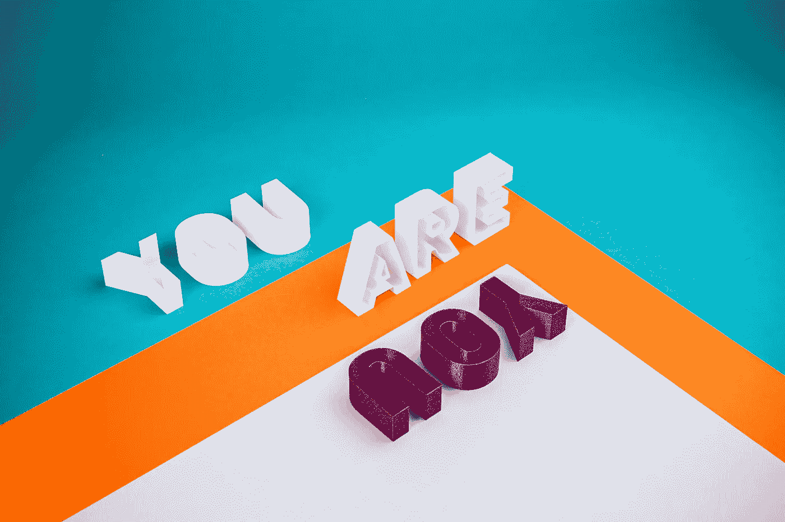

# 用 3D 动画文本让你的网站脱颖而出

> 原文：<https://javascript.plainenglish.io/make-3d-animated-texts-for-your-website-eca1a34f2c5b?source=collection_archive---------14----------------------->

如何只用纯 CSS 制作 3D 文本？



Photo by [stefan moertl](https://unsplash.com/@shmdsgn?utm_source=unsplash&utm_medium=referral&utm_content=creditCopyText) on [Unsplash](https://unsplash.com/s/photos/3d-text?utm_source=unsplash&utm_medium=referral&utm_content=creditCopyText)

大家好，

今天我想和你分享我所学到的一些只用 HTML 和 CSS 制作 3D 文本的技巧。另外，我还试图在本教程中为这些 3D 文本制作动画。如果你能应用这一点，希望它能让你的网站更吸引人，更突出。

我们将从这个主题中学到什么:

*   **使用文本阴影的 3D 文本**
*   **使用 SVG 滤镜的 3D 文本**
*   **3D 文本使用图层**

好了，我们开始吧！

1.  **使用文本阴影的 3D 文本:**

首先，在您的 HTML 文件中，创建一个元素，如下所示:

```
<h1>
 BOLD
</h1>
```

然后，在你的 CSS 文件中，重要的部分是添加如下的 **"text-shadow"** 属性:

```
h1 {
 margin: auto;
 position: absolute;
 top: 2rem;
 right: 0;
 bottom: 0;
 left: 6rem;font-size: 20rem;
 font-weight: 800;
 font-family: "VT323", monospace;
 color: #fef6e4;
 **text-shadow: 5px 5px 0px #172c66, 10px 10px 0px #001858, 15px 15px 0px #f9bc60,20px 20px 0px #ff8e3c, 25px 25px 0px #9656a1;**transform-style: preserve-3d;
 animation: animated-text 5s infinite alternate ease-in-out -5s;
 animation-fill-mode: forwards;
 transform: rotateY(20deg) rotateX(20deg) translateZ(0);
}
```

注意"**文本-阴影"**将使文本具有 3D 外观。您可以为您选择的**“文本-阴影”**属性定制这些值。点击阅读更多关于文字阴影属性[的内容。](https://www.w3schools.com/cssref/css3_pr_text-shadow.asp)

对于动画，您可以注意到这些代码行:

```
h1{
... **animation: animated-text 5s infinite alternate ease-in-out -5s;
 animation-fill-mode: forwards;
 transform: rotateY(20deg) rotateX(20deg) translateZ(0);**
}**@keyframes animated-text {
 100% {
  transform: rotateY(-20deg) rotateX(-20deg);
 }
}**
```

同样，您也可以自定义" **animation"** 属性的这些值，只要您了解这些值用于 **"animation"** 属性。你可以通过 CSS [这里](https://www.w3schools.com/css/css3_animations.asp)了解更多关于动画的知识。

点击此处查看[演示](https://codepen.io/juniHub/pen/XWRXOzN?editors=1100)和完整代码:

**2。使用 SVG 滤镜的 3D 文本:**

正如标题本身所说，这个 3D 文本可以使用一个 **SVG** 过滤器来创建，它给文本添加了一些**“噪声”**效果。在 HTML 文件中添加如下 SVG 代码:

```
<h1>BOLD</h1>**<svg ae lb" href="http://www.w3.org/2000/svg" rel="noopener ugc nofollow" target="_blank">**http://www.w3.org/2000/svg****" class="filter">
 <defs>
  <filter id="shadow">
   <feTurbulence type="turbulence" baseFrequency="0.2" numOctaves="100" result="turbulence" />
   <feDisplacementMap in2="turbulence" in="SourceGraphic" scale="50" xChannelSelector="R" yChannelSelector="G" result="grainyShadow1" />
   <feDisplacementMap in2="turbulence" in="SourceGraphic" scale="50" xChannelSelector="R" yChannelSelector="G" result="grainyShadow2" />
   <feColorMatrix in="grainyShadow1" result="colorCorrected1" type="matrix" values="1 0 0 -1 0
                  0 0 0 -1 0
                  0 0 0 -1 0
                  0 0 0 1 0" />
   <feColorMatrix in="grainyShadow2" result="colorCorrected2" type="matrix" values="1 0 0 -1 0
                  0 0 0 -1 0
                  0 0 0 -1 0
                  0 0 0 1 0" />******<feMerge>
    <feMergeNode in="colorCorrected1" />
    <feMergeNode in="colorCorrected2" />
    <feMergeNode in="SourceGraphic" />
   </feMerge>****</filter>
 </defs>
</svg>**
```

注意**<feTurbulence/>**标签，此处[定义为](https://developer.mozilla.org/en-US/docs/Web/SVG/Element/feTurbulence):

> SVG 过滤器原语使用柏林湍流函数创建图像。它允许人工纹理的合成，如云或大理石。结果图像将填充整个过滤器图元子区域。

在上面的代码中，这个 **SVG** 滤镜函数将帮助我们为文本阴影创建一个**“噪波”**效果。而且，您可以通过更改其属性值来自定义它。

要展示这种效果，只需在 CSS 文件中添加以下代码行:

```
h1 {
 margin: auto;
 position: absolute;
 top: 2rem;
 right: 0;
 bottom: 0;
 left: 6rem;font-size: 20rem;
 font-weight: 800;
 font-family: "VT323", monospace;
 color: #f582ae;
 **filter: url(#shadow);****animation: animated-text 5s infinite alternate ease-in-out -5s;
 animation-fill-mode: forwards;
 transform: rotateY(20deg) rotateX(20deg) translateZ(0);
}****@keyframes animated-text {
 100% {
  transform: rotateY(-20deg) rotateX(-20deg);
 }
}**
```

注意 h1 元素的**过滤器**属性有一个 URL 链接到 id 为**“阴影”**的 **SVG** ，这是我们之前在 HTML 文件中创建的。

点击此处查看[演示](https://codepen.io/juniHub/pen/rNwrNBB)和完整代码:

**3。使用图层的 3D 文本:**

另一个让文字看起来有 3D 效果的技术是为文字制作**图层**。因此，在 HTML 文件中，为每个层创建 **div 元素**，如下所示:

```
<div class="container">
 <div id="one" class="layer"></div>
 <div id="two" class="layer"></div>
 <div id="three" class="layer"></div>
 <div id="four" class="layer"></div>
 <div id="five" class="layer"></div>
 <div id="six" class="layer"></div>
 <div id="seven" class="layer"></div>
 <div id="eight" class="layer"></div>
 <div id="nine" class="layer"></div>
 <div id="ten" class="layer"></div>
 <div id="eleven" class="layer"></div>
 <div id="twelve" class="layer"></div>
 <div id="thirteen" class="layer"></div>
 <div id="fourteen" class="layer"></div>
 <div id="fifteen" class="layer"></div>
 <div id="sixteen" class="layer"></div>
 <div id="seventeen" class="layer"></div>
 <div id="eighteen" class="layer"></div>
 <div id="nineteen" class="layer"></div>
 <div id="twenty" class="layer"></div>
</div>
```

这取决于你的文字有多厚，层数越多就越厚。

现在，在 CSS 文件中，你可以看到我正在使用**伪类**，如下所示。这些伪类是将层附加到我们的文本的关键。关于这个[你可以在这里](https://developer.mozilla.org/en-US/docs/Web/CSS/Pseudo-classes)了解更多。

```
.layer { width: 100%;
 height: 100%;
 position: absolute;
 transform-style: preserve-3d;
 animation: animated-text 5s infinite alternate ease-in-out -5s;
 animation-fill-mode: forwards;
 transform: rotateY(20deg) rotateX(20deg) translateZ(0);}**.layer:after {** **font-size: 20rem;
 font-weight: 800;
 font-family: "VT323", monospace;
 content: "BOLD";
 white-space: pre;
 text-align: center;
 height: 100%;
 width: 100%;
 position: absolute;
 top: 50px;
 color: #f582ae;
 letter-spacing: -2px;
 text-shadow: 4px 0 10px rgba(0, 0, 0, 0.13);****}****.layer:nth-child(1):after {
 transform: translateZ(0px);
}****.layer:nth-child(2):after {
 transform: translateZ(-1.5px);
}****.layer:nth-child(3):after {
 transform: translateZ(-3px);
}****.layer:nth-child(4):after {
 transform: translateZ(-4.5px);
}****.layer:nth-child(5):after {
 transform: translateZ(-6px);
}****.layer:nth-child(6):after {
 transform: translateZ(-7.5px);
}****.layer:nth-child(7):after {
 transform: translateZ(-9px);
}****.layer:nth-child(8):after {
 transform: translateZ(-10.5px);
}****.layer:nth-child(9):after {
 transform: translateZ(-12px);
}****.layer:nth-child(10):after {
 transform: translateZ(-13.5px);
}****.layer:nth-child(11):after {
 transform: translateZ(-15px);
}****.layer:nth-child(12):after {
 transform: translateZ(-16.5px);
}****.layer:nth-child(13):after {
 transform: translateZ(-18px);
}****.layer:nth-child(14):after {
 transform: translateZ(-19.5px);
}****.layer:nth-child(15):after {
 transform: translateZ(-21px);
}****.layer:nth-child(16):after {
 transform: translateZ(-22.5px);
}****.layer:nth-child(17):after {
 transform: translateZ(-24px);
}****.layer:nth-child(18):after {
 transform: translateZ(-25.5px);
}****.layer:nth-child(19):after {
 transform: translateZ(-27px);
}****.layer:nth-child(20):after {
 transform: translateZ(-28.5px);
}****.layer:nth-child(n + 10):after {
 -webkit-text-stroke: 3px rgba(0, 0, 0, 0.25);
}****.layer:nth-child(n + 11):after {
 -webkit-text-stroke: 15px #8bd3dd;
 -webkit-text-shadow: 6px 0 6px #00366b, 5px 5px 5px #002951, 0 6px 6px #00366b;
}****.layer:nth-child(n + 12):after {
 -webkit-text-stroke: 15px #8bd3dd;
}****.layer:last-child:after {
 -webkit-text-stroke: 17px rgba(0, 0, 0, 0.1);
}****.layer:first-child:after {
 color: #f582ae;
 text-shadow: none;
}****@keyframes animated-text {
 100% {
  transform: rotateY(-20deg) rotateX(-20deg);
 }
}**
```

点击此处查看[演示](https://codepen.io/juniHub/pen/LYLJoVX)和完整代码:

今天这个教程就到这里。我希望您发现它很有用，并且很容易使用。如果你对动画主题感兴趣，你可以在这里阅读更多内容:

[](/make-your-site-stand-out-with-animation-4bb855c5a109) [## 用动画让你的网站脱颖而出

### 如何使用 CSS 和 JavaScript 创建动画，使你的网站更有吸引力

javascript.plainenglish.io](/make-your-site-stand-out-with-animation-4bb855c5a109) [](https://enlear.academy/quick-animation-for-website-html-only-made-with-lottiefile-8f72883821d0) [## 网站的快速动画 HTML 仅使用 LottieFile 制作

### 如何用 LottieFile 在 1 分钟内为你的网站制作动画

enlear .学院](https://enlear.academy/quick-animation-for-website-html-only-made-with-lottiefile-8f72883821d0) 

*更多内容请看*[***plain English . io***](http://plainenglish.io/)