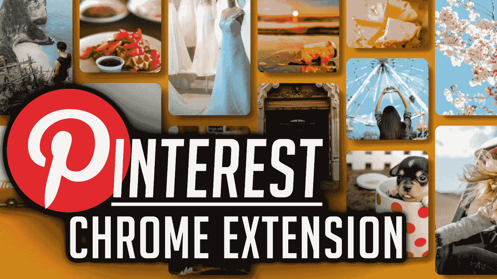
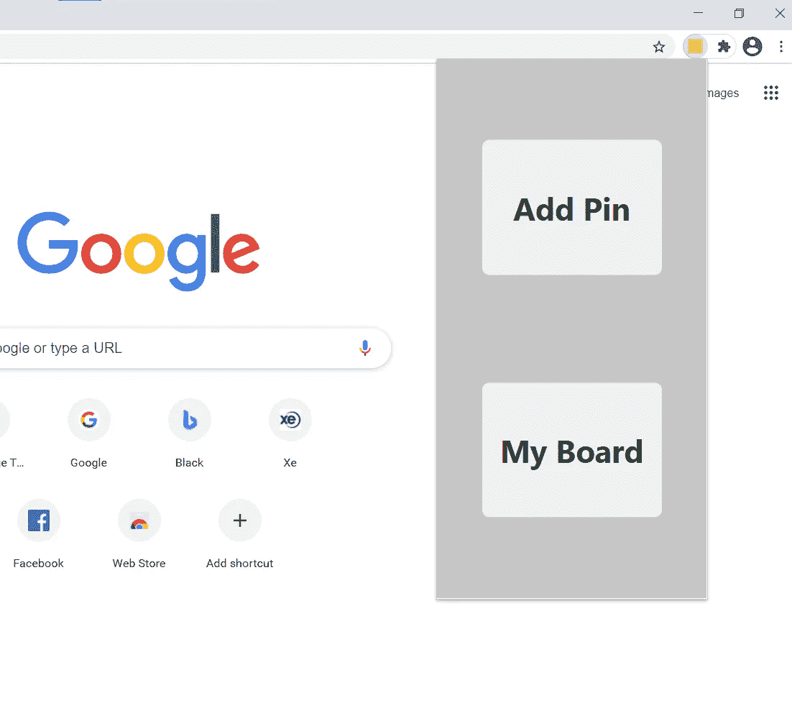
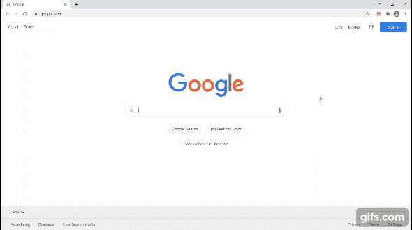
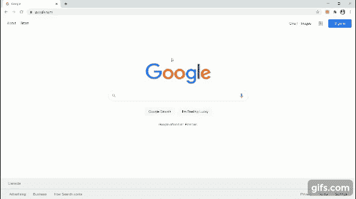

# 制作 Pinterest Chrome 扩展

> 原文：<https://javascript.plainenglish.io/make-a-pinterest-chrome-extension-bc4900c76414?source=collection_archive---------10----------------------->

将你浏览的网站保存在 Pinterest 板上。

这篇文章假设你知道如何从头开始创建一个 JavaScript Pinterest 克隆。如果你不知道如何，在这里观看教程[](/create-a-javascript-pinterest-clone-68b8ca786b66)****。****

**对于本教程，我们只是升级了 JavaScript Pinterest 克隆的功能，并将其集成到 Chrome 扩展中。**

****

# ****第一部分。整合****

## **让我们回顾一下我们的文件结构。**

**我们将从 **manifest.json** 开始。**

```
{ “name”: “Pinterest Chrome Extension”, “description”: “Pinterest Chrome Extension”, “version”: “0.1.0”, “manifest_version”: 2, “icons”: { “16”: “./images/icon-16x16.png”, “32”: “./images/icon-32x32.png”, “48”: “./images/icon-48x48.png”, “128”: “./images/icon-128x128.png” }, “background”: { “scripts”: [“./scripts/background.js”] }, “browser_action”: { “default_popup”: “popup.html” }, “permissions”: [ “tabs”, “storage”, “unlimitedStorage”, “https://*/*png", “https://*/*jpg", “https://*/*jpeg", “https://*/*gif" ]}
```

****注意事项:****

*   **我们需要一个背景脚本来协调我们的整个扩展。**
*   **我们需要**选项卡权限**，这样我们就可以保存网站的网址。**
*   **我们需要**存储**和**无限存储权限**，这样我们就可以保存 Pin 数据(包括图像数据)。**
*   **我们需要以图像扩展结尾的**域/主机权限，以允许我们的扩展下载图像。****

****我们的 popup.html**将是一个简单的页面，为用户提供选项**基于他们正在访问的当前站点添加新的 Pin 码**或**打开他们的 Pin 码板并手动添加 Pin 码**。**

****

****为了将我们实际的 Pinterest 板集成到扩展中，我们只需在用户浏览器中用我们的 Pinterest 板打开一个新标签。****

**因此，当用户点击我们的**popup.html**中的一个按钮时，我们执行一个 **popup_script.js** 脚本，告诉我们的 **background.js** 打开我们的开发板或添加一个 Pin。**

```
chrome.runtime.onMessage.addListener((request, sender, sendResponse) => { if (request.message === ‘add_pin’) { new_pin_data = { …request.payload }; chrome.tabs.create({ active: true, url: ‘./board.html’ }, tab => recent_tab = tab.id); } else if (request.message === ‘my_board’) { chrome.tabs.create({ active: true, url: ‘./board.html’ }); }}
```

****

# ****第二部分。升级****

## ****让我们添加从 URL 保存图像的功能。****

**当用户点击我们的“**从站点**保存”按钮时，我们将打开一个**输入**并获取一个 URL。**

**我们将使用一个**获取**来获取图像，并以与从本地硬盘中选择图像相同的方式对其进行处理。**

```
<!-- board.html --><div class=”save_from_site”> <span style=”pointer-events: none;”>Save From Site</span> <input placeholder=”Past a URL to an image” type=”text” 
    name=”save_from_site_input” id=”save_from_site_input”> <div class=”upload_image_url”>Upload</div> <div class=”cancel_image_url”>Cancel</div></div>// board.jsif (event.target === save_from_site) { // hide the ‘save from site’ button // show the input for taking a url // show the upload button // show the cancel button} else if (event.target === upload_image_url) { // fetch the image from the url // parse the image as a blob // read the image into our Pinterest board} else if (event.target === cancel_image_url) { // show the ‘save from site’ button // hide the input for taking a url // hide the upload button // hide the cancel button}
```

****

# ****第三部分。存储****

## ****让我们使用 Chrome 的‘local storage’API。****

**将数据保存到用户的硬盘非常简单。我们将把信息保存为一个**对象数组**。**

**通过使用“存储”API 的两次调用，我们可以获得先前保存的**引脚**:**

```
chrome.storage.local.get(‘pins’, data => {});
```

**将新的**引脚**添加到数据集中。**

```
const new_pins = data.pins ? […data.pins, new_pin_data] : [new_pin_data];
```

**并保存更新后的**引脚**。**

```
chrome.storage.local.set({ pins: new_pins });
```

**然后，当请求时，我们可以将保存的 pin 提供给 Pinterest 板。**

```
// board.jschrome.runtime.sendMessage({ message: ‘get_pins’}, response => { if (response.message === ‘success’) { response.payload.forEach(pin_data => { create_pin(pin_data); }); }});// background.js…} else if (request.message === ‘get_pins’) { chrome.storage.local.get(‘pins’, data => { if (chrome.runtime.lastError) { sendResponse({ message: ‘fail’ }); return; } sendResponse({ message: ‘success’, payload: data.pins ? data.pins : [] }); });return true;}
```

## **这个项目有更多的细微差别。**

**你可以在这里 获得源文件 [**，你也可以跟随下面的视频教程。**](https://github.com/an-object-is-a/chrome-ext-pinterest)**

**如果你想要更深入的指导，可以看看我在 YouTube 上的完整视频教程， [**一个物体是一个**](https://www.youtube.com/c/anobjectisa) 。**

**一定要在 [**Instagram**](https://www.instagram.com/an_object_is_a/) 和 [**Twitter**](https://twitter.com/anobjectisa1) 上关注我们，及时了解我们最新的 **Web 开发教程**。**

## ****做一个 Pinterest 谷歌 Chrome 扩展****