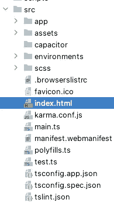

# 使 IndexedDB 在电容器和 iOS 14.6 上工作

> 原文：<https://javascript.plainenglish.io/make-indexeddb-work-on-capacitor-and-ios-14-6-a0a75141ca1a?source=collection_archive---------9----------------------->

## 本文是关于修复 iOS 14.6 的一个问题，IndexedDB 和一个 PWA 通过电容在 iOS 上运行。


Photo by [Szabo Viktor](https://unsplash.com/@vmxhu?utm_source=medium&utm_medium=referral) on [Unsplash](https://unsplash.com?utm_source=medium&utm_medium=referral)

苹果于 5 月 24 日发布了新版 iOS 14.6。原来这个版本的固件引入了一个错误，IndexedDB: [这里](https://developer.apple.com/forums/thread/681201)苹果开发者论坛上的一个讨论，但这个问题也在其他平台上出现，比如 Ionic: [这里](https://developer.apple.com/forums/thread/681201)。关于这个 bug 的一篇有趣的文章也在[这里](https://www.theregister.com/2021/06/16/apple_safari_indexeddb_bug/)。

该问题与 IndexedDB 的打开有关，刷新页面应该可以解决该问题(即使可能会让您的用户感到烦恼)。

在我的情况下，这有点棘手:事实上，我在 iOS 上运行的 PWA 使用了 Capacitor，这与在 Safari 上运行该应用不同。无论如何，刷新应用程序并不能解决问题。

您在调试日志中得到的错误是:

```
You need to use the openDatabase function to create a database before you query it!
```

所以你检查你的代码，看到这个:

```
initializeDb() {
  **this**.indexedDB = **new** NgxIndexedDB(**this**.DB_NAME, **this**.DB_VERSION);
  **return this**.indexedDB.openDatabase(**this**.DB_VERSION, evt => {
     ...
  });
}
```

我们实际上是在调用这个方法，为什么会这样呢？

经过一番研究，并感谢之前发布的链接，我发现这个小代码可以有所帮助:

```
<**script** type**="text/javascript"**>
  window.indexedDB;
</**script**>
```

诀窍是这个应用程序是用 Angular 编写的 PWA:我把应该加载到每个页面的代码放在哪里？

最后，我把这个片段放到了 index.html 的文件中，然后数据库就可以正确加载了！在下面的截图中你可以看到项目中的 *src* 包和*index.html*文件:



index.html file in the Angular project

希望这有所帮助。如果你有任何意见，请告诉我。

*更多内容请看*[***plain English . io***](http://plainenglish.io)