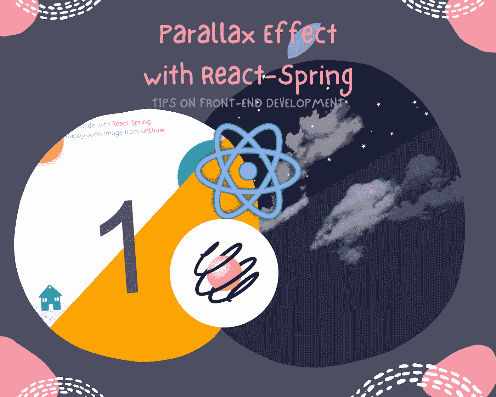
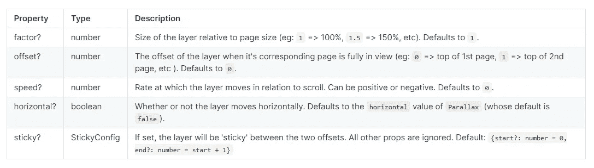

# 使用 React-Spring 制作具有视差效果的惊艳网站

> 原文：<https://javascript.plainenglish.io/make-sites-stunning-with-parallax-effect-using-react-spring-93eb40a10182?source=collection_archive---------5----------------------->

## 如何用反作用弹簧制作垂直和水平的视差效果



Image Designed with [Canva](https://www.canva.com/)

你好，希望你们都过得好。欢迎来到我关于前端开发的第四个技巧，这次我们将使用我最喜欢的前端框架及其库再次探索**视差效果**:**React**和 **React-Spring。**

正如你已经知道的，React 是一个 JavaScript 库，基于他们网站上的文档来构建用户界面。由于其可重用的组件，它的框架非常强大，因此可以为开发人员节省大量构建和开发复杂应用程序的时间。

如果您以前从未尝试过 React，我建议您可以访问他们的网站，快速浏览一下他们的文档。React 上的[文档](https://reactjs.org/tutorial/tutorial.html)写得很好，很容易理解。否则，我们可以跳到这篇文章的主要部分，用**反作用弹簧**制作**视差效果**。React-Spring 是一个*基于 Spring 物理学的动画库，根据他们的[站点](https://react-spring.io/)来看，它应该涵盖你的大部分 UI 相关的动画需求*。

虽然 React-Spring 因其动画 UI 而广受欢迎，但它也可以通过其**视差组件**使您的站点更具吸引力和响应性。在这篇文章中，你可能会惊讶于在 React 项目中实现视差效果是多么有效和简单。好了，我们开始吧！

**你将从这个话题中学到什么:**

*   如何使**视差**效果**垂直**与**反作用-弹簧？**
*   如何使**视差**效果**水平**与**反作用-弹簧？**

## **1。如何用反作用弹簧使视差效果垂直**

首先，在您的 React 项目中，我们需要安装它的 NPM 包:

`*npm install @react-spring/parallax*`

然后，在 App.js 文件中，像这样导入它们的组件:

```
*import { Parallax, ParallaxLayer } from “@react-spring/parallax”*
```

到这一点，你可以看到我们有两个组件要处理:**视差**和**视差层**。视差效果仅在其视差组件容器内起作用。视差容器*创建一个可滚动的容器*，而视差层*包含你的内容，并将根据它们的偏移和速度*根据它们的[文档](https://react-spring.io/components/parallax)移动。因此，确保在实现如下编码时一步一步地遵循这些:

```
<Parallax pages={3}><ParallaxLayeroffset={1}speed={1}style={{ backgroundColor: "#232946" }}/><ParallaxLayeroffset={2}speed={1}style={{ backgroundColor: "#8bd3dd" }}/><ParallaxLayer offset={1} speed={-0.2} style={{ opacity: 0.6 }}><imgalt="cloud"src="https://freepngimg.com/thumb/cloud/7-cloud-png-image.png"style={{ width: "50%", marginLeft: "20%" }}/></ParallaxLayer><ParallaxLayer offset={1} speed={0.8} style={{ opacity: 0.2 }}><imgalt="cloud"src="https://freepngimg.com/thumb/cloud/7-cloud-png-image.png"style={{ display: "block", width: "50%", marginLeft: "55%" }}/><imgalt="cloud"src="https://freepngimg.com/thumb/cloud/7-cloud-png-image.png"style={{ display: "block", width: "40%", marginLeft: "15%" }}/></ParallaxLayer><ParallaxLayer offset={2} speed={0} style={{ opacity: 0.6 }}><imgalt="cloud"src="https://freepngimg.com/thumb/cloud/7-cloud-png-image.png"style={{ display: "block", width: "50%", marginLeft: "10%" }}/><imgalt="cloud"src="https://freepngimg.com/thumb/cloud/7-cloud-png-image.png"style={{ display: "block", width: "40%", marginLeft: "55%" }}/><imgalt="cloud"src="https://freepngimg.com/thumb/cloud/7-cloud-png-image.png"style={{ display: "block", width: "30%", marginRight: "55%" }}/></ParallaxLayer></Parallax>
```

在上面的代码片段中，你可以看到*<Parallax layer/>*组件位于< *Parallax/ >* 组件容器内。在这个例子中，我为视差效果做了三层，所以我为容器设置了 *pages={3}* 。您可以为您的站点添加许多层，然后将页面设置为您拥有的层数。以下是*<ParallaxLayer/>*组件的可用属性列表，您可以根据需要对其进行定制:



Source from [React-Spring/Parallax](https://react-spring.io/components/parallax)

在这里看[演示](https://gmegq.csb.app/)看看它是如何工作的:

## **2。如何用反作用弹簧制作水平视差效果**

类似地，这个的实现与上面的相同，唯一的区别是在你的*</*>组件中，把它设置为水平，如下所示:

```
<Parallax className="container" pages={3} horizontal>
```

请参见我的 App.js 文件中的代码片段:

```
const Page = ({ offset, color }) => (<><ParallaxLayer offset={offset} speed={0.2}><divstyle={{width: "100%",height: "100%",backgroundImage: `url(${require("./images/sunny.png")})`,backgroundSize: "contain"}}>{" "}<h3>Scroll Horizontally to See the Parallax Effect{" "}<span role="img" aria-label="arrow-right">➡️</span></h3><footer><span>Made with</span><a target="_blank" rel="noreferrer" href="https://react-spring.io">&nbsp;React-Spring</a><div>Background Image from<atarget="_blank"rel="noreferrer"href="https://undraw.co/illustrations">&nbsp;unDraw</a></div></footer></div></ParallaxLayer><ParallaxLayer offset={offset} speed={0.6}><div className={`gradient ${color}`} /></ParallaxLayer><ParallaxLayer className="text" offset={offset} speed={0.3}><span>{offset + 1}</span></ParallaxLayer></>);export default function App() {return (<div><Parallax className="container" pages={3} horizontal><Page offset={0} color="orange" /><Page offset={1} color="teal" /><Page offset={2} color="pink" /></Parallax></div>);}
```

在上面的代码片段中，我制作了一个函数< *Page/ >* ，带有两个参数，分别用于偏移和颜色，然后返回*<parallax layer/>*组件，这样我就不需要为每个图层重复所有相同的样式，但是每个图层仍然有不同的颜色和文本样式。

这只是我演示的一个例子，你完全可以根据你的需要定制它。

这里来看看它的表现[如何](https://rtyz1.csb.app/):

这就是关于使用**反应弹簧**作为前端开发的**视差效果**的技巧。希望您喜欢它，并发现它对您未来的 React 项目非常有用。如果你对**视差**这个话题感兴趣，我也有另一个关于视差效果的帖子，你只能在 **HTML** 和 **CSS** 文件上工作，那么你可以在这里快速阅读:

[](/make-your-site-more-beautiful-with-parallax-effect-9160cf8db2bd) [## 用视差效果让你的网站更漂亮

### 如何创建一个网站视差效果

javascript.plainenglish.io](/make-your-site-more-beautiful-with-parallax-effect-9160cf8db2bd) 

祝阅读愉快，下一篇文章再见！

*更多内容看*[***plain English . io***](http://plainenglish.io)