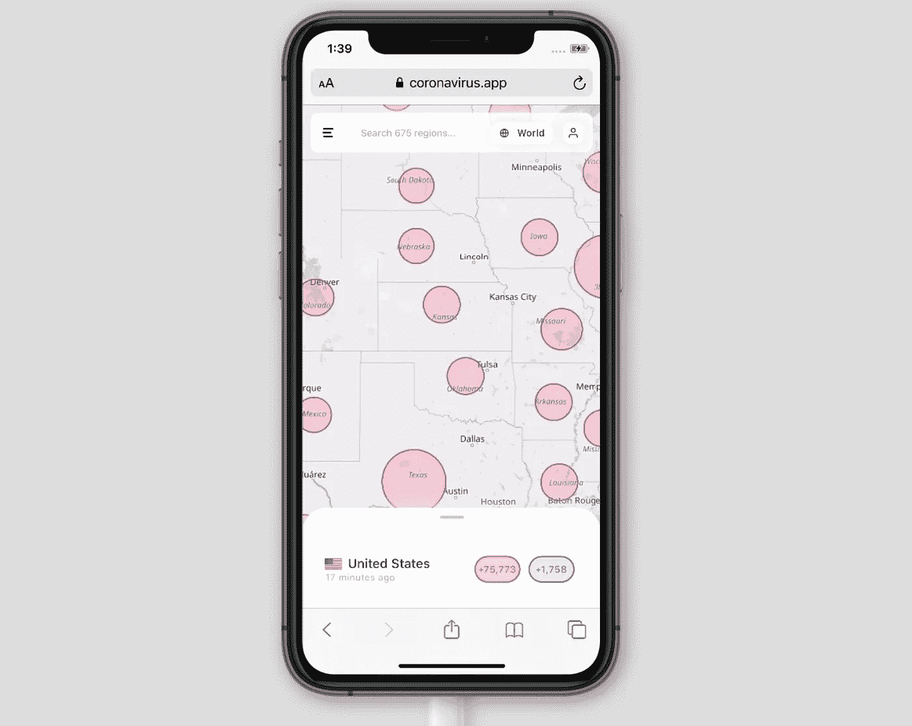
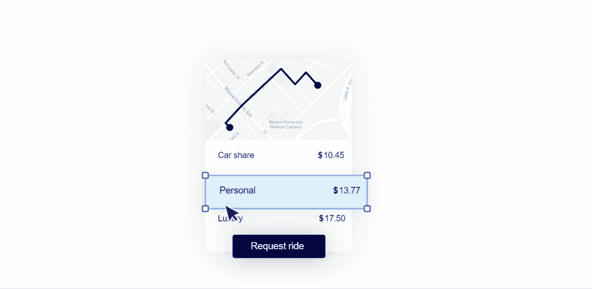
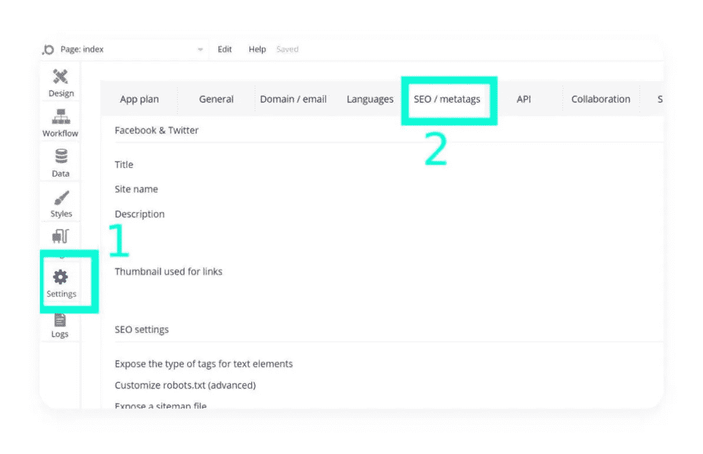
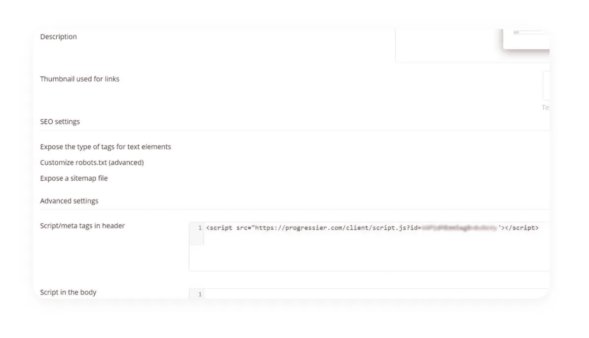
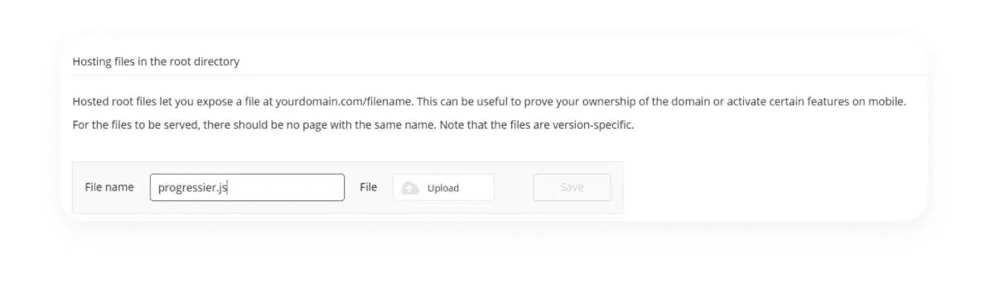
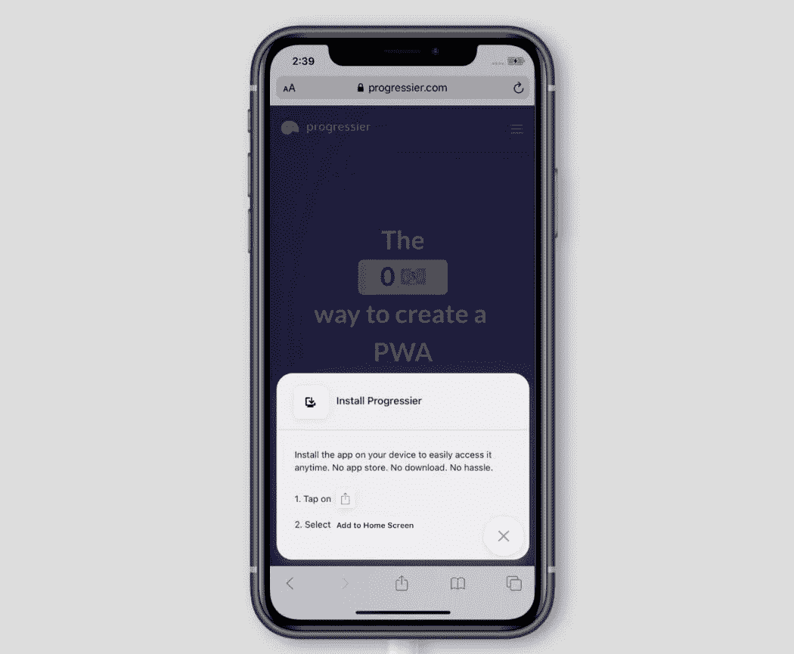

# 让你的泡泡应用在 3 分钟内变成 PWA

> 原文：<https://javascript.plainenglish.io/make-your-bubble-app-a-pwa-in-3-minutes-2d9b60b1e279?source=collection_archive---------1----------------------->

## 使用 PWA 安装和推送通知增强您的 Bubble.io 应用

## 背景故事

2020 年 1 月，我召集了几个朋友，凭着直觉，我们一起开发了第一个新冠肺炎应用，谦虚地命名为 [coronavirus.app](https://coronavirus.app) 。

它很快超出了我们的预期，几个月后，全世界超过 1500 万人定期使用它来跟踪疫情的传播。

因为时机对这样一个应用的成功至关重要，所以我们把它建成了一个渐进式的网络应用。事实证明——没有真正意识到——我们正在构建一个[漂亮的 PWA 实现](https://twitter.com/slightlylate/status/1239710321150853120)。

所以我们采用了 PWA 实现，使它成为一个独立的产品，称之为 [Progressier](https://progressier.com) ，并提供给任何需要它的人。

今天，Progressier 终于对任何使用 [Bubble.io](https://bubble.io) 开发应用程序的人开放了。

## 为什么我的泡泡应用需要这个？

如果你在使用 Bubble，很可能你更重视快速构建东西。你可能想花尽可能少的时间弄清楚[不同的浏览器厂商如何实现某些 PWA 特性](https://kevinbasset.medium.com/creating-a-browser-agnostic-pwa-install-button-41039f312fbe?source=friends_link&sk=c3da213293a855edc715d4e19f22fce7)。

It’s never been faster to build apps than with Bubble

渐进式网络应用附带的全部功能(推送通知、安装等)是一个很好的用户体验插件。

虽然一开始看起来很容易构建，但实际上需要付出巨大的努力。更糟糕的是，你不能简单地在 Bubble 中直接构建这些特性。您必须将它们构建为单独的实体，并将其添加回您的 Bubble 应用程序。在 99.99%的情况下，这不值得你花时间。

你所要做的就是将 Progressier 添加到你现有的 Bubble 应用程序中，所有的功能都将开箱即用。现在就开始计时吧——应该不到 3 分钟。

## 如何让我的泡泡 app 成为 PWA

1.  在 [Progressier](https://progressier.com/signup) 创建一个账户，然后在**网站生成器**下选择“泡泡”
2.  打开你的泡泡仪表盘，进入**设置>SEO/元标签**。

Note: while you can use Progressier free of charge, you may have to upgrade your Bubble account to use some of the features under **SEO /metatags**

3.滚动到**高级设置**，在标题中的**脚本/元标签旁边，粘贴我们在 Progressier 仪表盘中提供的代码片段。**

This script automatically creates an app manifest, generate all required logos & splash screens, handles push notifications, and generates a bunch of cool analytics.

4.PWA 需要一名[服务人员](https://developers.google.com/web/fundamentals/primers/service-workers)。下载我们在仪表盘中提供的文件，回到 Bubble，向下滚动到根目录中的**托管文件，将文件命名为 **progressier.js** ，并上传您刚刚从 progressier 下载的文件。最后点击**保存**。**

你完了！您的 Bubble 应用程序现在可以安装了(是的，甚至可以在 iOS 上安装)。您可以对用户进行细分，并立即向他们发送通知。最重要的是，这是一次性的努力。你不需要担心浏览器厂商将来会实现什么新功能。有了 Progressier，您的应用程序中总会有最好的 PWA 实现。

你花了多长时间？请在下面告诉我们您使用 PWAs、Bubble 或 Progressier 的体验。

*更多内容请看*[***plain English . io***](https://plainenglish.io/)