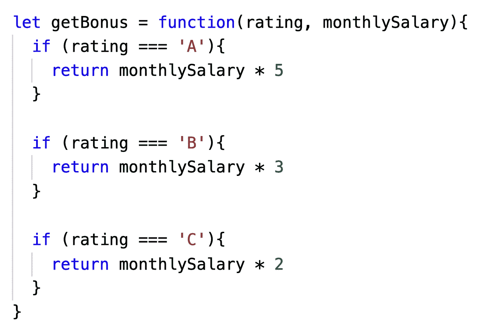
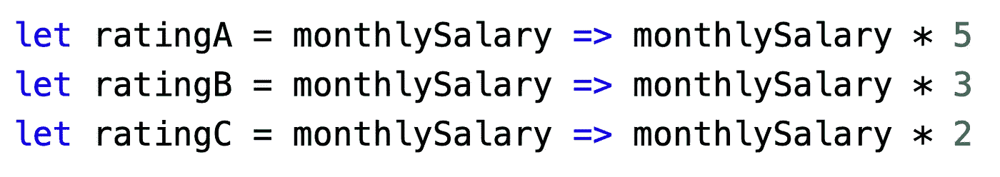
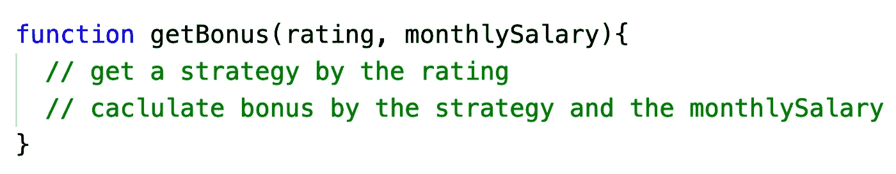
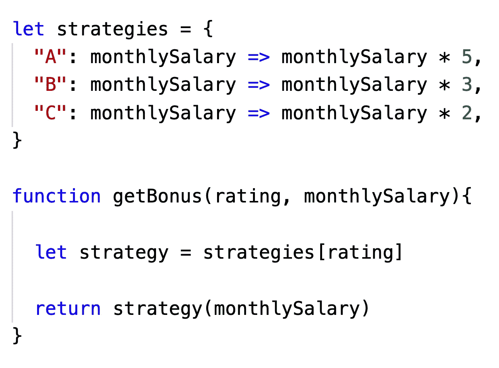
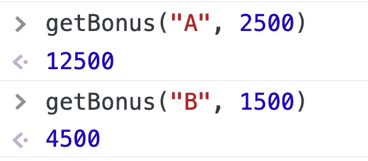
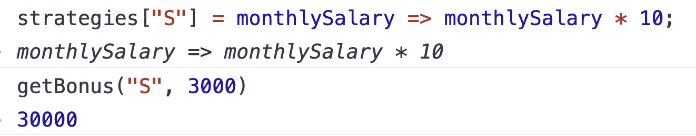
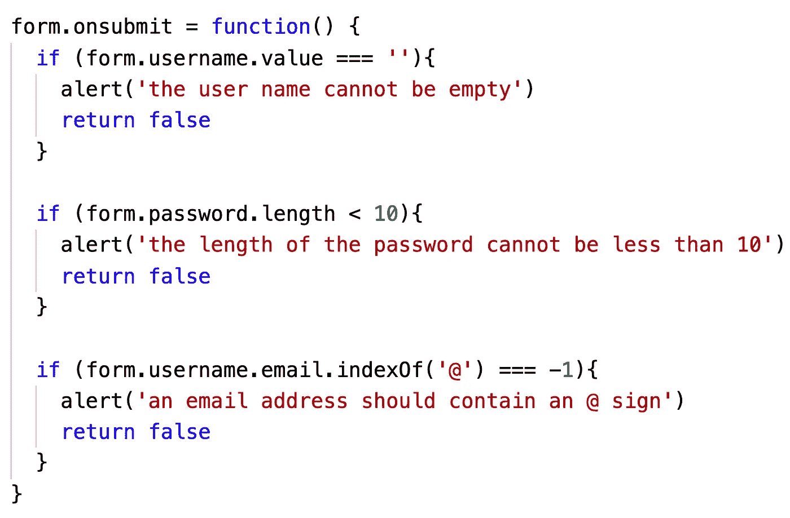
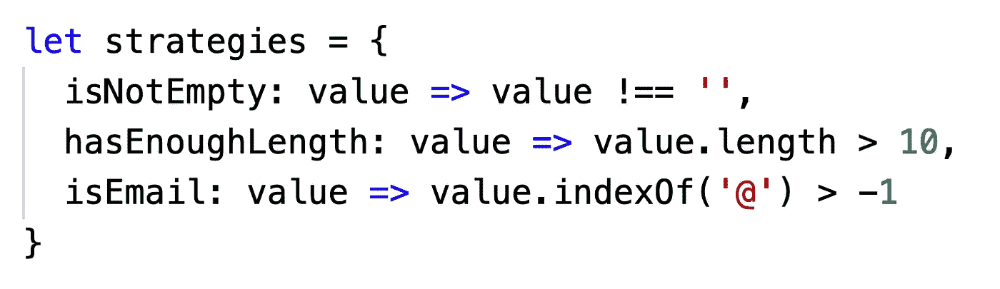
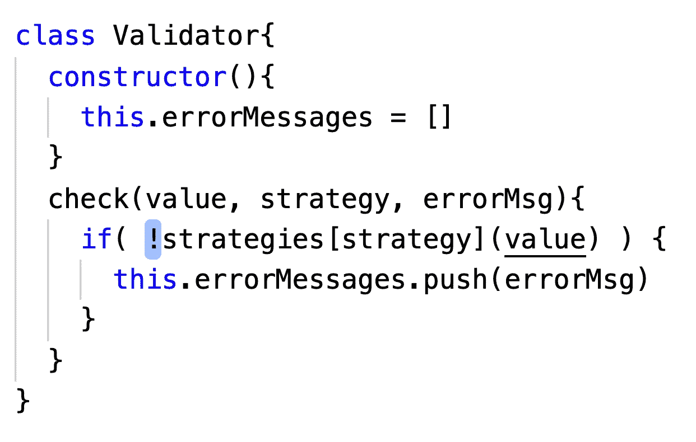

# 使用策略模式使您的代码更具可伸缩性

> 原文：<https://javascript.plainenglish.io/make-your-code-more-scalable-with-the-strategy-pattern-2ef1619c0127?source=collection_archive---------7----------------------->

## 两个真实的例子将帮助你更好地理解这个有用的设计模式。


Photo by [Bharat Patil](https://unsplash.com/@bharat_patil_photography?utm_source=medium&utm_medium=referral) on [Unsplash](https://unsplash.com?utm_source=medium&utm_medium=referral)

好吧，假设你的公司决定马上发放奖金。奖金基于员工的工资基数和绩效评分。

*   绩效评级为 A 的员工可以获得相当于其基本月薪 5 倍的奖金。
*   绩效评级为 B 的员工可以获得相当于其基本月薪 3 倍的奖金。
*   绩效评级为 C 的员工可以获得相当于其月基本工资两倍的奖金。

现在你的老板要你写一个程序来计算每个员工应该得到的奖金。你会怎么做？

其实这是普遍存在的需求，相信每个编程初期的程序员都会遇到类似的问题。

如果我们不考虑编码技巧和后续迭代，大多数人期望编写的第一个程序版本是这样的代码:



员工有三个评级，所以我们为每个评级写一个判断逻辑。的确，这是一个非常直观的代码。我相信大多数开发人员都曾经编写过这样的代码，有些人可能会使用 switch 语句而不是 if-else 语句，但是没有根本的区别。

如果你的老板不打算改变未来奖金的计算方式，如果我们不需要在其他地方重用这些奖金算法，那么像这样编写代码确实可以完成工作。

然而，在一个真实的项目中，如果您遇到一个更复杂、动态的场景，上面的代码会暴露出很多问题。

*   如果我们需要添加一个新的绩效等级 D，或者如果我们想将绩效等级 A 的奖金系数更改为 6，那么我们必须直接更改`getBonus`函数。对核心功能的频繁更改容易出错，难以测试，并且难以协作。
*   函数`getBonus`很容易变得臃肿笨拙。
*   代码重用性差。如果我们想在程序的其他地方重用这些奖金算法，那么我们唯一的选择就是复制和粘贴。

那么如何才能优化上面的代码呢？

事实上，如果我们仔细看看上面的代码，我们可以看到，在上面的代码中，每个性能评级都对应一个算法。比如 A 级对应的奖金应该是`monthlySalary * 5`。

代码就是这么描述的:



我们可以将这些计算从主函数中去掉，并将`getBonus`函数的流程简化为如下所示:



那么我们如何通过评级来获得策略呢？在 JavaScript 中，通过使用映射或对象来存储映射关系，可以很容易地解决这个问题。

代码看起来是这样的:



```
let strategies = {
  "A": monthlySalary => monthlySalary * 5,
  "B": monthlySalary => monthlySalary * 3,
  "C": monthlySalary => monthlySalary * 2,
}function getBonus(rating, monthlySalary){

  let strategy = strategies[rating] return strategy(monthlySalary)
}
```

测试:



假设现在我们的老板想要增加一个新的评级:绩效评级为 S 的员工可以获得 10 倍于其基本月薪的奖金。

在这一点上，我们不需要改变我们的`getBonus`函数，我们只需要添加一个新的策略到我们的策略集中。



实际上，上面使用的重构技巧是设计模式中的策略模式。

我不打算在这里和你讨论战略模式的官方定义，因为我认为它太理论化了，没有意义。如果你真的想知道官方的定义，你可以去谷歌搜索一下。我想让你知道的是**如果你的代码中有很多条件分支，每个分支对应一个特定的算法，你可以考虑把那些特定的小算法拉出来，放在一起**。这使得你的主要功能集中在程序的整体流程上。

在实际开发中，我们经常扩展算法的含义，以便策略模式也可以用于封装一组“业务规则”只要这些业务规则指向相同的目标，并且可以互换使用，我们就可以用策略模式封装它们。

现在让我们看一个更常见也更复杂的例子。

# 表单验证

假设我们正在编写一个供用户注册的 HTML 页面。当用户单击提交按钮时，我们需要验证以下规则:

*   用户名不能为空
*   密码长度不能少于 10 个字符
*   电子邮件地址应该包含一个`@`符号

这里我给出一个 HTML 的基本模板。

需求很简单，但是写出高质量的代码就不简单了。你将如何编写验证代码？

我们首先使用传统的方法来完成需求，然后使用策略模式。然后让我们比较一下，看看哪个更好。

传统的方法是使用 if-else 语句来验证各种规则。



如果我们想使用策略模式，我们首先列出所有的策略。如您所见，每个验证规则只是输入一个字符串，如果不符合规则，就会返回一条错误消息。

所以我们可以这样写:



因为有很多规则需要验证，每个验证逻辑都需要处理一个错误消息，所以我们可以再次拉出具体的验证逻辑。



最后，我们完成了主要功能。完整代码如下:

看起来我们正在编写更复杂的代码。事实上，如果您确信您的需求在未来不会改变，并且您不打算在其他地方重用该算法，那么您可以只使用通常的方法，而不需要使用策略模式或其他设计模式。但是，如果您的项目需求发生变化，或者如果您计划重用代码，战略模式可以帮助您完成工作。

假设随着项目的进展，我们添加了一个新的表单。该表单中有三个字段:

*   名和姓。我们需要确保它们不是空的。
*   电话号码。我们需要验证电话号码是否符合格式。

```
<form id='registor'>
    Username: <input type="text" name="username" />
    Password: <input type="text" name="password" /> 
    Email: <input type="text" name="email" />
    <button>submit</button>
</form><form id='userInfo'>
    first name: <input type="text" name="firstname" /> 
    last name: <input type="text" name="lastname" /> 
    phone number: <input type="text" name="phoneNumber" />
    <button>submit</button>
</form>
```

直接给出用于验证电话号码的正则表达式。你直接抄就可以了，不用管细节。

```
/^[\+]?[(]?[0-9]{3}[)]?[-\s\.]?[0-9]{3}[-\s\.]?[0-9]{4,6}$/im
```

如果我们使用常规方法，我们需要大量的复制和粘贴。你可以自己尝试一下，但是为了文章大小，我就不做了。

如果使用策略模式，我们可以重用很多代码。

在脚本中，我们只需要添加一个新的策略，不需要修改验证器，可以很好地重用之前的代码。使用传统方法很难做到这一点。

## 结论

这些是我在开发过程中学到的一些例子。希望对你有帮助。