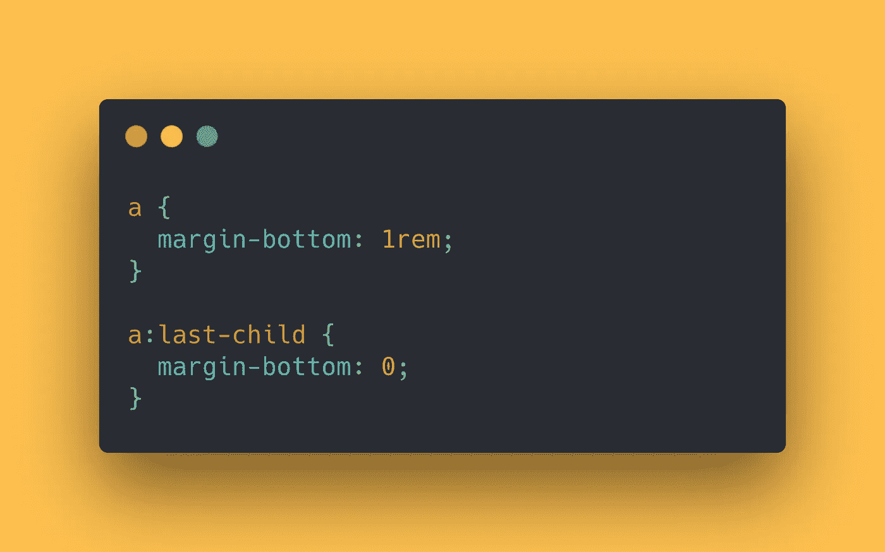
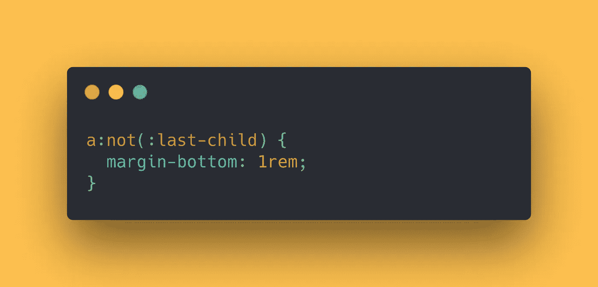
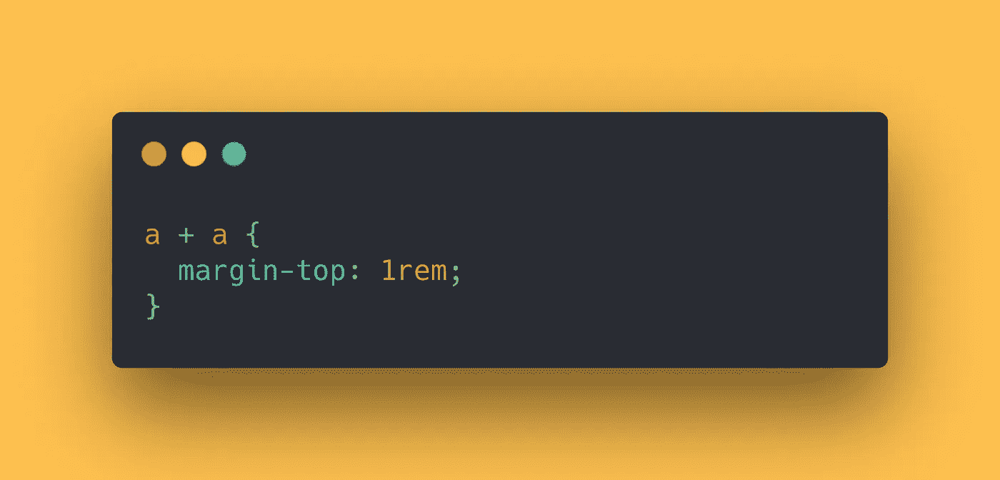

# 使用 CSS“使能”模式使你的 CSS 具有可读性和可维护性

> 原文：<https://javascript.plainenglish.io/make-your-css-readable-and-maintainable-with-the-css-enabling-pattern-35b2965d7b3b?source=collection_archive---------1----------------------->

## 现在是 2021 年，停止禁用 CSS，学习“启用”CSS 模式的方式和原因。


Photo by [Atikh Bana](https://unsplash.com/@tikh?utm_source=unsplash&utm_medium=referral&utm_content=creditCopyText) on [Unsplash](https://unsplash.com/s/photos/pretty-girl?utm_source=unsplash&utm_medium=referral&utm_content=creditCopyText)

“使能”模式是一个 CSS 模式，可以用一句话来解释。

> 与其使用“禁用”选择器，你应该专注于编写“启用”选择器。

现在我能听到你在想什么。

*“那到底是什么意思？”*

我举个例子给你看。

# 我不应该做什么？

假设您已经使用 HTML 创建了一个导航:


Navigation using the “nav” and “a” tags

```
<nav>
  <a href="/html/">HTML</a>
  <a href="/css/">CSS</a>
  <a href="/js/">JavaScript</a>
  <a href="/python/">Python</a>
</nav>
```

现在，除了最后一个标签之外，您想为所有的“a”标签添加一个边距。

下面是通常的禁用方式:



```
a {
  margin-bottom: 1rem;
}a:last-child {
  margin-bottom: 0;
}
```

首先，您为导航中的所有“a”标签添加一个边距。然后，禁用最后一个元素的下边距。

我们称之为“禁用”模式，因为`a:last-child`选择器禁用了前一个选择器的规则。

但是，我们可以做得更好！

# 我该怎么办？

我们可以使用“启用”选择器来设计导航，而不是覆盖我们以前的样式:



Using the :not selector to style our “a” tags

```
a:not(:last-child) {
  margin-bottom: 1rem;
}
```

选择器`a:not(:last-child)`正在启用除最后一个元素之外的所有元素的`margin-bottom`。没有必要禁用任何东西。

这将使你的 CSS 不仅可读性更好，而且更容易维护！

另一个可以得到(几乎)相同结果的优秀选择器是`+` CSS 选择器。像下面这样使用它会得到同样的结果！



Using the “+” selector to styling our “a” tags

```
a + a {
  margin-top: 1rem;
}
```

在上面的例子中，我们给所有有前一个兄弟的“a”标签添加了一个`margin-top`。

这意味着除了第一个标签之外，所有标签都将添加一个`margin-top`。

这就是全部了！

你觉得这种类型的内容有趣吗？你想保持更新吗？ [***在 Twitter 上关注我的时候千万不要错过一次更新***](https://twitter.com/toktoktwan) 。